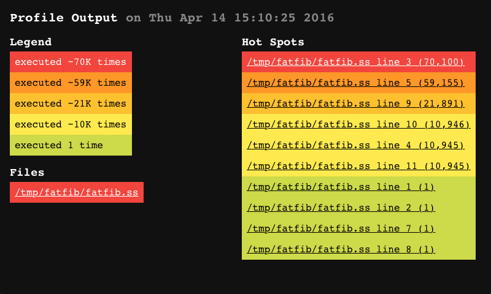

[#chp_12]
== Chapter 12. System Operations

This chapter describes operations for handling exceptions, interrupts, environments, compilation and evaluation, profiling, controlling the operation of the system, timing and statistics, defining and setting parameters, and querying the operating system environment.

=== Section 12.1. Exceptions [[section_12.1.]]

[#system:s0]
_Chez Scheme_ provides some extensions to the Revised^6^ Report exception-handling mechanism, including mechanisms for producing formatted error messages, displaying conditions, and redefining the base exception handler. These extensions are described in this section.

[#system:s1]
[horizontal]
procedure:: `(warning _who_ _msg_ _irritant_ \...)`
returns:: unspecified
libraries:: `(chezscheme)`

`warning` raises a continuable exception with condition type `&warning` and should be used to describe situations for which the `&warning` condition type is appropriate, typically a situation that should not prevent the program from continuing but might result in a more serious problem at some later point.

The continuation object with which the exception is raised also includes a `&who` condition whose who field is `_who_` if `_who_` is not `#f`, a `&message` condition whose message field is `_msg_`, and an `&irritants` condition whose irritants field is `(_irritant_ \...)`.

`_who_` must be a string, a symbol, or `#f` identifying the procedure or syntactic form reporting the warning upon whose behalf the warning is being reported. It is usually best to identify a procedure the programmer has called rather than some other procedure the programmer may not be aware is involved in carrying out the operation. `_msg_` must be a string and should describe the exceptional situation. The irritants may be any Scheme objects and should include values that may have caused or been materially involved in the exceptional situation.

[#system:s2]
[horizontal]
procedure:: `(assertion-violationf _who_ _msg_ _irritant_ \...)`
returns:: does not return
procedure:: `(errorf _who_ _msg_ _irritant_ \...)`
returns:: does not return
procedure:: `(warningf _who_ _msg_ _irritant_ \...)`
returns:: unspecified
libraries:: `(chezscheme)`

[#system:s3]
These procedures are like `assertion-violation`, `error`, and `warning` except that `_msg_` is assumed to be a format string, as if in a call to `format` (<<section_9.13.,Section 9.13>>), with `_irritant_ \...` treated as the additional arguments to `format`. This allows programs to control the appearance of the error message, at least when the default exception handler is in place.

For each of these procedures, the continuation object with which the exception is raised includes a `&format` condition to signify that the string contained in the condition object's `&message` condition is a `format` string and the objects contained in the condition object's `&irritants` condition should be treated as the additional `format` arguments.

[#system:s4]
[horizontal]
syntax:: `&format`
procedure:: `(make-format-condition)`
returns:: a condition of type `&format`
procedure:: `(format-condition? _obj_)`
returns:: `#t` if `_obj_` is a condition of type `&format`, `#f` otherwise
libraries:: `(chezscheme)`

Presence of this condition type within a compound condition indicates that the string provided by the `&message` condition, if present, is a `format` string and the list of objects provided by the `&irritants` condition, if present, should be treated as additional `format` arguments. This condition type might be defined as follows.

[source,scheme,subs="quotes"]
----
(define-condition-type &format &condition
  make-format-condition format-condition?)
----

[#system:s5]
[horizontal]
syntax:: `&source`
procedure:: `(make-source-condition _form_)`
returns:: a condition of type `&source`
procedure:: `(source-condition? _obj_)`
returns:: `#t` if `_obj_` is a condition of type `&source`, `#f` otherwise
procedure:: `(source-condition-form _condition_)`
returns:: the contents of ``_condition_``'s `form` field
libraries:: `(chezscheme)`

This condition type can be included within a compound condition when a source expression can be identified in situations in which a `&syntax` condition would be inappropriate, such as when a run-time assertion violation is detected. The `form` argument should be an s-expression or syntax object representing the source expression. This condition type might be defined as follows.

[source,scheme,subs="quotes"]
----
(define-condition-type &source &condition
  make-source-condition source-condition?
  (form source-condition-form))
----

[#system:s6]
[horizontal]
syntax:: `&continuation`
procedure:: `(make-continuation-condition _continuation_)`
returns:: a condition of type `&continuation`
procedure:: `(continuation-condition? _obj_)`
returns:: `#t` if `_obj_` is a condition of type `&continuation`, `#f` otherwise
procedure:: `(condition-continuation _condition_)`
returns:: the contents of ``_condition_``'s `continuation` field
libraries:: `(chezscheme)`

This condition type can be included within a compound condition to indicate the current continuation at the point where the exception described by the condition occurred. The continuation of a failed `assert` or a call to `assertion-violation`, `assertion-violationf`, `error`, `errorf`, or `syntax-error` is now included via this condition type in the conditions passed to `raise`. The `continuation` argument should be a continuation. This condition type might be defined as follows.

[source,scheme,subs="quotes"]
----
(define-condition-type &continuation &condition
  make-continuation-condition continuation-condition?
  (continuation condition-continuation))
----

[#system:s7]
[horizontal]
procedure:: `(display-condition _obj_)`
procedure:: `(display-condition _obj_ _textual-output-port_)`
returns:: unspecified
libraries:: `(chezscheme)`

If `_textual-output-port_` is not supplied, it defaults to the current output port. This procedure displays a message to the effect that an exception has occurred with value `_obj_`. If `_obj_` is a condition (link:../../the-scheme-programming-language-4th/en/index.html#chp_11[Chapter 11] of _The Scheme Programming Language, 4th Edition_), it displays information encapsulated within the condition, handling messages, `_who_` conditions, irritants, source information, etc., as appropriate.

[#system:s8]
[horizontal]
procedure:: `(default-exception-handler _obj_)`
returns:: unspecified
libraries:: `(chezscheme)`

This procedure is the default value of the `base-exception-handler` parameter called on a condition when no other exception handler has been defined or when all dynamically established exception handlers have chosen not to handle the condition. It first displays `_obj_`, as if with `display-condition`, to the console error port. For non-serious warning conditions, it returns immediately after displaying the condition.

For serious or other non-warning conditions, it saves the condition in the parameter `debug-condition`, where `debug` (<<section_3.2.,Section 3.2>>) can retrieve it and allow it to be inspected. If the `debug-on-exception` parameter is set to `#f` (the default unless the `--debug-on-exception` command-line option is provided), the handler prints a message instructing the user to type `(debug)` to enter the debugger, then resets to the current café. Otherwise, the handler invokes `debug` directly and resets if `debug` returns.

If an I/O exception occurs while attempting to display the condition, the default exception handler resets (as if by calling `reset`). The intent is to avoid an infinite regression (ultimately ending in exhaustion of memory) in which the process repeatedly recurs back to the default exception handler trying to write to a console-error port (typically stderr) that is no longer writable, e.g., due to the other end of a pipe or socket having been closed.

[#system:s10]
[horizontal]
global parameter:: `debug-on-exception`
libraries:: `(chezscheme)`

The value of this parameter determines whether the default exception handler immediately enters the debugger immediately when it receives a serious or non-warning condition. If the `--debug-on-exception` command-line option (<<section_2.1.,Section 2.1>>) has been provided, the initial value of this parameter is `#t`. Otherwise, the initial value is `#f`.

[#system:s12]
[horizontal]
thread parameter:: `base-exception-handler`
libraries:: `(chezscheme)`

The value of this parameter must be a procedure, and the procedure should accept one argument. The default value of `base-exception-handler` is the procedure `default-exception-handler`.

The value of this parameter is invoked whenever no exception handler established by a program has chosen to handle an exception.

[#system:s13]
[horizontal]
thread parameter:: `debug-condition`
libraries:: `(chezscheme)`

This parameter is used by the default exception handler to hold the last serious or non-warning condition received by the handler, where it can be inspected via the `debug` procedure (<<section_3.2.,Section 3.2>>). It can also be invoked by user code to store or retrieve a condition.

[#system:s14]
[horizontal]
thread parameter:: `current-exception-state`
libraries:: `(chezscheme)`

`current-exception-state` may be used to get or set the current exception state. When called without arguments, `current-exception-state` returns an _exception state_ comprising the current stack of handlers established by `with-exception-handler` and `guard`. When called with a single argument, which must be an exception state, `current-exception-state` sets the exception state.

[#system:s15]
[horizontal]
procedure:: `(create-exception-state)`
procedure:: `(create-exception-state _procedure_)`
libraries:: `(chezscheme)`

`create-exception-state` creates an exception state whose stack of exception handlers is empty except for, in effect, an infinite number of occurrences of _handler_ at its base. `_handler_` must be a procedure, and should accept one argument. If not provided, `_handler_` defaults to a procedure equivalent to the value of the following expression.

[source,scheme,subs="quotes"]
----
(lambda (x) ((base-exception-handler) x))
----

=== Section 12.2. Interrupts [[section_12.2.]]

[#system:s16]
_Chez Scheme_ allows programs to control the action of the Scheme system when various events occur, including an interrupt from the keyboard, the expiration of an internal timer set by `set-timer`, a breakpoint caused by a call to `break`, or a request from the storage manager to initiate a garbage collection. These mechanisms are described in this section, except for the collect request mechanism, which is described in <<section_13.1.,Section 13.1>>.

Timer, keyboard, and collect-request interrupts are supported via a counter that is decremented approximately once for each call to a nonleaf procedure. (A leaf procedure is one that does not itself make any calls.) When no timer is running, this counter is set to a default value (1000 in Version 9) when a program starts or after an interrupt occurs. If a timer is set (via `set-timer`), the counter is set to the minimum of the default value and the number of ticks to which the timer is set. When the counter reaches zero, the system looks to see if the timer is set and has expired or if a keyboard or collect request interrupt has occurred. If so, the current procedure call is pended ("put on hold") while the appropriate interrupt handler is invoked to handle the interrupt. When (if) the interrupt handler returns, the pended call takes place. Thus, timer, keyboard, and collect-request interrupts effectively occur synchronously with respect to the procedure call mechanism, and keyboard and collect request interrupts may be delayed by a number of calls equal to the default timer value.

Calls to the break handler occur immediately whenever `break` is called.

[#system:s17]
[horizontal]
procedure:: `(break _who_ _msg_ _irritant_ \...)`
procedure:: `(break _who_)`
procedure:: `(break)`
returns:: unspecified
libraries:: `(chezscheme)`

The arguments to `break` follow the protocol described above for `errorf`. The default break handler (see `break-handler`) displays a message and invokes the debugger. The format string and objects may be omitted, in which case the message issued by the default break handler identifies the break using the `_who_` argument but provides no more information about the break. If the `_who_` argument is omitted as well, no message is generated. The default break handler returns normally if the debugger exits normally.

[#system:s19]
[horizontal]
thread parameter:: `break-handler`
libraries:: `(chezscheme)`

The value of this parameter must be a procedure. The current break handler is called by `break`, which passes along its arguments. See `break` for a description of the default break handler. The example below shows how to disable breaks.

[source,scheme,subs="quotes"]
----
(break-handler (lambda args (void)))
----

[#system:s20]
[horizontal]
thread parameter:: `keyboard-interrupt-handler`
libraries:: `(chezscheme)`

The value of this parameter must be a procedure. The keyboard-interrupt handler is called (with no arguments) when a keyboard interrupt occurs. The default keyboard-interrupt handler invokes the interactive debugger. If the debugger exits normally the interrupted computation is resumed. The example below shows how to install a keyboard-interrupt handler that resets without invoking the debugger.

[source,scheme,subs="quotes"]
----
(keyboard-interrupt-handler
  (lambda ()
    (newline (console-output-port))
    (reset)))
----

[#desc:set-timer]
[horizontal]
procedure:: `(set-timer _n_)` [[system:s22]]
returns:: previous current timer value
libraries:: `(chezscheme)`

[#system:s23]
`_n_` must be a nonnegative integer. When `_n_` is nonzero, `set-timer` starts an internal timer with an initial value of `_n_`. When `_n_` ticks elapse, a timer interrupt occurs, resulting in invocation of the timer interrupt handler. Each tick corresponds roughly to one nonleaf procedure call (see the introduction to this section); thus, ticks are not uniform time units but instead depend heavily on how much work is done by each procedure call.

When `_n_` is zero, `set-timer` turns the timer off.

The value returned in either case is the value of the timer before the call to `set-timer`. A return value of 0 should not be taken to imply that the timer was not on; the return value may also be 0 if the timer was just about to fire when the call to `set-timer` occurred.

The engine mechanism (<<section_6.4.,Section 6.4>>) is built on top of the timer interrupt so timer interrupts should not be used with engines.

[#system:s24]
[horizontal]
thread parameter:: `timer-interrupt-handler`
libraries:: `(chezscheme)`

[#system:s25]
The value of this parameter must be a procedure. The timer interrupt handler is called by the system when the internal timer (set by `set-timer`) expires. The default handler raises an exception with condition type `&assertion` to say that the handler has not been defined; any program that uses the timer should redefine the handler before setting the timer.

[#system:s26]
[horizontal]
procedure:: `(disable-interrupts)`
procedure:: `(enable-interrupts)`
returns:: disable count
libraries:: `(chezscheme)`

`disable-interrupts` disables the handling of interrupts, including timer, keyboard, and collect request interrupts. `enable-interrupts` re-enables these interrupts. The system maintains a disable count that starts at zero; when zero, interrupts are enabled. Each call to `disable-interrupts` increments the count, effectively disabling interrupts. Each call to `enable-interrupts` decrements the count, if not already zero, effectively enabling interrupts. For example, two calls to `disable-interrupts` followed by one call to `enable-interrupts` leaves interrupts disabled. Calls to `enable-interrupts` when the count is already zero (and interrupts are enabled) have no effect. The value returned by either procedure is the number of calls to `enable-interrupts` required to enable interrupts.

Great care should be exercised when using these procedures, since disabling interrupts inhibits the normal processing of keyboard interrupts, timer interrupts, and, perhaps most importantly, collect request interrupts. Since garbage collection does not happen automatically when interrupts are disabled, it is possible for the storage allocator to run out of space unnecessarily should interrupts be disabled for a long period of time.

The `with-interrupts-disabled` syntactic form should be used instead of these more primitive procedures whenever possible, since `with-interrupts-disabled` ensures that interrupts are re-enabled whenever a nonlocal exit occurs, such as when an exception is handled by the default exception handler.

[#system:s27]
[horizontal]
syntax:: `(with-interrupts-disabled _body~1~_ _body~2~_ \...)`
syntax:: `(critical-section _body~1~_ _body~2~_ \...)`
returns:: the values of the body `_body~1~_ _body~2~_ \...`
libraries:: `(chezscheme)`

`with-interrupts-disabled` evaluates the body `_body~1~_ _body~2~_ \...` with interrupts disabled. That is, upon entry, interrupts are disabled, and upon exit, interrupts are re-enabled. Thus, `with-interrupts-disabled` allows the implementation of indivisible operations in nonthreaded versions of _Chez Scheme_ or within a single thread in threaded versions of _Chez Scheme_. `critical-section` is the same as `with-interrupts-disabled` and is provided for backward compatibility.

`with-interrupts-disabled` can be defined as follows.

[source,scheme,subs="quotes"]
----
(define-syntax with-interrupts-disabled
  (syntax-rules ()
    [(_ b1 b2 ...)
     (dynamic-wind
       disable-interrupts
       (lambda () b1 b2 ...)
       enable-interrupts)]))
----

The use of `dynamic-wind` ensures that interrupts are disabled whenever the body of the `with-interrupts-disabled` expression is active and re-enabled whenever it is not. Since calls to `disable-interrupts` are counted (see the discussion under `disable-interrupts` and `enable-interrupts` above), `with-interrupts-disabled` expressions may be nested with the desired effect.

[#system:s28]
[horizontal]
procedure:: `(register-signal-handler _sig_ _procedure_)`
returns:: unspecified
libraries:: `(chezscheme)`

`register-signal-handler` is used to establish a signal handler for a given low-level signal. `_sig_` must be an exact integer identifying a valid signal, and `_procedure_` should accept one argument. See your host system's `<signal.h>` or documentation for a list of valid signals and their numbers. After a signal handler for a given signal has been registered, receipt of the specified signal results in a call to the handler. The handler is passed the signal number, allowing the same handler to be used for different signals while differentiating among them.

Signals handled in this fashion are treated like keyboard interrupts in that the handler is not called immediately when the signal is delivered to the process, but rather at some procedure call boundary after the signal is delivered. It is generally not a good idea, therefore, to establish handlers for memory faults, illegal instructions, and the like, since the code that causes the fault or illegal instruction will continue to execute (presumably erroneously) for some time before the handler is invoked. A finite amount of storage is used to buffer as-yet unhandled signals, after which additional signals are dropped.

`register-signal-handler` is supported only on Unix-based systems.

=== Section 12.3. Environments [[section_12.3.]]

Environments are first-class objects containing identifier bindings. They are similar to modules but, unlike modules, may be manipulated at run time. Environments may be provided as optional arguments to `eval`, `expand`, and the procedures that define, assign, or reference top-level values.

There are several built-in environments, and new environments can be created by copying existing environments or selected bindings from existing environments.

Environments can be mutable or immutable. A mutable environment can be extended with new bindings, its existing bindings can be modified, and its variables can be assigned. An immutable environment cannot be modified in any of these ways.

[#system:s29]
[horizontal]
procedure:: `(environment? _obj_)`
returns:: `#t` if `_obj_` is an environment, otherwise `#f`
libraries:: `(chezscheme)`

[source,scheme,subs="quotes"]
----
(environment? (interaction-environment)) ⇒ #t
(environment? 'interaction-environment) ⇒ #f
(environment? (copy-environment (scheme-environment))) ⇒ #t
(environment? (environment '(prefix (rnrs) $rnrs-))) ⇒ #t
----

[#system:s30]
[horizontal]
procedure:: `(environment-mutable? _env_)`
returns:: `#t` if `_env_` is mutable, otherwise `#f`
libraries:: `(chezscheme)`

[source,scheme,subs="quotes"]
----
(environment-mutable? (interaction-environment)) ⇒ #t
(environment-mutable? (scheme-environment)) ⇒ #f
(environment-mutable? (copy-environment (scheme-environment))) ⇒ #t
(environment-mutable? (environment '(prefix (rnrs) $rnrs-))) ⇒ #f
----

[#system:s31]
[horizontal]
procedure:: `(scheme-environment)`
returns:: an environment
libraries:: `(chezscheme)`

`scheme-environment` returns an environment containing the initial top-level bindings. This environment corresponds to the `scheme` module.

The environment returned by this procedure is immutable.

[source,scheme,subs="quotes"]
----
(define cons 3)
(top-level-value 'cons (scheme-environment)) ⇒ #&lt;procedure cons&gt;
(set-top-level-value! 'cons 3 (scheme-environment)) ⇒ _exception_
----

[#system:s32]
[horizontal]
procedure:: `(ieee-environment)`
returns:: an IEEE/ANSI standard compatibility environment
libraries:: `(chezscheme)`

`ieee-environment` returns an environment containing bindings for the keywords and variables whose meanings are defined by the IEEE/ANSI Standard for Scheme <<ref26>>.

The bindings for each of the identifiers in the IEEE environment are those of the corresponding Revised^6^ Report library, so this does not provide full backward compatibility.

The environment returned by this procedure is immutable.

[source,scheme,subs="quotes"]
----
(define cons 3)
(top-level-value 'cons (ieee-environment)) ⇒ #&lt;procedure cons&gt;
(set-top-level-value! 'cons 3 (ieee-environment)) ⇒ _exception_
----

[#system:s33]
[horizontal]
thread parameter:: `interaction-environment`
libraries:: `(chezscheme)`

The original value of `interaction-environment` is the default top-level environment. It is initially set to a mutable copy of `(scheme-environment)` and which may be extended or otherwise altered by top-level definitions and assignments. It may be set to any environment, mutable or not, to change the default top-level evaluation environment.

An expression's top-level bindings resolve to the environment that is in effect when the expression is expanded, and changing the value of this parameter has no effect on running code. Changes affect only code that is subsequently expanded, e.g., as the result of a call to `eval`, `load`, or `compile-file`.

[source,scheme,subs="quotes"]
----
(define cons 3)
cons ⇒ 3
(top-level-value 'cons (interaction-environment)) ⇒ 3

(interaction-environment (scheme-environment))
cons ⇒ #&lt;procedure cons&gt;
(set! cons 3) ⇒ _exception: attempt to assign immutable variable_
(define cons 3) ⇒ _exception: invalid definition in immutable environment_
----

[#system:s34]
[horizontal]
procedure:: `(copy-environment _env_)`
procedure:: `(copy-environment _env_ _mutable?_)`
procedure:: `(copy-environment _env_ _mutable?_ _syms_)`
returns:: a new environment
libraries:: `(chezscheme)`

`copy-environment` returns a copy of `_env_`, i.e., a new environment that contains the same bindings as `_env_`.

The environment is mutable if `_mutable?_` is omitted or true; if `_mutable?_` is false, the environment is immutable.

The set of bindings copied from `_env_` to the new environment is determined by `_syms_`, which defaults to the value of `(environment-symbols _env_)`. The binding, if any, for each element of `_syms_` is copied to the new environment, and no other bindings are present in the new environment.

In the current implementation, the storage space used by an environment is never collected, so repeated use of `copy-environment` will eventually cause the system to run out of memory.

[source,scheme,subs="quotes"]
----
(define e (copy-environment (scheme-environment)))
(eval '(define cons +) e)
(eval '(cons 3 4) e)                    ⇒ 7
(eval '(cons 3 4) (scheme-environment)) ⇒ (3 . 4)
----

[#system:s35]
[horizontal]
procedure:: `(environment-symbols _env_)`
returns:: a list of symbols
libraries:: `(chezscheme)`

This procedure returns a list of symbols representing the identifiers bound in environment `_env_`. It is primarily useful in building the list of symbols to be copied from one environment to another.

[source,scheme,subs="quotes"]
----
(define listless-environment
  (copy-environment
    (scheme-environment)
    #t
    (remq 'list (environment-symbols (scheme-environment)))))
(eval '(let ([x (cons 3 4)]) x) listless-environment) ⇒ (3 . 4)
(eval '(list 3 4) listless-environment) ⇒ _exception_
----

[#system:s36]
[horizontal]
procedure:: `(apropos-list _s_)`
procedure:: `(apropos-list _s_ _env_)`
returns:: see below
libraries:: `(chezscheme)`

This procedure returns a selected list of symbols and pairs. Each symbol in the list represents an identifier bound in `_env_`. Each pair represents a set of identifiers exported by a predefined library or a library previously defined or loaded into the system. The car of the pair is the library name, and the cdr is a list of symbols. If `_s_` is a string, only entries whose names have `_s_` as a substring are included, and if `_s_` is a symbol, only those whose names have the name of `_s_` as a substring are selected. If no environment is provided, it defaults to the value of `interaction-environment`.

[source,scheme,subs="quotes"]
----
(library (a) (export a-vector-sortof) (import (rnrs))
  (define a-vector-sortof '(vector 1 2 3)))
(apropos-list 'vector-sort) ⇒
  (vector-sort vector-sort!
   ((a) a-vector-sortof)
   ((chezscheme) vector-sort vector-sort!)
   ((rnrs) vector-sort vector-sort!)
   ((rnrs sorting) vector-sort vector-sort!)
   ((scheme) vector-sort vector-sort!))
----

[#system:s37]
[horizontal]
procedure:: `(apropos _s_)`
procedure:: `(apropos _s_ _env_)`
returns:: unspecified
libraries:: `(chezscheme)`

`apropos` is like `apropos-list` except the information is displayed to the current output port, as shown in the following transcript.

[source,scheme,subs="quotes"]
----
> (library (a) (export a-vector-sortof) (import (rnrs))
    (define a-vector-sortof '(vector 1 2 3)))
> (apropos 'vector-sort)
interaction environment:
  vector-sort, vector-sort!
(a):
  a-vector-sortof
(chezscheme):
  vector-sort, vector-sort!
(rnrs):
  vector-sort, vector-sort!
(rnrs sorting):
  vector-sort, vector-sort!
(scheme):
  vector-sort, vector-sort!
----

=== Section 12.4. Compilation, Evaluation, and Loading [[section_12.4.]]

[#system:s38]
[horizontal]
procedure:: `(eval _obj_)`
procedure:: `(eval _obj_ _env_)`
returns:: value of the Scheme form represented by `_obj_`
libraries:: `(chezscheme)`

`eval` treats `_obj_` as the representation of an expression. It evaluates the expression in environment `_env_` and returns its value. If no environment is provided, it defaults to the environment returned by `interaction-environment`.

Single-argument `eval` is a _Chez Scheme_ extension. _Chez Scheme_ also permits `_obj_` to be the representation of a nonexpression form, i.e., a definition, whenever the environment is mutable. _Chez Scheme_ further allows `_obj_` to be an annotation (<<section_11.11.,Section 11.11>>), and the default evaluators make use of annotations to incorporate source-file information in error messages and associate source-file information with compiled code.

In _Chez Scheme_, `eval` is actually a wrapper that simply passes its arguments to the current evaluator. (See `current-eval`.) The default evaluator is `compile`, which expands the expression via the current expander (see `current-expand`), compiles it, executes the resulting code, and returns its value. If the environment argument, `_env_`, is present, `compile` passes it along to the current expander, which is `sc-expand` by default.

[#system:s39]
[horizontal]
thread parameter:: `current-eval`
libraries:: `(chezscheme)`

`current-eval` determines the evaluation procedure used by the procedures `eval`, `load`, and `new-cafe`. `current-eval` is initially bound to the value of `compile`. (In _Petite Chez Scheme_, it is initially bound to the value of `interpret`.) The evaluation procedureshould expect one or two arguments: an object to evaluate and an optional environment. The second argument might be an annotation (<<section_11.11.,Section 11.11>>).

[source,scheme,subs="quotes"]
----
(current-eval interpret)
(+ 1 1) ⇒ 2

(current-eval (lambda (x . ignore) x))
(+ 1 1) ⇒ (+ 1 1)
----

[#system:s43]
[horizontal]
procedure:: `(compile _obj_)`
procedure:: `(compile _obj_ _env_)`
returns:: value of the Scheme form represented by `_obj_`
libraries:: `(chezscheme)`

`_obj_`, which can be an annotation (<<section_11.11.,Section 11.11>>) or unannotated value, is treated as a Scheme expression, expanded with the current expander (the value of `current-expand`) in the specified environment (or the interaction environment, if no environment is provided), compiled to machine code, and executed. `compile` is the default value of the `current-eval` parameter.

[#system:s44]
[horizontal]
procedure:: `(interpret _obj_)`
procedure:: `(interpret _obj_ _env_)`
returns:: value of the Scheme form represented by `_obj_`
libraries:: `(chezscheme)`

`interpret` is like `compile`, except that the expression is interpreted rather than compiled. `interpret` may be used as a replacement for `compile`, with the following caveats:

- Interpreted code runs significantly slower.
- Inspector information is not generated for interpreted code, so the inspector is not as useful for interpreted code as it is for compiled code.
- Foreign procedure expressions cannot be interpreted, so the interpreter invokes the compiler for all foreign procedure expressions (this is done transparently).

`interpret` is sometimes faster than `compile` when the form to be evaluated is short running, since it avoids some of the work done by `compile` prior to evaluation.

[#system:s45]
[horizontal]
procedure:: `(load _path_)`
procedure:: `(load _path_ _eval-proc_)`
returns:: unspecified
libraries:: `(chezscheme)`

`_path_` must be a string. `load` reads and evaluates the contents of the file specified by `_path_`. The file may contain source or object code. By default, `load` employs `eval` to evaluate each source expression found in a source file. If `_eval-proc_` is specified, `load` uses this procedure instead. `_eval-proc_` must accept one argument, the expression to evaluate. The expression passed to `_eval-proc_` might be an annotation (<<section_11.11.,Section 11.11>>) or an unannotated value.

The `_eval-proc_` argument facilitates the implementation of embedded Scheme-like languages and the use of alternate evaluation mechanisms to be used for Scheme programs. `_eval-proc_` can be put to other uses as well. For example,

[source,scheme,subs="quotes"]
----
(load "myfile.ss"
  (lambda (x)
    (pretty-print
      (if (annotation? x)
          (annotation-stripped x)
          x))
    (newline)
    (eval x)))
----

pretty-prints each expression before evaluating it.

The parameter `source-directories` (<<section_12.5.,Section 12.5>>) determines the set of directories searched for source files not identified by absolute path names.

[#system:s47]
[horizontal]
procedure:: `(load-library _path_)`
procedure:: `(load-library _path_ _eval-proc_)`
returns:: unspecified
libraries:: `(chezscheme)`

`load-library` is identical to `load` except that it treats the input file as if it were prefixed by an implicit `\#!r6rs`. This effectively disables any non-R6RS lexical syntax except where subsequently overridden by `#!chezscheme`.

[#system:s48]
[horizontal]
procedure:: `(load-program _path_)`
procedure:: `(load-program _path_ _eval-proc_)`
returns:: unspecified
libraries:: `(chezscheme)`

`_path_` must be a string. `load-program` reads and evaluates the contents of the file specified by `_path_`. The file may contain source or object code. If it contains source code, `load-program` wraps the code in a `top-level-program` form so that the file's content is treated as an RNRS top-level program (link:../../the-scheme-programming-language-4th/en/index.html#section_10.3.[Section 10.3] of _The Scheme Programming Language, 4th Edition_). By default, `load-program` employs `eval` to evaluate each source expression found in the file. If `_eval-proc_` is specified, `load-program` uses this procedure instead. `_eval-proc_` must accept one argument, the expression to evaluate. The expression passed to `_eval-proc_` might be an annotation (<<section_11.11.,Section 11.11>>) or an unannotated value.

The parameter `source-directories` (<<section_12.5.,Section 12.5>>) determines the set of directories searched for source files not identified by absolute path names.

[#system:s50]
[horizontal]
procedure:: `(verify-loadability _situation_ _input_ \...)`
returns:: unspecified
libraries:: `(chezscheme)`

`_situation_` must be one of the symbols `visit`, `revisit`, or `load`. Each `_input_` must be a string pathname or a pair of a string pathname and a library search path. Each of the pathnames should name a file containing object code for a set of libraries and top-level programs, such as would be produced by `compile-program`, `compile-library`, `compile-whole-program`, or `compile-whole-library`. A library search path must be a suitable argument for `library-directories`.

`verify-loadability` verifies, without actually loading any code or definining any libraries, whether the object files named by the specified pathnames and their library dependencies, direct or indirect, are present, readable, and mutually compatible. The type of dependencies for each named object file is determined by the `_situation_` argument: compile-time dependencies for `_visit_`, run-time dependencies for `_revisit_` and both for `_load_`.

For each input pathname that is paired with a search path, the `library-directories` parameter is parameterized to the library search path during the recursive search for dependencies of the programs and libraries found in the object file named by the pathname.

If `verify-loadabilty` finds a problem, such as a missing library dependency or compilation-instance mismatch, it raises an exception with an appropriate condition. Otherwise, it returns an unspecified value.

Since `verify-loadability` does not load or run any code from the files it processes, it cannot determine whether errors unrelated to missing or unreadable files or mutual compatibility will occur when the files are actually loaded.

[#system:s56]
[horizontal]
procedure:: `(load-compiled-from-port _input-port_)`
returns:: result of the last compiled expression
libraries:: `(chezscheme)`

`load-compiled-from-port` reads and evaluates the object-code contents of `_input-port_` as previously created by functions like `compile-file`, `compile-script`, `compile-library`, and `compile-to-port`.

The return value is the value of the last expression whose compiled form is in `_input-port_`. If `_input-port_` is empty, then the result value is unspecified. The port is left at end-of-file but is not closed.

[#system:s57]
[horizontal]
procedure:: `(visit-compiled-from-port _input-port_)`
returns:: result of the last compiled expression processed
libraries:: `(chezscheme)`

`visit-compiled-from-port` reads and evaluates the object-code contents of `_input-port_` as previously created by functions like `compile-file`, `compile-script`, `compile-library`, and `compile-to-port`. In the process, it skips any revisit (run-time-only) code.

The return value is the value of the last expression whose last non-revisit compiled form is in `_input-port_`. If there are no such forms, then the result value is unspecified. The port is left at end-of-file but is not closed.

[#system:s58]
[horizontal]
procedure:: `(revisit-compiled-from-port _input-port_)`
returns:: result of the last compiled expression processed
libraries:: `(chezscheme)`

`revisit-compiled-from-port` reads and evaluates the object-code contents of `_input-port_` as previously created by functions like `compile-file`, `compile-script`, `compile-library`, and `compile-to-port`. In the process, it skips any visit (compile-time-only) code.

The return value is the value of the last expression whose last non-visit compiled form is in `_input-port_`. If there are no such forms, then the result value is unspecified. The port is left at end-of-file but is not closed.

[#system:s59]
[horizontal]
procedure:: `(visit _path_)`
returns:: unspecified
libraries:: `(chezscheme)`

`_path_` must be a string. `visit` reads the named file, which must contain compiled object code compatible with the current machine type and version, and it runs those portions of the compiled object code that establish compile-time information or correspond to expressions identified as "visit" time by `eval-when` forms contained in the original source file.

For example, assume the file `t1.ss` contains the following forms:

[source,scheme,subs="quotes"]
----
(define-syntax a (identifier-syntax 3))
(module m (x) (define x 4))
(define y 5)
----

If `t1.ss` is compiled to `t1.so`, applying `load` to `t1.so` has the effect of defining all three identifiers. Applying `visit` to `t1.so`, however, has the effect of installing the transformer for `a`, installing the interface for `m` (for use by `import`), and recording `y` as a variable. `visit` is useful when separately compiling one file that depends on bindings defined in another without actually loading and evaluating the code in the supporting file.

The parameter `source-directories` (<<section_12.5.,Section 12.5>>) determines the set of directories searched for source files not identified by absolute path names.

[#system:s61]
[horizontal]
procedure:: `(revisit _path_)`
returns:: unspecified
libraries:: `(chezscheme)`

`_path_` must be a string. `revisit` reads the named file, which must contain compiled object code compatible with the current machine type and version, and it runs those portions of the compiled object code that compute run-time values or correspond to expressions identified as "revisit" time by `eval-when` forms contained in the original source file.

Continuing the example given for `visit` above, applying `revisit` to the object file, `t1.so`, has the effect of establishing the values of the variable `x` exported from `m` and the top-level variable `y`, without installing either the interface for `m` or the transformer for `a`.

`revisit` is useful for loading compiled application code without loading unnecessary compile-time information. Care must be taken when using this feature if the application calls `eval` or uses `top-level-value`, `set-top-level-value!`, or `top-level-syntax` to access top-level bindings at run-time, since these procedures use compile-time information to resolve top-level bindings.

The parameter `source-directories` (<<section_12.5.,Section 12.5>>) determines the set of directories searched for source files not identified by absolute path names.

[#system:s63]
[horizontal]
procedure:: `(compile-file _input-filename_)`
procedure:: `(compile-file _input-filename_ _output-filename_)`
returns:: unspecified
libraries:: `(chezscheme)`

`_input-filename_` and `_output-filename_` must be strings. `_input-filename_` must name an existing, readable file. It must contain a sequence of zero or more source expressions; if this is not the case, `compile-file` raises an exception with condition type `&syntax`.

The normal evaluation process proceeds in two steps: compilation and execution. `compile-file` performs the compilation process for an entire source file, producing an object file. When the object file is subsequently loaded (see `load`), the compilation process is not necessary, and the file typically loads several times faster.

If the optional `_output-filename_` argument is omitted, the actual input and output filenames are determined as follows. If `_input-filename_` has no extension, the input filename is `_input-filename_` followed by `.ss` and the output filename is `_input-filename_` followed by `.so`. If `_input-filename_` has the extension `.so`, the input filename is `_input-filename_` and the output filename is `_input-filename_` followed by `.so`. Otherwise, the input filename is `_input-filename_` and the output filename is `_input-filename_` without its extension, followed by `.so`. For example, `(compile-file "myfile")` produces an object file with the name `"myfile.so"` from the source file named `"myfile.ss"`, `(compile-file "myfile.sls")` produces an object file with the name `"myfile.so"` from the source file named `"myfile.sls"`, and `(compile-file "myfile1" "myfile2")` produces an object file with the name `"myfile2"` from the source file name `"myfile1"`.

Before compiling a file, `compile-file` saves the values of the following parameters:

[source,scheme,subs="quotes"]
----
optimize-level
debug-level
run-cp0
cp0-effort-limit
cp0-score-limit
cp0-outer-unroll-limit
generate-inspector-information
generate-procedure-source-information
compile-profile
generate-covin-files
generate-interrupt-trap
enable-cross-library-optimization
----

It restores the values after the file has been compiled. This allows the programmer to control the values of these parameters on a per-file basis, e.g., via an `eval-when` with situation `compile` embedded in the source file. For example, if

[source,scheme,subs="quotes"]
----
(eval-when (compile) (optimize-level 3))
----

appears at the top of a source file, the optimization level is set to 3 just while the remainder of file is compiled.

[#system:s66]
[horizontal]
procedure:: `(compile-script _input-filename_)`
procedure:: `(compile-script _input-filename_ _output-filename_)`
returns:: unspecified
libraries:: `(chezscheme)`

`_input-filename_` and `_output-filename_` must be strings.

`compile-script` is like `compile-file` but differs in that it copies the leading `#!` line from the source-file script into the object file.

`compile-script` permits compiled script files to be created from source script to reduce script load time. As with source-code scripts, compiled scripts may be run with the `--script` command-line option.

[#system:s68]
[horizontal]
procedure:: `(compile-library _input-filename_)`
procedure:: `(compile-library _input-filename_ _output-filename_)`
returns:: unspecified
libraries:: `(chezscheme)`

`_input-filename_` and `_output-filename_` must be strings.

`compile-library` is identical to `compile-file` except that it treats the input file as if it were prefixed by an implicit `\#!r6rs`. This effectively disables any non-R6RS lexical syntax except where subsequently overridden by `#!chezscheme`.

[#system:s69]
[horizontal]
procedure:: `(compile-program _input-filename_)`
procedure:: `(compile-program _input-filename_ _output-filename_)`
returns:: a list of libraries invoked by the program
libraries:: `(chezscheme)`

`_input-filename_` and `_output-filename_` must be strings.

`compile-program` is like `compile-script` but differs in that it implements the semantics of RNRS top-level programs, while `compile-script` implements the semantics of the interactive top-level. The resulting compiled program will also run faster than if compiled via `compile-file` or `compile-script`.

`compile-program` returns a list of libraries directly invoked by the compiled top-level program, excluding built-in libraries like `(rnrs)` and `(chezscheme)`. The procedure `library-requirements` may be used to determine the indirect requirements, i.e., additional libraries required by the directly invoked libraries. When combined with `library-object-filename`, this information can be used to determine the set of files that must be distributed with the compiled program file.

A program invokes a library only if it references one or more variables exported from the library. The set of libraries invoked by a top-level program, and hence loaded when the program is loaded, might be smaller than the set imported by the program, and it might be larger than the set directly imported by the program.

As with source-code top-level programs, compiled top-level programs may be run with the `--program` command-line option.

[#system:s71]
[horizontal]
procedure:: `(maybe-compile-file _input-filename_)`
procedure:: `(maybe-compile-file _input-filename_ _output-filename_)`
procedure:: `(maybe-compile-library _input-filename_)`
procedure:: `(maybe-compile-library _input-filename_ _output-filename_)`
procedure:: `(maybe-compile-program _input-filename_)`
procedure:: `(maybe-compile-program _input-filename_ _output-filename_)`
returns:: see below
libraries:: `(chezscheme)`

These procedures are like their non-`maybe` counterparts but compile the source file only if the object file is out-of-date. An object file `_X_` is considered out-of-date if it does not exist or if it is older than the source file or any files included (via `include`) when `_X_` was created. When the value of the parameter `compile-imported-libraries` is `#t`, `_X_` is also considered out-of-date if the object file for any library imported when `_X_` was compiled is out-of-date. If `maybe-compile-file` determines that compilation is necessary, it compiles the source file by passing `compile-file` the input and output filenames. `compile-library` does so by similarly invoking the value of the `compile-library-handler` parameter, and `compile-program` does so by similarly invoking the value of the `compile-program-handler` parameter.

When `_output-filename_` is not specified, the input and output filenames are determined in the same manner as for `compile-file`.

[#system:s72]
[horizontal]
thread parameter:: `compile-library-handler`
libraries:: `(chezscheme)`

This parameter must be set to a procedure, and the procedure should accept two string arguments naming a source file and an object file. The procedure should typically invoke `compile-library` and pass it the two arguments, but it can also use one of the other file or port compilation procedures. For example, it might read the source file using its own parser and use `compile-to-file` to finish the compilation process. The procedure can perform other actions as well, such as parameterizing compilation parameters, establishing guards, or gathering statistics. The default value of this parameter simply invokes `compile-library` on the two string arguments without taking any other action.

The value of this parameter is called by `maybe-compile-library` when the object file is out-of-date. It is also called by the expander to compile an imported library when `compile-imported-libraries` is `#t` and the expander determines the object file is out-of-date.

[#system:s74]
[horizontal]
thread parameter:: `compile-program-handler`
libraries:: `(chezscheme)`

This parameter must be set to a procedure, and the procedure should accept two string arguments naming a source file and an object file. The procedure should typically invoke `compile-program` and pass it the two arguments, but it can also use one of the other file or port compilation procedures. For example, it might read the source file using its own parser and use `compile-to-file` to finish the compilation process. The procedure can perform other actions as well, such as parameterizing compilation parameters, establishing guards, or gathering statistics. The default value of this parameter simply invokes `compile-program` on the two string arguments without taking any other action and returns the list of libraries returned by `compile-program`.

The value of this parameter is called by `maybe-compile-program` when the object file is out-of-date.

[#system:s76]
[horizontal]
procedure:: `(compile-whole-program _input-filename_ _output-filename_)`
procedure:: `(compile-whole-program _input-filename_ _output-filename_ _libs-visible?_)`
returns:: a list of libraries left to be loaded at run time
libraries:: `(chezscheme)`

`compile-whole-program` accepts as input a filename naming a "whole program optimization" (wpo) file for a top-level program and produces an object file incorporating the program and each library upon which it depends, provided that a wpo file for the library can be found.

If a wpo file for a required library cannot be found, but an object file for the library can, the library is not incorporated in the resulting object file. Such libraries are left to be loaded at run time. `compile-whole-program` returns a list of such libraries. If there are no such libraries, the resulting object file is self-contained and `compile-whole-program` returns the empty list.

The libraries incorporated into the resulting object file are visible (for use by `environment` and `eval`) if the `_libs-visible?_` argument is supplied and non-false. Any library incorporated into the resulting object file and required by an object file left to be loaded at run time is also visible, as are any libraries the object file depends upon, regardless of the value of `_libs-visible?_`.

`compile-whole-program` linearizes the initialization code for the set of incorporated libraries in a way that respects static dependencies among the libraries but not necessary dynamic dependencies deriving from initialization-time uses of `environment` or `eval`. Additional static dependencies can be added in most cases to force an ordering that allows the dynamic imports to succeed, though not in general since a different order might be required each time the program is run. Adding a static dependency of one library on a second requires adding an import of the second in the first as well as a run-time reference to one of the variables exported by the second in the body of the first.

`_input-filename_` and `_output-filename_` must be strings. `_input-filename_` must identify a wpo file, and a wpo or object file must also be present for each required library somewhere in the directories specified by the `library-directories` parameter.

To the extent possible given the specified set of visible libraries and requirements of libraries to be loaded at run time, `compile-whole-program` discards unused code and optimizes across program and library boundaries, potentially reducing program load time, run time, and memory requirements. Some optimization also occurs even across the boundaries of libraries that are not incorporated into the output, though this optimization is limited in nature.

The procedures `compile-file`, `compile-program`, `compile-library`, `compile-script`, and `compile-whole-library` produce wpo files as well as ordinary object files when the `generate-wpo-files` parameter is set to `#t` (the default is `#f`). `compile-port` and `compile-to-port` do so when passed an optional wpo port.

[#system:s78]
[horizontal]
procedure:: `(compile-whole-library _input-filename_ _output-filename_)`
returns:: a list of libraries left to be loaded at run time
libraries:: `(chezscheme)`

`compile-whole-library` is like `compile-whole-program`, except `_input-filename_` must specify a wpo file for a library, all libraries are automatically made visible, and a new wpo file is produced (when `generate-wpo-files` is `#t`) as well as an object file for the resulting combination of libraries.

The comment in the description of `compile-whole-program` about the effect of initialization-code linearization on dynamic dependencies applies to `compile-whole-library` as well.

[#system:s79]
[horizontal]
procedure:: `(compile-port _input-port_ _output-port_)`
procedure:: `(compile-port _input-port_ _output-port_ _sfd_)`
procedure:: `(compile-port _input-port_ _output-port_ _sfd_ _wpo-port_)`
procedure:: `(compile-port _input-port_ _output-port_ _sfd_ _wpo-port_ _covop_)`
returns:: unspecified
libraries:: `(chezscheme)`

`_input-port_` must be a textual input port. `_output-port_` and, if present and non-false, `_wpo-port_` must be binary output ports. If present and non-false, `_sfd_` must be a source-file descriptor. If present and non-false, `_covop_` must be a textual output port.

`compile-port` is like `compile-file` except that it takes input from an arbitrary textual input port and sends output to an arbitrary binary output port. If `_sfd_` is supplied, it is passed to the reader so that source information can be associated with the expressions read from `_input-port_`. It is also used to associate block-profiling information with the input file name encapsulated within `_sfd_`. If `_wpo-port_` is supplied, `compile-port` sends whole-program optimization information to `_wpo-port_` for use by `compile-whole-program`, as if (and regardless of whether) `generate-wpo-files` is set. If `_covop_` is supplied, `compile-port` sends coverage information to `_covop_`, as if (and regardless of whether) `generate-covin-files` is set.

The ports are closed automatically after compilation under the assumption the program that opens the ports and invokes `compile-port` will take care of closing the ports.

[#system:s80]
[horizontal]
procedure:: `(compile-to-port _obj-list_ _output-port_)`
procedure:: `(compile-to-port _obj-list_ _output-port_ _sfd_)`
procedure:: `(compile-to-port _obj-list_ _output-port_ _sfd_ _wpo-port_)`
procedure:: `(compile-to-port _obj-list_ _output-port_ _sfd_ _wpo-port_ _covop_)`
returns:: see below
libraries:: `(chezscheme)`

`_obj-list_` must be a list containing a sequence of objects that represent syntactically valid expressions, each possibly annotated (<<section_11.11.,Section 11.11>>). If any of the objects does not represent a syntactically valid expression, `compile-to-port` raises an exception with condition type `&syntax`. `_output-port_` and, if present, `_wpo-port_` must be binary output ports. If present, `_sfd_` must be a source-file descriptor.

`compile-to-port` is like `compile-file` except that it takes input from a list of objects and sends output to an arbitrary binary output port. `_sfd_` is used to associate block-profiling information with the input file name encapsulated within `_sfd_`. If `_wpo-port_` is present, `_compile-to-port_` sends whole-program optimization information to `_wpo-port_` for use by `compile-whole-program`, as if (and regardless of whether) `generate-wpo-files` is set. If `_covop_` is present, `_compile-to-port_` sends coverage information to `_covop_`, as if (and regardless of whether) `generate-covin-files` is set.

The ports are not closed automatically after compilation under the assumption the program that opens the port and invokes `compile-to-port` will take care of closing the port.

When `_obj-list_` contains a single list-structured element whose first-element is the symbol `top-level-program`, `compile-to-port` returns a list of the libraries the top-level program requires at run time, as with `compile-program`. Otherwise, the return value is unspecified.

[#system:s81]
[horizontal]
procedure:: `(compile-to-file _obj-list_ _output-file_)`
procedure:: `(compile-to-file _obj-list_ _output-file_ _sfd_)`
returns:: see below
libraries:: `(chezscheme)`

`_obj-list_` must be a list containing a sequence of objects that represent syntactically valid expressions, each possibly annotated (<<section_11.11.,Section 11.11>>). If any of the objects does not represent a syntactically valid expression, `compile-to-file` raises an exception with condition type `&syntax`. `_output-file_` must be a string. If present, `_sfd_` must be a source-file descriptor.

`compile-to-file` is like `compile-file` except that it takes input from a list of objects. `_sfd_` is used to associate block-profiling information with the input file name encapsulated within `_sfd_`.

When `_obj-list_` contains a single list-structured element whose first-element is the symbol `top-level-program`, `compile-to-file` returns a list of the libraries the top-level program requires at run time, as with `compile-program`. Otherwise, the return value is unspecified.

[#system:s82]
[horizontal]
procedure:: `(concatenate-object-files _out-file_ _in-file~1~_ _in-file~2~_ \...)`
returns:: unspecified
libraries:: `(chezscheme)`

`_out-file_` and each `_in-file_` must be strings.

`concatenate-object-files` combines the header information contained in the object files named by each `_in-file_`. It then writes the combined header information to the file named by `_out-file_`, followed by the remaining object code from each input file in turn.

[#system:s83]
[horizontal]
procedure:: `(make-boot-file _output-filename_ _base-boot-list_ _input-filename_ \...)`
returns:: unspecified
libraries:: `(chezscheme)`

`_output-filename_`, `_input-filename_`, and the elements of `_base-boot-list_` must be strings.

`make-boot-file` writes a boot header to the file named by `_output-filename_`, followed by the object code for each `_input-filename_` in turn. If an input file is not already compiled, `make-boot-file` compiles the file as it proceeds.

The boot header identifies the elements of `_base-boot-list_` as alternative boot files upon which the new boot file depends. If the list of strings naming base boot files is empty, the first named input file should be a base boot file, i.e., petite.boot or some boot file derived from petite.boot.

[#system:s85]
Boot files are loaded explicitly via the `--boot` or `-b` command-line options or implicitly based on the name of the executable (<<section_2.9.,Section 2.9>>).

See <<section_2.8.,Section 2.8>> for more information on boot files and the use of `make-boot-file`.

[#system:s86]
[horizontal]
procedure:: `(make-boot-header _output-filename_ _base-boot~1~_ _base-boot~2~_...)`
returns:: unspecified
libraries:: `(chezscheme)`

This procedure has been subsumed by `make-boot-file` and is provided for backward compatibility. The call

[source,scheme,subs="quotes"]
----
(make-boot-header _output-filename_ _base-boot~1~_ _base-boot~2~_ ...)
----

is equivalent to

[source,scheme,subs="quotes"]
----
(make-boot-file _output-filename_ '(_base-boot~1~_ _base-boot~2~_ ...))
----

[#system:s87]
[horizontal]
procedure:: `(strip-fasl-file _input-path_ _output-path_ _options_)`
returns:: unspecified
libraries:: `(chezscheme)`

`_input-path_` and `_output-path_` must be strings. `_input-path_` must name an existing, readable file containing object code produced by `compile-file`, one of the other file-compiling procedures, or an earlier run of `strip-fasl-file`. `_options_` must be an enumeration set over the symbols constituting valid strip options, as described in the `fasl-strip-options` entry below.

The new procedure `strip-fasl-file` allows the removal of source information of various sorts from a compiled object (fasl) file produced by `compile-file` or one of the other file compiling procedures. It also allows removal of library visit code from object files containing compiled libraries. Visit code is the code for macro transformers and meta definitions required to compile (but not run) dependent libraries.

On most platforms, the input and output paths can be the same, in which case the input file is replaced with a new file containing the stripped object code. Using the same path will likely fail on Windows file systems, which do not generally permit an open file to be removed.

If `_options_` is empty, the output file is effectively equivalent to the input file, though it will not necessarily be identical.

[#system:s88]
[horizontal]
syntax:: `(fasl-strip-options _symbol_ \...)`
returns:: a fasl-strip-options enumeration set
libraries:: `(chezscheme)`

Fasl-strip-options enumeration sets are passed to `strip-fasl-file` to determine what is stripped. The available options are described below.

`inspector-source`::
    Strip inspector source information. This includes source expressions that might otherwise be available for procedures and continuations with the "code" and "call" commands and messages in the interactive and object inspectors. It also includes filename and position information that might otherwise be available for the same via the "file" command and "source" messages.

`source-annotations`::
    Strip source annotations, which typically appear only on syntax objects, e.g., identifiers, in the templates of macro transformers.

`profile-source`::
    Strip source file and character position information from profiled code objects. This does not remove the profile counters or eliminate the overhead for incrementing them at run time.

`compile-time-information`::
    This strips compile-time information from compiled libraries, potentially reducing the size of the resulting file but making it impossible to use the file to compile dependent code. This option is useful for creating smaller object files to ship as part of a binary-only package.

[#system:s89]
[horizontal]
procedure:: `(machine-type)`
returns:: the current machine type
libraries:: `(chezscheme)`

Consult the release notes for the current version of _Chez Scheme_ for a list of supported machine types. [[system:s90]]

[#desc:expand]
[horizontal]
procedure:: `(expand _obj_)`
procedure:: `(expand _obj_ _env_)`
returns:: expansion of the Scheme form represented by `_obj_`
libraries:: `(chezscheme)`

`expand` treats `_obj_` as the representation of an expression. It expands the expression in environment `_env_` and returns an object representing the expanded form. If no environment is provided, it defaults to the environment returned by `interaction-environment`.

`_obj_` can be an annotation (<<section_11.11.,Section 11.11>>), and the default expander makes use of annotations to incorporate source-file information in error messages.

`expand` actually passes its arguments to the current expander (see `current-expand`), initially `sc-expand`.

See also `expand-output` (<<desc:expand-output,page 363>>) which can be used to request that the compiler or interpreter show expander output.

[#system:s92]
[horizontal]
thread parameter:: `current-expand`
libraries:: `(chezscheme)`

`current-expand` determines the expansion procedure used by the compiler, interpreter, and direct calls to `expand` to expand syntactic extensions. `current-expand` is initially bound to the value of `sc-expand`.

It may be set another procedure, but since the format of expanded code expected by the compiler and interpreter is not publicly documented, only `sc-expand` produces correct output, so the other procedure must ultimately be defined in terms of `sc-expand`.

The first argument to the expansion procedure represents the input expression. It can be an annotation (<<section_11.11.,Section 11.11>>) or an unannotated value. the second argument is an environment. Additional arguments might be passed to the expansion procedure by the compiler, interpreter, and `expand`; their number and roles are unspecified.

[#system:s95]
[horizontal]
procedure:: `(sc-expand _obj_)`
procedure:: `(sc-expand _obj_ _env_)`
returns:: the expanded form of `_obj_`
libraries:: `(chezscheme)`

The procedure `sc-expand` is used to expand programs written using `syntax-case` macros. `sc-expand` is the default expander, i.e., the initial value of `current-expand`. `_obj_` represents the program to be expanded, and `_env_` must be an environment. `_obj_` can be an annotation (<<section_11.11.,Section 11.11>>) or unannotated value. If not provided, `_env_` defaults to the environment returned by `interaction-environment`. [[system:s96]]

[#desc:expand/optimize]
[horizontal]
procedure:: `(expand/optimize _obj_)`
procedure:: `(expand/optimize _obj_ _env_)`
returns:: result of expanding and optimizing form represented by `_obj_`
libraries:: `(chezscheme)`

`expand/optimize` treats `_obj_` as the representation of an expression. `_obj_` can be an annotation (<<section_11.11.,Section 11.11>>) or unannotated value. `expand/optimize` expands the expression in environment `_env_` and passes the expression through the source optimizer `cp0` (unless `cp0` is disabled via `run-cp0`). It also simplifies `letrec` and `letrec*` expressions within the expression and makes their undefined checks explicit. It returns an object representing the expanded, simplified, and optimized form. If no environment is provided, it defaults to the environment returned by `interaction-environment`.

`expand/optimize` is primarily useful for understanding what `cp0` does and does not optimize. Many optimizations are performed later in the compiler, so `expand/optimize` does not give a complete picture of optimizations performed.

[source,scheme,subs="quotes"]
----
(expand/optimize
  '(let ([y '(3 . 4)])
     (+ (car y) (cdr y)))) ⇒ 7

(print-gensym #f)
(expand/optimize
  '(let ([y '(3 . 4)])
     (lambda (x)
       (* (+ (car y) (cdr y)) x)))) ⇒ (lambda (x) (#2%* 7 x))

(expand/optimize
  '(let ([n (expt 2 10)])
     (define even?
       (lambda (x) (or (zero? x) (not (odd? x)))))
     (define odd?
       (lambda (x) (not (even? (- x 1)))))
     (define f
       (lambda (x)
         (lambda (y)
           (lambda (z)
             (if (= z 0) (omega) (+ x y z))))))
     (define omega
       (lambda ()
         ((lambda (x) (x x)) (lambda (x) (x x)))))
     (let ([g (f 1)] [m (f n)])
       (let ([h (if (> ((g 2) 3) 5)
                    (lambda (x) (+ x 1))
                    odd?)])
         (h n))))) ⇒ 1025
----

[#system:s97]
See also `expand/optimize-output` (<<desc:expand/optimize-output,page 363>>) which can be used to request that the compiler or interpreter show source-optimizer output.

[#system:s98]
[horizontal]
syntax:: `(eval-when _situations_ _form~1~_ _form~2~_ \...)`
returns:: see below
libraries:: `(chezscheme)`

`_situations_` must be a list containing some combination of the symbols `eval`, `compile`, `load`, `visit`, and `revisit`.

When source files are loaded (see `load`), the forms in the file are read, compiled, and executed sequentially, so that each form in the file is fully evaluated before the next one is read. When a source file is compiled (see `compile-file`), however, the forms are read and compiled, _but not executed_, in sequence. This distinction matters only when the execution of one form in the file affects the compilation of later forms, e.g., when the form results in the definition of a module or syntactic form or sets a compilation parameter such as `optimize-level` or `case-sensitive`.

For example, assume that a file contains the following two forms:

[source,scheme,subs="quotes"]
----
(define-syntax reverse-define
  (syntax-rules ()
    [(_ e x) (define x e)]))

(reverse-define 3 three)
----

Loading this from source has the effect of defining `reverse-define` as a syntactic form and binding the identifier `three` to 3. The situation may be different if the file is compiled with `compile-file`, however. Unless the system or programmer takes steps to assure that the first form is fully executed before the second expression is compiled, the syntax expander will not recognize `reverse-define` as a syntactic form and will generate code for a procedure call to `reverse-define` instead of generating code to define `three` to be 3. When the object file is subsequently loaded, the attempt to reference either `reverse-define` or `three` will fail.

As it happens, when a `define-syntax`, `module`, `import`, or `import-only` form appears at top level, as in the example above, the compiler does indeed arrange to evaluate it before going on to compile the remainder of the file. If the compiler encounters a variable definition for an identifier that was previously something else, it records that fact as well. The compiler also generates the appropriate code so that the bindings will be present as well when the object file is subsequently loaded. This solves most, but not all, problems of this nature, since most are related to the use of `define-syntax` and modules. Some problems are not so straightforwardly handled, however. For example, assume that the file contains the following definitions for `nodups?` and `mvlet`.

[source,scheme,subs="quotes"]
----
(define nodups?
  (lambda (ids)
    (define bound-id-member?
      (lambda (id ids)
        (and (not (null? ids))
             (or (bound-identifier=? id (car ids))
                 (bound-id-member? id (cdr ids))))))
    (or (null? ids)
        (and (not (bound-id-member? (car ids) (cdr ids)))
             (nodups? (cdr ids))))))

(define-syntax mvlet
  (lambda (x)
    (syntax-case x ()
      [(_ ((x ...) expr) b1 b2 ...)
       (and (andmap identifier? #'(x ...))
            (nodups? #'(x ...)))
       #'(call-with-values
           (lambda () expr)
           (lambda (x ...) b1 b2 ...))])))

(mvlet ((a b c) (values 1 2 3))
  (list (* a a) (* b b) (* c c)))
----

When loaded directly, this results in the definition of `nodups?` as a procedure and `mvlet` as a syntactic abstraction before evaluation of the `mvlet` expression. Because `nodups?` is defined before the `mvlet` expression is expanded, the call to `nodups?` during the expansion of `mvlet` causes no difficulty. If instead this file were compiled, using `compile-file`, the compiler would arrange to define `mvlet` before continuing with the expansion and evaluation of the `mvlet` expression, but it would not arrange to define `nodups?`. Thus the expansion of the `mvlet` expression would fail.

In this case it does not help to evaluate the syntactic extension alone. A solution in this case would be to move the definition of `nodups?` inside the definition for `mvlet`, just as the definition for `bound-id-member?` is placed within `nodups?`, but this does not work for help routines shared among several syntactic definitions. Another solution is to label the `nodups?` definition a "meta" definition (see <<section_11.8.,Section 11.8>>) but this does not work for helpers that are used both by syntactic abstractions and by run-time code.

A somewhat simpler problem occurs when setting parameters that affect compilation, such as `optimize-level` and `case-sensitive?`. If not set prior to compilation, their settings usually will not have the desired effect.

`eval-when` offers a solution to these problems by allowing the programmer to explicitly control what forms should or should not be evaluated during compilation. `eval-when` is a syntactic form and is handled directly by the expander. The action of `eval-when` depends upon the `_situations_` argument and whether or not the forms `_form~1~_ _form~2~_ \...` are being compiled via `compile-file` or are being evaluated directly. Let's consider each of the possible situation specifiers `eval`, `compile`, `load`, `visit`, and `revisit` in turn.

`eval`::
    The `eval` specifier is relevant only when the `eval-when` form is being evaluated directly, i.e., if it is typed at the keyboard or loaded from a source file. Its presence causes `_form~1~_ _form~2~_ \...` to be expanded and this expansion to be included in the expansion of the `eval-when` form. Thus, the forms will be evaluated directly as if not contained within an `eval-when` form.

`compile`::
    The `compile` specifier is relevant only when the `eval-when` form appears in a file currently being compiled. (Its presence is simply ignored otherwise.) Its presence forces `_form~1~_ _form~2~_ \...` to be expanded and evaluated immediately.

`load`::
    The `load` specifier is also relevant only when the `eval-when` form appears in a file currently being compiled. Its presence causes `_form~1~_ _form~2~_ \...` to be expanded and this expansion to be included in the expansion of the `eval-when` form. Any code necessary to record binding information and evaluate syntax transformers for definitions contained in the forms is marked for execution when the file is "visited," and any code necessary to compute the values of variable definitions and the expressions contained within the forms is marked for execution when the file is "revisited."

`visit`::
    The `visit` specifier is also relevant only when the `eval-when` form appears in a file currently being compiled. Its presence causes `_form~1~_ _form~2~_ \...` to be expanded and this expansion to be included in the expansion of the `eval-when` form, with an annotation that the forms are to be executed when the file is "visited."

`revisit`::
    The `revisit` specifier is also relevant only when the `eval-when` form appears in a file currently being compiled. Its presence causes `_form~1~_ _form~2~_ \...` to be expanded and this expansion to be included in the expansion of the `eval-when` form, with an annotation that the forms are to be executed when the file is "revisited."

A file is considered "visited" when it is brought in by either `load` or `visit` and "revisited" when it is brought in by either `load` or `revisit`.

Top-level expressions are treated as if they are wrapped in an `eval-when` with situations `load` and `eval`. This means that, by default, forms typed at the keyboard or loaded from a source file are evaluated, and forms appearing in a file to be compiled are not evaluated directly but are compiled for execution when the resulting object file is subsequently loaded.

The treatment of top-level definitions is slightly more involved. All definitions result in changes to the compile-time environment. For example, an identifier defined by `define` is recorded as a variable, and an identifier defined by `define-syntax` is recorded as a keyword and associated with the value of its right-hand-side (transformer) expression. These changes are made at eval, compile, and load time as if the definitions were wrapped in an `eval-when` with situations `eval`, `load`, and `compile`. (This behavior can be altered by changing the value of the parameter `eval-syntax-expanders-when`.) Some definitions also result in changes to the run-time environment. For example, a variable is associated with the value of its right-hand-side expression. These changes are made just at evaluation and load time as if the definitions were wrapped in an `eval-when` with situations `eval` and `load`.

The treatment of local expressions or definitions (those not at top level) that are wrapped in an `eval-when` depends only upon whether the situation `eval` is present in the list of situations. If the situation `eval` is present, the definitions and expressions are evaluated as if they were not wrapped in an `eval-when` form, i.e., the `eval-when` form is treated as a `begin` form. If the situation `eval` is not present, the forms are ignored; in a definition context, the `eval-when` form is treated as an empty `begin`, and in an expression context, the `eval-when` form is treated as a constant with an unspecified value.

Since top-level syntax bindings are established, by default, at compile time as well as eval and load time, top-level variable bindings needed by syntax transformers should be wrapped in an `eval-when` form with situations `compile`, `load`, and `eval`. We can thus `nodups?` problem above by enclosing the definition of `nodups?` in an `eval-when` as follows.

[source,scheme,subs="quotes"]
----
(eval-when (compile load eval)
  (define nodups?
    (lambda (ids)
      (define bound-id-member?
        (lambda (id ids)
          (and (not (null? ids))
               (or (bound-identifier=? id (car ids))
                   (bound-id-member? id (cdr ids))))))
      (or (null? ids)
          (and (not (bound-id-member? (car ids) (cdr ids)))
               (nodups? (cdr ids)))))))
----

This forces it to be evaluated before it is needed during the expansion of the `mvlet` expression.

Just as it is useful to add `compile` to the default `load` and `eval` situations, omitting options is also useful. Omitting one or more of `compile`, `load`, and `eval` has the effect of preventing the evaluation at the given time. Omitting all of the options has the effect of inhibiting evaluation altogether.

One common combination of situations is `(compile eval)`, which by the inclusion of `compile` causes the expression to be evaluated at compile time, and by the omission of `load` inhibits the generation of code by the compiler for execution when the file is subsequently loaded. This is typically used for the definition of syntactic extensions used only within the file in which they appear; in this case their presence in the object file is not necessary. It is also used to set compilation parameters that are intended to be in effect whether the file is loaded from source or compiled via `compile-file`

[source,scheme,subs="quotes"]
----
(eval-when (compile eval) (case-sensitive #t))
----

Another common situations list is `(compile)`, which might be used to set compilation options to be used only when the file is compiled via `compile-file`.

[source,scheme,subs="quotes"]
----
(eval-when (compile) (optimize-level 3))
----

Finally, one other common combination is `(load eval)`, which might be useful for inhibiting the double evaluation (during the compilation of a file and again when the resulting object file is loaded) of syntax definitions when the syntactic extensions are not needed within the file in which their definitions appear.

The behavior of `eval-when` is usually intuitive but can be understood precisely as follows. The `syntax-case` expander, which handles `eval-when` forms, maintains two state sets, one for compile-time forms and one for run-time forms. The set of possible states in each set are "L" for `load`, "C" for `compile`, "V" for `visit`, "R" for `revisit`, and "E" for `eval`.

When compiling a file, the compile-time set initially contains "L" and "C" and the run-time set initially contains only "L." When not compiling a file (as when a form is evaluated by the read-eval-print loop or loaded from a source file), both sets initially contain only "E." The subforms of an `eval-when` form at top level are expanded with new compile- and run-time sets determined by the current sets and the situations listed in the `eval-when` form. Each element of the current set contributes zero or more elements to the new set depending upon the given situations according to the following table.

[%autowidth,grid=none,frame=none]
|===

| 	| `load`  	|  `compile`  	|  `visit`  	|  `revisit`  	|  `eval`
| L 	| L 	| C 	| V 	| R 	| ---
| C 	| --- 	| --- 	| --- 	| --- 	| C
| V 	| V 	| C 	| V 	| --- 	| ---
| R 	| R 	| C 	| --- 	| R 	| ---
| E 	| --- 	| --- 	| --- 	| --- 	| E
|

|===

For example, if the current compile-time state set is {L} and the situations are `load` and `compile`, the new compile-time state set is {L, C}, since L/``load`` contributes "L" and L/``compile`` contributes "C."

The state sets determine how forms are treated by the expander. Compile-time forms such as syntax definitions are evaluated at a time or times determined by the compile-time state set, and run-time forms are evaluated at a time or times determined by the run-time state set. A form is evaluated immediately if "C" is in the state set. Code is generated to evaluate the form at visit or revisit time if "V" or "R" is present. If "L" is present in the compile-time set, it is treated as "V;" likewise, if "L" is present in the run-time set, it is treated as "R." If more than one of states is present in the state set, the form is evaluated at each specified time.

"E" can appear in the state set only when not compiling a file, i.e., when the expander is invoked from an evaluator such as `compile` or `interpret`. When it does appear, the expanded form is returned from the expander to be processed by the evaluator, e.g., `compile` or `interpret`, that invoked the expander.

The value of the parameter `eval-syntax-expanders-when` actually determines the initial compile-time state set. The parameter is bound to a list of situations, which defaults to `(compile load eval)`. When compiling a file, `compile` contributes "C" to the state set, `load` contributes "L," `visit` contributes "V," `revisit` contributes "R," and `eval` contributes nothing. When not compiling a file, `eval` contributes "E" to the state set, and the other situations contribute nothing. There is no corresponding parameter for controlling the initial value of the run-time state set.

[#eval-when-tlp]
For RNRS top-level programs, `eval-when` is essentially ineffective. The entire program is treated as a single expression, so `eval-when` becomes a local `eval-when` for which only the `eval` situation has any relevance. As for any local `eval-when` form, the subforms are ignored if the `eval` situation is not present; otherwise, they are treated as if the `eval-when` wrapper were absent.

[#system:s101]
[horizontal]
thread parameter:: `eval-syntax-expanders-when`
libraries:: `(chezscheme)`

This parameter must be set to a list representing a set of `eval-when` situations, e.g., a list containing at most one occurrence of each of the symbols `eval`, `compile`, `load`, `visit`, and `revisit`. It is used to determine the evaluation time of syntax definitions, module forms, and import forms are expanded. (See the discussion of `eval-when` above.) The default value is `(compile load eval)`, which causes compile-time information in a file to be established when the file is loaded from source, when it is compiled via `compile-file`, and when a compiled version of the file is loaded via `load` or `visit`.

=== Section 12.5. Source Directories and Files [[section_12.5.]]

[#system:s102]
[horizontal]
global parameter:: `source-directories`
libraries:: `(chezscheme)`

The value of `source-directories` must be a list of strings, each of which names a directory path. `source-directories` determines the set of directories searched for source or object files when a file is loaded via `load`, `load-library`, `load-program`, `include`, `visit`, or `revisit`, when a syntax error occurs, or when a source file is opened in the interactive inspector.

The default value is the list `(".")`, which means source files will be found only in or relative to the current directory, unless named with an absolute path.

This parameter is never altered by the system, with one exception. The expander temporarily adds (via `parameterize`) the directory in which a library file resides to the front of the `source-directories` list when it compiles (when `compile-imported-libraries` is true) or loads the library from source, which it does only if the library is not already defined.

[#system:s103]
[horizontal]
procedure:: `(with-source-path _who_ _name_ _procedure_)`
libraries:: `(chezscheme)`

The procedure `with-source-path` searches through the current source-directories path, in order, for a file with the specified `_name_` and invokes `_procedure_` on the result. If no such file is found, an exception is raised with condition types `&assertion` and `&who` with `_who_` as who value.

If `_name_` is an absolute pathname or one beginning with `./` (or `.\` under Windows) or `../` (or `..\` under Windows), or if the list of source directories contains only `"."`, the default, or `""`, which is equivalent to `"."`, no searching is performed and `_name_` is returned.

`_who_` must be a symbol, `_name_` must be a string, and `_procedure_` should accept one argument.

The following examples assumes that the file "pie" exists in the directory "../spam" but not in "../ham" or the current directory.

[source,scheme,subs="quotes"]
----
(define find-file
  (lambda (fn)
    (with-source-path 'find-file fn values)))

(find-file "pie") ⇒ "pie"

(source-directories '("." "../ham"))
(find-file "pie") ⇒ _exception in find-file: pie not found_

(source-directories '("." "../spam"))
(find-file "pie") ⇒ "../spam/pie"

(source-directories '("." "../ham"))
(find-file "/pie") ⇒ "/pie"

(source-directories '("." "../ham"))
(find-file "./pie") ⇒ "./pie"

(source-directories '("." "../spam"))
(find-file "../pie") ⇒ "../ham/pie"
----

=== Section 12.6. Compiler Controls [[section_12.6.]]

[#system:s104]
[horizontal]
thread parameter:: `optimize-level`
libraries:: `(chezscheme)`

This parameter can take on one of the four values 0, 1, 2, and 3.

In theory, this parameter controls the amount of optimization performed by the compiler. In practice, it does so only indirectly, and the only difference is between optimize level 3, at which the compiler generates "unsafe" code, and optimize levels 0-2, at which the compiler generates "safe" code. Safe code performs full type and bounds checking so that, for example, an attempt to apply a non-procedure, an attempt to take the car of a non-pair, or an attempt to reference beyond the end of a vector each result in an exception being raised. With unsafe code, the same situations may result in invalid memory references, corruption of the Scheme heap (which may cause seemingly unrelated problems later), system crashes, or other undesirable behaviors. Unsafe code is typically faster, but optimize-level 3 should be used with caution and only on sections of well-tested code that must run as quickly as possible.

While the compiler produces the same code for optimize levels 0-2, user-defined macro transformers can differentiate among the different levels if desired.

One way to use optimize levels is on a per-file basis, using `eval-when` to force the use of a particular optimize level at compile time. For example, placing:

[source,scheme,subs="quotes"]
----
(eval-when (compile) (optimize-level 3))
----

at the front of a file will cause all of the forms in the file to be compiled at optimize level 3 when the file is compiled (using `compile-file`) but does not affect the optimize level used when the file is loaded from source. Since `compile-file` parameterizes `optimize-level` (see `parameterize`), the above expression does not permanently alter the optimize level in the system in which the `compile-file` is performed.

The optimize level can also be set via the `--optimize-level` command-line option (<<section_2.9.,Section 2.9>>). This option is particularly useful for running RNRS top-level programs at optimize-level 3 via the `--program` command-line option, since `eval-when` is ineffective for RNRS top-level programs as described on <<eval-when-tlp,page 355>>. [[system:s109]]

[#desc:hash-primitive]
[horizontal]
syntax:: `($primitive _variable_)`
syntax:: `#%_variable_`
syntax:: `($primitive 2 _variable_)`
syntax:: `#2%_variable_`
syntax:: `($primitive 3 _variable_)`
syntax:: `#3%_variable_`
returns:: the primitive value for `_variable_`
libraries:: `(chezscheme)`

`_variable_` must name a primitive procedure. The `$primitive` syntactic form allows control over the optimize level at the granularity of individual primitive references, and it can be used to access the original value of a primitive, regardless of the lexical context or the current top-level binding for the variable originally bound to the primitive.

The expression `($primitive _variable_)` may be abbreviated as `\#%_variable_`. The reader expands `#%` followed by an object into a `$primitive` expression, much as it expands `'_object_` into a `quote` expression.

If a `2` or `3` appears in the form or between the `#` and `%` in the abbreviated form, the compiler treats an application of the primitive as if it were compiled at the corresponding optimize level (see the `optimize-level` parameter). If no number appears in the form, an application of the primitive is treated as an optimize-level 3 application if the current optimize level is 3; otherwise, it is treated as an optimize-level 2 application.

[source,scheme,subs="quotes"]
----
(\#%car '(a b c)) ⇒ a
(let ([car cdr]) (car '(a b c))) ⇒ (b c)
(let ([car cdr]) (#%car '(a b c))) ⇒ a
(begin (set! car cdr) (#%car '(a b c))) ⇒ a
----

[#system:s110]
[horizontal]
thread parameter:: `debug-level`
libraries:: `(chezscheme)`

This parameter can take on one of the four values 0, 1, 2, and 3. It is used to tell the compiler how important the preservation of debugging information is, with 0 being least important and 3 being most important. The default value is 1. As of Version 9.0, it is used solely to determine whether an error-causing call encountered in nontail position is treated as if it were in tail position (thus causing the caller's frame not to appear in a stack backtrace); this occurs at debug levels below 2.

[#system:s111]
[horizontal]
thread parameter:: `generate-interrupt-trap`
libraries:: `(chezscheme)`

To support interrupts, including keyboard, timer, and collect request interrupts, the compiler inserts a short sequence of instructions at the entry to each nonleaf procedure (<<section_12.2.,Section 12.2>>). This small overhead may be eliminated by setting `generate-interrupt-trap` to `#f`. The default value of this parameter is `#t`.

It is rarely a good idea to compile code without interrupt trap generation, since a tight loop in the generated code may completely prevent interrupts from being serviced, including the collect request interrupt that causes garbage collections to occur automatically. Disabling trap generation may be useful, however, for routines that act simply as "wrappers" for other routines for which code is presumably generated with interrupt trap generation enabled. It may also be useful for short performance-critical routines with embedded loops or recursions that are known to be short running and that make no other calls.

[#system:s112]
[horizontal]
thread parameter:: `compile-interpret-simple`
libraries:: `(chezscheme)`

At all optimize levels, when the value of `compile-interpret-simple` is set to a true value (the default), `compile` interprets simple expressions. A simple expression is one that creates no procedures. This can save a significant amount of time over the course of many calls to `compile` or `eval` (with `current-eval` set to `compile`, its default value). When set to false, `compile` compiles all expressions. [[system:s114]]

[#desc:generate-inspector-information]
[horizontal]
thread parameter:: `generate-inspector-information`
libraries:: `(chezscheme)`

When this parameter is set to a true value (the default), information about the source and contents of procedures and continuations is generated during compilation and retained in tables associated with each code segment. This information allows the inspector to provide more complete information, at the expense of using more memory and producing larger object files (via `compile-file`). Although compilation and loading may be slower when inspector information is generated, the speed of the compiled code is not affected. If this parameter is changed during the compilation of a file, the original value will be restored. For example, if:

[source,scheme,subs="quotes"]
----
(eval-when (compile) (generate-inspector-information #f))
----

is included in a file, generation of inspector information will be disabled only for the remainder of that particular file. [[system:s115]]

[#desc:generate-procedure-source-information]
[horizontal]
thread parameter:: `generate-procedure-source-information`
libraries:: `(chezscheme)`

When `generate-inspector-information` is set to `#f` and this parameter is set to `#t`, then a source location is preserved for a procedure, even though other inspector information is not preserved. Source information provides a small amount of debugging support at a much lower cost in memory and object-file size than full inspector information. If this parameter is changed during the compilation of a file, the original value will be restored.

[#system:s116]
[horizontal]
thread parameter:: `enable-cross-library-optimization`
libraries:: `(chezscheme)`

This parameter controls whether information is included with the object code for a compiled library to enable propagation of constants and inlining of procedures defined in the library into dependent libraries. When set to `#t` (the default), this information is included; when set to `#f`, the information is not included. Setting the parameter to `#f` potentially reduces the sizes of the resulting object files and the exposure of near-source information via the object file.

[#system:s117]
[horizontal]
thread parameter:: `generate-wpo-files`
libraries:: `(chezscheme)`

[#system:s118]
When this parameter is set to `#t` (the default is `#f`), `compile-file`, `compile-library`, `compile-program`, and `compile-script` produce whole-program optimization (wpo) files for use by `compile-whole-program`. The name of the `wpo` file is derived from the output-file name by replacing the object-file extension (normally `.so`) with `.wpo`, or adding the extension `.wpo` if the object filename has no extension or has the extension `.wpo`.

[#system:s119]
[horizontal]
thread parameter:: `compile-file-message`
libraries:: `(chezscheme)`

When this parameter is set to true, the default, `compile-file`, `compile-library`, `compile-program`, and `compile-script` print a message of the form:

[source,scheme,subs="quotes"]
----
compiling _input-path_ with output to _output-path_
----

When the parameter is set to `#f`, the message is not printed. [[system:s120]]

[#desc:run-cp0]
[horizontal]
thread parameter:: `run-cp0`
thread parameter:: `cp0-effort-limit`
thread parameter:: `cp0-score-limit`
thread parameter:: `cp0-outer-unroll-limit`
libraries:: `(chezscheme)`

These parameters control the operation of `cp0`, a source optimization pass that runs after macro expansion and prior to most other compiler passes. `cp0` performs procedure inlining, in which the code of one procedure is inlined at points where it is called by other procedures, as well as copy propagation, constant folding, useless code elimination, and several related optimizations. The algorithm used by the optimizer is described in detail in the paper "Fast and effective procedure inlining" <<ref31>>.

When `cp0` is enabled, the programmer can count on the compiler to fold constants, eliminate unnecessary `let` bindings, and eliminate unnecessary and inaccessible code. This is particularly useful when writing macros, since the programmer can usually handle only the general case and let the compiler simplify the code when possible. For example, the programmer can define `case` as follows:

[source,scheme,subs="quotes"]
----
(define-syntax case
  (syntax-rules ()
    [(_ e [(k ...) a1 a2 ...] ... [else b1 b2 ...])
     (let ([t e])
       (cond
         [(memv t '(k ...)) a1 a2 ...]
         ...
         [else b1 b2 ...]))]
    [(_ e [(k ...) a1 a2 ...] ...)
     (let ([t e])
       (cond
         [(memv t '(k ...)) a1 a2 ...]
         ...))]))
----

and count on the introduce `let` expression to be eliminated if `e` turns out to be an unassigned variable, and count on the entire `case` expression to be folded if `e` turns out to be a constant.

It is possible to see what `cp0` does with an expression via the procedure `expand/optimize`, which expands its argument and passes the result through `cp0`, as illustrated by the following transcript.

[source,scheme,subs="quotes"]
----
> (print-gensym #f)
> (expand/optimize
    '(lambda (x)
       (case x [(a) 1] [(b c) 2] [(d) 3] [else 4])))
(lambda (x)
  (if (#2%memv x '(a))
      1
      (if (#2%memv x '(b c)) 2 (if (#2%memv x '(d)) 3 4))))
> (expand/optimize
    '(+ (let ([f (lambda (x)
                (case x [(a) 1] [(b c) 2] [(d) 3] [else 4]))])
          (f 'b))
         15))
17
----

In the first example, the `let` expression produced by `case` is eliminated, and in the second, the entire expression is optimized down to the constant `17`. Although not shown by `expand/optimize`, the `memv` calls in the output code for the first example will be replaced by calls to the less expensive `eq?` by a later pass of the compiler. Additional examples are given in the description of `expand/optimize`.

The value of `run-cp0` must be a procedure. Whenever the compiler is invoked on a Scheme form, the value `_p_` of this parameter is called to determine whether and how `cp0` is run. `_p_` receives two arguments: `_cp0_`, the entry point into `cp0`, and `_x_`, the form being compiled. The default value of `run-cp0` simply invokes `_cp0_` on `_x_`, then `_cp0_` again on the result. The second run is useful in some cases because the first run may not eliminate bindings for certain variables that appear to be referenced but are not actually referenced after inlining. The marginal benefit of the second run is usually minimal, but so is the cost.

Interesting variants include

[source,scheme,subs="quotes"]
----
(run-cp0 (lambda (cp0 x) x))
----

which bypasses (disables) `cp0`, and

[source,scheme,subs="quotes"]
----
(run-cp0 (lambda (cp0 x) (cp0 x)))
----

which runs `cp0` just once.

The value of `cp0-effort-limit` determines the maximum amount of effort spent on each inlining attempt. The time spent optimizing a program is a linear function of this limit and the number of calls in the program's source, so small values for this parameter enforce a tighter bound on compile time. When set to zero, inlining is disabled except when the name of a procedure is referenced only once. The value of `cp0-score-limit` determines the maximum amount of code produced per inlining attempt. Small values for this parameter limit the amount of overall code expansion. These parameters must be set to nonnegative fixnum values.

The parameter `cp0-outer-unroll-limit` controls the amount of inlining performed by the optimizer for recursive procedures. With the parameter's value set to the default value of `0`, recursive procedures are not inlined. A nonzero value for the outer unroll limit allows calls external to a recursive procedure to be inlined. For example, the expression

[source,scheme,subs="quotes"]
----
(letrec ([fact (lambda (x) (if (zero? x) 1 (* x (fact (- x 1)))))])
  (fact 10))
----

would be left unchanged with the outer unroll limit set to zero, but would be converted into

[source,scheme,subs="quotes"]
----
(letrec ([fact (lambda (x) (if (zero? x) 1 (* x (fact (- x 1)))))])
  (* 10 (fact 9)))
----

with the outer unroll limit set to one.

Interesting effects can be had by varying several of these parameters at once. For example, setting the effort and outer unroll limits to large values and the score limit to `1` has the effect of inlining even complex recursive procedures whose values turn out to be constant at compile time without risking any code expansion. For example,

[source,scheme,subs="quotes"]
----
(letrec ([fact (lambda (x) (if (zero? x) 1 (* x (fact (- x 1)))))])
  (fact 10))
----

would be reduced to `3628800`, but

[source,scheme,subs="quotes"]
----
(letrec ([fact (lambda (x) (if (zero? x) 1 (* x (fact (- x 1)))))])
  (fact z))
----

would be left unchanged, although the optimizer may take a while to reach this decision if the effort and outer unroll limits are large.

[#system:s122]
[horizontal]
thread parameter:: `commonization-level`
libraries:: `(chezscheme)`

After running the main source optimization pass (cp0) for the last time, the compiler optionally runs a _commonization_ pass. The pass commonizes the code for lambda expressions that have identical structure by abstracting differences at certain leaves of the program, namely constants, references to unassigned variables, and references to primitives. The parameter `commonization-level` controls whether commonization is run and, if so, how aggressive it is. Its value must be a nonnegative exact integer ranging from 0 through 9. When the parameter is set to 0, the default, commonization is not run. Otherwise, higher values result in more commonization.

Commonization can undo some of the effects of cp0's inlining, can add run-time overhead, and can complicate debugging, particularly at higher commonization levels, which is why it is disabled by default. On the other hand, for macros or other meta programs that can generate large, mostly similar lambda expressions, enabling commonization can result in significant savings in object-code size and even reduce run-time overhead by making more efficient use of instruction caches.

[#system:s123]
[horizontal]
thread parameter:: `undefined-variable-warnings`
libraries:: `(chezscheme)`

When `undefined-variable-warnings` is set to `#t`, the compiler issues a warning message whenever it cannot determine that a variable bound by `letrec`, `letrec*`, or an internal definition will not be referenced before it is defined. The default value is `#f`.

Regardless of the setting of this parameter, the compiler inserts code to check for the error, except at optimize level 3. The check is fairly inexpensive and does not typically inhibit inlining or other optimizations. In code that must be carefully tuned, however, it is sometimes useful to reorder bindings or make other changes to eliminate the checks. Enabling undefined-variable warnings can facilitate this process.

The checks are also visible in the output of `expand/optimize`. [[system:s124]]

[#desc:expand-output]
[horizontal]
thread parameter:: `expand-output`
thread parameter:: `expand/optimize-output`
libraries:: `(chezscheme)`

[#desc:expand/optimize-output]
The parameters `expand-output` and `expand/optimize-output` can be used to request that the compiler and interpreter print expander and source-optimizer output produced during the compilation or interpretation process. Each parameter must be set to either `#f` (the default) or a textual output port.

When `expand-output` is set to a textual output port, the output of the expander is printed to the port as a side effect of running `compile`, `interpret`, or any of the file compiling primitives, e.g., `compile-file` or `compile-library`. Similarly, when `expand/optimize-output` is set to a textual output port, the output of the source optimizer is printed.

[#system:s126]
See also `expand` (<<desc:expand,page 349>>) and `expand-optimize` (<<desc:expand/optimize,page 350>>), which can be used to run the expander or the expander and source optimizer directly on an individual form.

[#system:s127]
[horizontal]
syntax:: `(pariah _expr~1~_ _expr~2~_ \...)`
returns:: the values of the last subexpression
libraries:: `(chezscheme)`

A `pariah` expression is just like a `begin` expression except that it informs the compiler that the code is expected to be executed infrequently. The compiler uses this information to optimize code layout, register assignments, and other aspects of the generated code. The `pariah` form can be used in performance-critical code to mark the branches of a conditional (e.g., `if`, `cond`, or `case`) that are less likely to be executed than the others.

=== Section 12.7. Profiling [[section_12.7.]]

ChezScheme supports two forms of profiling: source profiling and block profiling. With source profiling enabled, the compiler instruments the code it produces to count the number of times each source-code expression is executed. This information can be displayed in HTML format, or it can be packaged in a list or source table for arbitrary user-defined processing. It can also be dumped to a file to be loaded subsequently into the compiler's database of profile information for use in source-level optimizations, such as reordering the clauses of a `case` or `exclusive-cond` form. In connection with coverage-information (covin) files generated by the compiler when `generate-covin-files` is `#t`, profile information can also be used to gauge coverage of a source-code base by a set of tests.

The association between source-code expressions and profile counts is usually established via annotations produced by the reader and present in the input to the expander (<<section_11.11.,Section 11.11>>). It is also possible to explicitly identify source positions to be assigned profile counts via `profile` expressions. A `profile` expression has one subform, a source object, and returns an unspecified value. Its only effect is to cause the number of times the expression is executed to be accounted to the source object.

In cases where source positions explicitly identified by `profile` forms are the only ones whose execution counts should be tracked, the parameter `generate-profile-forms` can be set to `#f` to inhibit the expander's implicit generation of `profile` forms for all annotated source expressions. It is also possible to obtain finer control over implicit generation of `profile` forms by marking which annotations that should and should not be used for profiling (<<section_11.11.,Section 11.11>>).

With block profiling enabled, the compiler similarly instruments the code it produces to count the number of times each "basic block" in the code it produces is executed. Basic blocks are the building blocks of the code produced by many compilers, including _Chez Scheme_'s compiler, and are sequences of straight-line code entered only at the top and exited only at the bottom. Counting the number of times each basic block is executed is equivalent to counting the number of times each instruction is executed, but more efficient. Block-profile information cannot be viewed, but it can be dumped to a file to be loaded subsequently into the compiler's database of profile information for use in block- and instruction-level optimizations. These optimizations include reordering blocks to push less frequently used sequences of code out-of-line, so they will not occupy space in the instruction cache, and giving registers to variables that are used in more frequently executed instructions.

Source profiling involves at least the following steps:

- compile the code with source profiling enabled,
- run the compiled code to generate source-profile information, and
- dump the profile information.

Source profiling is enabled by setting the parameter `compile-profile` to the symbol `source` or to the boolean value `#t`. The profile information can be dumped via:

`profile-dump-html`::
    in HTML format to allow the programmer to visualize how often each expression is executed using a color-coding system that makes it easy to spot "hot spots,"
`profile-dump-list`::
    in a form suitable for user-defined post-processing,
`profile-dump`::
    in a form suitable for off-line processing by one of the methods above or by some custom means, or
`profile-dump-data`::
    in a form suitable for loading into the compiler's database.

If the information is intended to be fed back into the compiler for optimization, the following additional steps are required, either in the same or a different Scheme process:

- load the profile information into the compiler's profile database, and
- recompile the code.

Profile information dumped by `profile-dump-data` is loaded into the compiler's profile database via `profile-load-data`. Profiling information is _not_ available to the compiler unless it is explicitly dumped via `profile-dump-data` and loaded via `profile-load-data`.

When block-profile information is to be used for optimization, the steps are similar:

- compile the code with block profiling enabled,
- run the code to generate block-profile information,
- dump the profile information,
- load the profile information, and
- recompile the code.

[#system:s139]
Block profiling is enabled by setting the parameter `compile-profile` to the symbol `block` or to the boolean value `#t`. The profile information must be dumped via `profile-dump-data` and loaded via `profile-load-data`. As with source profile information, block profile information can be loaded in the same or in a different Scheme process as the one that dumped the information.

For block optimization, the code to be recompiled must be identical. In general, this means the files involved must not have been modified, and nothing else can change that indirectly affects the code produced by the compiler, e.g., settings for compiler parameters such as `optimize-level` or the contents of configuration files read by macros at compile time. Otherwise, the set of blocks or the instructions within them might be different, in which case the block profile information will not line up properly and the compiler will raise an exception.

For the same reason, when both source profiling and block profiling information is to be used for optimization, the source information must be gathered first and loaded before both the first and second compilation runs involved in block profiling. That is, the following steps must be used:

- 1 compile the code with source profiling enabled,
- 2 run the code to generate source-profile information,
- 2 dump the source-profile information,
- 3 load the source-profile information,
- 3 recompile the code with block profiling enabled,
- 4 run the code to generate block-profile information,
- 4 dump the block-profile information,
- 5 load the source- and block-profile information, and
- 5 recompile the code.

The numbers labeling each step indicate both the order of the steps and those that must be performed in the same Scheme process. (All of the steps can be performed in the same Scheme process, if desired.)

Both source and block profiling are disabled when `compile-profile` is set to `#f`, its default value.

The following example highlights the use of source profiling for identifying hot spots in the code. Let's assume that the file `/tmp/fatfib/fatfib.ss` contains the following source code.

[source,scheme,subs="quotes"]
----
(define fat+
  (lambda (x y)
    (if (zero? y)
        x
        (fat+ (1+ x) (1- y)))))

(define fatfib
  (lambda (x)
    (if (< x 2)
        1
        (fat+ (fatfib (1- x)) (fatfib (1- (1- x)))))))
----

We can load fatfib.ss with profiling enabled as follows.

[source,scheme,subs="quotes"]
----
(parameterize ([compile-profile 'source])
  (load "/tmp/fatfib/fatfib.ss"))
----

We then run the application as usual.

[source,scheme,subs="quotes"]
----
(fatfib 20) ⇒ 10946
----

After the run (or multiple runs), we dump the profile information as a set of html files using `profile-dump-html`.

[source,scheme,subs="quotes"]
----
(profile-dump-html)
----

This creates a file named profile.html containing a summary of the profile information gathered during the run. If we view this file in a browser, we should see something like the following.

The most frequently executed code is highlighted in colors closer to red in the visible spectrum, while the least frequently executed code is highlighted in colors closer to violet. Each of the entries in the lists of files and hot spots are links into additional generated files, one per source file (provided `profile-dump-html` was able to locate an unmodified copy of the source file). In this case, there is only one, fatfib.ss.html. If we move to that file, we should see something like this:

image::images/fatfibhtml.png[align=center]

As in the summary, the code is color-coded according to frequency of execution. Hovering over a color-coded section of code should cause a pop-up box to appear with the starting position and count of the source expression. If a portion of source code is not color-coded or is identified via the starting position as having inherited its color from some enclosing expression, it may have been recognized as dead code by the compiler or garbage collector and discarded, or the expander might not have been able to track it through the macro-expansion process.

`profile-dump` and `profile-dump-list` may be used to generate a list of profile entries, which may then be analyzed manually or via a custom profile-viewing application.

[#system:s140]
[horizontal]
thread parameter:: `compile-profile`
libraries:: `(chezscheme)`

When this parameter is set to the symbol `source` or the boolean value `#t`, the compiler instruments the code it generates with instructions that count the number of times each section of source code is executed. When set to the symbol `block`, the compiler similarly instruments the code it generates with instructions that count the number of times each block of code is executed. When set to `#f` (the default), the compiler does not insert these instructions.

The general description of profiling above describes how the source and block profile information can be viewed or used for optimization.

The code generated when `compile-profile` is non-false is larger and less efficient, so this parameter should be set only when profile information is needed.

The profile counters for code compiled when profile instrumentation is enabled are retained indefinitely, even if the code with which they are associated is reclaimed by the garbage collector. This results in more complete and accurate profile data but can lead to space leaks in programs that dynamically generate or load code. Such programs can avoid the potential space leak by releasing the counters explicitly via the procedure `profile-release-counters`.

[#system:s142]
[horizontal]
thread parameter:: `generate-covin-files`
libraries:: `(chezscheme)`

When this parameter is set to `#t`, the compiler generates "coverage-information" (covin) files that can be used in connection with profile information to measure coverage of a source-code base by a set of tests. One covin file is created for each object file, with the object-file extension replaced by the extension `.covin`. Each covin file contains the printed representation of a source table (<<section_11.12.,Section 11.12>>), compressed using the compression format and level specified by `compress-format` and `compress-level`. This information can be read via `get-source-table!` and used as a universe of source expressions to identify source expressions that are not evaluated during the running of a set of tests.

[#system:s144]
[horizontal]
syntax:: `(profile _source-object_)`
returns:: unspecified
libraries:: `(chezscheme)`

A `profile` form has the effect of accounting to the source position identified by `_source-object_` the number of times the `profile` form is executed. Profile forms are generated implicitly by the expander for source expressions in annotated input, e.g., input read by the compiler or interpreter from a Scheme source file, so this form is typically useful only when unannotated source code is produced by the front end for some language that targets Scheme.

[#system:s145]
[horizontal]
thread parameter:: `(generate-profile-forms)`
libraries:: `(chezscheme)`

When this parameter is set to `#t`, the default, the expander implicitly introduces `profile` forms for each annotated input expression, unless the annotation has not been marked for use in profiling (<<section_11.11.,Section 11.11>>). It can be set to `#f` to inhibit the expander's implicit generation of `profile` forms, typically when explicit `profile` forms are already present for all source positions that should be profiled.

[#system:s146]
[horizontal]
procedure:: `(profile-clear)`
returns:: unspecified
libraries:: `(chezscheme)`

Calling this procedure causes profile information to be cleared, i.e., the counts associated with each section of code are set to zero.

[#system:s147]
[horizontal]
procedure:: `(profile-release-counters)`
returns:: unspecified
libraries:: `(chezscheme)`

Calling this procedure causes profile information associated with reclaimed code objects to be dropped.

[#system:s148]
[horizontal]
procedure:: `(profile-dump)`
returns:: a list of pairs of source-object and count
libraries:: `(chezscheme)`

This procedure produces a dump of all profile information gathered since startup or the last call to `profile-clear`. It returns a list of pairs, where the car of each pair is a source object (<<section_11.11.,Section 11.11>>) and the cdr is an exact nonnegative integer count.

The list might contain more than one entry per source object due to macro expansion and procedure inlining, and it might contain more than one (non-eq) source object per file and source position due to separate compilation. In such cases, the counts are not overlapping and can be summed together to obtain the full count.

The advantage of `profile-dump` over `profile-dump-list` is that `profile-dump` performs only minimal processing and preserves complete source objects, including their embedded source-file descriptors. It might be used, for example, to dump profile information to a fasl file on one machine for subsequent processing on another.

[#system:s149]
`with-profile-tracker` can be used to obtain the same set of counts as a source table.

[#system:s150]
[horizontal]
procedure:: `(with-profile-tracker _thunk_)`
procedure:: `(with-profile-tracker _preserve-existing?_ _thunk_)`
returns:: a source table and the values returned by `_thunk_`
libraries:: `(chezscheme)`

`_thunk_` must be a procedure and should accept zero arguments. It may return any number of values.

`with-profile-tracker` invokes `_thunk_` without arguments. If `_thunk_` returns _n_ values `_x~1~_, _x~2~_, \..., _x~n~_`, `with-profile-tracker` returns stem:[n+1] values `_st_, _x~1~_, _x~2~_, \..., _x~n~_`, where `_st_` is a source table associating source objects with profile counts. If `_preserve-existing?_` is absent or `#f`, each count represents the number of times the source expression represented by the associated source object is evaluated during the invocation of `_thunk_`. Otherwise, each count represents the number of times the source expression represented by the associated source object is evaluated before or during the invocation of `_thunk_`.

Profile data otherwise cleared by a call to `profile-clear` or `profile-release-counters` during the invocation of `_thunk_` is included in the resulting table. That is, invoking these procedures while `_thunk_` is running has no effect on the resulting counts. On the other hand, profile data cleared before `with-profile-tracker` is invoked is not included in the resulting table.

The idiom `(with-profile-tracker #t values)` can be used to obtain the current set of profile counts as a source table.

[#system:s153]
[horizontal]
procedure:: `(source-table-dump _source-table_)`
returns:: a list of pairs of source objects and their associated values in `_source-table_`
libraries:: `(chezscheme)`

This procedure can be used to convert a source-table produced by `with-profile-tracker` or some other mechanism into the form returned by `profile-dump` for use as an argument to `profile-dump-html`, `profile-dump-list`, or `profile-dump-data`.

[#system:s159]
[horizontal]
procedure:: `(profile-dump-html)`
procedure:: `(profile-dump-html _prefix_)`
procedure:: `(profile-dump-html _prefix_ _dump_)`
returns:: unspecified
libraries:: `(chezscheme)`

This procedure produces one or more HTML files, including profile.html, which contains color-coded summary information, and one file `_source_`.html for each source file `_source_` containing a color-coded copy of the source code, as described in the lead-in to this section. If `_prefix_` is specified, it must be a string and is prepended to the names of the generated HTML files. For example, if `_prefix_` is `"/tmp/"`, the generated files are placed in the directory /tmp. The raw profile information is obtained from `_dump_`, which defaults to the value returned by `profile-dump`.

[#system:s160]
[horizontal]
thread parameter:: `(profile-palette)`
libraries:: `(chezscheme)`

This value of this parameter must be a nonempty vector of at least three pairs. The car of each pair is a background color and the cdr is a foreground (text) color. Each color must be a string, and each string should contain an HTML cascading style sheet (CSS) color specifier. The first pair is used for unprofiled code, and the second is used for unexecuted profiled code. The third is used for code that is executed least frequently, the fourth for code executed next-least frequently, and so on, with the last being used for code that is executed most frequently. Programmers may wish to supply their own palette to enhance visibility or to change the number of colors used.

By default, a black background is used for unprofiled code, and a gray background is used for unexecuted profiled code. Background colors ranging from purple to red are used for executed profiled code, depending on frequency of execution, with red for the most frequently executed code.

[source,scheme,subs="quotes"]
----
(profile-palette) ⇒
  \#(("#111111" . "white") ("#607D8B" . "white")
    ("#9C27B0" . "black") ("#673AB7" . "white")
    ("#3F51B5" . "white") ("#2196F3" . "black")
    ("#00BCD4" . "black") ("#4CAF50" . "black")
    ("#CDDC39" . "black") ("#FFEB3B" . "black")
    ("#FFC107" . "black") ("#FF9800" . "black")
    ("#F44336" . "white"))
(profile-palette
 ; set palette with rainbow colors and black text
 ; for all but unprofiled or unexecuted code
  '#(("#000000" . "white")    ; black
     ("#666666" . "white")    ; gray
     ("#8B00FF" . "black")    ; violet
     ("#6600FF" . "black")    ; indigo
     ("#0000FF" . "black")    ; blue
     ("#00FF00" . "black")    ; green
     ("#FFFF00" . "black")    ; yellow
     ("#FF7F00" . "black")    ; orange
     ("#FF0000" . "black")))  ; red
----

[#system:s161]
[horizontal]
thread parameter:: `(profile-line-number-color)`
libraries:: `(chezscheme)`

This value of this parameter must be a string or `#f`. If it is a string, the string should contain an HTML cascading style sheet (CSS) color specifier. If the parameter is set to a string, `profile-dump-html` includes line numbers in its html rendering of each source file, using the specified color. If the parameter is set to `#f`, no line numbers are included.

[#system:s162]
[horizontal]
procedure:: `(profile-dump-list)`
procedure:: `(profile-dump-list _warn?_)`
procedure:: `(profile-dump-list _warn?_ _dump_)`
returns:: a list of profile entries (see below)
libraries:: `(chezscheme)`

This procedure produces a dump of all profile information present in `_dump_`, which defaults to the value returned by `profile-dump`. It returns a list of entries, each of which is itself a list containing the following elements identifying one block of code and how many times it has been executed.

- execution count
- pathname
- beginning file position in characters (inclusive)
- ending file position in characters (exclusive)
- line number of beginning file position
- character position of beginning file position

`profile-dump-list` may be unable to locate an unmodified copy of the file in the current source directories or at the absolute address, if an absolute address was used when the file was compiled or loaded. If this happens, the line number and character position of the beginning file position are `#f` and the pathname is the pathname originally used. A warning is also issued (an exception with condition type `&warning` is raised) unless the `warn?` argument is provided and is false.

Otherwise, the pathname is the path to an unmodified copy of the source and the line and character positions are set to exact nonnegative integers.

In either case, the execution count, beginning file position, and ending file position are all exact nonnegative integers, and the pathname is a string.

For source positions in files that cannot be found, the list might contain more than one entry per position due to macro expansion, procedure inlining, and separate compilation. In such cases, the counts are not overlapping and can be summed together to obtain the full count.

The information returned by `profile-dump-list` can be used to implement a custom viewer or used as input for offline analysis of profile information.

The advantage of `profile-dump-list` over `profile-dump` is that it attempts to determine the line number and character position for each source point and, if successful, aggregates multiple counts for the source point into a single entry.

[#system:s163]
[horizontal]
procedure:: `(profile-dump-data _path_)`
procedure:: `(profile-dump-data _path_ _dump_)`
returns:: unspecified
libraries:: `(chezscheme)`

`_path_` must be a string.

This procedure writes, in a machine-readable form consumable by `profile-load-data`, profile counts represented by `_dump_` to the file named by `_path_`, replacing the file if it already exists. `_dump_` defaults to the value returned by `profile-dump`.

[#system:s164]
[horizontal]
procedure:: `(profile-load-data _path_ \...)`
returns:: unspecified
libraries:: `(chezscheme)`

Each `_path_` must be a string.

This procedure reads profile information from the files named by `_path_ \...` and stores it in the compiler's internal database of profile information. The contents of the files must have been created originally by `profile-dump-data` using the same version of _Chez Scheme_.

The database stores a weight for each source expression or block rather than the actual count. When a single file is loaded into the database, the weight is the proportion of the actual count over the maximum count for all expressions or blocks represented in the file. When more than one file is loaded, either by one or multiple calls to `profile-load-data`, the weights are averaged.

[#system:s165]
[horizontal]
procedure:: `(profile-query-weight _obj_)`
returns:: ``_obj_``'s profile weight, or `#f` if `_obj_` is not in the database
libraries:: `(chezscheme)`

The compiler's profile database maps source objects (<<section_11.11.,Section 11.11>>) to weights. If `_obj_` is a source object, the `profile-query-weight` returns the weight associated with the source object or `#f` if the database does not have a weight recorded for the source object. `_obj_` can also be an annotation or syntax object, in which case `profile-query-weight` first extracts the source object, if any, using `syntax\->annotation` and `annotation-source`, returning `#f` if no source-object is found.

A weight is a flonum in the range 0.0 to 1.0, inclusive, and denotes the ratio of the actual count to the maximum count as described in the description of `profile-load-data`.

`profile-query-weight` can be used by a macro to determine the relative frequency with which its subexpressions were executed in the run or runs that generated the information in the database. This information can be used to guide the generation of code that is likely to be more efficient. For example, the `case` macro uses profile information, when available, to order the clauses so that those whose keys matched more frequently are tested before those whose keys matched less frequently.

[#system:s166]
[horizontal]
procedure:: `(profile-clear-database)`
returns:: unspecified
libraries:: `(chezscheme)`

This procedure clears the compiler's profile database. It has no impact on the counts associated with individual sections of instrumented code; `profile-clear` can be used to reset those counts.

=== Section 12.8. Waiter Customization [[section_12.8.]]

[#system:s167]
[horizontal]
procedure:: `(new-cafe)`
procedure:: `(new-cafe _eval-proc_)`
returns:: see below
libraries:: `(chezscheme)`

[#system:s168]
[#system:s169]
_Chez Scheme_ interacts with the user through a _waiter_, or read-eval-print loop (REPL). The waiter operates within a context called a _café_. When the system starts up, the user is placed in a café and given a waiter. `new-cafe` opens a new Scheme café, stacked on top of the old one. In addition to starting the waiter, `new-cafe` sets up the café's reset and exit handlers (see `reset-handler` and `exit-handler`). Exiting a café resumes the continuation of the call to `new-cafe` that created the café. Exiting from the initial café leaves Scheme altogether. A café may be exited from either by an explicit call to `exit` or by receipt of end-of-file ("control-D" on Unix systems) in response to the waiter's prompt. In the former case, any values passed to `exit` are returned from `new-cafe`.

If the optional `_eval-proc_` argument is specified, `_eval-proc_` is used to evaluate forms entered from the console. Otherwise, the value of the parameter `current-eval` is used. `_eval-proc_` must accept one argument, the expression to evaluate.

Interesting values for `_eval-proc_` include `expand`, which causes the macro expanded value of each expression entered to be printed and `(lambda (x) x)`, which simply causes each expression entered to be printed. An arbitrary procedure of one argument may be used to facilitate testing of a program on a series of input values.

[source,scheme,subs="quotes"]
----
> (new-cafe (lambda (x) x))
>> 3
3
>> (a . (b . (c . ())))
(a b c)
----

[source,scheme,subs="quotes"]
----
(define sum
  (lambda (ls)
    (if (null? ls)
        0
        (+ (car ls) (sum (cdr ls))))))
> (new-cafe sum)
>> (1 2 3)
6
----

The default waiter reader (see `waiter-prompt-and-read`) displays the current waiter prompt (see `waiter-prompt-string`) to the current value of `console-output-port` and reads from the current value of `console-input-port`. The default waiter printer (see `waiter-write`) sends output to the current value of `console-output-port`. These parameters, along with `current-eval`, can be modified to change the behavior of the waiter.

[#system:s174]
[horizontal]
thread parameter:: `waiter-prompt-string`
libraries:: `(chezscheme)`

The value of `waiter-prompt-string` must be a string. It is used by the default waiter prompter (see the parameter `waiter-prompt-and-read`) to print a prompt. Nested cafés are marked by repeating the prompt string once for each nesting level.

[source,scheme,subs="quotes"]
----
> (waiter-prompt-string)
">"
> (waiter-prompt-string "%")
% (waiter-prompt-string)
"%"
% (new-cafe)
%% (waiter-prompt-string)
"%"
----

[#system:s175]
[horizontal]
thread parameter:: `waiter-prompt-and-read`
libraries:: `(chezscheme)`

`waiter-prompt-and-read` must be set to a procedure. It is used by the waiter to print a prompt and read an expression. The value of `waiter-prompt-and-read` is called by the waiter with a positive integer that indicates the café nesting level. It should return an expression to be evaluated by the current evaluator (see `new-cafe` and `current-eval`).

[#system:s176]
[horizontal]
procedure:: `(default-prompt-and-read _level_)`
libraries:: `(chezscheme)`

`_level_` must be a positive integer indicating the cafeé nesting level as described above.

This procedure is the default value of the `waiter-prompt-and-read` parameter whenever the expression editor (<<section_2.2.,Section 2.2>>, <<chp_14,Chapter 14>>) is _not_ enabled. It might be defined as follows.

[source,scheme,subs="quotes"]
----
(define default-prompt-and-read
  (lambda (n)
    (unless (and (integer? n) (>= n 0))
       (assertion-violationf 'default-prompt-and-read
         "~s is not a nonnegative integer"
         n))
    (let ([prompt (waiter-prompt-string)])
      (unless (string=? prompt "")
        (do ([n n (- n 1)])
            ((= n 0)
             (write-char #\space (console-output-port))
             (flush-output-port (console-output-port)))
            (display prompt (console-output-port))))
      (let ([x (read (console-input-port))])
         (when (and (eof-object? x) (not (string=? prompt "")))
            (newline (console-output-port))
            (flush-output-port (console-output-port)))
         x))))
----

[#system:s177]
[horizontal]
thread parameter:: `waiter-write`
libraries:: `(chezscheme)`

The value of `waiter-write` must be a procedure. The waiter uses the value of `waiter-write` to print the results of each expression read and evaluated by the waiter. The following example installs a procedure equivalent to the default `waiter-write`:

[source,scheme,subs="quotes"]
----
(waiter-write
  (lambda (x)
    (unless (eq? x (void))
      (pretty-print x (console-output-port)))
    (flush-output-port (console-output-port))))
----

[#system:s178]
[horizontal]
procedure:: `(reset)`
returns:: does not return
libraries:: `(chezscheme)`

`reset` invokes the current reset handler (see `reset-handler`) without arguments.

[#system:s179]
[horizontal]
thread parameter:: `reset-handler`
libraries:: `(chezscheme)`

The value of this parameter must be a procedure and should accept zero arguments. The current reset handler is called by `reset`. The default reset handler resets to the current café.

[#system:s180]
[horizontal]
procedure:: `(exit _obj_ \...)`
returns:: does not return
libraries:: `(chezscheme)`

`exit` invokes the current exit handler (see `exit-handler`), passing along its arguments, if any.

[#system:s181]
[horizontal]
thread parameter:: `exit-handler`
libraries:: `(chezscheme)`

The value of this parameter must be a procedure and should accept any number of arguments. The current exit handler is called by `exit`.

The default exit handler exits from the current café, returning its arguments as the values of the call to `new-cafe` that created the current café. If the current café is the original café, or if `exit` is called from a script, `exit` exits from Scheme. In this case, the exit code for the Scheme process is 0 if no arguments were supplied or if the first argument is void, the value of the first argument cast to a C int if it is an exact integer of the host machine's bit width, and 1 otherwise.

[#system:s182]
[horizontal]
procedure:: `(abort)`
procedure:: `(abort _obj_)`
returns:: does not return
libraries:: `(chezscheme)`

`abort` invokes the current abort handler (see `abort-handler`), passing along its argument, if any.

[#system:s183]
[horizontal]
thread parameter:: `abort-handler`
libraries:: `(chezscheme)`

The value of this parameter must be a procedure and should accept either zero arguments or one argument. The current abort handler is called by `abort`.

The default abort handler exits the Scheme process. The exit code for the Scheme process is -1 if no arguments were supplied, 0 if the first argument is void, the value of the first argument if it is a 32-bit exact integer, and -1 otherwise.

[#system:s184]
[horizontal]
global parameter:: `scheme-start`
libraries:: `(chezscheme)`

The value of `scheme-start` is a procedure that determines the system's action upon start-up. The procedure receives zero or more arguments, which are strings representing the file names (or command-line arguments not recognized by the Scheme executable) after given on the command line. The default value first loads the files named by the arguments, then starts up the initial café:

[source,scheme,subs="quotes"]
----
(lambda fns
  (for-each load fns)
  (new-cafe))
----

`scheme-start` may be altered to start up an application or to perform customization prior to normal system start-up.

To have any effect, this parameter must be set within a boot file. (See <<chp_2,Chapter 2>>.)

[#system:s185]
[horizontal]
global parameter:: `scheme-script`
libraries:: `(chezscheme)`

The value of `scheme-script` is a procedure that determines the system's action upon start-up, when the `--script` option is used. The procedure receives one or more arguments. The first is a string identifying the script filename and the remainder are strings representing the remaining file names (or command-line arguments not recognized by the Scheme executable) given on the command line. The default value of this parameter is a procedure that sets the `command-line` and `command-line-arguments` parameters, loads the script using `load`, and returns void, which is translated into a 0 exit status for the script process.

[source,scheme,subs="quotes"]
----
(lambda (fn . fns)
  (command-line (cons fn fns))
  (command-line-arguments fns)
  (load fn))
----

`scheme-script` may be altered to start up an application or to perform customization prior to normal system start-up.

To have any effect, this parameter must be set within a boot file. (See <<chp_2,Chapter 2>>.)

[#system:s189]
[horizontal]
global parameter:: `scheme-program`
libraries:: `(chezscheme)`

The value of `scheme-program` is a procedure that determines the system's action upon start-up when the `--program` (RNRS top-level program) option is used. The procedure receives one or more arguments. The first is a string identifying the program filename and the remainder are strings representing the remaining file names (or command-line arguments not recognized by the Scheme executable) given on the command line. The default value of this parameter is a procedure that sets the `command-line` and `command-line-arguments` parameters, loads the program using `load-program`, and returns void, which is translated into a 0 exit status for the script process.

[source,scheme,subs="quotes"]
----
(lambda (fn . fns)
  (command-line (cons fn fns))
  (command-line-arguments fns)
  (load-program fn))
----

`scheme-program` may be altered to start up an application or to perform customization prior to normal system start-up.

To have any effect, this parameter must be set within a boot file. (See <<chp_2,Chapter 2>>.)

[#system:s193]
[horizontal]
global parameter:: `command-line`
libraries:: `(chezscheme)`

[#system:s194]
This parameter is set by the default values of `scheme-script` and `scheme-program` to a list representing the command line, with the script name followed by the command-line arguments, when the `--script` or `--program` option is used on system startup.

[#system:s195]
[horizontal]
global parameter:: `command-line-arguments`
libraries:: `(chezscheme)`

[#system:s196]
This parameter is set by the default values of `scheme-script` and `scheme-program` to a list of the command-line arguments when the `--script` or `--program` option is used on system startup.

[#system:s197]
[horizontal]
global parameter:: `suppress-greeting`
libraries:: `(chezscheme)`

The value of `suppress-greeting` is a boolean value that determines whether _Chez Scheme_ prints an identifying banner and copyright notice. The parameter defaults to `#f` but may be set to `#t` for use in batch processing applications where the banner would be disruptive.

To have any effect, this parameter must be set within a boot file. (See <<chp_2,Chapter 2>>.)

=== Section 12.9. Transcript Files [[section_12.9.]]

A transcript file is a record of an interactive session. It is also useful as a "quick-and-dirty" alternative to opening an output file and using explicit output operations. [[system:s199]]

[#desc:transcript-on]
[horizontal]
procedure:: `(transcript-on _path_)`
returns:: unspecified
libraries:: `(chezscheme)`

`_path_` must be a string.

`transcript-on` opens the file named by `_path_` for output, and it copies to this file all input from the current input port and all output to the current output port. An exception is raised with condition-type `i/o-filename` if the file cannot be opened for output.

[#system:s200]
[horizontal]
procedure:: `(transcript-off)`
returns:: unspecified
libraries:: `(chezscheme)`

`transcript-off` ends transcription and closes the transcript file.

[#system:s201]
[horizontal]
procedure:: `(transcript-cafe _path_)`
libraries:: `(chezscheme)`

`_path_` must be a string. `transcript-cafe` opens a transcript file as with `transcript-on` and enters a new café; exiting from this café (see `exit`) also ends transcription and closes the transcript file. Invoking `transcript-off` while in a transcript café ends transcription and closes the transcript file but does not cause an exit from the café.

=== Section 12.10. Times and Dates [[section_12.10.]]

This section documents procedures for handling times and dates. Most of the procedures described here are proposed in link:http://srfi.schemers.org/srfi-19/srfi-19.html[SRFI 19]: Time Data Types and Procedures, by Will Fitzgerald.

Times are represented by time objects. Time objects record the nanosecond and second of a particular time or duration, along with a _time type_ that identifies the nature of the time object. The time type is one of the following symbols:

`time-utc`::
    The time elapsed since the "epoch:" 00:00:00 UTC, January 1, 1970, subject to adjustment, e.g., to correct for leap seconds.

`time-monotonic`::
    The time elapsed since some arbitrary point in the past, ideally not subject to adjustment.

`time-duration`::
    The time elapsed between two times. When used as an argument to `current-time`, it behaves like `time-monotonic`, but may also used to represent the result of subtracting two time objects.

`time-process`::
    The amount of CPU time used by the current process.

`time-thread`::
    The amount of CPU time used by the current thread. It is the same as `time-process` if not running threaded or if the system does not allow individual thread times to be determined.

`time-collector-cpu`::
    The portion of the current process's CPU time consumed by the garbage collector.

`time-collector-real`::
    The portion of the current process's real time consumed by the garbage collector.

A time-object second is an exact integer (possibly negative), and a nanosecond is an exact nonnegative integer less than 10^9^. The second and nanosecond of a time object may be converted to an aggregate nanosecond value by scaling the seconds by 10^9^ and adding the nanoseconds. Thus, if the second and nanosecond of a time object are 5 and 10, the time object represents 5000000010 nanoseconds (5.000000010 seconds). If the second and nanosecond are -5 and 10, the time object represents -4999999990 nanoseconds (-4.999999990 seconds).

Dates are represented by date objects. A date object records the nanosecond, second, minute, hour, day, month, and year of a particular date, along with an offset that identifies the time zone.

As for time objects, a nanosecond is an exact integer less than 10^9^. A date-object second is, however, an exact nonnegative integer less than 62. (The values 61 and 62 allow for leap seconds.) A minute is an exact nonnegative integer less than 60, and an hour is an exact nonnegative integer less than 24. A day is an exact nonnegative integer in ranging from 1 representing the first day of the month to _n_, where _n_ is the number of days in the date's month and year. A month is an exact nonnegative integer ranging from 1 through 12, where 1 represents January, 2 represents February, and so on. A year must be an exact integer. Years less than 1970 or greater than 2038 may not be supported depending on limitations of the underlying implementation. A time-zone offset represents the time-zone offset, in seconds, from UTC. It is an exact integer in the range -86400 to +86400, inclusive. For example, Eastern Standard Time (EST), which is 5 hours east, has offset 5 × 3600 = -18000. The offset for Eastern Daylight Time (EDT) is -14400. UTC is represented by offset zero.

[#system:s202]
[horizontal]
procedure:: `(current-time)`
procedure:: `(current-time _time-type_)`
returns:: a time object representing the current time
libraries:: `(chezscheme)`

`_time-type_` must be one of the time-type symbols listed above and defaults to `time-utc`.

[source,scheme,subs="quotes"]
----
(current-time) ⇒ #&lt;time-utc 1198815722.473668000&gt;
(current-time 'time-process) ⇒ #&lt;time-process 0.120534264&gt;
----

[#system:s203]
[horizontal]
procedure:: `(make-time _type_ _nsec_ _sec_)`
returns:: a time object
libraries:: `(chezscheme)`

`_type_` must be one of the time-type symbols listed above. `_nsec_` represents nanoseconds and must be an exact nonnegative integer less than 10^9^. `_sec_` represents seconds and must be an exact integer.

[source,scheme,subs="quotes"]
----
(make-time 'time-utc 787511000 1198783214)
(make-time 'time-duration 10 5)
(make-time 'time-duration 10 -5)
----

[#system:s204]
[horizontal]
procedure:: `(time? _obj_)`
returns:: `#t` if `_obj_` is a time object, `#f` otherwise
libraries:: `(chezscheme)`

[source,scheme,subs="quotes"]
----
(time? (current-time)) ⇒ #t
(time? (make-time 'time-utc 0 0)) ⇒ #t
(time? "1400 hours") ⇒ #f
----

[#system:s205]
[horizontal]
procedure:: `(time-type _time_)`
returns:: the time type of `_time_`
procedure:: `(time-nanosecond _time_)`
returns:: the nanosecond of `_time_`
procedure:: `(time-second _time_)`
returns:: the second of `_time_`
libraries:: `(chezscheme)`

`_time_` must be a time object.

[source,scheme,subs="quotes"]
----
(time-type (current-time)) ⇒ time-utc
(time-type (current-time 'time-process)) ⇒ time-process
(time-type (make-time 'time-duration 0 50)) ⇒ time-duration
(time-second (current-time)) ⇒ 1198816497
(time-nanosecond (current-time)) ⇒ 2399000
(time-second (make-time 'time-duration 10 -5)) ⇒ -5
(time-nanosecond (make-time 'time-duration 10 -5)) ⇒ 10
----

[#system:s206]
[horizontal]
procedure:: `(set-time-type! _time_ _type_)`
returns:: unspecified
procedure:: `(set-time-nanosecond! _time_ _nsec_)`
returns:: unspecified
procedure:: `(set-time-second! _time_ _sec_)`
returns:: unspecified
libraries:: `(chezscheme)`

`_time_` must be a time object. `_type_` must be one of the time-type symbols listed above. `_nsec_` represents nanoseconds and must be an exact nonnegative integer less than 10^9^. `_sec_` represents seconds and must be an exact integer.

Each of these procedures modifies the time object, changing one aspect while leaving the others unaffected. For example, `set-time-nanosecond!` changes the nanosecond of `_time_` without changing the second or type. In particular, no conversion of values is performed when the type of a time object is changed.

[#system:s207]
[horizontal]
procedure:: `(time=? _time~1~_ _time~2~_)`
procedure:: `(time<? _time~1~_ _time~2~_)`
procedure:: `(time\<=? _time~1~_ _time~2~_)`
procedure:: `(time>=? _time~1~_ _time~2~_)`
procedure:: `(time>? _time~1~_ _time~2~_)`
returns:: `#t` if the relation holds, `#f` otherwise
libraries:: `(chezscheme)`

`_time~1~_` and `_time~2~_` must be time objects and must have the same type.

[source,scheme,subs="quotes"]
----
(let ([t (current-time)])
  (time=? t t)) ⇒ #t
(let ([t (current-time)])
  (let loop ()
    (when (time=? (current-time) t))
      (loop))
  (time>? (current-time) t)) ⇒ #t
----

[#system:s208]
[horizontal]
procedure:: `(copy-time _time_)`
returns:: a copy of `_time_`
libraries:: `(chezscheme)`

[source,scheme,subs="quotes"]
----
(define t1 (current-time))
(define t2 (copy-time t1))
(eq? t2 t1) ⇒ #f
(eqv? (time-second t2) (time-second t1)) ⇒ #t
(eqv? (time-nanosecond t2) (time-nanosecond t1)) ⇒ #t
----

[#system:s209]
[horizontal]
procedure:: `(time-difference _time~1~_ _time~2~_)`
returns:: the result of subtracting `_time~2~_` from `_time~1~_`
procedure:: `(time-difference! _time~1~_ _time~2~_)`
returns:: the result of subtracting `_time~2~_` from `_time~1~_`
procedure:: `(add-duration _time_ _time~d~_)`
returns:: the result of adding `_time~d~_` to `time`
procedure:: `(add-duration! _time_ _time~d~_)`
returns:: the result of adding `_time~d~_` to `time`
procedure:: `(subtract-duration _time_ _time~d~_)`
returns:: the result of subtracting `_time~d~_` from `time`
procedure:: `(subtract-duration! _time_ _time~d~_)`
returns:: the result of subtracting `_time~d~_` from `time`
libraries:: `(chezscheme)`

For `time-difference`, `_time~1~_` and `_time~2~_` must have the same time type, and the result is a time object with time type `time-duration`. For `add-duration`, `add-duration!`, `subtract-duration`, and `subtract-duration!`, `_time~d~_` must have time type `time-duration`, and the result is a time object with the same time type as `_time_`. `time-difference!`, `add-duration!`, and `subtract-duration!` are potentially destructive, i.e., each might modify and return its first argument, or it might allocate a new time object.

[source,scheme,subs="quotes"]
----
(let ([delay (make-time 'time-duration 0 1)])
  (let ([t1 (current-time 'time-monotonic)])
    (sleep delay)
    (let ([t2 (current-time 'time-monotonic)])
      (let ([t3 (time-difference t2 t1)])
        (and
          (eq? (time-type t3) 'time-duration)
          (time>=? t3 delay)
          (time=? (add-duration t1 t3) t2)
          (time=? (subtract-duration t2 t3) t1)))))) ⇒ #t
----

[#system:s210]
[horizontal]
procedure:: `(current-date)`
procedure:: `(current-date _offset_)`
returns:: a date object representing the current date
libraries:: `(chezscheme)`

`_offset_` represents the time-zone offset in seconds east of UTC, as described above. It must be an exact integer in the range -86400 to +86400, inclusive and defaults to the local time-zone offset. UTC may be obtained by passing an offset of zero.

If `_offset_` is not provided, then the current time zone's offset is used, and `date-dst?` and `date-zone-name` report information about the time zone. If `_offset_` is provided, then `date-dst?` and `date-zone-name` on the resulting date object produce `#f`.

The following examples assume the local time zone is EST.

[source,scheme,subs="quotes"]
----
(current-date) ⇒ #&lt;date Thu Dec 27 23:23:20 2007&gt;
(current-date 0) ⇒ #&lt;date Fri Dec 28 04:23:20 2007&gt;

(date-zone-name (current-date)) ⇒ "EST" _or other system-provided string_
(date-zone-name (current-date 0)) ⇒ #f
----

[#system:s211]
[horizontal]
procedure:: `(make-date _nsec_ _sec_ _min_ _hour_ _day_ _mon_ _year_)`
procedure:: `(make-date _nsec_ _sec_ _min_ _hour_ _day_ _mon_ _year_ _offset_)`
returns:: a date object
libraries:: `(chezscheme)`

`_nsec_` represents nanoseconds and must be an exact nonnegative integer less than 10^9^. `_sec_` represents seconds and must be an exact nonnegative integer less than 62. `_min_` represents minutes and must be an exact nonnegative integer less than 60. `_hour_` must be an exact nonnegative integer less than 24. `_day_` must be an exact integer, 1 ≤ _day_ ≤ 31. (The actual upper limit may be less depending on the month and year.) `_mon_` represents the month must be an exact integer, 1 ≤ _mon_ ≤ 12. `_year_` must be an exact integer. It should be at least 1970. `_offset_` represents the time-zone offset in seconds east of UTC, as described above. It must be an exact integer in the range -86400 to +86400, inclusive. UTC may be specified by passing an offset of zero.

If `_offset_` is not provided, then the current time zone's offset is used, and `date-dst?` and `date-zone-name` report information about the time zone. If `_offset_` is provided, then `date-dst?` and `date-zone-name` on the resulting date object produce `#f`.

[source,scheme,subs="quotes"]
----
(make-date 0 0 0 0 1 1 1970 0) ⇒ #&lt;date Thu Jan  1 00:00:00 1970&gt;
(make-date 0 30 7 9 23 9 2007 -14400) ⇒ #&lt;date Sun Sep 23 09:07:30 2007&gt;

(date-zone-name (make-date 0 30 7 9 23 9 2007 -14400)) ⇒ #f
(string? (date-zone-name (make-date 0 30 7 9 23 9 2007))) ⇒ #t
----

[#system:s212]
[horizontal]
procedure:: `(date? _obj_)`
returns:: `#t` if `_obj_` is a date object, `#f` otherwise
libraries:: `(chezscheme)`

[source,scheme,subs="quotes"]
----
(date? (current-date))
(date? (make-date 0 30 7 9 23 9 2007 -14400))
(date? "Sun Sep 23 09:07:30 2007") ⇒ #f
----

[#system:s213]
[horizontal]
procedure:: `(date-nanosecond _date_)`
returns:: the nanosecond of `_date_`
procedure:: `(date-second _date_)`
returns:: the second of `_date_`
procedure:: `(date-minute _date_)`
returns:: the minute of `_date_`
procedure:: `(date-hour _date_)`
returns:: the hour of `_date_`
procedure:: `(date-day _date_)`
returns:: the day of `_date_`
procedure:: `(date-month _date_)`
returns:: the month of `_date_`
procedure:: `(date-year _date_)`
returns:: the year of `_date_`
procedure:: `(date-zone-offset _date_)`
returns:: the time-zone offset of `_date_`
libraries:: `(chezscheme)`

`_date_` must be a date object.

[source,scheme,subs="quotes"]
----
(define d (make-date 0 30 7 9 23 9 2007 -14400))
(date-nanosecond d) ⇒ 0
(date-second d) ⇒ 30
(date-minute d) ⇒ 7
(date-hour d) ⇒ 9
(date-day d) ⇒ 23
(date-month d) ⇒ 9
(date-year d) ⇒ 2007
(date-zone-offset d) ⇒ -14400
----

[#system:s214]
[horizontal]
procedure:: `(date-week-day _date_)`
returns:: the week-day of `_date_`
procedure:: `(date-year-day _date_)`
returns:: the year-day of `_date_`
libraries:: `(chezscheme)`

These procedures allow the day-of-week or day-of-year to be determined for the date represented by `_date_`. A week-day is an exact nonnegative integer less than 7, where 0 represents Sunday, 1 represents Monday, and so on. A year-day is an exact nonnegative integer less than 367, where 0 represents the first day of the year (January 1), 1 the second day, 2 the third, and so on.

[source,scheme,subs="quotes"]
----
(define d1 (make-date 0 0 0 0 1 1 1970 -18000))
d1 ⇒ #&lt;date Thu Jan  1 00:00:00 1970&gt;
(date-week-day d1) ⇒ 4
(date-year-day d1) ⇒ 0

(define d2 (make-date 0 30 7 9 23 9 2007 -14400))
d2 ⇒ #&lt;date Sun Sep 23 09:07:30 2007&gt;
(date-week-day d2) ⇒ 0
(date-year-day d2) ⇒ 265
----

[#system:s215]
[horizontal]
procedure:: `(date-dst? _date_)`
returns:: whether `_date_` is in Daylight Saving Time
procedure:: `(date-zone-name _date_)`
returns:: `#f` or a string naming the time zone of `_date_`
libraries:: `(chezscheme)`

These procedures report time-zone information for the date represented by `_date_` for a date object that is constructed without an explicit time-zone offset. When a date object is created instead with explicit time-zone offset, these procedures produce `#f`.

Daylight Saving Time status for the current time zone and a name string for the time zone are computed using platform-specific routines. In particular, the format of the zone name is platform-specific.

[source,scheme,subs="quotes"]
----
(define d (make-date 0 30 7 9 23 9 2007))
(date-zone-offset d) ⇒ -14400 _assuming Eastern U.S. time zone_
(date-dst? d) ⇒ #t
(date-zone-name d) ⇒ "EDT" _or some system-provided string_
----

[#system:s216]
[horizontal]
procedure:: `(time-utc\->date _time_)`
procedure:: `(time-utc\->date _time_ _offset_)`
returns:: a date object corresponding to `_time_`
procedure:: `(date\->time-utc _date_)`
returns:: a time object corresponding to `_date_`
libraries:: `(chezscheme)`

These procedures are used to convert between time and date objects. The `_time_` argument to `time-utc\->date` must have time-type `utc`, and `date\->time-utc` always returns a time object with time-type `utc`.

For `time-utc\->date`, `_offset_` represents the time-zone offset in seconds east of UTC, as described at the beginning of this section. It must be an exact integer in the range -86400 to +86400, inclusive and defaults to the local time-zone offset. UTC may be obtained by passing an offset of zero.

If `_offset_` is not provided to `time-utc\->date`, then the current time zone's offset is used, and `date-dst?` and `date-zone-name` report information about the time zone. If `_offset_` is provided, then `date-dst?` and `date-zone-name` on the resulting date object produce `#f`.

[source,scheme,subs="quotes"]
----
(define d (make-date 0 30 7 9 23 9 2007 -14400))
(date->time-utc d) ⇒ #&lt;time-utc 1190552850.000000000&gt;
(define t (make-time 'time-utc 0 1190552850))
(time-utc->date t) ⇒ #&lt;date Sun Sep 23 09:07:30 2007&gt;
(time-utc->date t 0) ⇒ #&lt;date Sun Sep 23 13:07:30 2007&gt;
----

[#system:s217]
[horizontal]
procedure:: `(date-and-time)`
procedure:: `(date-and-time _date_)`
returns:: a string giving the current date and time
libraries:: `(chezscheme)`

The string is always in the format illustrated by the examples below and always has length 24.

[source,scheme,subs="quotes"]
----
(date-and-time) ⇒ "Fri Jul 13 13:13:13 2001"
(define d (make-date 0 0 0 0 1 1 2007 0))
(date-and-time d) ⇒ "Mon Jan 01 00:00:00 2007"
----

[#system:s218]
[horizontal]
procedure:: `(sleep _time_)`
returns:: unspecified
libraries:: `(chezscheme)`

`_time_` must be a time object with type `time-duration`. `_sleep_` causes the invoking thread to suspend operation for approximately the amount of time indicated by the time object, unless the process receives a signal that interrupts the sleep operation. The actual time slept depends on the granularity of the system clock and how busy the system is running other threads and processes.

=== Section 12.11. Timing and Statistics [[section_12.11.]]

This section documents procedures for timing computations. The `current-time` procedure described in <<section_12.10.,Section 12.10>> may also be used to time computations.

[#system:s219]
[horizontal]
syntax:: `(time _expr_)`
returns:: the values of `_expr_`
libraries:: `(chezscheme)`

`time` evaluates `_expr_` and, as a side-effect, prints (to the console-output port) the amount of cpu time, the amount of real time, the number of bytes allocated, and the amount of collection overhead associated with evaluating `_expr_`.

[source,scheme,subs="quotes"]
----
> (time (collect))
(time (collect))
    1 collection
    1 ms elapsed cpu time, including 1 ms collecting
    1 ms elapsed real time, including 1 ms collecting
    160 bytes allocated, including 8184 bytes reclaimed
----

[#system:s220]
[horizontal]
procedure:: `(display-statistics)`
procedure:: `(display-statistics _textual-output-port_)`
returns:: unspecified
libraries:: `(chezscheme)`

This procedure displays a running total of the amount of cpu time, real time, bytes allocated, and collection overhead. If `_textual-output-port_` is not supplied, it defaults to the current output port.

[#system:s221]
[horizontal]
procedure:: `(cpu-time)`
returns:: the amount of cpu time consumed since system start-up
libraries:: `(chezscheme)`

The amount is in milliseconds. The amount includes "system" as well as "user" time, i.e., time spent in the kernel on behalf of the process as well as time spent in the process itself.

See also `current-time`, which returns more precise information.

[#system:s222]
[horizontal]
procedure:: `(real-time)`
returns:: the amount of real time that has elapsed since system start-up
libraries:: `(chezscheme)`

The amount is in milliseconds.

See also `current-time`, which returns more precise information.

[#system:s223]
[horizontal]
procedure:: `(bytes-allocated)`
procedure:: `(bytes-allocated _g_)`
returns:: the number of bytes currently allocated
libraries:: `(chezscheme)`

If `_g_` is supplied, `bytes-allocated` returns the number of bytes currently allocated for Scheme objects in the specified generation. `_g_` must be a nonnegative exact integer no greater than the maximum nonstatic generation, i.e., the value returned by `collect-maximum-generation`, or the symbol `static`. If `_g_` is not supplied, `bytes-allocated` returns the total number of bytes allocated in all generations.

[#system:s224]
[horizontal]
procedure:: `(initial-bytes-allocated)`
returns:: the total number of bytes allocated after loading boot files
libraries:: `(chezscheme)`

[#system:s225]
[horizontal]
procedure:: `(bytes-deallocated)`
returns:: the total number of bytes deallocated by the garbage collector
libraries:: `(chezscheme)`

The total number of bytes allocated by the current process, whether still in use or not, can be obtained by summing `(bytes-deallocated)` and `(bytes-allocated)` and possibly subtracting `(initial-bytes-allocated)`.

[#system:s226]
[horizontal]
procedure:: `(current-memory-bytes)`
returns:: the total number of bytes currently allocated, including overhead
libraries:: `(chezscheme)`

`current-memory-bytes` returns the total size of the heap in bytes, including not only the bytes occupied for Scheme objects but also various forms of overhead, including fragmentation and reserved but not currently occupied memory, and is thus an accurate measure of the amount of heap memory currently reserved from the operating system for the current process.

[#system:s227]
[horizontal]
procedure:: `(maximum-memory-bytes)`
returns:: the maximum number of bytes ever allocated, including overhead
libraries:: `(chezscheme)`

`maximum-memory-bytes` returns the maximum size of the heap in bytes, i.e., the maximum value that `current-memory-bytes` returned or could have returned, since the last call to `reset-maximum-memory-bytes!` or, if there has been no such call, since the process started.

[#system:s228]
[horizontal]
procedure:: `(reset-maximum-memory-bytes!)`
returns:: unspecified
libraries:: `(chezscheme)`

`reset-maximum-memory-bytes!` resets the maximum recorded size of the heap to the current size of the heap.

[#system:s229]
[horizontal]
procedure:: `(collections)`
returns:: the number garbage collections so far
libraries:: `(chezscheme)`

[#system:s230]
[horizontal]
procedure:: `(statistics)`
returns:: a sstats record containing current statistics
libraries:: `(chezscheme)`

`statistics` packages together various timing and allocation statistics into a single `sstats` record. A `sstats` record has the following fields:

`cpu`::
    the cpu time consumed,
`real`::
    the elapsed real time,
`bytes`::
    the number of bytes allocated,
`gc-count`::
    the number of collections,
`gc-cpu`::
    the cpu time consumed during collections,
`gc-real`::
    the elapsed real time during collections, and
`gc-bytes`::
    the number of bytes reclaimed by the collector.

All values are computed since system start-up. The time values are time objects (<<section_12.10.,Section 12.10>>), and the bytes and count values are exact integers.

`statistics` might be defined as follows:

[source,scheme,subs="quotes"]
----
(define statistics
  (lambda ()
    (make-sstats
      (current-time 'time-thread)
      (current-time 'time-monotonic)
      (- (+ (bytes-allocated) (bytes-deallocated))
         (initial-bytes-allocated))
      (collections)
      (current-time 'time-collector-cpu)
      (current-time 'time-collector-real)
      (bytes-deallocated))))
----

[#system:s231]
[horizontal]
procedure:: `(make-sstats _cpu_ _real_ _bytes_ _gc-count_ _gc-cpu_ _gc-real_ _gc-bytes_)`
returns:: a sstats record
libraries:: `(chezscheme)`

The time arguments (`_cpu_`, `_real_`, `_gc-cpu_`, and `_gc-real_`) must be time objects. The other arguments must be exact integers.

[#system:s232]
[horizontal]
procedure:: `(sstats? _obj_)`
returns:: `#t` if `_obj_` is a sstats record, otherwise `#f`
libraries:: `(chezscheme)`

[#system:s233]
[horizontal]
procedure:: `(sstats-cpu _s_)`
procedure:: `(sstats-real _s_)`
procedure:: `(sstats-bytes _s_)`
procedure:: `(sstats-gc-count _s_)`
procedure:: `(sstats-gc-cpu _s_)`
procedure:: `(sstats-gc-real _s_)`
procedure:: `(sstats-gc-bytes _s_)`
returns:: the value of the corresponding field of `_s_`
libraries:: `(chezscheme)`

`_s_` must be a sstats record.

[#system:s234]
[horizontal]
procedure:: `(set-sstats-cpu! _s_ _new-value_)`
procedure:: `(set-sstats-real! _s_ _new-value_)`
procedure:: `(set-sstats-bytes! _s_ _new-value_)`
procedure:: `(set-sstats-gc-count! _s_ _new-value_)`
procedure:: `(set-sstats-gc-cpu! _s_ _new-value_)`
procedure:: `(set-sstats-gc-real! _s_ _new-value_)`
procedure:: `(set-sstats-gc-bytes! _s_ _new-value_)`
returns:: unspecified
libraries:: `(chezscheme)`

`_s_` must be a sstats record, the `_new-value_` arguments for the time fields (`_cpu_`, `_real_`, `_gc-cpu_`, and `_gc-real_`) must be time objects, and the other `_new-value_` arguments must be exact integers. Each procedure sets the value of the corresponding field of `_s_` to `_new-value_`.

[#system:s235]
[horizontal]
procedure:: `(sstats-difference _s~1~_ _s~2~_)`
returns:: a sstats record representing the difference between `_s~1~_` and `_s~2~_`
libraries:: `(chezscheme)`

`_s~1~_` and `_s~2~_` must be sstats records. `sstats-difference` subtracts each field of `_s~2~_` from the corresponding field of `_s~1~_` to produce the resulting `sstats` record.

[#system:s236]
[horizontal]
procedure:: `(sstats-print _s_)`
procedure:: `(sstats-print _s_ _textual-output-port_)`
returns:: unspecified
libraries:: `(chezscheme)`

`_s_` must be a `sstats` record. If `_textual-output-port_` is not supplied, it defaults to the current output port. `sstats-print` displays the fields of `s` in a manner similar to `display-statistics` and `time`.

[#system:s237]
[horizontal]
global parameter:: `enable-object-counts`
libraries:: `(chezscheme)`

The value of `enable-object-counts` is a boolean value that determines whether the collector records object counts as it runs and hence whether the object counts returned by the procedure `object-counts` are accurate. The parameter is set to `#f` by default, since enabling object counts adds overhead to collection.

Counts for the static generation are always correct. Counts for a nonstatic generation _n_ are correct immediately after a collection of generation _m_ ≥ _n_ (regardless of whether the target generation is _m_ or _m_ + 1) if `enable-object-counts` was set to `#t` during the collection.

One strategy for collecting object counts with minimal overhead is to enable object counts only while collecting the maximum nonstatic generation and to obtain the object counts immediately after that collection.

[#system:s238]
[horizontal]
procedure:: `(object-counts)`
returns:: see below
libraries:: `(chezscheme)`

The procedure `object-counts` returns a nested association list representing object counts and bytes allocated for each heap-allocated primitive type and record type with at least one live instance in one or more generations. (Heap-allocated primitive types include, e.g., pairs and vectors, but not, e.g., fixnums or characters.) Object counts are gathered by the collector only when `enable-object-counts` is `#t`. The description of `enable-object-counts` details the circumstances under which the counts are accurate.

The association list returned by `object-counts` has the following structure:

[source,scheme,subs="quotes"]
----
((_type_ (_generation_ _count_ . _bytes_) ...) ...)
----

`_type_` is either the name of a primitive type, represented as a symbol, e.g., `pair`, or a record-type descriptor (rtd). `_generation_` is a nonnegative fixnum between 0 and the value of `(collect-maximum-generation)`, inclusive, or the symbol `static` representing the static generation. `_count_` and `_bytes_` are nonnegative fixnums.

[source,scheme,subs="quotes"]
----
(collect-request-handler void)
(enable-object-counts #t)
(define-record-type frob (fields x))
(define x (make-frob (make-frob #f)))
(collect 3 3)
(cdr (assoc 3
       (cdr (assoc (record-type-descriptor frob)
              (object-counts)))))                ⇒ (2 . 16)
----

=== Section 12.12. Cost Centers [[section_12.12.]]

Cost centers are used to track the bytes allocated, instructions executed, and/or cpu time elapsed while evaluating selected sections of code. Cost centers are created via the procedure `make-cost-center`, and costs are tracked via the procedure `with-cost-center`.

Allocation and instruction counts are tracked only for code instrumented for that purpose. This instrumentation is controlled by two parameters: `generate-allocation-counts` and `generate-instruction-counts`. Instrumentation is disabled by default. Built in procedures are not instrumented, nor is interpreted code or non-Scheme code. Elapsed time is tracked only when the optional `timed?` argument to `with-cost-center` is provided and is not false.

The `with-cost-center` procedure accurately tracks costs, subject to the caveats above, even when reentered with the same cost center, used simultaneously in multiple threads, and exited or reentered one or more times via continuation invocation.

[#system:s239]
[horizontal]
thread parameter:: `generate-allocation-counts`
libraries:: `(chezscheme)`

When this parameter has a true value, the compiler inserts a short sequence of instructions at each allocation point in generated code to track the amount of allocation that occurs. This parameter is initially false.

[#system:s240]
[horizontal]
thread parameter:: `generate-instruction-counts`
libraries:: `(chezscheme)`

When this parameter has a true value, the compiler inserts a short sequence of instructions in each block of generated code to track the number of instructions executed by that block. This parameter is initially false.

[#system:s241]
[horizontal]
procedure:: `(make-cost-center)`
returns:: a new cost center
libraries:: `(chezscheme)`

The recorded costs of the new cost center are initialized to zero.

[#system:s242]
[horizontal]
procedure:: `(cost-center? _obj_)`
returns:: `#t` if `_obj_` is a cost center, otherwise `#f`
libraries:: `(chezscheme)`

[#system:s243]
[horizontal]
procedure:: `(with-cost-center _cost-center_ _thunk_)`
procedure:: `(with-cost-center _timed?_ _cost-center_ _thunk_)`
returns:: see below
libraries:: `(chezscheme)`

`_thunk_` must be a procedure that accepts zero arguments. `with-cost-center` invokes `_thunk_` without arguments and returns its values. It also tracks, dynamically, the bytes allocated, instructions executed, and cpu time elapsed while evaluating the invocation of `_thunk_` and adds the tracked costs to the cost center's running record of these costs.

As described above, allocation counts are tracked only for code compiled with the parameter `generate-allocation-counts` set to true, and instruction counts are tracked only for code compiled with `generate-instruction-counts` set to true. Cpu time is tracked only if `_timed?_` is provided and not false and includes cpu time spent in instrumented, uninstrumented, and non-Scheme code.

[#system:s244]
[horizontal]
procedure:: `(cost-center-instruction-count _cost-center_)`
returns:: the number of instructions tracked by `_cost-center_`
libraries:: `(chezscheme)`

[#system:s245]
[horizontal]
procedure:: `(cost-center-allocation-count _cost-center_)`
returns:: the number of allocated bytes tracked by `_cost-center_`
libraries:: `(chezscheme)`

[#system:s246]
[horizontal]
procedure:: `(cost-center-time _cost-center_)`
returns:: the cpu time tracked by `_cost-center_`
libraries:: `(chezscheme)`

The cpu time is returned as a time object with time-type `time-duration`.

[#system:s247]
[horizontal]
procedure:: `(reset-cost-center! _cost-center_)`
returns:: unspecified
libraries:: `(chezscheme)`

This procedure resets the costs recorded by `_cost-center_` to zero.

=== Section 12.13. Parameters [[section_12.13.]]

This section describes mechanisms for creating and manipulating parameters. New parameters may be created conveniently with `make-parameter`. Nothing distinguishes parameters from other procedures, however, except for their behavior. If more complicated actions must be taken when a parameter is invoked than can be accommodated easily through the `make-parameter` mechanism, the parameter may be defined directly with `case-lambda`.

[#system:s248]
[horizontal]
procedure:: `(make-parameter _object_)`
procedure:: `(make-parameter _object_ _procedure_)`
returns:: a parameter (procedure)
libraries:: `(chezscheme)`

`make-parameter` accepts one or two arguments. The first argument is the initial value of the internal variable, and the second, if present, is a _filter_ applied to the initial value and all subsequent values. The filter should accept one argument. If the value is not appropriate, the filter should raise an exception or convert the value into a more appropriate form.

For example, the default value of `print-length` is defined as follows:

[source,scheme,subs="quotes"]
----
(define print-length
  (make-parameter
    #f
    (lambda (x)
      (unless (or (not x) (and (fixnum? x) (fx>= x 0)))
        (assertion-violationf 'print-length
          "~s is not a positive fixnum or #f"
          x))
      x)))
----

[source,scheme,subs="quotes"]
----
(print-length)  ⇒ #f
(print-length 3)
(print-length)  ⇒ 3
(format "~s" '(1 2 3 4 5 6))  ⇒ "(1 2 3 ...)"
(print-length #f)
(format "~s" '(1 2 3 4 5 6))  ⇒ "(1 2 3 4 5 6)"
----

The definition of `make-parameter` is straightforward using `case-lambda`:

[source,scheme,subs="quotes"]
----
(define make-parameter
  (case-lambda
    [(init guard)
     (let ([v (guard init)])
       (case-lambda
         [() v]
         [(u) (set! v (guard u))]))]
    [(init)
     (make-parameter init (lambda (x) x))]))
----

In threaded versions of _Chez Scheme_, `make-parameter` creates global parameters. The procedure `make-thread-parameter`, described in <<section_15.7.,Section 15.7>>, may be used to make thread parameters.

[#system:s250]
[horizontal]
syntax:: `(parameterize ((_param_ _expr_) \...) _body~1~_ _body~2~_ \...)`
returns:: the values of the body `_body~1~_ _body~2~_ \...`
libraries:: `(chezscheme)`

Using the syntactic form `parameterize`, the values of parameters can be changed in a manner analogous to `fluid-let` for ordinary variables. Each `_param_` is set to the value of the corresponding `_expr_` while the body is evaluated. When control leaves the body by normal return or by the invocation of a continuation created outside of the body, the parameters are restored to their original values. If control returns to the body via a continuation created during the execution of the body, the parameters are again set to their temporary values.

[source,scheme,subs="quotes"]
----
(define test
  (make-parameter 0))
(test)  ⇒ 0
(test 1)
(test)  ⇒ 1
(parameterize ([test 2])
  (test))  ⇒ 2
(test)  ⇒ 1
(parameterize ([test 2])
  (test 3)
  (test))  ⇒ 3
(test)  ⇒ 1
(define k (lambda (x) x))
(begin (set! k (call/cc k))
       'k)  ⇒ k
(parameterize ([test 2])
  (test (call/cc k))
  (test))  ⇒ k
(test)  ⇒ 1
(k 3)  ⇒ 3
(test)  ⇒ 1
----

The definition of `parameterize` is similar to the definition of `fluid-let` (<<defn:fluid-let,page 117>>):

[source,scheme,subs="quotes"]
----
(define-syntax parameterize
  (lambda (x)
    (syntax-case x ()
      [(_ () b1 b2 ...) #'(begin b1 b2 ...)]
      [(_ ((x e) ...) b1 b2 ...)
       (with-syntax ([(p ...) (generate-temporaries #'(x ...))]
                     [(y ...) (generate-temporaries #'(x ...))])
         #'(let ([p x] ... [y e] ...)
             (let ([swap (lambda ()
                           (let ([t (p)]) (p y) (set! y t))
                           ...)])
               (dynamic-wind swap (lambda () b1 b2 ...) swap))))])))
----

=== Section 12.14. Virtual registers [[section_12.14.]]

A limited set of _virtual registers_ is supported by the compiler for use by programs that require high-speed, global, and mutable storage locations. Referencing or assigning a virtual register is potentially faster and never slower than accessing an assignable local or global variable, and the code sequences for doing so are generally smaller. Assignment is potentially significantly faster because there is no need to track pointers from the virtual registers to young objects, as there is for variable locations that might reside in older generations. On threaded versions of the system, virtual registers are "per thread" and thus serve as thread-local storage in a manner that is less expensive than thread parameters.

The interface consists of three procedures: `virtual-register-count`, which returns the number of virtual registers, `set-virtual-register!`, which sets the value of a specified virtual register, and `virtual-register`, which retrieves the value of a specified virtual register.

A virtual register is specified by a nonnegative fixnum index less than the number of virtual registers. To get optimal performance for `set-virtual-register!` and `virtual-register`, the index should be a constant embedded right in the call (or propagatable via optimization to the call). To avoid putting these constants in the source code, programmers should consider using identifier macros to give names to virtual registers, e.g.:

[source,scheme,subs="quotes"]
----
(define-syntax current-state
  (identifier-syntax
    [id (virtual-register 0)]
    [(set! id e) (set-virtual-register! 0 e)]))
(set! current-state 'start)
current-state ⇒ start
----

A more elaborate macro could dole out indices at compile time and complain when no more indices are available.

Virtual-registers must be treated as an application-level resource, i.e., libraries intended to be used by multiple applications should generally not use virtual registers to avoid conflicts with an application's use of the registers.

[#system:s251]
[horizontal]
procedure:: `(virtual-register-count)`
returns:: the number of virtual registers
libraries:: `(chezscheme)`

As of Version 9.0, the number of virtual registers is set at 16. It cannot be changed except by recompiling _Chez Scheme_ from source.

[#system:s252]
[horizontal]
procedure:: `(set-virtual-register! _k_ _x_)`
returns:: unspecified
libraries:: `(chezscheme)`

`set-virtual-register!` stores `_x_` in virtual register `_k_`. `_k_` must be a nonnegative fixnum less than the value of `(virtual-register-count)`.

[#system:s253]
[horizontal]
procedure:: `(virtual-register _k_)`
returns:: see below
libraries:: `(chezscheme)`

`virtual-register` returns the value most recently stored in virtual register `_k_` (on the current thread, in threaded versions of the system).

=== Section 12.15. Environmental Queries and Settings [[section_12.15.]]

[#system:s254]
[horizontal]
procedure:: `(scheme-version)`
returns:: a version string
libraries:: `(chezscheme)`

The version string is in the form

[source,scheme,subs="quotes"]
----
"Chez Scheme Version _version_"
----

for _Chez Scheme_, and

[source,scheme,subs="quotes"]
----
"Petite Chez Scheme Version _version_"
----

for _Petite Chez Scheme_.

[#system:s255]
[horizontal]
procedure:: `(scheme-version-number)`
returns:: three values: the major, minor, and sub-minor version numbers
libraries:: `(chezscheme)`

Each of the three return values is a nonnegative fixnum.

In _Chez Scheme_ Version 7.9.4:

[source,scheme,subs="quotes"]
----
(scheme-version-number) ⇒ 7
                           9
                           4
----

[#system:s256]
[horizontal]
procedure:: `(petite?)`
returns:: `#t` if called in _Petite Chez Scheme_, `#f` otherwise
libraries:: `(chezscheme)`

The only difference between _Petite Chez Scheme_ and _Chez Scheme_ is that the compiler is not available in the former, so this predicate can serve as a way to determine if the compiler is available.

[#system:s257]
[horizontal]
procedure:: `(threaded?)`
returns:: `#t` if called in a threaded version of the system, `#f` otherwise
libraries:: `(chezscheme)`

[#system:s258]
[horizontal]
procedure:: `(interactive?)`
returns:: `#t` if system is run interactively, `#f` otherwise
libraries:: `(chezscheme)`

This predicate returns `#t` if the Scheme process's stdin and stdout are connected to a tty (Unix-based systems) or console (Windows). Otherwise, it returns `#f`.

[#system:s259]
[horizontal]
procedure:: `(get-process-id)`
returns:: the operating system process id if the current process
libraries:: `(chezscheme)`

[#system:s260]
[horizontal]
procedure:: `(getenv _key_)`
returns:: environment value of `_key_` or `#f`
libraries:: `(chezscheme)`

`_key_` must be a string. `getenv` returns the operating system shell's environment value associated with `_key_`, or `#f` if no environment value is associated with `_key_`.

[source,scheme,subs="quotes"]
----
(getenv "HOME") ⇒ "/u/freddy"
----

[#system:s261]
[horizontal]
procedure:: `(putenv _key_ _value_)`
returns:: unspecified
libraries:: `(chezscheme)`

`_key_` and `_value_` must be strings.

`putenv` stores the `_key_`, `_value_` pair in the environment of the process, where it is available to the current process (e.g., via `_getenv_`) and any spawned processes.

[source,scheme,subs="quotes"]
----
(putenv "SCHEME" "rocks!")
(getenv "SCHEME") ⇒ "rocks!"
----

[#system:s262]
[horizontal]
procedure:: `(get-registry _key_)`
returns:: registry value of `_key_` or `#f`
procedure:: `(put-registry! _key_ _val_)`
procedure:: `(remove-registry! _key_)`
returns:: unspecified
libraries:: `(chezscheme)`

`_key_` and `_val_` must be strings.

`get-registry` returns a string containing the registry value of `_key_` if the value exists. If no registry value for `_key_` exists, `get-registry` returns `#f`.

`put-registry!` sets the registry value of `_key_` to `_val_`. It raises an exception with condition type `&assertion` if the value cannot be set, which may happen if the user has insufficient access.

`remove-registry!` removes the registry key or value named by `_key_`. It raises an exception with condition type `&assertion` if the value cannot be removed. Reasons for failure include the key not being present, the user having insufficient access, or `_key_` being a key with subkeys.

These routines are defined for Windows only.

[source,scheme,subs="quotes"]
----
(get-registry "hkey_local_machine\\Software\\North\\South") ⇒ #f
(put-registry! "hkey_local_machine\\Software\\North\\South" "east")
(get-registry "hkey_local_machine\\Software\\North\\South") ⇒ "east"
(remove-registry! "hkey_local_machine\\Software\\North")
(get-registry "hkey_local_machine\\Software\\North\\South") ⇒ #f
----

=== Section 12.16. Subset Modes [[section_12.16.]]

[#system:s263]
[horizontal]
thread parameter:: `subset-mode`
libraries:: `(chezscheme)`

The value of this parameter must be `#f` (the default) or the symbol `system`. Setting `subset-mode` to `system` allows the manipulation of various undocumented system variables, data structures, and settings. It is typically used only for system debugging.
