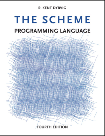

= The Scheme Programming Language, Fourth Edition
R\. Kent Dybvig
Illustrations by Jean-Pierre Hébert
:author: R. Kent Dybvig
:doctype: book
:toc: left
:toc-title: Table of Contents
:toclevels: 2
:favicon: ./icon.png
:data-uri:
:stem: latexmath
:source-highlighter: highlightjs
:highlightjs-languages: scheme, bash
ifdef::backend-pdf[]
:title-logo-image: image::images/cover.png[align=center]
endif::[]
:footer-copyright: R. Kent Dybvig / The Scheme Programming Language, Fourth Edition + \
                    Copyright (C) 2009 https://mitpress.mit.edu/books/scheme-programming-language-fourth-edition[The MIT Press]. \
                    Electronically reproduced by permission. + \
                    Illustrations (C) 2009 http://hebert.kitp.ucsb.edu/[Jean-Pierre Hébert] + \
                    ISBN 978-0-262-51298-5 / LOC QA76.73.S34D93 + \
                    https://mitpress.mit.edu/books/scheme-programming-language-fourth-edition[to order this book] \
                    / https://www.scheme.com/tspl4/canned/about.html[about this book] + \
                    &nbsp; + \
                    https://www.scheme.com

ifndef::backend-pdf[]

endif::[]

[dedication]

{footer-copyright}

[toc]

// Preface
include::preface.adoc[]

// Chapter 1. Introduction
include::introduction.adoc[]

// Chapter 2. Getting Started
include::getting-started.adoc[]

// Chapter 3. Going Further
include::going-further.adoc[]

// Chapter 4. Procedures and Variable Bindings
include::procedures-and-variable-bindings.adoc[]

// Chapter 5. Control Operations
include::control-operations.adoc[]

// Chapter 6. Operations on Objects
include::operations-on-objects.adoc[]

// Chapter 7. Input and Output
include::input-and-output.adoc[]

// Chapter 8. Syntactic Extension
include::syntactic-extension.adoc[]

// Chapter 9. Records
include::records.adoc[]

// Chapter 10. Libraries and Top-Level Programs
include::libraries-and-top-level-programs.adoc[]

// Chapter 11. Exceptions and Conditions
include::exceptions-and-conditions.adoc[]

// Chapter 12. Extended Examples
include::extended-examples.adoc[]

// References
include::references.adoc[]

// Answers to Selected Exercises
include::answers-to-selected-exercises.adoc[]

// Formal Syntax
include::formal-syntax.adoc[]

// Summary of Forms
include::summary-of-forms.adoc[]

// Index
include::index.adoc[]

[appendix]
== Book Converting Tools

- link:https://asciidoctor.org/docs/user-manual/[Asciidoctor User Manual]
- link:https://asciidoctor.org/docs/asciidoc-syntax-quick-reference/[AsciiDoc Syntax Quick Reference]
- link:https://math.meta.stackexchange.com/questions/5020/mathjax-basic-tutorial-and-quick-reference[MathJax basic tutorial and quick reference]
- link:https://www.whatsmyip.org/html-characters/[HTML Entities & Special Characters]

[appendix]
== Format Javascript and Replacement Regex for The Original Book

- Format Javascript +
+
[source,javascript,subs=""]
----
// Format the content with AsciiDoc syntax
document.querySelectorAll('h3')
        .forEach(function(node) {
            var title=node.innerText;
            var anchor='section_'+title.replace(/^Section ([\d.]+) .+/, '$1');
            node.outerHTML = '=== ' + title + ' [['+anchor+']]';
        })
document.querySelectorAll('h4')
        .forEach(function(node) {
            var title=node.innerText;
            var anchor='exercise_'+title.replace(/^Exercise ([\d.]+)$/, '$1');
            node.outerHTML = '==== ' + title + ' [['+anchor+']]&lt;br&gt;';
        })
document.querySelectorAll('[src="math/tspl/0.gif"]')
        .forEach(function(node) { node.outerHTML = '⇒' })
document.querySelectorAll('tt')
        .forEach(function(node) { node.innerHTML = '`'+node.innerHTML+'`' })
document.querySelectorAll('i')
        .forEach(function(node) { node.innerHTML = '_'+node.innerHTML+'_' })
document.querySelectorAll('li')
        .forEach(function(node) { node.innerHTML = '- '+node.innerHTML })
document.querySelectorAll('sub')
        .forEach(function(node) { node.outerHTML = '~'+node.innerText+'~' })
document.querySelectorAll('sup')
        .forEach(function(node) { node.outerHTML = '^'+node.innerText+'^' })
document.querySelectorAll('a')
        .forEach(function(node) {
            var name=node.name;
            if (name && name.match(/^\.\/(.+)$/)) {
                node.outerHTML='[#'+(name.replace(/^\.\/(.+)$/, '$1'))+'] ';
            }
        })
document.querySelectorAll('a')
        .forEach(function(node) {
            var name=node.name;
            if (name && name.match(/^[^#.\/]+$/)) {
                node.outerHTML='[#'+name+'] ';
            }
        })

// Highlight the code blocks and italic text
document.querySelectorAll('tt')
        .forEach(function(node) {
            node.style='font-size: 2em; border-bottom: 1px solid grey;'
        })
document.querySelectorAll('i')
        .forEach(function(node) {
            node.style='font-size: 2em; border-right: 1px solid red;'
        })
----

- Replacement Regex +
+
|===
|Regex |Replacement

|^$\n\s*`\s*\(
|`\n[source,scheme,subs=""]\n----\n(`

|\)`\n^$
|`)\n----\n`

|`\[(\d+)\]`
|++<<ref$1>>++

|`([^=]) Section ([\d\.]+\d)`
|++$1 <<section_$2.,Section $2>>++

|`([(])Section ([\d\.]+\d)`
|++$1<<section_$2.,Section $2>>++

|`([^=]) Exercise ([\d\.]+\d)`
|++$1 <<exercise_$2,Exercise $2>>++
|===

- Check the lost links +
+
[source,javascript,subs=""]
----
var lostAnchors=[];
document.querySelector('#content')
        .querySelectorAll('a[href^="#"]')
        .forEach(function(node) {
            var anchor = node.getAttribute('href');

            if (!document.querySelector('[id="' + anchor.replace(/^#/, '') + '"]')) {
                lostAnchors.push(anchor);
            }
        });
console.log(lostAnchors.join('\n'));
----
