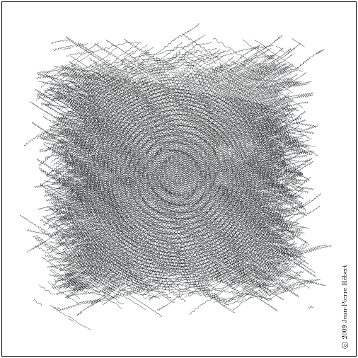

[#chp_operations_on_objects]
== Chapter 6. Operations on Objects

This chapter describes the operations on objects, including lists, numbers, characters, strings, vectors, bytevectors, symbols, booleans, hashtables, and enumerations. The first section covers constant objects and quotation. The second section describes generic equivalence predicates for comparing two objects and predicates for determining the type of an object. Later sections describe procedures that deal primarily with one of the object types mentioned above. There is no section treating operations on procedures, since the only operation defined specifically for procedures is application, and this is described in <<chp_control_operations,Chapter 5>>. Operations on ports are covered in the more general discussion of input and output in <<chp_input_and_output,Chapter 7>>. A mechanism for defining new data types is described in <<chp_records,Chapter 9>>.

=== Section 6.1. Constants and Quotation [[section_6.1.]]

[horizontal]
syntax:: `_constant_`
returns:: `_constant_`

`_constant_` is any self-evaluating constant, i.e., a number, boolean, character, string, or bytevector. Constants are immutable; see the note in the description of `quote` below.

[source,scheme,subs=""]
----
3.2 ⇒ 3.2
#f ⇒ #f
#\c ⇒ #\c
"hi" ⇒ "hi"
#vu8(3 4 5) ⇒ #vu8(3 4 5)
----

[horizontal]
syntax:: `(quote _obj_)`
syntax:: `'_obj_`
returns:: `_obj_`
libraries:: `(rnrs base)`, `(rnrs)`

`'_obj_` is equivalent to `(quote _obj_)`. The abbreviated form is converted into the longer form by the Scheme reader (see `read`).

`quote` inhibits the normal evaluation rule for `_obj_`, allowing `_obj_` to be employed as data. Although any Scheme object may be quoted, quotation is not necessary for self-evaluating constants, i.e., numbers, booleans, characters, strings, and bytevectors.

Quoted and self-evaluating constants are immutable. That is, programs should not alter a constant via `set-car!`, `string-set!`, etc., and implementations are permitted to raise an exception with condition type `&assertion` if such an alteration is attempted. If an attempt to alter an immutable object is undetected, the behavior of the program is unspecified. An implementation may choose to share storage among different constants to save space.

[source,scheme,subs=""]
----
(+ 2 3) ⇒ 5
'(+ 2 3) ⇒ (+ 2 3)
(quote (+ 2 3)) ⇒ (+ 2 3)
'a ⇒ a
'cons ⇒ cons
'() ⇒ ()
'7 ⇒ 7
----

[horizontal]
syntax:: `(quasiquote _obj_ \...)`
syntax:: ``_obj_`
syntax:: `(unquote _obj_ \...)`
syntax:: `,_obj_`
syntax:: `(unquote-splicing _obj_ \...)`
syntax:: `,@_obj_`
returns:: see below
libraries:: `(rnrs base)`, `(rnrs)`

``_obj_` is equivalent to `(quasiquote _obj_)`, `,_obj_` is equivalent to `(unquote _obj_)`, and `,@_obj_` is equivalent to `(unquote-splicing _obj_)`. The abbreviated forms are converted into the longer forms by the Scheme reader (see `read`).

`quasiquote` is similar to `quote`, but it allows parts of the quoted text to be "unquoted." Within a `quasiquote` expression, `unquote` and `unquote-splicing` subforms are evaluated, and everything else is quoted, i.e., left unevaluated. The value of each `unquote` subform is inserted into the output in place of the `unquote` form, while the value of each `unquote-splicing` subform is spliced into the surrounding list or vector structure. `unquote` and `unquote-splicing` are valid only within `quasiquote` expressions.

`quasiquote` expressions may be nested, with each `quasiquote` introducing a new level of quotation and each `unquote` or `unquote-splicing` taking away a level of quotation. An expression nested within _n_ `quasiquote` expressions must be within _n_ `unquote` or `unquote-splicing` expressions to be evaluated.

[source,scheme,subs=""]
----
`(+ 2 3) ⇒ (+ 2 3)

`(+ 2 ,(* 3 4)) ⇒ (+ 2 12)
`(a b (,(+ 2 3) c) d) ⇒ (a b (5 c) d)
`(a b ,(reverse '(c d e)) f g) ⇒ (a b (e d c) f g)
(let ([a 1] [b 2])
  `(,a . ,b)) ⇒ (1 . 2)

`(+ ,@(cdr '(* 2 3))) ⇒ (+ 2 3)
`(a b ,@(reverse '(c d e)) f g) ⇒ (a b e d c f g)
(let ([a 1] [b 2])
  `(,a ,@b)) ⇒ (1 . 2)
`#(,@(list 1 2 3)) ⇒ #(1 2 3)

'`,(cons 'a 'b) ⇒ `,(cons 'a 'b)
`',(cons 'a 'b) ⇒ '(a . b)
----

`unquote` and `unquote-splicing` forms with zero or more than one subform are valid only in splicing (list or vector) contexts. `(unquote _obj_ \...)` is equivalent to `(unquote _obj_) \...`, and `(unquote-splicing _obj_ \...)` is equivalent to `(unquote-splicing _obj_) \...`. These forms are primarily useful as intermediate forms in the output of the `quasiquote` expander. They support certain useful nested quasiquotation idioms <<ref3>>, such as `,@,@`, which has the effect of a doubly indirect splicing when used within a doubly nested and doubly evaluated `quasiquote` expression.

[source,scheme,subs=""]
----
`(a (unquote) b) ⇒ (a b)
`(a (unquote (+ 3 3)) b) ⇒ (a 6 b)
`(a (unquote (+ 3 3) (* 3 3)) b) ⇒ (a 6 9 b)

(let ([x '(m n)]) ``(a ,@,@x f)) ⇒ `(a (unquote-splicing m n) f)
(let ([x '(m n)])
  (eval `(let ([m '(b c)] [n '(d e)]) `(a ,@,@x f))
        (environment '(rnrs)))) ⇒ (a b c d e f)
----

`unquote` and `unquote-splicing` are auxiliary keywords for `quasiquote`. It is a syntax violation to reference these identifiers except in contexts where they are recognized as auxiliary keywords.

=== Section 6.2. Generic Equivalence and Type Predicates [[section_6.2.]]

This section describes the basic Scheme predicates (procedures returning one of the boolean values `#t` or `#f`) for determining the type of an object or the equivalence of two objects. The equivalence predicates `eq?`, `eqv?`, and `equal?` are discussed first, followed by the type predicates.

[horizontal]
procedure:: `(eq? _obj~1~_ _obj~2~_)`
returns:: `#t` if `_obj~1~_` and `_obj~2~_` are identical, `#f` otherwise
libraries:: `(rnrs base)`, `(rnrs)`

In most Scheme systems, two objects are considered identical if they are represented internally by the same pointer value and distinct (not identical) if they are represented internally by different pointer values, although other criteria, such as time-stamping, are possible.

Although the particular rules for object identity vary somewhat from system to system, the following rules always hold.

- Two objects of different types (booleans, the empty list, pairs, numbers, characters, strings, vectors, symbols, and procedures) are distinct.
- Two objects of the same type with different contents or values are distinct.
- The boolean object `#t` is identical to itself wherever it appears, and `#f` is identical to itself wherever it appears, but `#t` and `#f` are distinct.
- The empty list `()` is identical to itself wherever it appears.
- Two symbols are identical if and only if they have the same name (by `string=?`).
- A constant pair, vector, string, or bytevector is identical to itself, as is a pair, vector, string, or bytevector created by an application of `cons`, `vector`, `string`, `make-bytevector`, etc. Two pairs, vectors, strings, or bytevectors created by different applications of `cons`, `vector`, `string`, `make-bytevector`, etc., are distinct. One consequence is that `cons`, for example, may be used to create a unique object distinct from all other objects.
- Two procedures that may behave differently are distinct. A procedure created by an evaluation of a `lambda` expression is identical to itself. Two procedures created by the same `lambda` expression at different times, or by similar `lambda` expressions, may or may not be distinct.

`eq?` cannot be used to compare numbers and characters reliably. Although every inexact number is distinct from every exact number, two exact numbers, two inexact numbers, or two characters with the same value may or may not be identical.

Since constant objects are immutable, i.e., programs should not modify them via `vector-set!`, `set-car!`, or any other structure mutation operation, all or portions of different quoted constants or self-evaluating literals may be represented internally by the same object. Thus, `eq?` may return `#t` when applied to equal parts of different immutable constants.

`eq?` is most often used to compare symbols or to check for pointer equivalence of allocated objects, e.g., pairs, vectors, or record instances.

[source,scheme,subs="quotes"]
----
(eq? 'a 3) ⇒ \#f
(eq? #t 't) ⇒ #f
(eq? "abc" 'abc) ⇒ #f
(eq? "hi" '(hi)) ⇒ #f
(eq? #f '()) ⇒ #f

(eq? 9/2 7/2) ⇒ #f
(eq? 3.4 53344) ⇒ #f
(eq? 3 3.0) ⇒ #f
(eq? 1/3 #i1/3) ⇒ #f

(eq? 9/2 9/2) ⇒ _unspecified_
(eq? 3.4 (+ 3.0 .4)) ⇒ _unspecified_
(let ([x (* 12345678987654321 2)])
  (eq? x x)) ⇒ _unspecified_

(eq? #\a #\b) ⇒ #f
(eq? #\a #\a) ⇒ _unspecified_
(let ([x (string-ref "hi" 0)])
  (eq? x x)) ⇒ _unspecified_

(eq? #t #t) ⇒ #t
(eq? #f #f) ⇒ #t
(eq? #t #f) ⇒ #f
(eq? (null? '()) #t) ⇒ #t
(eq? (null? '(a)) #f) ⇒ #t

(eq? (cdr '(a)) '()) ⇒ #t

(eq? 'a 'a) ⇒ #t
(eq? 'a 'b) ⇒ #f
(eq? 'a (string->symbol "a")) ⇒ #t

(eq? '(a) '(b)) ⇒ #f
(eq? '(a) '(a)) ⇒ _unspecified_
(let ([x '(a . b)]) (eq? x x)) ⇒ #t
(let ([x (cons 'a 'b)])
  (eq? x x)) ⇒ #t
(eq? (cons 'a 'b) (cons 'a 'b)) ⇒ #f

(eq? "abc" "cba") ⇒ #f
(eq? "abc" "abc") ⇒ _unspecified_
(let ([x "hi"]) (eq? x x)) ⇒ #t
(let ([x (string #\h #\i)]) (eq? x x)) ⇒ #t
(eq? (string #\h #\i)
     (string #\h #\i)) ⇒ #f

(eq? '#vu8(1) '#vu8(1)) ⇒ _unspecified_
(eq? '#vu8(1) '#vu8(2)) ⇒ #f
(let ([x (make-bytevector 10 0)])
  (eq? x x)) ⇒ #t
(let ([x (make-bytevector 10 0)])
  (eq? x (make-bytevector 10 0))) ⇒ #f

(eq? '#(a) '\#(b)) ⇒ #f
(eq? '#(a) '\#(a)) ⇒ _unspecified_
(let ([x '#(a)]) (eq? x x)) ⇒ #t
(let ([x (vector 'a)])
  (eq? x x)) ⇒ #t
(eq? (vector 'a) (vector 'a)) ⇒ #f

(eq? car car) ⇒ #t
(eq? car cdr) ⇒ #f
(let ([f (lambda (x) x)])
  (eq? f f)) ⇒ #t
(let ([f (lambda () (lambda (x) x))])
  (eq? (f) (f))) ⇒ _unspecified_
(eq? (lambda (x) x) (lambda (y) y)) ⇒ _unspecified_

(let ([f (lambda (x)
           (lambda ()
             (set! x (+ x 1))
             x))])
  (eq? (f 0) (f 0))) ⇒ #f
----

[horizontal]
procedure:: `(eqv? _obj~1~_ _obj~2~_)`
returns:: `#t` if `_obj~1~_` and `_obj~2~_` are equivalent, `#f` otherwise
libraries:: `(rnrs base)`, `(rnrs)`

`eqv?` is similar to `eq?` except `eqv?` is guaranteed to return `#t` for two characters that are considered equal by `char=?` and two numbers that are (a) considered equal by `=` and (b) cannot be distinguished by any other operation besides `eq?` and `eqv?`. A consequence of (b) is that `(eqv? -0.0 +0.0)` is `#f` even though `(= -0.0 +0.0)` is `#t` in systems that distinguish `-0.0` and `+0.0`, such as those based on IEEE floating-point arithmetic. This is because operations such as `/` can expose the difference:

[source,scheme,subs="quotes"]
----
(/ 1.0 -0.0) ⇒ -inf.0
(/ 1.0 +0.0) ⇒ +inf.0
----

Similarly, although 3.0 and 3.0+0.0i are considered numerically equal, they are not considered equivalent by `eqv?` if -0.0 and 0.0 have different representations.

[source,scheme,subs="quotes"]
----
(= 3.0+0.0i 3.0) ⇒ #t
(eqv? 3.0+0.0i 3.0) ⇒ #f
----

The boolean value returned by `eqv?` is not specified when the arguments are NaNs.

[source,scheme,subs="quotes"]
----
(eqv? +nan.0 (/ 0.0 0.0)) ⇒ _unspecified_
----

`eqv?` is less implementation-dependent but generally more expensive than `eq?`.

[source,scheme,subs="quotes"]
----
(eqv? 'a 3) ⇒ \#f
(eqv? #t 't) ⇒ #f
(eqv? "abc" 'abc) ⇒ #f
(eqv? "hi" '(hi)) ⇒ #f
(eqv? #f '()) ⇒ #f

(eqv? 9/2 7/2) ⇒ #f
(eqv? 3.4 53344) ⇒ #f
(eqv? 3 3.0) ⇒ #f
(eqv? 1/3 #i1/3) ⇒ #f

(eqv? 9/2 9/2) ⇒ #t
(eqv? 3.4 (+ 3.0 .4)) ⇒ #t
(let ([x (* 12345678987654321 2)])
  (eqv? x x)) ⇒ #t

(eqv? #\a #\b) ⇒ #f
(eqv? #\a #\a) ⇒ #t
(let ([x (string-ref "hi" 0)])
  (eqv? x x)) ⇒ #t

(eqv? #t #t) ⇒ #t
(eqv? #f #f) ⇒ #t
(eqv? #t #f) ⇒ #f
(eqv? (null? '()) #t) ⇒ #t
(eqv? (null? '(a)) #f) ⇒ #t

(eqv? (cdr '(a)) '()) ⇒ #t

(eqv? 'a 'a) ⇒ #t
(eqv? 'a 'b) ⇒ #f
(eqv? 'a (string->symbol "a")) ⇒ #t

(eqv? '(a) '(b)) ⇒ #f
(eqv? '(a) '(a)) ⇒ _unspecified_
(let ([x '(a . b)]) (eqv? x x)) ⇒ #t
(let ([x (cons 'a 'b)])
  (eqv? x x)) ⇒ #t
(eqv? (cons 'a 'b) (cons 'a 'b)) ⇒ #f

(eqv? "abc" "cba") ⇒ #f
(eqv? "abc" "abc") ⇒ _unspecified_
(let ([x "hi"]) (eqv? x x)) ⇒ #t
(let ([x (string #\h #\i)]) (eqv? x x)) ⇒ #t
(eqv? (string #\h #\i)
      (string #\h #\i)) ⇒ #f

(eqv? '#vu8(1) '#vu8(1)) ⇒ _unspecified_
(eqv? '#vu8(1) '#vu8(2)) ⇒ #f
(let ([x (make-bytevector 10 0)])
  (eqv? x x)) ⇒ #t
(let ([x (make-bytevector 10 0)])
  (eqv? x (make-bytevector 10 0))) ⇒ #f

(eqv? '#(a) '\#(b)) ⇒ #f
(eqv? '#(a) '\#(a)) ⇒ _unspecified_
(let ([x '#(a)]) (eqv? x x)) ⇒ #t
(let ([x (vector 'a)])
  (eqv? x x)) ⇒ #t
(eqv? (vector 'a) (vector 'a)) ⇒ #f

(eqv? car car) ⇒ #t
(eqv? car cdr) ⇒ #f
(let ([f (lambda (x) x)])
  (eqv? f f)) ⇒ #t
(let ([f (lambda () (lambda (x) x))])
  (eqv? (f) (f))) ⇒ _unspecified_
(eqv? (lambda (x) x) (lambda (y) y)) ⇒ _unspecified_

(let ([f (lambda (x)
           (lambda ()
             (set! x (+ x 1))
             x))])
  (eqv? (f 0) (f 0))) ⇒ #f
----

[horizontal]
procedure:: `(equal? _obj~1~_ _obj~2~_)`
returns:: `#t` if `_obj~1~_` and `_obj~2~_` have the same structure and contents, `#f` otherwise
libraries:: `(rnrs base)`, `(rnrs)`

Two objects are equal if they are equivalent according to `eqv?`, strings that are `string=?`, bytevectors that are `bytevector=?`, pairs whose cars and cdrs are equal, or vectors of the same length whose corresponding elements are equal.

`equal?` is required to terminate even for cyclic arguments and return `#t` "if and only if the (possibly infinite) unfoldings of its arguments into regular trees are equal as ordered trees" <<ref24>>. In essence, two values are equivalent, in the sense of `equal?`, if the structure of the two objects cannot be distinguished by any composition of pair and vector accessors along with the `eqv?`, `string=?`, and `bytevector=?` procedures for comparing data at the leaves.

Implementing `equal?` efficiently is tricky <<ref1>>, and even with a good implementation, it is likely to be more expensive than either `eqv?` or `eq?`.

[source,scheme,subs="quotes"]
----
(equal? 'a 3) ⇒ \#f
(equal? #t 't) ⇒ #f
(equal? "abc" 'abc) ⇒ #f
(equal? "hi" '(hi)) ⇒ #f
(equal? #f '()) ⇒ #f

(equal? 9/2 7/2) ⇒ #f
(equal? 3.4 53344) ⇒ #f
(equal? 3 3.0) ⇒ #f
(equal? 1/3 #i1/3) ⇒ #f

(equal? 9/2 9/2) ⇒ #t
(equal? 3.4 (+ 3.0 .4)) ⇒ #t
(let ([x (* 12345678987654321 2)])
  (equal? x x)) ⇒ #t

(equal? #\a #\b) ⇒ #f
(equal? #\a #\a) ⇒ #t
(let ([x (string-ref "hi" 0)])
  (equal? x x)) ⇒ #t

(equal? #t #t) ⇒ #t
(equal? #f #f) ⇒ #t
(equal? #t #f) ⇒ #f
(equal? (null? '()) #t) ⇒ #t
(equal? (null? '(a)) #f) ⇒ #t

(equal? (cdr '(a)) '()) ⇒ #t

(equal? 'a 'a) ⇒ #t
(equal? 'a 'b) ⇒ #f
(equal? 'a (string->symbol "a")) ⇒ #t

(equal? '(a) '(b)) ⇒ #f
(equal? '(a) '(a)) ⇒ #t
(let ([x '(a . b)]) (equal? x x)) ⇒ #t
(let ([x (cons 'a 'b)])
  (equal? x x)) ⇒ #t
(equal? (cons 'a 'b) (cons 'a 'b)) ⇒ #t

(equal? "abc" "cba") ⇒ #f
(equal? "abc" "abc") ⇒ #t
(let ([x "hi"]) (equal? x x)) ⇒ #t
(let ([x (string #\h #\i)]) (equal? x x)) ⇒ #t
(equal? (string #\h #\i)
        (string #\h #\i)) ⇒ #t

(equal? '#vu8(1) '#vu8(1)) ⇒ #t
(equal? '#vu8(1) '#vu8(2)) ⇒ #f
(let ([x (make-bytevector 10 0)])
  (equal? x x)) ⇒ #t
(let ([x (make-bytevector 10 0)])
  (equal? x (make-bytevector 10 0))) ⇒ #t

(equal? '#(a) '\#(b)) ⇒ #f
(equal? '#(a) '\#(a)) ⇒ #t
(let ([x '#(a)]) (equal? x x)) ⇒ #t
(let ([x (vector 'a)])
  (equal? x x)) ⇒ #t
(equal? (vector 'a) (vector 'a)) ⇒ #t

(equal? car car) ⇒ #t
(equal? car cdr) ⇒ #f
(let ([f (lambda (x) x)])
  (equal? f f)) ⇒ #t
(let ([f (lambda () (lambda (x) x))])
  (equal? (f) (f))) ⇒ _unspecified_
(equal? (lambda (x) x) (lambda (y) y)) ⇒ _unspecified_

(let ([f (lambda (x)
           (lambda ()
             (set! x (+ x 1))
             x))])
  (equal? (f 0) (f 0))) ⇒ #f

(equal?
  (let ([x (cons 'x 'x)])
    (set-car! x x)
    (set-cdr! x x)
    x)
  (let ([x (cons 'x 'x)])
    (set-car! x x)
    (set-cdr! x x)
    (cons x x))) ⇒ #t
----

[horizontal]
procedure:: `(boolean? _obj_)`
returns:: `#t` if `_obj_` is either `#t` or `#f`, `#f` otherwise
libraries:: `(rnrs base)`, `(rnrs)`

`boolean?` is equivalent to `(lambda (x) (or (eq? x #t) (eq? x #f)))`.

[source,scheme,subs="quotes"]
----
(boolean? #t) ⇒ #t
(boolean? #f) ⇒ #t
(or (boolean? 't) (boolean? '())) ⇒ #f
----

[horizontal]
procedure:: `(null? _obj_)`
returns:: `#t` if `_obj_` is the empty list, `#f` otherwise
libraries:: `(rnrs base)`, `(rnrs)`

`null?` is equivalent to `(lambda (x) (eq? x '()))`.

[source,scheme,subs="quotes"]
----
(null? '()) ⇒ #t
(null? '(a)) ⇒ #f
(null? (cdr '(a))) ⇒ #t
(null? 3) ⇒ #f
(null? #f) ⇒ #f
----

[horizontal]
procedure:: `(pair? _obj_)`
returns:: `#t` if `_obj_` is a pair, `#f` otherwise
libraries:: `(rnrs base)`, `(rnrs)`

[source,scheme,subs="quotes"]
----
(pair? '(a b c)) ⇒ \#t
(pair? '(3 . 4)) ⇒ #t
(pair? '()) ⇒ #f
(pair? '#(a b)) ⇒ #f
(pair? 3) ⇒ #f
----

[horizontal]
procedure:: `(number? _obj_)`
returns:: `#t` if `_obj_` is a number object, `#f` otherwise
procedure:: `(complex? _obj_)`
returns:: `#t` if `_obj_` is a complex number object, `#f` otherwise
procedure:: `(real? _obj_)`
returns:: `#t` if `_obj_` is a real number object, `#f` otherwise
procedure:: `(rational? _obj_)`
returns:: `#t` if `_obj_` is a rational number object, `#f` otherwise
procedure:: `(integer? _obj_)`
returns:: `#t` if `_obj_` is an integer object, `#f` otherwise
libraries:: `(rnrs base)`, `(rnrs)`

These predicates form a hierarchy: any integer is rational, any rational is real, any real is complex, and any complex is numeric. Most implementations do not provide internal representations for irrational numbers, so all real numbers are typically rational as well.

The `real?`, `rational?`, and `integer?` predicates do not recognize as real, rational, or integer complex numbers with inexact zero imaginary parts.

[source,scheme,subs="quotes"]
----
(integer? 1901) ⇒ \#t
(rational? 1901) ⇒ #t
(real? 1901) ⇒ #t
(complex? 1901) ⇒ #t
(number? 1901) ⇒ #t

(integer? -3.0) ⇒ #t
(rational? -3.0) ⇒ #t
(real? -3.0) ⇒ #t
(complex? -3.0) ⇒ #t
(number? -3.0) ⇒ #t

(integer? 7+0i) ⇒ #t
(rational? 7+0i) ⇒ #t
(real? 7+0i) ⇒ #t
(complex? 7+0i) ⇒ #t
(number? 7+0i) ⇒ #t

(integer? -2/3) ⇒ #f
(rational? -2/3) ⇒ #t
(real? -2/3) ⇒ #t
(complex? -2/3) ⇒ #t
(number? -2/3) ⇒ #t

(integer? -2.345) ⇒ #f
(rational? -2.345) ⇒ #t
(real? -2.345) ⇒ #t
(complex? -2.345) ⇒ #t
(number? -2.345) ⇒ #t

(integer? 7.0+0.0i) ⇒ #f
(rational? 7.0+0.0i) ⇒ #f
(real? 7.0+0.0i) ⇒ #f
(complex? 7.0+0.0i) ⇒ #t
(number? 7.0+0.0i) ⇒ #t

(integer? 3.2-2.01i) ⇒ #f
(rational? 3.2-2.01i) ⇒ #f
(real? 3.2-2.01i) ⇒ #f
(complex? 3.2-2.01i) ⇒ #t
(number? 3.2-2.01i) ⇒ #t

(integer? 'a) ⇒ #f
(rational? '(a b c)) ⇒ #f
(real? "3") ⇒ #f
(complex? '#(1 2)) ⇒ #f
(number? #\a) ⇒ #f
----

[horizontal]
procedure:: `(real-valued? _obj_)`
returns:: `#t` if `_obj_` is a real number, `#f` otherwise
procedure:: `(rational-valued? _obj_)`
returns:: `#t` if `_obj_` is a rational number, `#f` otherwise
procedure:: `(integer-valued? _obj_)`
returns:: `#t` if `_obj_` is an integer, `#f` otherwise
libraries:: `(rnrs base)`, `(rnrs)`

These predicates are similar to `real?`, `rational?`, and `integer?`, but treat as real, rational, or integral complex numbers with inexact zero imaginary parts.

[source,scheme,subs="quotes"]
----
(integer-valued? 1901) ⇒ #t
(rational-valued? 1901) ⇒ #t
(real-valued? 1901) ⇒ #t

(integer-valued? -3.0) ⇒ #t
(rational-valued? -3.0) ⇒ #t
(real-valued? -3.0) ⇒ #t

(integer-valued? 7+0i) ⇒ #t
(rational-valued? 7+0i) ⇒ #t
(real-valued? 7+0i) ⇒ #t

(integer-valued? -2/3) ⇒ #f
(rational-valued? -2/3) ⇒ #t
(real-valued? -2/3) ⇒ #t

(integer-valued? -2.345) ⇒ #f
(rational-valued? -2.345) ⇒ #t
(real-valued? -2.345) ⇒ #t

(integer-valued? 7.0+0.0i) ⇒ #t
(rational-valued? 7.0+0.0i) ⇒ #t
(real-valued? 7.0+0.0i) ⇒ #t

(integer-valued? 3.2-2.01i) ⇒ #f
(rational-valued? 3.2-2.01i) ⇒ #f
(real-valued? 3.2-2.01i) ⇒ #f
----

As with `real?`, `rational?`, and `integer?`, these predicates return `#f` for all non-numeric values.

[source,scheme,subs="quotes"]
----
(integer-valued? 'a) ⇒ #f
(rational-valued? '(a b c)) ⇒ #f
(real-valued? "3") ⇒ #f
----

[horizontal]
procedure:: `(char? _obj_)`
returns:: `#t` if `_obj_` is a character, `#f` otherwise
libraries:: `(rnrs base)`, `(rnrs)`

[source,scheme,subs="quotes"]
----
(char? 'a) ⇒ #f
(char? 97) ⇒ #f
(char? #\a) ⇒ #t
(char? "a") ⇒ #f
(char? (string-ref (make-string 1) 0)) ⇒ #t
----

[horizontal]
procedure:: `(string? _obj_)`
returns:: `#t` if `_obj_` is a string, `#f` otherwise
libraries:: `(rnrs base)`, `(rnrs)`

[source,scheme,subs="quotes"]
----
(string? "hi") ⇒ #t
(string? 'hi) ⇒ #f
(string? #\h) ⇒ #f
----

[horizontal]
procedure:: `(vector? _obj_)`
returns:: `#t` if `_obj_` is a vector, `#f` otherwise
libraries:: `(rnrs base)`, `(rnrs)`

[source,scheme,subs="quotes"]
----
(vector? '\#()) ⇒ #t
(vector? '#(a b c)) ⇒ #t
(vector? (vector 'a 'b 'c)) ⇒ #t
(vector? '()) ⇒ #f
(vector? '(a b c)) ⇒ #f
(vector? "abc") ⇒ #f
----

[horizontal]
procedure:: `(symbol? _obj_)`
returns:: `#t` if `_obj_` is a symbol, `#f` otherwise
libraries:: `(rnrs base)`, `(rnrs)`

[source,scheme,subs="quotes"]
----
(symbol? 't) ⇒ #t
(symbol? "t") ⇒ #f
(symbol? '(t)) ⇒ #f
(symbol? #\t) ⇒ #f
(symbol? 3) ⇒ #f
(symbol? #t) ⇒ #f
----

[horizontal]
procedure:: `(procedure? _obj_)`
returns:: `#t` if `_obj_` is a procedure, `#f` otherwise
libraries:: `(rnrs base)`, `(rnrs)`

[source,scheme,subs="quotes"]
----
(procedure? car) ⇒ #t
(procedure? 'car) ⇒ #f
(procedure? (lambda (x) x)) ⇒ #t
(procedure? '(lambda (x) x)) ⇒ #f
(call/cc procedure?) ⇒ #t
----

[horizontal]
procedure:: `(bytevector? _obj_)`
returns:: `#t` if `_obj_` is a bytevector, `#f` otherwise
libraries:: `(rnrs bytevectors)`, `(rnrs)`

[source,scheme,subs="quotes"]
----
(bytevector? \#vu8()) ⇒ #t
(bytevector? '#()) ⇒ #f
(bytevector? "abc") ⇒ #f
----

[horizontal]
procedure:: `(hashtable? _obj_)`
returns:: `#t` if `_obj_` is a hashtable, `#f` otherwise
libraries:: `(rnrs hashtables)`, `(rnrs)`

[source,scheme,subs="quotes"]
----
(hashtable? (make-eq-hashtable)) ⇒ #t
(hashtable? '(not a hash table)) ⇒ #f
----

=== Section 6.3. Lists and Pairs [[section_6.3.]]

The pair, or _cons cell_, is the most fundamental of Scheme's structured object types. The most common use for pairs is to build lists, which are ordered sequences of pairs linked one to the next by the _cdr_ field. The elements of the list occupy the _car_ fields of the pairs. The cdr of the last pair in a _proper list_ is the empty list, `()`; the cdr of the last pair in an _improper list_ can be anything other than `()`.

Pairs may be used to construct binary trees. Each pair in the tree structure is an internal node of the binary tree; its car and cdr are the children of the node.

Proper lists are printed as sequences of objects separated by whitespace and enclosed in parentheses. Matching pairs of brackets ( `[` `]` ) may be used in place of parentheses. For example, `(1 2 3)` and `(a [nested list])` are proper lists. The empty list is written as `()`.

Improper lists and trees require a slightly more complex syntax. A single pair is written as two objects separated by whitespace and a dot, e.g., `(a . b)`. This is referred to as _dotted-pair notation_. Improper lists and trees are also written in dotted-pair notation; the dot appears wherever necessary, e.g., `(1 2 3 . 4)` or `((1 . 2) . 3)`. Proper lists may be written in dotted-pair notation as well. For example, `(1 2 3)` may be written as `(1 . (2 . (3 . ())))`.

It is possible to create a circular list or a cyclic graph by destructively altering the car or cdr field of a pair, using `set-car!` or `set-cdr!`. Such lists are not considered proper lists.

Procedures that accept a `_list_` argument are required to detect that the list is improper only to the extent that they actually traverse the list far enough either (a) to attempt to operate on a non-list tail or (b) to loop indefinitely due to a circularity. For example, `member` need not detect that a list is improper if it actually finds the element being sought, and `list-ref` need never detect circularities, because its recursion is bounded by the index argument.

[horizontal]
procedure:: `(cons _obj~1~_ _obj~2~_)`
returns:: a new pair whose car and cdr are `_obj~1~_` and `_obj~2~_`
libraries:: `(rnrs base)`, `(rnrs)`

`cons` is the pair constructor procedure. `_obj~1~_` becomes the car and `_obj~2~_` becomes the cdr of the new pair.

[source,scheme,subs=""]
----
(cons 'a '()) ⇒ (a)
(cons 'a '(b c)) ⇒ (a b c)
(cons 3 4) ⇒ (3 . 4)
----

[horizontal]
procedure:: `(car _pair_)`
returns:: the car of `_pair_`
libraries:: `(rnrs base)`, `(rnrs)`

The empty list is not a pair, so the argument must not be the empty list.

[source,scheme,subs=""]
----
(car '(a)) ⇒ a
(car '(a b c)) ⇒ a
(car (cons 3 4)) ⇒ 3
----

[horizontal]
procedure:: `(cdr _pair_)`
returns:: the cdr of `_pair_`
libraries:: `(rnrs base)`, `(rnrs)`

The empty list is not a pair, so the argument must not be the empty list.

[source,scheme,subs=""]
----
(cdr '(a)) ⇒ ()
(cdr '(a b c)) ⇒ (b c)
(cdr (cons 3 4)) ⇒ 4
----

[horizontal]
procedure:: `(set-car! _pair_ _obj_)`
returns:: unspecified
libraries:: `(rnrs mutable-pairs)`

`set-car!` changes the car of `_pair_` to `_obj_`.

[source,scheme,subs=""]
----
(let ([x (list 'a 'b 'c)])
  (set-car! x 1)
  x) ⇒ (1 b c)
----

[horizontal]
procedure:: `(set-cdr! _pair_ _obj_)`
returns:: unspecified
libraries:: `(rnrs mutable-pairs)`

`set-cdr!` changes the cdr of `_pair_` to `_obj_`.

[source,scheme,subs=""]
----
(let ([x (list 'a 'b 'c)])
  (set-cdr! x 1)
  x) ⇒ (a . 1)
----

[horizontal]
procedure:: `(caar _pair_)`
procedure:: `(cadr _pair_)` <graphic>
procedure:: `(cddddr _pair_)`
returns:: the caar, cadr, \..., or cddddr of `_pair_`
libraries:: `(rnrs base)`, `(rnrs)`

These procedures are defined as the composition of up to four `car`s and `cdr`s. The `a`'s and `d`'s between the `c` and `r` represent the application of `car` or `cdr` in order from right to left. For example, the procedure `cadr` applied to a pair yields the `car` of the `cdr` of the pair and is equivalent to `(lambda (x) (car (cdr x)))`.

[source,scheme,subs=""]
----
(caar '((a))) ⇒ a
(cadr '(a b c)) ⇒ b
(cdddr '(a b c d)) ⇒ (d)
(cadadr '(a (b c))) ⇒ c
----

[horizontal]
procedure:: `(list _obj_ \...)`
returns:: a list of `_obj_ \...`
libraries:: `(rnrs base)`, `(rnrs)`

`list` is equivalent to `(lambda x x)`.

[source,scheme,subs=""]
----
(list) ⇒ ()
(list 1 2 3) ⇒ (1 2 3)
(list 3 2 1) ⇒ (3 2 1)
----

[horizontal]
procedure:: `(cons* _obj_ \... _final-obj_)`
returns:: a list of `_obj_ \...` terminated by `_final-obj_`
libraries:: `(rnrs lists)`, `(rnrs)`

If the objects `_obj_ \...` are omitted, the result is simply `_final-obj_`. Otherwise, a list of `_obj_ \...` is constructed, as with `list`, except that the final cdr field is `_final-obj_` instead of `()`. If `_final-obj_` is not a list, the result is an improper list.

[source,scheme,subs=""]
----
(cons* '()) ⇒ ()
(cons* '(a b)) ⇒ (a b)
(cons* 'a 'b 'c) ⇒ (a b . c)
(cons* 'a 'b '(c d)) ⇒ (a b c d)
----

[horizontal]
procedure:: `(list? _obj_)`
returns:: `#t` if `_obj_` is a proper list, `#f` otherwise
libraries:: `(rnrs base)`, `(rnrs)`

`list?` must return `#f` for all improper lists, including cyclic lists. A definition of `list?` is shown on page 67.

[source,scheme,subs=""]
----
(list? '()) ⇒ #t
(list? '(a b c)) ⇒ #t
(list? 'a) ⇒ #f
(list? '(3 . 4)) ⇒ #f
(list? 3) ⇒ #f
(let ([x (list 'a 'b 'c)])
  (set-cdr! (cddr x) x)
  (list? x)) ⇒ #f
----

[horizontal]
procedure:: `(length _list_)`
returns:: the number of elements in `_list_`
libraries:: `(rnrs base)`, `(rnrs)`

`length` may be defined as follows, using an adaptation of the hare and tortoise algorithm used for the definition of `list?` on page 67.

[source,scheme,subs="quotes"]
----
(define length
  (lambda (x)
    (define improper-list
      (lambda ()
        (assertion-violation 'length "not a proper list" x)))

    (let f ([h x] [t x] [n 0])
      (if (pair? h)
          (let ([h (cdr h)])
            (if (pair? h)
                (if (eq? h t)
                    (improper-list)
                    (f (cdr h) (cdr t) (+ n 2)))
                (if (null? h)
                    (+ n 1)
                    (improper-list))))
          (if (null? h)
              n
              (improper-list))))))

(length '()) ⇒ 0
(length '(a b c)) ⇒ 3
(length '(a b . c)) ⇒ _exception_
(length
  (let ([ls (list 'a 'b)])
    (set-cdr! (cdr ls) ls) ⇒ _exception_
    ls))
(length
  (let ([ls (list 'a 'b)])
    (set-car! (cdr ls) ls) ⇒ 2
    ls))
----

[horizontal]
procedure:: `(list-ref _list_ _n_)`
returns:: the ``_n_``th element (zero-based) of `_list_`
libraries:: `(rnrs base)`, `(rnrs)`

`_n_` must be an exact nonnegative integer less than the length of `_list_`. `list-ref` may be defined without error checks as follows.

[#defn:list-ref]
[source,scheme,subs=""]
----
(define list-ref
  (lambda (ls n)
    (if (= n 0)
        (car ls)
        (list-ref (cdr ls) (- n 1)))))

(list-ref '(a b c) 0) ⇒ a
(list-ref '(a b c) 1) ⇒ b
(list-ref '(a b c) 2) ⇒ c
----

[horizontal]
procedure:: `(list-tail _list_ _n_)`
returns:: the ``_n_``th tail (zero-based) of `_list_`
libraries:: `(rnrs base)`, `(rnrs)`

`_n_` must be an exact nonnegative integer less than or equal to the length of `_list_`. The result is not a copy; the tail is `eq?` to the ``_n_``th cdr of `_list_` (or to `_list_` itself, if `_n_` is zero).

`list-tail` may be defined without error checks as follows.

[source,scheme,subs=""]
----
(define list-tail
  (lambda (ls n)
    (if (= n 0)
        ls
        (list-tail (cdr ls) (- n 1)))))

(list-tail '(a b c) 0) ⇒ (a b c)
(list-tail '(a b c) 2) ⇒ (c)
(list-tail '(a b c) 3) ⇒ ()
(list-tail '(a b c . d) 2) ⇒ (c . d)
(list-tail '(a b c . d) 3) ⇒ d
(let ([x (list 1 2 3)])
  (eq? (list-tail x 2)
       (cddr x))) ⇒ #t
----

[horizontal]
procedure:: `(append)`
procedure:: `(append _list_ \... _obj_)`
returns:: the concatenation of the input lists
libraries:: `(rnrs base)`, `(rnrs)`

`append` returns a new list consisting of the elements of the first list followed by the elements of the second list, the elements of the third list, and so on. The new list is made from new pairs for all arguments but the last; the last (which need not be a list) is merely placed at the end of the new structure. `append` may be defined without error checks as follows.

[source,scheme,subs=""]
----
(define append
  (lambda args
    (let f ([ls '()] [args args])
      (if (null? args)
          ls
          (let g ([ls ls])
            (if (null? ls)
                (f (car args) (cdr args))
                (cons (car ls) (g (cdr ls)))))))))

(append '(a b c) '()) ⇒ (a b c)
(append '() '(a b c)) ⇒ (a b c)
(append '(a b) '(c d)) ⇒ (a b c d)
(append '(a b) 'c) ⇒ (a b . c)
(let ([x (list 'b)])
  (eq? x (cdr (append '(a) x)))) ⇒ #t
----

[horizontal]
procedure:: `(reverse _list_)`
returns:: a new list containing the elements of `_list_` in reverse order
libraries:: `(rnrs base)`, `(rnrs)`

`reverse` may be defined without error checks as follows.

[source,scheme,subs=""]
----
(define reverse
  (lambda (ls)
    (let rev ([ls ls] [new '()])
      (if (null? ls)
          new
          (rev (cdr ls) (cons (car ls) new))))))

(reverse '()) ⇒ ()
(reverse '(a b c)) ⇒ (c b a)
----

[horizontal]
procedure:: `(memq _obj_ _list_)`
procedure:: `(memv _obj_ _list_)`
procedure:: `(member _obj_ _list_)`
returns:: the first tail of `_list_` whose car is equivalent to `_obj_`, or `#f`
libraries:: `(rnrs lists)`, `(rnrs)`

These procedures traverse the argument `_list_` in order, comparing the elements of `_list_` against `_obj_`. If an object equivalent to `_obj_` is found, the tail of the list whose first element is that object is returned. If the list contains more than one object equivalent to `_obj_`, the first tail whose first element is equivalent to `_obj_` is returned. If no object equivalent to `_obj_` is found, `#f` is returned. The equivalence test for `memq` is `eq?`, for `memv` is `eqv?`, and for `member` is `equal?`.

These procedures are most often used as predicates, but their names do not end with a question mark because they return a useful true value in place of `#t`. `memq` may be defined without error checks as follows.

[source,scheme,subs=""]
----
(define memq
  (lambda (x ls)
    (cond
      [(null? ls) #f]
      [(eq? (car ls) x) ls]
      [else (memq x (cdr ls))])))
----

`memv` and `member` may be defined similarly, with `eqv?` and `equal?` in place of `eq?`.

[source,scheme,subs=""]
----
(memq 'a '(b c a d e)) ⇒ (a d e)
(memq 'a '(b c d e g)) ⇒ #f
(memq 'a '(b a c a d a)) ⇒ (a c a d a)

(memv 3.4 '(1.2 2.3 3.4 4.5)) ⇒ (3.4 4.5)
(memv 3.4 '(1.3 2.5 3.7 4.9)) ⇒ #f
(let ([ls (list 'a 'b 'c)])
  (set-car! (memv 'b ls) 'z)
  ls) ⇒ (a z c)

(member '(b) '((a) (b) (c))) ⇒ ((b) (c))
(member '(d) '((a) (b) (c))) ⇒ #f
(member "b" '("a" "b" "c")) ⇒ ("b" "c")

(let ()
  (define member?
    (lambda (x ls)
      (and (member x ls) #t)))
  (member? '(b) '((a) (b) (c)))) ⇒ #t

(define count-occurrences
  (lambda (x ls)
    (cond
      [(memq x ls) =>
       (lambda (ls)
         (+ (count-occurrences x (cdr ls)) 1))]
      [else 0])))

(count-occurrences 'a '(a b c d a)) ⇒ 2
----

[horizontal]
procedure:: `(memp _procedure_ _list_)`
returns:: the first tail of `_list_` for whose car `_procedure_` returns true, or `#f`
libraries:: `(rnrs lists)`, `(rnrs)`

`_procedure_` should accept one argument and return a single value. It should not modify `_list_`.

[source,scheme,subs=""]
----
(memp odd? '(1 2 3 4)) ⇒ (1 2 3 4)
(memp even? '(1 2 3 4)) ⇒ (2 3 4)
(let ([ls (list 1 2 3 4)])
  (eq? (memp odd? ls) ls)) ⇒ #t
(let ([ls (list 1 2 3 4)])
  (eq? (memp even? ls) (cdr ls))) ⇒ #t
(memp odd? '(2 4 6 8)) ⇒ #f
----

[horizontal]
procedure:: `(remq _obj_ _list_)`
procedure:: `(remv _obj_ _list_)`
procedure:: `(remove _obj_ _list_)`
returns:: a list containing the elements of `_list_` with all occurrences of `_obj_` removed
libraries:: `(rnrs lists)`, `(rnrs)`

These procedures traverse the argument `_list_`, removing any objects that are equivalent to `_obj_`. The elements remaining in the output list are in the same order as they appear in the input list. If a tail of `_list_` (including `_list_` itself) contains no occurrences of `_obj_`, the corresponding tail of the result list may be the same (by `eq?`) as the tail of the input list.

The equivalence test for `remq` is `eq?`, for `remv` is `eqv?`, and for `remove` is `equal?`.

[source,scheme,subs=""]
----
(remq 'a '(a b a c a d)) ⇒ (b c d)
(remq 'a '(b c d)) ⇒ (b c d)

(remv 1/2 '(1.2 1/2 0.5 3/2 4)) ⇒ (1.2 0.5 3/2 4)

(remove '(b) '((a) (b) (c))) ⇒ ((a) (c))
----

[horizontal]
procedure:: `(remp _procedure_ _list_)`
returns:: a list of the elements of `_list_` for which `_procedure_` returns `#f`
libraries:: `(rnrs lists)`, `(rnrs)`

`_procedure_` should accept one argument and return a single value. It should not modify `_list_`.

`remp` applies `_procedure_` to each element of `_list_` and returns a list containing only the elements for which `_procedure_` returns `#f`. The elements of the returned list appear in the same order as they appeared in the original list.

[source,scheme,subs=""]
----
(remp odd? '(1 2 3 4)) ⇒ (2 4)
(remp
  (lambda (x) (and (> x 0) (< x 10)))
  '(-5 15 3 14 -20 6 0 -9)) ⇒ (-5 15 14 -20 0 -9)
----

[horizontal]
procedure:: `(filter _procedure_ _list_)`
returns:: a list of the elements of `_list_` for which `_procedure_` returns true
libraries:: `(rnrs lists)`, `(rnrs)`

`_procedure_` should accept one argument and return a single value. It should not modify `_list_`.

`filter` applies `_procedure_` to each element of `_list_` and returns a new list containing only the elements for which `_procedure_` returns true. The elements of the returned list appear in the same order as they appeared in the original list.

[source,scheme,subs=""]
----
(filter odd? '(1 2 3 4)) ⇒ (1 3)
(filter
  (lambda (x) (and (> x 0) (< x 10)))
  '(-5 15 3 14 -20 6 0 -9)) ⇒ (3 6)
----

[horizontal]
procedure:: `(partition _procedure_ _list_)`
returns:: see below
libraries:: `(rnrs lists)`, `(rnrs)`

`_procedure_` should accept one argument and return a single value. It should not modify `_list_`.

`partition` applies `_procedure_` to each element of `_list_` and returns two values: a new list containing only the elements for which `_procedure_` returns true, and a new list containing only the elements for which `_procedure_` returns `#f`. The elements of the returned lists appear in the same order as they appeared in the original list.

[source,scheme,subs=""]
----
(partition odd? '(1 2 3 4)) ⇒ (1 3)
                               (2 4)
(partition
  (lambda (x) (and (> x 0) (< x 10)))
  '(-5 15 3 14 -20 6 0 -9)) ⇒ (3 6)
                               (-5 15 14 -20 0 -9)
----

The values returned by `partition` can be obtained by calling `filter` and `remp` separately, but this would require two calls to `_procedure_` for each element of `_list_`.

[horizontal]
procedure:: `(find _procedure_ _list_)`
returns:: the first element of `_list_` for which `_procedure_` returns true, or `#f`
libraries:: `(rnrs lists)`, `(rnrs)`

`_procedure_` should accept one argument and return a single value. It should not modify `_list_`.

`find` traverses the argument `_list_` in order, applying `_procedure_` to each element in turn. If `_procedure_` returns a true value for a given element, `find` returns that element without applying `_procedure_` to the remaining elements. If `_procedure_` returns `#f` for each element of `_list_`, `find` returns `#f`.

If a program must distinguish between finding `#f` in the list and finding no element at all, `memp` should be used instead.

[source,scheme,subs=""]
----
(find odd? '(1 2 3 4)) ⇒ 1
(find even? '(1 2 3 4)) ⇒ 2
(find odd? '(2 4 6 8)) ⇒ #f
(find not '(1 a #f 55)) ⇒ #f
----

[#page:assq]
[horizontal]
procedure:: `(assq _obj_ _alist_)`
procedure:: `(assv _obj_ _alist_)`
procedure:: `(assoc _obj_ _alist_)`
returns:: first element of `_alist_` whose car is equivalent to `_obj_`, or `#f`
libraries:: `(rnrs lists)`, `(rnrs)`

The argument `_alist_` must be an _association list_. An association list is a proper list whose elements are key-value pairs of the form `(key . value)`. Associations are useful for storing information (values) associated with certain objects (keys).

These procedures traverse the association list, testing each key for equivalence with `_obj_`. If an equivalent key is found, the key-value pair is returned. Otherwise, `#f` is returned.

The equivalence test for `assq` is `eq?`, for `assv` is `eqv?`, and for `assoc` is `equal?`. `assq` may be defined without error checks as follows.

[source,scheme,subs=""]
----
(define assq
  (lambda (x ls)
    (cond
      [(null? ls) #f]
      [(eq? (caar ls) x) (car ls)]
      [else (assq x (cdr ls))])))
----

`assv` and `assoc` may be defined similarly, with `eqv?` and `equal?` in place of `eq?`.

[source,scheme,subs=""]
----
(assq 'b '((a . 1) (b . 2))) ⇒ (b . 2)
(cdr (assq 'b '((a . 1) (b . 2)))) ⇒ 2
(assq 'c '((a . 1) (b . 2))) ⇒ #f

(assv 2/3 '((1/3 . 1) (2/3 . 2))) ⇒ (2/3 . 2)
(assv 2/3 '((1/3 . a) (3/4 . b))) ⇒ #f

(assoc '(a) '(((a) . a) (-1 . b))) ⇒ ((a) . a)
(assoc '(a) '(((b) . b) (a . c))) ⇒ #f

(let ([alist (list (cons 2 'a) (cons 3 'b))])
  (set-cdr! (assv 3 alist) 'c)
  alist) ⇒ ((2 . a) (3 . c))
----

The interpreter given in <<section_12.7.,Section 12.7>> represents environments as association lists and uses `assq` for both variable lookup and assignment.

[horizontal]
procedure:: `(assp _procedure_ _alist_)`
returns:: first element of `_alist_` for whose car `_procedure_` returns true, or `#f`
libraries:: `(rnrs lists)`, `(rnrs)`

`_alist_` must be an _association list_. An association list is a proper list whose elements are key-value pairs of the form `(key . value)`. `_procedure_` should accept one argument and return a single value. It should not modify `_list_`.

[source,scheme,subs=""]
----
(assp odd? '((1 . a) (2 . b))) ⇒ (1 . a)
(assp even? '((1 . a) (2 . b))) ⇒ (2 . b)
(let ([ls (list (cons 1 'a) (cons 2 'b))])
  (eq? (assp odd? ls) (car ls))) ⇒ #t
(let ([ls (list (cons 1 'a) (cons 2 'b))])
  (eq? (assp even? ls) (cadr ls))) ⇒ #t
(assp odd? '((2 . b))) ⇒ #f
----

[horizontal]
procedure:: `(list-sort _predicate_ _list_)`
returns:: a list containing the elements of `_list_` sorted according to `_predicate_`
libraries:: `(rnrs sorting)`, `(rnrs)`

`_predicate_` should be a procedure that expects two arguments and returns `#t` if its first argument must precede its second in the sorted list. That is, if `_predicate_` is applied to two elements `_x_` and `_y_`, where `_x_` appears after `_y_` in the input list, it should return true only if `_x_` should appear before `_y_` in the output list. If this constraint is met, `list-sort` performs a stable sort, i.e., two elements are reordered only when necessary according to `_predicate_`. Duplicate elements are not removed. This procedure may call predicate up to stem:[n\log{n}] times, where stem:[n] is the length of `_list_`.

[source,scheme,subs=""]
----
(list-sort < '(3 4 2 1 2 5)) ⇒ (1 2 2 3 4 5)
(list-sort > '(0.5 1/2)) ⇒ (0.5 1/2)
(list-sort > '(1/2 0.5)) ⇒ (1/2 0.5)
(list->string
  (list-sort char>?
    (string->list "hello"))) ⇒ "ollhe"
----

=== Section 6.4. Numbers [[section_6.4.]]

Scheme numbers may be classified as integers, rational numbers, real numbers, or complex numbers. This classification is hierarchical, in that all integers are rational, all rational numbers are real, and all real numbers are complex. The predicates `integer?`, `rational?`, `real?`, and `complex?` described in <<section_6.2.,Section 6.2>> are used to determine into which of these classes a number falls.

A Scheme number may also be classified as _exact_ or _inexact_, depending upon the quality of operations used to derive the number and the inputs to these operations. The predicates `exact?` and `inexact?` may be used to determine the exactness of a number. Most operations on numbers in Scheme are _exactness preserving_: if given exact operands they return exact values, and if given inexact operands or a combination of exact and inexact operands they return inexact values.

Exact integer and rational arithmetic is typically supported to arbitrary precision; the size of an integer or of the denominator or numerator of a ratio is limited only by system storage constraints. Although other representations are possible, inexact numbers are typically represented by _floating-point_ numbers supported by the host computer's hardware or by system software. Complex numbers are typically represented as ordered pairs (`_real-part_`, `_imag-part_`), where `_real-part_` and `_imag-part_` are exact integers, exact rationals, or floating-point numbers.

Scheme numbers are written in a straightforward manner not much different from ordinary conventions for writing numbers. An exact integer is normally written as a sequence of numerals preceded by an optional sign. For example, `3`, `+19`, `-100000`, and `208423089237489374` all represent exact integers.

An exact rational number is normally written as two sequences of numerals separated by a slash (`/`) and preceded by an optional sign. For example, `3/4`, `-6/5`, and `1/1208203823` are all exact rational numbers. A ratio is reduced immediately to lowest terms when it is read and may in fact reduce to an exact integer.

Inexact real numbers are normally written in either floating-point or scientific notation. Floating-point notation consists of a sequence of numerals followed by a decimal point and another sequence of numerals, all preceded by an optional sign. Scientific notation consists of an optional sign, a sequence of numerals, an optional decimal point followed by a second string of numerals, and an exponent; an exponent is written as the letter `e` followed by an optional sign and a sequence of numerals. For example, `1.0` and `-200.0` are valid inexact integers, and `1.5`, `0.034`, `-10e-10` and `1.5e-5` are valid inexact rational numbers. The exponent is the power of ten by which the number preceding the exponent should be scaled, so that `2e3` is equivalent to `2000.0`.

A mantissa width `|_w_` may appear as the suffix of a real number or the real components of a complex number written in floating-point or scientific notation. The mantissa width `_w_` represents the number of significant bits in the representation of the number. The mantissa width defaults to 53, the number of significant bits in a normalized IEEE double floating-point number, or more. For denormalized IEEE double floating-point numbers, the mantissa width is less than 53. If an implementation cannot represent a number with the mantissa width specified, it uses a representation with at least as many significant bits as requested if possible, otherwise it uses its representation with the largest mantissa width.

Exact and inexact real numbers are written as exact or inexact integers or rational numbers; no provision is made in the syntax of Scheme numbers for nonrational real numbers, i.e., irrational numbers.

Complex numbers may be written in either rectangular or polar form. In rectangular form, a complex number is written as `_x_+_y~i~_` or `_x_-_y~i~_`, where `_x_` is an integer, rational, or real number and `_y_` is an unsigned integer, rational, or real number. The real part, _x_, may be omitted, in which case it is assumed to be zero. For example, `3+4i`, `3.2-3/4i`, `+i`, and `-3e-5i` are complex numbers written in rectangular form. In polar form, a complex number is written as `_x_@_y_`, where `_x_` and `_y_` are integer, rational, or real numbers. For example, `1.1@1.764` and `-1@-1/2` are complex numbers written in polar form.

The syntaxes `+inf.0` and `-inf.0` represent inexact real numbers that represent positive and negative infinity. The syntaxes `+nan.0` and `-nan.0` represent an inexact "not-a-number" (NaN) value. Infinities may be produced by dividing inexact positive and negative values by inexact zero, and NaNs may also be produced by dividing inexact zero by inexact zero, among other ways.

The exactness of a numeric representation may be overridden by preceding the representation by either `#e` or `#i`. `#e` forces the number to be exact, and `#i` forces it to be inexact. For example, `1`, `#e1`, `1/1`, `#e1/1`, `#e1.0`, and `#e1e0` all represent the exact integer 1, and `#i3/10`, `0.3`, `#i0.3`, and `3e-1` all represent the inexact rational 0.3.

Numbers are written by default in base 10, although the special prefixes `#b` (binary), `#o` (octal), `#d` (decimal), and `#x` (hexadecimal) can be used to specify base 2, base 8, base 10, or base 16. For radix 16, the letters `a` through `f` or `A` through `F` serve as the additional numerals required to express digit values 10 through 15. For example, `#b10101` is the binary equivalent of `21~10~`, `#o72` is the octal equivalent of `58~10~`, and `#xC7` is the hexadecimal equivalent of `199~10~`. Numbers written in floating-point and scientific notations are always written in base 10.

If both are present, radix and exactness prefixes may appear in either order.

A Scheme implementation may support more than one size of internal representation for inexact quantities. The exponent markers `s` (_short_), `f` (_single_), `d` (_double_), and `l` (_long_) may appear in place of the default exponent marker `e` to override the default size for numbers written in scientific notation. In implementations that support multiple representations, the default size has at least as much precision as _double_.

A precise grammar for Scheme numbers is given on <<grammar:numbers,page 459>>.

Any number can be written in a variety of different ways, but the system printer (invoked by `put-datum`, `write`, and `display`) and `number\->string` express numbers in a compact form, using the fewest number of digits necessary to retain the property that, when read, the printed number is identical to the original number.

The remainder of this section describes "generic arithmetic" procedures that operate on numbers. The two sections that follow this section describe operations specific to _fixnums_ and _flonums_, which are representations of exact, fixed-precision integer values and inexact real values.

The types of numeric arguments accepted by the procedures in this section are implied by the names given to the arguments: `_num_` for complex numbers (that is, all numbers), `_real_` for real numbers, `_rat_` for rational numbers, and `_int_` for integers. If a `_real_`, `_rat_`, or `_int_` is required, the argument must be considered real, rational, or integral by `real?`, `rational?`, or `integer?`, i.e., the imaginary part of the number must be exactly zero. Where exact integers are required, the name `_exint_` is used. In each case, a suffix may appear on the name, e.g., `_int~2~_`.

[horizontal]
procedure:: `(exact? _num_)`
returns:: `#t` if `_num_` is exact, `#f` otherwise
libraries:: `(rnrs base)`, `(rnrs)`

[source,scheme,subs=""]
----
(exact? 1) ⇒ #t
(exact? -15/16) ⇒ #t
(exact? 2.01) ⇒ #f
(exact? #i77) ⇒ #f
(exact? #i2/3) ⇒ #f
(exact? 1.0-2i) ⇒ #f
----

[horizontal]
procedure:: `(inexact? _num_)`
returns:: `#t` if `_num_` is inexact, `#f` otherwise
libraries:: `(rnrs base)`, `(rnrs)`

[source,scheme,subs=""]
----
(inexact? -123) ⇒ #f
(inexact? #i123) ⇒ #t
(inexact? 1e23) ⇒ #t
(inexact? +i) ⇒ #f
----

[horizontal]
procedure:: `(= _num~1~_ _num~2~_ _num~3~_ \...)`
procedure:: `(< _real~1~_ _real~2~_ _real~3~_ \...)`
procedure:: `(> _real~1~_ _real~2~_ _real~3~_ \...)`
procedure:: `(\<= _real~1~_ _real~2~_ _real~3~_ \...)`
procedure:: `(>= _real~1~_ _real~2~_ _real~3~_ \...)`
returns:: `#t` if the relation holds, `#f` otherwise
libraries:: `(rnrs base)`, `(rnrs)`

The predicate `=` returns `#t` if its arguments are equal. The predicate `<` returns `#t` if its arguments are monotonically increasing, i.e., each argument is greater than the preceding ones, while `>` returns `#t` if its arguments are monotonically decreasing. The predicate `\<=` returns `#t` if its arguments are monotonically nondecreasing, i.e., each argument is not less than the preceding ones, while `>=` returns `#t` if its arguments are monotonically nonincreasing.

As implied by the names of the arguments, `=` is defined for complex arguments while the other relational predicates are defined only for real arguments. Two complex numbers are considered equal if their real and imaginary parts are equal. Comparisons involving NaNs always return `#f`.

[source,scheme,subs=""]
----
(= 7 7) ⇒ #t
(= 7 9) ⇒ #f

(< 2e3 3e2) ⇒ #f
(<= 1 2 3 3 4 5) ⇒ #t
(<= 1 2 3 4 5) ⇒ #t

(> 1 2 2 3 3 4) ⇒ #f
(>= 1 2 2 3 3 4) ⇒ #f

(= -1/2 -0.5) ⇒ #t
(= 2/3 .667) ⇒ #f
(= 7.2+0i 7.2) ⇒ #t
(= 7.2-3i 7) ⇒ #f

(< 1/2 2/3 3/4) ⇒ #t
(> 8 4.102 2/3 -5) ⇒ #t

(let ([x 0.218723452])
  (< 0.210 x 0.220)) ⇒ #t

(let ([i 1] [v (vector 'a 'b 'c)])
  (< -1 i (vector-length v))) ⇒ #t

(apply < '(1 2 3 4)) ⇒ #t
(apply > '(4 3 3 2)) ⇒ #f

(= +nan.0 +nan.0) ⇒ #f
(< +nan.0 +nan.0) ⇒ #f
(> +nan.0 +nan.0) ⇒ #f
(>= +inf.0 +nan.0) ⇒ #f
(>= +nan.0 -inf.0) ⇒ #f
(> +nan.0 0.0) ⇒ #f
----

[horizontal]
procedure:: `(+ _num_ \...)`
returns:: the sum of the arguments `_num_ \...`
libraries:: `(rnrs base)`, `(rnrs)`

When called with no arguments, `+` returns 0.

[source,scheme,subs=""]
----
(+) ⇒ 0
(+ 1 2) ⇒ 3
(+ 1/2 2/3) ⇒ 7/6
(+ 3 4 5) ⇒ 12
(+ 3.0 4) ⇒ 7.0
(+ 3+4i 4+3i) ⇒ 7+7i
(apply + '(1 2 3 4 5)) ⇒ 15
----

[horizontal]
procedure:: `(- _num_)`
returns:: the additive inverse of `_num_`
procedure:: `(- _num~1~_ _num~2~_ _num~3~_ \...)`
returns:: the difference between `_num~1~_` and the sum of `_num~2~_ _num~3~_ \...`
libraries:: `(rnrs base)`, `(rnrs)`

[source,scheme,subs=""]
----
(- 3) ⇒ -3
(- -2/3) ⇒ 2/3
(- 4 3.0) ⇒ 1.0
(- 3.25+4.25i 1/4+1/4i) ⇒ 3.0+4.0i
(- 4 3 2 1) ⇒ -2
----

[horizontal]
procedure:: `(* _num_ \...)`
returns:: the product of the arguments `_num_ \...`
libraries:: `(rnrs base)`, `(rnrs)`

When called with no arguments, `*` returns 1.

[source,scheme,subs=""]
----
(*) ⇒ 1
(* 3.4) ⇒ 3.4
(* 1 1/2) ⇒ 1/2
(* 3 4 5.5) ⇒ 66.0
(* 1+2i 3+4i) ⇒ -5+10i
(apply * '(1 2 3 4 5)) ⇒ 120
----

[horizontal]
procedure:: `(/ _num_)`
returns:: the multiplicative inverse of `_num_`
procedure:: `(/ _num~1~_ _num~2~_ _num~3~_ \...)`
returns:: the result of dividing `_num~1~_` by the product of `_num~2~_ _num~3~_ \...`
libraries:: `(rnrs base)`, `(rnrs)`

[source,scheme,subs=""]
----
(/ -17) ⇒ -1/17
(/ 1/2) ⇒ 2
(/ .5) ⇒ 2.0
(/ 3 4) ⇒ 3/4
(/ 3.0 4) ⇒ .75
(/ -5+10i 3+4i) ⇒ 1+2i
(/ 60 5 4 3 2) ⇒ 1/2
----

[horizontal]
procedure:: `(zero? _num_)`
returns:: `#t` if `_num_` is zero, `#f` otherwise
libraries:: `(rnrs base)`, `(rnrs)`

`zero?` is equivalent to `(lambda (x) (= x 0))`.

[source,scheme,subs=""]
----
(zero? 0) ⇒ #t
(zero? 1) ⇒ #f
(zero? (- 3.0 3.0)) ⇒ #t
(zero? (+ 1/2 1/2)) ⇒ #f
(zero? 0+0i) ⇒ #t
(zero? 0.0-0.0i) ⇒ #t
----

[horizontal]
procedure:: `(positive? _real_)`
returns:: `#t` if `_real_` is greater than zero, `#f` otherwise
libraries:: `(rnrs base)`, `(rnrs)`

`positive?` is equivalent to `(lambda (x) (> x 0))`.

[source,scheme,subs="quotes"]
----
(positive? 128) ⇒ #t
(positive? 0.0) ⇒ #f
(positive? 1.8e-15) ⇒ #t
(positive? -2/3) ⇒ #f
(positive? .001-0.0i) ⇒ _exception: not a real number_
----

[horizontal]
procedure:: `(negative? _real_)`
returns:: `#t` if `_real_` is less than zero, `#f` otherwise
libraries:: `(rnrs base)`, `(rnrs)`

`negative?` is equivalent to `(lambda (x) (< x 0))`.

[source,scheme,subs="quotes"]
----
(negative? -65) ⇒ #t
(negative? 0) ⇒ #f
(negative? -0.0121) ⇒ #t
(negative? 15/16) ⇒ #f
(negative? -7.0+0.0i) ⇒ _exception: not a real number_
----

[horizontal]
procedure:: `(even? _int_)`
returns:: `#t` if `_int_` is even, `#f` otherwise
procedure:: `(odd? _int_)`
returns:: `#t` if `_int_` is odd, `#f` otherwise
libraries:: `(rnrs base)`, `(rnrs)`

[source,scheme,subs="quotes"]
----
(even? 0) ⇒ #t
(even? 1) ⇒ #f
(even? 2.0) ⇒ #t
(even? -120762398465) ⇒ #f
(even? 2.0+0.0i) ⇒ _exception: not an integer_

(odd? 0) ⇒ #f
(odd? 1) ⇒ #t
(odd? 2.0) ⇒ #f
(odd? -120762398465) ⇒ #t
(odd? 2.0+0.0i) ⇒ _exception: not an integer_
----

[horizontal]
procedure:: `(finite? _real_)`
returns:: `#t` if `_real_` is finite, `#f` otherwise
procedure:: `(infinite? _real_)`
returns:: `#t` if `_real_` is infinite, `#f` otherwise
procedure:: `(nan? _real_)`
returns:: `#t` if `_real_` is a NaN, `#f` otherwise
libraries:: `(rnrs base)`, `(rnrs)`

[source,scheme,subs=""]
----
(finite? 2/3) ⇒ #t
(infinite? 2/3) ⇒ #f
(nan? 2/3) ⇒ #f

(finite? 3.1415) ⇒ #t
(infinite? 3.1415) ⇒ #f
(nan? 3.1415) ⇒ #f

(finite? +inf.0) ⇒ #f
(infinite? -inf.0) ⇒ #t
(nan? -inf.0) ⇒ #f

(finite? +nan.0) ⇒ #f
(infinite? +nan.0) ⇒ #f
(nan? +nan.0) ⇒ #t
----

[horizontal]
procedure:: `(quotient _int~1~_ _int~2~_)`
returns:: the integer quotient of `_int~1~_` and `_int~2~_`
procedure:: `(remainder _int~1~_ _int~2~_)`
returns:: the integer remainder of `_int~1~_` and `_int~2~_`
procedure:: `(modulo _int~1~_ _int~2~_)`
returns:: the integer modulus of `_int~1~_` and `_int~2~_`
libraries:: `(rnrs r5rs)`

The result of `remainder` has the same sign as `_int~1~_`, while the result of `modulo` has the same sign as `_int~2~_`.

[source,scheme,subs=""]
----
(quotient 45 6) ⇒ 7
(quotient 6.0 2.0) ⇒ 3.0
(quotient 3.0 -2) ⇒ -1.0

(remainder 16 4) ⇒ 0
(remainder 5 2) ⇒ 1
(remainder -45.0 7) ⇒ -3.0
(remainder 10.0 -3.0) ⇒ 1.0
(remainder -17 -9) ⇒ -8

(modulo 16 4) ⇒ 0
(modulo 5 2) ⇒ 1
(modulo -45.0 7) ⇒ 4.0
(modulo 10.0 -3.0) ⇒ -2.0
(modulo -17 -9) ⇒ -8
----

[horizontal]
procedure:: `(div _x~1~_ _x~2~_)`
procedure:: `(mod _x~1~_ _x~2~_)`
procedure:: `(div-and-mod _x~1~_ _x~2~_)`
returns:: see below
libraries:: `(rnrs base)`, `(rnrs)`

If `_x~1~_` and `_x~2~_` are exact, `_x~2~_` must not be zero. These procedures implement number-theoretic integer division, with the `div` operation being related to `quotient` and the `mod` operation being related to `remainder` or `modulo`, but in both cases extended to handle real numbers.

The value `_n~d~_` of `(div _x~1~_ _x~2~_)` is an integer, and the value `_x~m~_` of `(mod _x~1~_ _x~2~_)` is a real number such that stem:[x_1 = n_d \cdot x_2 + x_m] and stem:[0 \le x_m \lt |x_2|]. In situations where the implementation cannot represent the mathematical results prescribed by these equations as a number object, `div` and `mod` return an unspecified number or raise an exception with condition type `&implementation-restriction`.

The `div-and-mod` procedure behaves as if defined as follows.

[source,scheme,subs=""]
----
(define (div-and-mod x1 x2) (values (div x1 x2) (mod x1 x2)))
----

That is, unless it raises an exception in the circumstance described above, it returns two values: the result of calling `div` on the two arguments and the result of calling `mod` on the two arguments.

[source,scheme,subs=""]
----
(div 17 3) ⇒ 5
(mod 17 3) ⇒ 2
(div -17 3) ⇒ -6
(mod -17 3) ⇒ 1
(div 17 -3) ⇒ -5
(mod 17 -3) ⇒ 2
(div -17 -3) ⇒ 6
(mod -17 -3) ⇒ 1

(div-and-mod 17.5 3) ⇒ 5.0
                        2.5
----

[horizontal]
procedure:: `(div0 _x~1~_ _x~2~_)`
procedure:: `(mod0 _x~1~_ _x~2~_)`
procedure:: `(div0-and-mod0 _x~1~_ _x~2~_)`
returns:: see below
libraries:: `(rnrs base)`, `(rnrs)`

If `_x~1~_` and `_x~2~_` are exact, `_x~2~_` must not be zero. These procedures are similar to `div`, `mod`, and `div-and-mod`, but constrain the "mod" value differently, which also affects the "div" value. The value `_n~d~_` of `(div0 _x~1~_ _x~2~_)` is an integer, and the value `_x~m~_` of `(mod0 _x~1~_ _x~2~_)` is a real number such that stem:[x_1 = n_d \cdot x_2 + x_m] and stem:[-|x_2 / 2| \leq x_m \lt |x_2 / 2|]. In situations where the implementation cannot represent the mathematical results prescribed by these equations as a number object, `div0` and `mod0` return an unspecified number or raise an exception with condition type `&implementation-restriction`.

The `div0-and-mod0` procedure behaves as if defined as follows.

[source,scheme,subs=""]
----
(define (div0-and-mod0 x1 x2) (values (div0 x1 x2) (mod0 x1 x2)))
----

That is, unless it raises an exception in the circumstance described above, it returns two values: the result of calling `div0` on the two arguments and the result of calling `mod0` on the two arguments.

[source,scheme,subs=""]
----
(div0 17 3) ⇒ 6
(mod0 17 3) ⇒ -1
(div0 -17 3) ⇒ -6
(mod0 -17 3) ⇒ 1
(div0 17 -3) ⇒ -6
(mod0 17 -3) ⇒ -1
(div0 -17 -3) ⇒ 6
(mod0 -17 -3) ⇒ 1

(div0-and-mod0 17.5 3) ⇒ 6.0
                          -0.5
----

[horizontal]
procedure:: `(truncate _real_)`
returns:: the integer closest to `_real_` toward zero
libraries:: `(rnrs base)`, `(rnrs)`

If `_real_` is an infinity or NaN, `truncate` returns `_real_`.

[source,scheme,subs=""]
----
(truncate 19) ⇒ 19
(truncate 2/3) ⇒ 0
(truncate -2/3) ⇒ 0
(truncate 17.3) ⇒ 17.0
(truncate -17/2) ⇒ -8
----

[horizontal]
procedure:: `(floor _real_)`
returns:: the integer closest to `_real_` toward <graphic>
libraries:: `(rnrs base)`, `(rnrs)`

If `_real_` is an infinity or NaN, `floor` returns `_real_`.

[source,scheme,subs=""]
----
(floor 19) ⇒ 19
(floor 2/3) ⇒ 0
(floor -2/3) ⇒ -1
(floor 17.3) ⇒ 17.0
(floor -17/2) ⇒ -9
----

[horizontal]
procedure:: `(ceiling _real_)`
returns:: the integer closest to `_real_` toward <graphic>
libraries:: `(rnrs base)`, `(rnrs)`

If `_real_` is an infinity or NaN, `ceiling` returns `_real_`.

[source,scheme,subs=""]
----
(ceiling 19) ⇒ 19
(ceiling 2/3) ⇒ 1
(ceiling -2/3) ⇒ 0
(ceiling 17.3) ⇒ 18.0
(ceiling -17/2) ⇒ -8
----

[horizontal]
procedure:: `(round _real_)`
returns:: the integer closest to `_real_`
libraries:: `(rnrs base)`, `(rnrs)`

If `_real_` is exactly between two integers, the closest even integer is returned. If `_real_` is an infinity or NaN, `round` returns `_real_`.

[source,scheme,subs=""]
----
(round 19) ⇒ 19
(round 2/3) ⇒ 1
(round -2/3) ⇒ -1
(round 17.3) ⇒ 17.0
(round -17/2) ⇒ -8
(round 2.5) ⇒ 2.0
(round 3.5) ⇒ 4.0
----

[#page:abs]
[horizontal]
procedure:: `(abs _real_)`
returns:: the absolute value of `_real_`
libraries:: `(rnrs base)`, `(rnrs)`

`abs` is equivalent to `(lambda (x) (if (< x 0) (- x) x))`. `abs` and `magnitude` (see <<page:magnitude,page 183>>) are identical for real inputs.

[source,scheme,subs=""]
----
(abs 1) ⇒ 1
(abs -3/4) ⇒ 3/4
(abs 1.83) ⇒ 1.83
(abs -0.093) ⇒ 0.093
----

[horizontal]
procedure:: `(max _real~1~_ _real~2~_ \...)`
returns:: the maximum of `_real~1~_ _real~2~_ \...`
libraries:: `(rnrs base)`, `(rnrs)`

[source,scheme,subs=""]
----
(max 4 -7 2 0 -6) ⇒ 4
(max 1/2 3/4 4/5 5/6 6/7) ⇒ 6/7
(max 1.5 1.3 -0.3 0.4 2.0 1.8) ⇒ 2.0
(max 5 2.0) ⇒ 5.0
(max -5 -2.0) ⇒ -2.0
(let ([ls '(7 3 5 2 9 8)])
  (apply max ls)) ⇒ 9
----

[horizontal]
procedure:: `(min _real~1~_ _real~2~_ \...)`
returns:: the minimum of `_real~1~_ _real~2~_ \...`
libraries:: `(rnrs base)`, `(rnrs)`

[source,scheme,subs=""]
----
(min 4 -7 2 0 -6) ⇒ -7
(min 1/2 3/4 4/5 5/6 6/7) ⇒ 1/2
(min 1.5 1.3 -0.3 0.4 2.0 1.8) ⇒ -0.3
(min 5 2.0) ⇒ 2.0
(min -5 -2.0) ⇒ -5.0
(let ([ls '(7 3 5 2 9 8)])
  (apply min ls)) ⇒ 2
----

[#page:gcd]
[horizontal]
procedure:: `(gcd _int_ \...)`
returns:: the greatest common divisor of its arguments `_int_ \...`
libraries:: `(rnrs base)`, `(rnrs)`

The result is always nonnegative, i.e., factors of -1 are ignored. When called with no arguments, `gcd` returns 0.

[source,scheme,subs=""]
----
(gcd) ⇒ 0
(gcd 34) ⇒ 34
(gcd 33.0 15.0) ⇒ 3.0
(gcd 70 -42 28) ⇒ 14
----

[horizontal]
procedure:: `(lcm _int_ \...)`
returns:: the least common multiple of its arguments `_int_ \...`
libraries:: `(rnrs base)`, `(rnrs)`

The result is always nonnegative, i.e., common multiples of -1 are ignored. Although `lcm` should probably return <graphic> when called with no arguments, it is defined to return 1. If one or more of the arguments is 0, `lcm` returns 0.

[source,scheme,subs=""]
----
(lcm) ⇒ 1
(lcm 34) ⇒ 34
(lcm 33.0 15.0) ⇒ 165.0
(lcm 70 -42 28) ⇒ 420
(lcm 17.0 0) ⇒ 0.0
----

[horizontal]
procedure:: `(expt _num~1~_ _num~2~_)`
returns:: `_num~1~_` raised to the `_num~2~_` power
libraries:: `(rnrs base)`, `(rnrs)`

If both arguments are 0, `expt` returns 1.

[source,scheme,subs=""]
----
(expt 2 10) ⇒ 1024
(expt 2 -10) ⇒ 1/1024
(expt 2 -10.0) ⇒ 9.765625e-4
(expt -1/2 5) ⇒ -1/32
(expt 3.0 3) ⇒ 27.0
(expt +i 2) ⇒ -1
----

[horizontal]
procedure:: `(inexact _num_)`
returns:: an inexact representation of `_num_`
libraries:: `(rnrs base)`, `(rnrs)`

If `_num_` is already inexact, it is returned unchanged. If no inexact representation for `_num_` is supported by the implementation, an exception with condition type `&implementation-violation` may be raised. `inexact` may also return `+inf.0` or `-inf.0` for inputs whose magnitude exceeds the range of the implementation's inexact number representations.

[source,scheme,subs=""]
----
(inexact 3) ⇒ 3.0
(inexact 3.0) ⇒ 3.0
(inexact -1/4) ⇒ -.25
(inexact 3+4i) ⇒ 3.0+4.0i
(inexact (expt 10 20)) ⇒ 1e20
----

[horizontal]
procedure:: `(exact _num_)`
returns:: an exact representation of `_num_`
libraries:: `(rnrs base)`, `(rnrs)`

If `_num_` is already exact, it is returned unchanged. If no exact representation for `_num_` is supported by the implementation, an exception with condition type `&implementation-violation` may be raised.

[source,scheme,subs=""]
----
(exact 3.0) ⇒ 3
(exact 3) ⇒ 3
(exact -.25) ⇒ -1/4
(exact 3.0+4.0i) ⇒ 3+4i
(exact 1e20) ⇒ 100000000000000000000
----

[horizontal]
procedure:: `(exact\->inexact _num_)`
returns:: an inexact representation of `_num_`
procedure:: `(inexact\->exact _num_)`
returns:: an exact representation of `_num_`
libraries:: `(rnrs r5rs)`

These are alternative names for `inexact` and `exact`, supported for compatibility with the Revised5 Report.

[horizontal]
procedure:: `(rationalize _real~1~_ _real~2~_)`
returns:: see below
libraries:: `(rnrs base)`, `(rnrs)`

`rationalize` returns the simplest rational number that differs from `_real~1~_` by no more than `_real~2~_`. A rational number stem:[q_1 = n_1/m_1] is simpler than another rational number stem:[q_2 = n_2/m_2] if stem:[|n_1| \leq |n_2|] and stem:[|m_1| \leq |m_2|] and either stem:[|n_1| \lt |n_2|] or stem:[|m_1| \lt |m_2|].

[source,scheme,subs=""]
----
(rationalize 3/10 1/10) ⇒ 1/3
(rationalize .3 1/10) ⇒ 0.3333333333333333
(eqv? (rationalize .3 1/10) #i1/3) ⇒ #t
----

[horizontal]
procedure:: `(numerator _rat_)`
returns:: the numerator of `_rat_`
libraries:: `(rnrs base)`, `(rnrs)`

If `_rat_` is an integer, the numerator is `_rat_`.

[source,scheme,subs=""]
----
(numerator 9) ⇒ 9
(numerator 9.0) ⇒ 9.0
(numerator 0.0) ⇒ 0.0
(numerator 2/3) ⇒ 2
(numerator -9/4) ⇒ -9
(numerator -2.25) ⇒ -9.0
----

[horizontal]
procedure:: `(denominator _rat_)`
returns:: the denominator of `_rat_`
libraries:: `(rnrs base)`, `(rnrs)`

If `_rat_` is an integer, including zero, the denominator is one.

[source,scheme,subs=""]
----
(denominator 9) ⇒ 1
(denominator 9.0) ⇒ 1.0
(denominator 0) ⇒ 1
(denominator 0.0) ⇒ 1.0
(denominator 2/3) ⇒ 3
(denominator -9/4) ⇒ 4
(denominator -2.25) ⇒ 4.0
----

[horizontal]
procedure:: `(real-part _num_)`
returns:: the real component of `_num_`
libraries:: `(rnrs base)`, `(rnrs)`

If `_num_` is real, `real-part` returns `_num_`.

[source,scheme,subs=""]
----
(real-part 3+4i) ⇒ 3
(real-part -2.3+0.7i) ⇒ -2.3
(real-part -i) ⇒ 0
(real-part 17.2) ⇒ 17.2
(real-part -17/100) ⇒ -17/100
----

[horizontal]
procedure:: `(imag-part _num_)`
returns:: the imaginary component of `_num_`
libraries:: `(rnrs base)`, `(rnrs)`

If `_num_` is real, `imag-part` returns exact zero.

[source,scheme,subs=""]
----
(imag-part 3+4i) ⇒ 4
(imag-part -2.3+0.7i) ⇒ 0.7
(imag-part -i) ⇒ -1
(imag-part -2.5) ⇒ 0
(imag-part -17/100) ⇒ 0
----

[horizontal]
procedure:: `(make-rectangular _real~1~_ _real~2~_)`
returns:: a complex number with real component `_real~1~_` and imaginary component `_real~2~_`
libraries:: `(rnrs base)`, `(rnrs)`

[source,scheme,subs=""]
----
(make-rectangular -2 7) ⇒ -2+7i
(make-rectangular 2/3 -1/2) ⇒ 2/3-1/2i
(make-rectangular 3.2 5.3) ⇒ 3.2+5.3i
----

[horizontal]
procedure:: `(make-polar _real~1~_ _real~2~_)`
returns:: a complex number with magnitude `_real~1~_` and angle `_real~2~_`
libraries:: `(rnrs base)`, `(rnrs)`

[source,scheme,subs=""]
----
(make-polar 2 0) ⇒ 2
(make-polar 2.0 0.0) ⇒ 2.0+0.0i
(make-polar 1.0 (asin -1.0)) ⇒ 0.0-1.0i
(eqv? (make-polar 7.2 -0.588) 7.2@-0.588) ⇒ #t
----

[horizontal]
procedure:: `(angle _num_)`
returns:: the angle part of the polar representation of `_num_`
libraries:: `(rnrs base)`, `(rnrs)`

The range of the result is stem:[-π] (exclusive) to stem:[+π] (inclusive).

[source,scheme,subs=""]
----
(angle 7.3@1.5708) ⇒ 1.5708
(angle 5.2) ⇒ 0.0
----

[#page:magnitude]
[horizontal]
procedure:: `(magnitude _num_)`
returns:: the magnitude of `_num_`
libraries:: `(rnrs base)`, `(rnrs)`

`magnitude` and `abs` (see <<page:abs,page 178>>) are identical for real arguments. The magnitude of a complex number stem:[x + y_i] is stem:[+\sqrt{x^2+y^2}].

[source,scheme,subs=""]
----
(magnitude 1) ⇒ 1
(magnitude -3/4) ⇒ 3/4
(magnitude 1.83) ⇒ 1.83
(magnitude -0.093) ⇒ 0.093
(magnitude 3+4i) ⇒ 5
(magnitude 7.25@1.5708) ⇒ 7.25
----

[horizontal]
procedure:: `(sqrt _num_)`
returns:: the principal square root of `_num_`
libraries:: `(rnrs base)`, `(rnrs)`

Implementations are encouraged, but not required, to return exact results for exact inputs to `sqrt` whenever feasible.

[source,scheme,subs=""]
----
(sqrt 16) ⇒ 4
(sqrt 1/4) ⇒ 1/2
(sqrt 4.84) ⇒ 2.2
(sqrt -4.84) ⇒ 0.0+2.2i
(sqrt 3+4i) ⇒ 2+1i
(sqrt -3.0-4.0i) ⇒ 1.0-2.0i
----

[horizontal]
procedure:: `(exact-integer-sqrt _n_)`
returns:: see below
libraries:: `(rnrs base)`, `(rnrs)`

This procedure returns two nonnegative exact integers _s_ and _r_ where stem:[n = s_2 + r] and stem:[n < (s + 1)^2].

[source,scheme,subs=""]
----
(exact-integer-sqrt 0) ⇒ 0
                          0
(exact-integer-sqrt 9) ⇒ 3
                       ⇒ 0
(exact-integer-sqrt 19) ⇒ 4
                        ⇒ 3
----

[horizontal]
procedure:: `(exp _num_)`
returns:: _e_ to the `_num_` power
libraries:: `(rnrs base)`, `(rnrs)`

[source,scheme,subs=""]
----
(exp 0.0) ⇒ 1.0
(exp 1.0) ⇒ 2.7182818284590455
(exp -.5) ⇒ 0.6065306597126334
----

[horizontal]
procedure:: `(log _num_)`
returns:: the natural logarithm of `_num_`
procedure:: `(log _num~1~_ _num~2~_)`
returns:: the base-``_num~2~_`` logarithm of `_num~1~_`
libraries:: `(rnrs base)`, `(rnrs)`

[source,scheme,subs=""]
----
(log 1.0) ⇒ 0.0
(log (exp 1.0)) ⇒ 1.0
(/ (log 100) (log 10)) ⇒ 2.0
(log (make-polar (exp 2.0) 1.0)) ⇒ 2.0+1.0i

(log 100.0 10.0) ⇒ 2.0
(log .125 2.0) ⇒ -3.0
----

[horizontal]
procedure:: `(sin _num_)`
procedure:: `(cos _num_)`
procedure:: `(tan _num_)`
returns:: the sine, cosine, or tangent of `_num_`
libraries:: `(rnrs base)`, `(rnrs)`

The argument is specified in radians.

[source,scheme,subs=""]
----
(sin 0.0) ⇒ 0.0
(cos 0.0) ⇒ 1.0
(tan 0.0) ⇒ 0.0
----

[horizontal]
procedure:: `(asin _num_)`
procedure:: `(acos _num_)`
returns:: the arc sine or the arc cosine of `_num_`
libraries:: `(rnrs base)`, `(rnrs)`

The result is in radians. The arc sine and arc cosine of a complex number _z_ are defined as follows.

[stem]
++++
\sin^{-1}(z) = -i \log(iz + \sqrt{1 - z^2})
++++

[stem]
++++
\cos^{-1}(z) = π/2 - \sin^{-1}(z)
++++

[source,scheme,subs=""]
----
(define pi (* (asin 1) 2))
(= (* (acos 0) 2) pi) ⇒ #t
----

[horizontal]
procedure:: `(atan _num_)`
procedure:: `(atan _real~1~_ _real~2~_)`
returns:: see below
libraries:: `(rnrs base)`, `(rnrs)`

When passed a single complex argument `_num_` (the first form), `atan` returns the arc tangent of `_num_`. The arc tangent of a complex number _z_ is defined as follows.

[stem]
++++
\tan^{-1}(z) = (\log(1 + iz) - \log(1 - iz)) / (2i)
++++

When passed two real arguments (the second form), `atan` is equivalent to `(lambda (y x) (angle (make-rectangular x y)))`.

[source,scheme,subs=""]
----
(define pi (* (atan 1) 4))
(= (* (atan 1.0 0.0) 2) pi) ⇒ #t
----

[horizontal]
procedure:: `(bitwise-not _exint_)`
returns:: the bitwise not of `_exint_`
procedure:: `(bitwise-and _exint_ \...)`
returns:: the bitwise and of `_exint_ \...`
procedure:: `(bitwise-ior _exint_ \...)`
returns:: the bitwise inclusive or of `_exint_ \...`
procedure:: `(bitwise-xor _exint_ \...)`
returns:: the bitwise exclusive or of `_exint_ \...`
libraries:: `(rnrs arithmetic bitwise)`, `(rnrs)`

The inputs are treated as if represented in two's complement, even if they are not represented that way internally.

[source,scheme,subs=""]
----
(bitwise-not 0) ⇒ -1
(bitwise-not 3) ⇒ -4

(bitwise-and #b01101 #b00111) ⇒ #b00101
(bitwise-ior #b01101 #b00111) ⇒ #b01111
(bitwise-xor #b01101 #b00111) ⇒ #b01010
----

[horizontal]
procedure:: `(bitwise-if _exint~1~_ _exint~2~_ _exint~3~_)`
returns:: the bitwise "if" of its arguments
libraries:: `(rnrs arithmetic bitwise)`, `(rnrs)`

The inputs are treated as if represented in two's complement, even if they are not represented that way internally.

For each bit set in `_exint~1~_`, the corresponding bit of the result is taken from `_exint~2~_`, and for each bit not set in `_exint~1~_`, the corresponding bit of the result is taken from `_x~3~_`.

[source,scheme,subs=""]
----
(bitwise-if #b101010 #b111000 #b001100) ⇒ #b101100
----

`bitwise-if` might be defined as follows:

[source,scheme,subs=""]
----
(define bitwise-if
  (lambda (exint1 exint2 exint3)
    (bitwise-ior
      (bitwise-and exint1 exint2)
      (bitwise-and (bitwise-not exint1) exint3))))
----

[horizontal]
procedure:: `(bitwise-bit-count _exint_)`
returns:: see below
libraries:: `(rnrs arithmetic bitwise)`, `(rnrs)`

For nonnegative inputs, `bitwise-bit-count` returns the number of bits set in the two's complement representation of `_exint_`. For negative inputs, it returns a negative number whose magnitude is one greater than the number of bits not set in the two's complement representation of `_exint_`, which is equivalent to `(bitwise-not (bitwise-bit-count (bitwise-not _exint_)))`.

[source,scheme,subs=""]
----
(bitwise-bit-count #b00000) ⇒ 0
(bitwise-bit-count #b00001) ⇒ 1
(bitwise-bit-count #b00100) ⇒ 1
(bitwise-bit-count #b10101) ⇒ 3

(bitwise-bit-count -1) ⇒ -1
(bitwise-bit-count -2) ⇒ -2
(bitwise-bit-count -4) ⇒ -3
----

[horizontal]
procedure:: `(bitwise-length _exint_)`
returns:: see below
libraries:: `(rnrs arithmetic bitwise)`, `(rnrs)`

This procedure returns the number of bits of the smallest two's complement representation of `_exint_`, not including the sign bit for negative numbers. For 0 `bitwise-length` returns 0.

[source,scheme,subs=""]
----
(bitwise-length #b00000) ⇒ 0
(bitwise-length #b00001) ⇒ 1
(bitwise-length #b00100) ⇒ 3
(bitwise-length #b00110) ⇒ 3

(bitwise-length -1) ⇒ 0
(bitwise-length -6) ⇒ 3
(bitwise-length -9) ⇒ 4
----

[horizontal]
procedure:: `(bitwise-first-bit-set _exint_)`
returns:: the index of the least significant bit set in `_exint_`
libraries:: `(rnrs arithmetic bitwise)`, `(rnrs)`

The input is treated as if represented in two's complement, even if it is not represented that way internally.

If `_exint_` is 0, `bitwise-first-bit-set` returns -1.

[source,scheme,subs=""]
----
(bitwise-first-bit-set #b00000) ⇒ -1
(bitwise-first-bit-set #b00001) ⇒ 0
(bitwise-first-bit-set #b01100) ⇒ 2

(bitwise-first-bit-set -1) ⇒ 0
(bitwise-first-bit-set -2) ⇒ 1
(bitwise-first-bit-set -3) ⇒ 0
----

[horizontal]
procedure:: `(bitwise-bit-set? _exint~1~_ _exint~2~_)`
returns:: `#t` if bit `_exint~2~_` of `_exint~1~_` is set, `#f` otherwise
libraries:: `(rnrs arithmetic bitwise)`, `(rnrs)`

`_exint~2~_` is taken as a zero-based index for the bits in the two's complement representation of `_exint~1~_`. The two's complement representation of a nonnegative number conceptually extends to the left (toward more significant bits) with an infinite number of zero bits, and the two's complement representation of a negative number conceptually extends to the left with an infinite number of one bits. Thus, exact integers can be used to represent arbitrarily large sets, where 0 is the empty set, -1 is the universe, and `bitwise-bit-set?` is used to test for membership.

[source,scheme,subs=""]
----
(bitwise-bit-set? #b01011 0) ⇒ #t
(bitwise-bit-set? #b01011 2) ⇒ #f

(bitwise-bit-set? -1 0) ⇒ #t
(bitwise-bit-set? -1 20) ⇒ #t
(bitwise-bit-set? -3 1) ⇒ #f

(bitwise-bit-set? 0 5000) ⇒ #f
(bitwise-bit-set? -1 5000) ⇒ #t
----

[horizontal]
procedure:: `(bitwise-copy-bit _exint~1~_ _exint~2~_ _exint~3~_)`
returns:: `_exint~1~_` with bit `_exint~2~_` replaced by `_exint~3~_`
libraries:: `(rnrs arithmetic bitwise)`, `(rnrs)`

`_exint~2~_` is taken as a zero-based index for the bits in the two's complement representation of `_exint~1~_`. `_exint~3~_` must be 0 or 1. This procedure effectively clears or sets the specified bit depending on the value of `_exint~3~_`. `_exint~1~_` is treated as if represented in two's complement, even if it is not represented that way internally.

[source,scheme,subs=""]
----
(bitwise-copy-bit #b01110 0 1) ⇒ #b01111
(bitwise-copy-bit #b01110 2 0) ⇒ #b01010
----

[horizontal]
procedure:: `(bitwise-bit-field _exint~1~_ _exint~2~_ _exint~3~_)`
returns:: see below
libraries:: `(rnrs arithmetic bitwise)`, `(rnrs)`

`_exint~2~_` and `_exint~3~_` must be nonnegative, and `_exint~2~_` must not be greater than `_exint~3~_`. This procedure returns the number represented by extracting from `_exint~1~_` the sequence of bits from `_exint~2~_` (inclusive) to `_exint~3~_` (exclusive). `_exint~1~_` is treated as if represented in two's complement, even if it is not represented that way internally.

[source,scheme,subs=""]
----
(bitwise-bit-field #b10110 0 3) ⇒ #b00110
(bitwise-bit-field #b10110 1 3) ⇒ #b00011
(bitwise-bit-field #b10110 2 3) ⇒ #b00001
(bitwise-bit-field #b10110 3 3) ⇒ #b00000
----

[horizontal]
procedure:: `(bitwise-copy-bit-field _exint~1~_ _exint~2~_ _exint~3~_ _exint~4~_)`
returns:: see below
libraries:: `(rnrs arithmetic bitwise)`, `(rnrs)`

`_exint~2~_` and `_exint~3~_` must be nonnegative, and `_exint~2~_` must not be greater than `_exint~3~_`. This procedure returns `_exint~1~_` with the `_n_` bits from `_exint~2~_` (inclusive) to `_exint~3~_` (exclusive) replaced by the low-order `_n_` bits of `_exint~4~_`. `_exint~1~_` and `_exint~4~_` are treated as if represented in two's complement, even if they are not represented that way internally.

[source,scheme,subs=""]
----
(bitwise-copy-bit-field #b10000 0 3 #b10101) ⇒ #b10101
(bitwise-copy-bit-field #b10000 1 3 #b10101) ⇒ #b10010
(bitwise-copy-bit-field #b10000 2 3 #b10101) ⇒ #b10100
(bitwise-copy-bit-field #b10000 3 3 #b10101) ⇒ #b10000
----

[horizontal]
procedure:: `(bitwise-arithmetic-shift-right _exint~1~_ _exint~2~_)`
returns:: `_exint~1~_` arithmetically shifted right by `_exint~2~_` bits
procedure:: `(bitwise-arithmetic-shift-left _exint~1~_ _exint~2~_)`
returns:: `_exint~1~_` shifted left by `_exint~2~_` bits
libraries:: `(rnrs arithmetic bitwise)`, `(rnrs)`

`_exint~2~_` must be nonnegative. `_exint~1~_` is treated as if represented in two's complement, even if it is not represented that way internally.

[source,scheme,subs=""]
----
(bitwise-arithmetic-shift-right #b10000 3) ⇒ #b00010
(bitwise-arithmetic-shift-right -1 1) ⇒ -1
(bitwise-arithmetic-shift-right -64 3) ⇒ -8

(bitwise-arithmetic-shift-left #b00010 2) ⇒ #b01000
(bitwise-arithmetic-shift-left -1 2) ⇒ -4
----

[horizontal]
procedure:: `(bitwise-arithmetic-shift _exint~1~_ _exint~2~_)`
returns:: see below
libraries:: `(rnrs arithmetic bitwise)`, `(rnrs)`

If `_exint~2~_` is negative, `bitwise-arithmetic-shift` returns the result of arithmetically shifting `_exint~1~_` right by `-_exint~2~_` bits. Otherwise, `bitwise-arithmetic-shift` returns the result of shifting `_exint~1~_` left by `_exint~2~_` bits. `_exint~1~_` is treated as if represented in two's complement, even if it is not represented that way internally.

[source,scheme,subs=""]
----
(bitwise-arithmetic-shift #b10000 -3) ⇒ #b00010
(bitwise-arithmetic-shift -1 -1) ⇒ -1
(bitwise-arithmetic-shift -64 -3) ⇒ -8
(bitwise-arithmetic-shift #b00010 2) ⇒ #b01000
(bitwise-arithmetic-shift -1 2) ⇒ -4
----

Thus, `bitwise-arithmetic-shift` behaves as if defined as follows.

[source,scheme,subs=""]
----
(define bitwise-arithmetic-shift
  (lambda (exint1 exint2)
    (if (< exint2 0)
        (bitwise-arithmetic-shift-right exint1 (- exint2))
        (bitwise-arithmetic-shift-left exint1 exint2))))
----

[horizontal]
procedure:: `(bitwise-rotate-bit-field _exint~1~_ _exint~2~_ _exint~3~_ _exint~4~_)`
returns:: see below
libraries:: `(rnrs arithmetic bitwise)`, `(rnrs)`

`_exint~2~_`, `_exint~3~_`, and `_exint~4~_` must be nonnegative, and `_exint~2~_` must not be greater than `_exint~3~_`. This procedure returns the result of shifting the bits of `_exint~1~_` from bit `_exint~2~_` (inclusive) through bit `_exint~3~_` (exclusive) left by `(mod _exint~4~_ (- _exint~3~_ _exint~2~_))` bits, with the bits shifted out of the range inserted at the bottom end of the range. `_exint~1~_` is treated as if represented in two's complement, even if it is not represented that way internally.

[source,scheme,subs=""]
----
(bitwise-rotate-bit-field #b00011010 0 5 3) ⇒ #b00010110
(bitwise-rotate-bit-field #b01101011 2 7 3) ⇒ #b01011011
----

[horizontal]
procedure:: `(bitwise-reverse-bit-field _exint~1~_ _exint~2~_ _exint~3~_)`
returns:: see below
libraries:: `(rnrs arithmetic bitwise)`, `(rnrs)`

`_exint~2~_` and `_exint~3~_` must be nonnegative, and `_exint~2~_` must not be greater than `_exint~3~_`. This procedure returns the result of reversing the bits of `_exint~1~_` from bit `_exint~2~_` (inclusive) through bit `_exint~3~_` (exclusive). `_exint~1~_` is treated as if represented in two's complement, even if it is not represented that way internally.

[source,scheme,subs=""]
----
(bitwise-reverse-bit-field #b00011010 0 5) ⇒ #b00001011
(bitwise-reverse-bit-field #b01101011 2 7) ⇒ #b00101111
----

[horizontal]
procedure:: `(string\->number _string_)`
procedure:: `(string\->number _string_ _radix_)`
returns:: the number represented by `_string_`, or `#f`
libraries:: `(rnrs base)`, `(rnrs)`

If `_string_` is a valid representation of a number, that number is returned, otherwise `#f` is returned. The number is interpreted in radix `_radix_`, which must be an exact integer in the set {2,8,10,16}. If not specified, `_radix_` defaults to 10. Any radix specifier within `_string_`, e.g., `#x`, overrides the `_radix_` argument.

[source,scheme,subs=""]
----
(string->number "0") ⇒ 0
(string->number "3.4e3") ⇒ 3400.0
(string->number "#x#e-2e2") ⇒ -738
(string->number "#e-2e2" 16) ⇒ -738
(string->number "#i15/16") ⇒ 0.9375
(string->number "10" 16) ⇒ 16
----

[horizontal]
procedure:: `(number\->string _num_)`
procedure:: `(number\->string _num_ _radix_)`
procedure:: `(number\->string _num_ _radix_ _precision_)`
returns:: an external representation of `_num_` as a string
libraries:: `(rnrs base)`, `(rnrs)`

The num is expressed in radix `_radix_`, which must be an exact integer in the set {2,8,10,16}. If not specified, `_radix_` defaults to 10. In any case, no radix specifier appears in the resulting string.

The external representation is such that, when converted back into a number using `string\->number`, the resulting numeric value is equivalent to `_num_`. That is, for all inputs:

[source,scheme,subs="quotes"]
----
(eqv? (string->number
        (number->string _num_ _radix_)
        _radix_)
      _num_)
----

returns `#t`. An exception with condition type `&implementation-restriction` is raised if this is not possible.

If `_precision_` is provided, it must be an exact positive integer, `_num_` must be inexact, and `_radix_` must be 10. In this case, the real part and, if present, the imaginary part of the number are each printed with an explicit mantissa width `_m_`, where `_m_` is the least possible value greater than or equal to `_precision_` that makes the expression above true.

If `_radix_` is 10, inexact values of `_num_` are expressed using the fewest number of significant digits possible <<ref5>> without violating the above restriction.

[source,scheme,subs=""]
----
(number->string 3.4) ⇒ "3.4"
(number->string 1e2) ⇒ "100.0"
(number->string 1e-23) ⇒ "1e-23"
(number->string -7/2) ⇒ "-7/2"
(number->string 220/9 16) ⇒ "DC/9"
----

=== Section 6.5. Fixnums [[section_6.5.]]

_Fixnums_ represent exact integers in the fixnum range, which is required to be a closed range stem:[[-2^{w-1}, 2^{w-1} - 1\]], where _w_ (the _fixnum width_) is at least 24. The implementation-specific value of _w_ may be determined via the procedure `fixnum-width`, and the endpoints of the range may be determined via the procedures `least-fixnum` and `greatest-fixnum`.

The names of arithmetic procedures that operate only on fixnums begin with the prefix "`fx`" to set them apart from their generic counterparts.

Procedure arguments required to be fixnums are named `_fx_`, possibly with a suffix, e.g., `_fx~2~_`.

Unless otherwise specified, the numeric values of fixnum-specific procedures are fixnums. If the value of a fixnum operation should be a fixnum, but the mathematical result would be outside the fixnum range, an exception with condition type `&implementation-restriction` is raised.

Bit and shift operations on fixnums assume that fixnums are represented in two's complement, even if they are not represented that way internally.

[horizontal]
procedure:: `(fixnum? _obj_)`
returns:: `#t` if `_obj_` is a fixnum, `#f` otherwise
libraries:: `(rnrs arithmetic fixnums)`, `(rnrs)`

[source,scheme,subs=""]
----
(fixnum? 0) ⇒ #t
(fixnum? -1) ⇒ #t
(fixnum? (- (expt 2 23))) ⇒ #t
(fixnum? (- (expt 2 23) 1)) ⇒ #t
----

[horizontal]
procedure:: `(least-fixnum)`
returns:: the least (most negative) fixnum supported by the implementation
procedure:: `(greatest-fixnum)`
returns:: the greatest (most positive) fixnum supported by the implementation
libraries:: `(rnrs arithmetic fixnums)`, `(rnrs)`

[source,scheme,subs=""]
----
(fixnum? (- (least-fixnum) 1)) ⇒ #f
(fixnum? (least-fixnum)) ⇒ #t
(fixnum? (greatest-fixnum)) ⇒ #t
(fixnum? (+ (greatest-fixnum) 1)) ⇒ #f
----

[horizontal]
procedure:: `(fixnum-width)`
returns:: the implementation-dependent _fixnum width_
libraries:: `(rnrs arithmetic fixnums)`, `(rnrs)`

As described in the lead-in to this section, the fixnum width determines the size of the fixnum range and must be at least 24.

[source,scheme,subs=""]
----
(define w (fixnum-width))
(= (least-fixnum) (- (expt 2 (- w 1)))) ⇒ #t
(= (greatest-fixnum) (- (expt 2 (- w 1)) 1)) ⇒ #t
(>= w 24) ⇒ #t
----

[horizontal]
procedure:: `(fx=? _fx~1~_ _fx~2~_ _fx~3~_ \...)`
procedure:: `(fx<? _fx~1~_ _fx~2~_ _fx~3~_ \...)`
procedure:: `(fx>? _fx~1~_ _fx~2~_ _fx~3~_ \...)`
procedure:: `(fx\<=? _fx~1~_ _fx~2~_ _fx~3~_ \...)`
procedure:: `(fx>=? _fx~1~_ _fx~2~_ _fx~3~_ \...)`
returns:: `#t` if the relation holds, `#f` otherwise
libraries:: `(rnrs arithmetic fixnums)`, `(rnrs)`

The predicate `fx=?` returns `#t` if its arguments are equal. The predicate `fx<?` returns `#t` if its arguments are monotonically increasing, i.e., each argument is greater than the preceding ones, while `fx>?` returns `#t` if its arguments are monotonically decreasing. The predicate `fx\<=?` returns `#t` if its arguments are monotonically nondecreasing, i.e., each argument is not less than the preceding ones, while `fx>=?` returns `#t` if its arguments are monotonically nonincreasing.

[source,scheme,subs=""]
----
(fx=? 0 0) ⇒ #t
(fx=? -1 1) ⇒ #f
(fx<? (least-fixnum) 0 (greatest-fixnum)) ⇒ #t
(let ([x 3]) (fx<=? 0 x 9)) ⇒ #t
(fx>? 5 4 3 2 1) ⇒ #t
(fx<=? 1 3 2) ⇒ #f
(fx>=? 0 0 (least-fixnum)) ⇒ #t
----

[horizontal]
procedure:: `(fxzero? _fx_)`
returns:: `#t` if `_fx_` is zero, `#f` otherwise
procedure:: `(fxpositive? _fx_)`
returns:: `#t` if `_fx_` is greater than zero, `#f` otherwise
procedure:: `(fxnegative? _fx_)`
returns:: `#t` if `_fx_` is less than zero, `#f` otherwise
libraries:: `(rnrs arithmetic fixnums)`, `(rnrs)`

`fxzero?` is equivalent to `(lambda (x) (fx=? x 0))`, `fxpositive?` is equivalent to `(lambda (x) (fx>? x 0))`, and `fxnegative?` to `(lambda (x) (fx<? x 0))`.

[source,scheme,subs=""]
----
(fxzero? 0) ⇒ #t
(fxzero? 1) ⇒ #f

(fxpositive? 128) ⇒ #t
(fxpositive? 0) ⇒ #f
(fxpositive? -1) ⇒ #f

(fxnegative? -65) ⇒ #t
(fxnegative? 0) ⇒ #f
(fxnegative? 1) ⇒ #f
----

[horizontal]
procedure:: `(fxeven? _fx_)`
returns:: `#t` if `_fx_` is even, `#f` otherwise
procedure:: `(fxodd? _fx_)`
returns:: `#t` if `_fx_` is odd, `#f` otherwise
libraries:: `(rnrs arithmetic fixnums)`, `(rnrs)`

[source,scheme,subs=""]
----
(fxeven? 0) ⇒ #t
(fxeven? 1) ⇒ #f
(fxeven? -1) ⇒ #f
(fxeven? -10) ⇒ #t

(fxodd? 0) ⇒ #f
(fxodd? 1) ⇒ #t
(fxodd? -1) ⇒ #t
(fxodd? -10) ⇒ #f
----

[horizontal]
procedure:: `(fxmin _fx~1~_ _fx~2~_ \...)`
returns:: the minimum of `_fx~1~_` `_fx~2~_` \...
procedure:: `(fxmax _fx~1~_ _fx~2~_ \...)`
returns:: the maximum of `_fx~1~_` `_fx~2~_` \...
libraries:: `(rnrs arithmetic fixnums)`, `(rnrs)`

[source,scheme,subs=""]
----
(fxmin 4 -7 2 0 -6) ⇒ -7

(let ([ls '(7 3 5 2 9 8)])
  (apply fxmin ls)) ⇒ 2

(fxmax 4 -7 2 0 -6) ⇒ 4

(let ([ls '(7 3 5 2 9 8)])
  (apply fxmax ls)) ⇒ 9
----

[horizontal]
procedure:: `(fx+ _fx~1~_ _fx~2~_)`
returns:: the sum of `_fx~1~_` and `_fx~2~_`
libraries:: `(rnrs arithmetic fixnums)`, `(rnrs)`

[source,scheme,subs=""]
----
(fx+ -3 4) ⇒ 1
----

[horizontal]
procedure:: `(fx- _fx_)`
returns:: the additive inverse of `_fx_`
procedure:: `(fx- _fx~1~_ _fx~2~_)`
returns:: the difference between `_fx~1~_` and `_fx~2~_`
libraries:: `(rnrs arithmetic fixnums)`, `(rnrs)`

[source,scheme,subs=""]
----
(fx- 3) ⇒ -3
(fx- -3 4) ⇒ -7
----

[horizontal]
procedure:: `(fx* _fx~1~_ _fx~2~_)`
returns:: the product of `_fx~1~_` and `_fx~2~_`
libraries:: `(rnrs arithmetic fixnums)`, `(rnrs)`

[source,scheme,subs=""]
----
(fx* -3 4) ⇒ -12
----

[horizontal]
procedure:: `(fxdiv _fx~1~_ _fx~2~_)`
procedure:: `(fxmod _fx~1~_ _fx~2~_)`
procedure:: `(fxdiv-and-mod _fx~1~_ _fx~2~_)`
returns:: see below
libraries:: `(rnrs arithmetic fixnums)`, `(rnrs)`

`_fx~2~_` must not be zero. These are fixnum-specific versions of the generic `div`, `mod`, and `div-and-mod`.

[source,scheme,subs=""]
----
(fxdiv 17 3) ⇒ 5
(fxmod 17 3) ⇒ 2
(fxdiv -17 3) ⇒ -6
(fxmod -17 3) ⇒ 1
(fxdiv 17 -3) ⇒ -5
(fxmod 17 -3) ⇒ 2
(fxdiv -17 -3) ⇒ 6
(fxmod -17 -3) ⇒ 1

(fxdiv-and-mod 17 3) ⇒ 5
                        2
----

[horizontal]
procedure:: `(fxdiv0 _fx~1~_ _fx~2~_)`
procedure:: `(fxmod0 _fx~1~_ _fx~2~_)`
procedure:: `(fxdiv0-and-mod0 _fx~1~_ _fx~2~_)`
returns:: see below
libraries:: `(rnrs arithmetic fixnums)`, `(rnrs)`

`_fx~2~_` must not be zero. These are fixnum-specific versions of the generic `div0`, `mod0`, and `div0-and-mod0`.

[source,scheme,subs=""]
----
(fxdiv0 17 3) ⇒ 6
(fxmod0 17 3) ⇒ -1
(fxdiv0 -17 3) ⇒ -6
(fxmod0 -17 3) ⇒ 1
(fxdiv0 17 -3) ⇒ -6
(fxmod0 17 -3) ⇒ -1
(fxdiv0 -17 -3) ⇒ 6
(fxmod0 -17 -3) ⇒ 1

(fxdiv0-and-mod0 17 3) ⇒ 6
                          -1
----

[horizontal]
procedure:: `(fx+/carry _fx~1~_ _fx~2~_ _fx~3~_)`
procedure:: `(fx-/carry _fx~1~_ _fx~2~_ _fx~3~_)`
procedure:: `(fx*/carry _fx~1~_ _fx~2~_ _fx~3~_)`
returns:: see below
libraries:: `(rnrs arithmetic fixnums)`, `(rnrs)`

When an ordinary fixnum addition, subtraction, or multiplication operation overflows, an exception is raised. These alternative procedures instead return a carry and also allow the carry to be propagated to the next operation. They can be used to implement portable code for multiple-precision arithmetic.

These procedures return the two fixnum values of the following computations. For `fx+/carry`:

[source,scheme,subs="quotes"]
----
(let* ([s (+ _fx~1~_ _fx~2~_ _fx~3~_)]
       [s0 (mod0 s (expt 2 (fixnum-width)))]
       [s1 (div0 s (expt 2 (fixnum-width)))])
  (values s0 s1))
----

for `fx-/carry`:

[source,scheme,subs="quotes"]
----
(let* ([d (- _fx~1~_ _fx~2~_ _fx~3~_)]
       [d0 (mod0 d (expt 2 (fixnum-width)))]
       [d1 (div0 d (expt 2 (fixnum-width)))])
  (values d0 d1))
----

and for `fx*/carry`:

[source,scheme,subs="quotes"]
----
(let* ([s (+ (* _fx~1~_ _fx~2~_) _fx~3~_)]
       [s0 (mod0 s (expt 2 (fixnum-width)))]
       [s1 (div0 s (expt 2 (fixnum-width)))])
  (values s0 s1))
----

[horizontal]
procedure:: `(fxnot _fx_)`
returns:: the bitwise not of `_fx_`
procedure:: `(fxand _fx_ \...)`
returns:: the bitwise and of `_fx_ \...`
procedure:: `(fxior _fx_ \...)`
returns:: the bitwise inclusive or of `_fx_ \...`
procedure:: `(fxxor _fx_ \...)`
returns:: the bitwise exclusive or of `_fx_ \...`
libraries:: `(rnrs arithmetic fixnums)`, `(rnrs)`

[source,scheme,subs=""]
----
(fxnot 0) ⇒ -1
(fxnot 3) ⇒ -4

(fxand #b01101 #b00111) ⇒ #b00101
(fxior #b01101 #b00111) ⇒ #b01111
(fxxor #b01101 #b00111) ⇒ #b01010
----

[horizontal]
procedure:: `(fxif _fx~1~_ _fx~2~_ _fx~3~_)`
returns:: the bitwise "if" of its arguments
libraries:: `(rnrs arithmetic fixnums)`, `(rnrs)`

For each bit set in `_fx~1~_`, the corresponding bit of the result is taken from `_fx~2~_`, and for each bit not set in `_fx~1~_`, the corresponding bit of the result is taken from `_x~3~_`.

[source,scheme,subs=""]
----
(fxif #b101010 #b111000 #b001100) ⇒ #b101100
----

`fxif` might be defined as follows:

[source,scheme,subs=""]
----
(define fxif
  (lambda (fx1 fx2 fx3)
    (fxior (fxand fx1 fx2)
           (fxand (fxnot fx1) fx3))))
----

[horizontal]
procedure:: `(fxbit-count _fx_)`
returns:: see below
libraries:: `(rnrs arithmetic fixnums)`, `(rnrs)`

For nonnegative inputs, `fxbit-count` returns the number of bits set in the two's complement representation of `_fx_`. For negative inputs, it returns a negative number whose magnitude is one greater than the number of bits not set in `_fx_`, which is equivalent to `(fxnot (fxbit-count (fxnot _fx_)))`.

[source,scheme,subs=""]
----
(fxbit-count #b00000) ⇒ 0
(fxbit-count #b00001) ⇒ 1
(fxbit-count #b00100) ⇒ 1
(fxbit-count #b10101) ⇒ 3

(fxbit-count -1) ⇒ -1
(fxbit-count -2) ⇒ -2
(fxbit-count -4) ⇒ -3
----

[horizontal]
procedure:: `(fxlength _fx_)`
returns:: see below
libraries:: `(rnrs arithmetic fixnums)`, `(rnrs)`

This procedure returns the number of bits of the smallest two's complement representation of `_fx_`, not including the sign bit for negative numbers. For 0 `fxlength` returns 0.

[source,scheme,subs=""]
----
(fxlength #b00000) ⇒ 0
(fxlength #b00001) ⇒ 1
(fxlength #b00100) ⇒ 3
(fxlength #b00110) ⇒ 3

(fxlength -1) ⇒ 0
(fxlength -6) ⇒ 3
(fxlength -9) ⇒ 4
----

[horizontal]
procedure:: `(fxfirst-bit-set _fx_)`
returns:: the index of the least significant bit set in `_fx_`
libraries:: `(rnrs arithmetic fixnums)`, `(rnrs)`

If `_fx_` is 0, `fxfirst-bit-set` returns -1.

[source,scheme,subs=""]
----
(fxfirst-bit-set #b00000) ⇒ -1
(fxfirst-bit-set #b00001) ⇒ 0
(fxfirst-bit-set #b01100) ⇒ 2

(fxfirst-bit-set -1) ⇒ 0
(fxfirst-bit-set -2) ⇒ 1
(fxfirst-bit-set -3) ⇒ 0
----

[horizontal]
procedure:: `(fxbit-set? _fx~1~_ _fx~2~_)`
returns:: `#t` if bit `_fx~2~_` of `_fx~1~_` is set, `#f` otherwise
libraries:: `(rnrs arithmetic fixnums)`, `(rnrs)`

`_fx~2~_` must be nonnegative. It is taken as a zero-based index for the bits in the two's complement representation of `_fx~1~_`, with the sign bit virtually replicated an infinite number of positions to the left.

[source,scheme,subs=""]
----
(fxbit-set? #b01011 0) ⇒ #t
(fxbit-set? #b01011 2) ⇒ #f

(fxbit-set? -1 0) ⇒ #t
(fxbit-set? -1 20) ⇒ #t
(fxbit-set? -3 1) ⇒ #f
(fxbit-set? 0 (- (fixnum-width) 1)) ⇒ #f
(fxbit-set? -1 (- (fixnum-width) 1)) ⇒ #t
----

[horizontal]
procedure:: `(fxcopy-bit _fx~1~_ _fx~2~_ _fx~3~_)`
returns:: `_fx~1~_` with bit `_fx~2~_` replaced by `_fx~3~_`
libraries:: `(rnrs arithmetic fixnums)`, `(rnrs)`

`_fx~2~_` must be nonnegative and less than the value of `(- (fixnum-width) 1)`. `_fx~3~_` must be 0 or 1. This procedure effectively clears or sets the specified bit depending on the value of `_fx~3~_`.

[source,scheme,subs=""]
----
(fxcopy-bit #b01110 0 1) ⇒ #b01111
(fxcopy-bit #b01110 2 0) ⇒ #b01010
----

[horizontal]
procedure:: `(fxbit-field _fx~1~_ _fx~2~_ _fx~3~_)`
returns:: see below
libraries:: `(rnrs arithmetic fixnums)`, `(rnrs)`

`_fx~2~_` and `_fx~3~_` must be nonnegative and less than the value of `(fixnum-width)`, and `_fx~2~_` must not be greater than `_fx~3~_`. This procedure returns the number represented by extracting from `_fx~1~_` the sequence of bits from `_fx~2~_` (inclusive) to `_fx~3~_` (exclusive).

[source,scheme,subs=""]
----
(fxbit-field #b10110 0 3) ⇒ #b00110
(fxbit-field #b10110 1 3) ⇒ #b00011
(fxbit-field #b10110 2 3) ⇒ #b00001
(fxbit-field #b10110 3 3) ⇒ #b00000
----

[horizontal]
procedure:: `(fxcopy-bit-field _fx~1~_ _fx~2~_ _fx~3~_ _fx~4~_)`
returns:: see below
libraries:: `(rnrs arithmetic fixnums)`, `(rnrs)`

`_fx~2~_` and `_fx~3~_` must be nonnegative and less than the value of `(fixnum-width)`, and `_fx~2~_` must not be greater than `_fx~3~_`. This procedure returns `_fx~1~_` with `_n_` bits from `_fx~2~_` (inclusive) to `_fx~3~_` (exclusive) replaced by the low-order `_n_` bits of `_x~4~_`.

[source,scheme,subs=""]
----
(fxcopy-bit-field #b10000 0 3 #b10101) ⇒ #b10101
(fxcopy-bit-field #b10000 1 3 #b10101) ⇒ #b10010
(fxcopy-bit-field #b10000 2 3 #b10101) ⇒ #b10100
(fxcopy-bit-field #b10000 3 3 #b10101) ⇒ #b10000
----

[horizontal]
procedure:: `(fxarithmetic-shift-right _fx~1~_ _fx~2~_)`
returns:: `_fx~1~_` arithmetically shifted right by `_fx~2~_` bits
procedure:: `(fxarithmetic-shift-left _fx~1~_ _fx~2~_)`
returns:: `_fx~1~_` shifted left by `_fx~2~_` bits
libraries:: `(rnrs arithmetic fixnums)`, `(rnrs)`

`_fx~2~_` must be nonnegative and less than the value of `(fixnum-width)`.

[source,scheme,subs=""]
----
(fxarithmetic-shift-right #b10000 3) ⇒ #b00010
(fxarithmetic-shift-right -1 1) ⇒ -1
(fxarithmetic-shift-right -64 3) ⇒ -8

(fxarithmetic-shift-left #b00010 2) ⇒ #b01000
(fxarithmetic-shift-left -1 2) ⇒ -4
----

[horizontal]
procedure:: `(fxarithmetic-shift _fx~1~_ _fx~2~_)`
returns:: see below
libraries:: `(rnrs arithmetic fixnums)`, `(rnrs)`

The absolute value of `_fx~2~_` must be less than the value of `(fixnum-width)`. If `_fx~2~_` is negative, `fxarithmetic-shift` returns the result of arithmetically shifting `_fx~1~_` right by `_fx~2~_` bits. Otherwise, `fxarithmetic-shift` returns the result of shifting `_fx~1~_` left by `_fx~2~_` bits.

[source,scheme,subs=""]
----
(fxarithmetic-shift #b10000 -3) ⇒ #b00010
(fxarithmetic-shift -1 -1) ⇒ -1
(fxarithmetic-shift -64 -3) ⇒ -8
(fxarithmetic-shift #b00010 2) ⇒ #b01000
(fxarithmetic-shift -1 2) ⇒ -4
----

Thus, `fxarithmetic-shift` behaves as if defined as follows.

[source,scheme,subs="quotes"]
----
(define fxarithmetic-shift
  (lambda (_fx~1~_ _fx~2~_)
    (if (fx&lt;? _fx~2~_ 0)
        (fxarithmetic-shift-right _fx~1~_ (fx- _fx~2~_))
        (fxarithmetic-shift-left _fx~1~_ _fx~2~_))))
----

[horizontal]
procedure:: `(fxrotate-bit-field _fx~1~_ _fx~2~_ _fx~3~_ _fx~4~_)`
returns:: see below
libraries:: `(rnrs arithmetic fixnums)`, `(rnrs)`

`_fx~2~_`, `_fx~3~_`, and `_fx~4~_` must be nonnegative and less than the value of `(fixnum-width)`, `_fx~2~_` must not be greater than `_fx~3~_`, and `_fx~4~_` must not be greater than the difference between `_fx~3~_` and `_fx~2~_`.

This procedure returns the result of shifting the bits of `_fx~1~_` from bit `_fx~2~_` (inclusive) through bit `_fx~3~_` (exclusive) left by `_fx~4~_` bits, with the bits shifted out of the range inserted at the bottom end of the range.

[source,scheme,subs=""]
----
(fxrotate-bit-field #b00011010 0 5 3) ⇒ #b00010110
(fxrotate-bit-field #b01101011 2 7 3) ⇒ #b01011011
----

[horizontal]
procedure:: `(fxreverse-bit-field _fx~1~_ _fx~2~_ _fx~3~_)`
returns:: see below
libraries:: `(rnrs arithmetic fixnums)`, `(rnrs)`

`_fx~2~_` and `_fx~3~_` must be nonnegative and less than the value of `(fixnum-width)`, and `_fx~2~_` must not be greater than `_fx~3~_`. This procedure returns the result of reversing the bits of `_fx~1~_` from bit `_fx~2~_` (inclusive) through bit `_fx~3~_` (exclusive).

[source,scheme,subs=""]
----
(fxreverse-bit-field #b00011010 0 5) ⇒ #b00001011
(fxreverse-bit-field #b01101011 2 7) ⇒ #b00101111
----

=== Section 6.6. Flonums [[section_6.6.]]

_Flonums_ represent inexact real numbers. Implementations are required to represent as a flonum any inexact real number whose lexical syntax contains no vertical bar and no exponent marker other than `e`, but are not required to represent any other inexact real number as a flonum.

Implementations typically use the IEEE double-precision floating-point representation for flonums, but implementations are not required to do so or even to use a floating-point representation of any sort, despite the name "flonum."

This section describes operations on flonums. Flonum-specific procedure names begin with the prefix "`fl`" to set them apart from their generic counterparts.

Procedure arguments required to be flonums are named `_fl_`, possibly with suffix, e.g., `_fl~2~_`. Unless otherwise specified, the numeric values of flonum-specific procedures are flonums.

[horizontal]
procedure:: `(flonum? _obj_)`
returns:: `#t` if `_obj_` is a flonum, otherwise `#f`
libraries:: `(rnrs arithmetic flonums)`, `(rnrs)`

[source,scheme,subs=""]
----
(flonum? 0) ⇒ #f
(flonum? 3/4) ⇒ #f
(flonum? 3.5) ⇒ #t
(flonum? .02) ⇒ #t
(flonum? 1e10) ⇒ #t
(flonum? 3.0+0.0i) ⇒ #f
----

[horizontal]
procedure:: `(fl=? _fl~1~_ _fl~2~_ _fl~3~_ \...)`
procedure:: `(fl<? _fl~1~_ _fl~2~_ _fl~3~_ \...)`
procedure:: `(fl>? _fl~1~_ _fl~2~_ _fl~3~_ \...)`
procedure:: `(fl\<=? _fl~1~_ _fl~2~_ _fl~3~_ \...)`
procedure:: `(fl>=? _fl~1~_ _fl~2~_ _fl~3~_ \...)`
returns:: `#t` if the relation holds, `#f` otherwise
libraries:: `(rnrs arithmetic flonums)`, `(rnrs)`

The predicate `fl=?` returns `#t` if its arguments are equal. The predicate `fl<?` returns `#t` if its arguments are monotonically increasing, i.e., each argument is greater than the preceding ones, while `fl>?` returns `#t` if its arguments are monotonically decreasing. The predicate `fl\<=?` returns `#t` if its arguments are monotonically nondecreasing, i.e., each argument is not less than the preceding ones, while `fl>=?` returns `#t` if its arguments are monotonically nonincreasing. When passed only one argument, each of these predicates returns `#t`.

Comparisons involving NaNs always return `#f`.

[source,scheme,subs=""]
----
(fl=? 0.0 0.0) ⇒ #t
(fl&lt;? -1.0 0.0 1.0) ⇒ #t
(fl>? -1.0 0.0 1.0) ⇒ #f
(fl<=? 0.0 3.0 3.0) ⇒ #t
(fl>=? 4.0 3.0 3.0) ⇒ #t
(fl&lt;? 7.0 +inf.0) ⇒ #t
(fl=? +nan.0 0.0) ⇒ #f
(fl=? +nan.0 +nan.0) ⇒ #f
(fl&lt;? +nan.0 +nan.0) ⇒ #f
(fl<=? +nan.0 +inf.0) ⇒ #f
(fl>=? +nan.0 +inf.0) ⇒ #f
----

[horizontal]
procedure:: `(flzero? _fl_)`
returns:: `#t` if `_fl_` is zero, `#f` otherwise
procedure:: `(flpositive? _fl_)`
returns:: `#t` if `_fl_` is greater than zero, `#f` otherwise
procedure:: `(flnegative? _fl_)`
returns:: `#t` if `_fl_` is less than zero, `#f` otherwise
libraries:: `(rnrs arithmetic flonums)`, `(rnrs)`

`flzero?` is equivalent to `(lambda (x) (fl=? x 0.0))`, `flpositive?` is equivalent to `(lambda (x) (fl>? x 0.0))`, and `flnegative?` to `(lambda (x) (fl<? x 0.0))`.

Even if the flonum representation distinguishes -0.0 from +0.0, -0.0 is considered both zero and nonnegative.

[source,scheme,subs=""]
----
(flzero? 0.0) ⇒ #t
(flzero? 1.0) ⇒ #f

(flpositive? 128.0) ⇒ #t
(flpositive? 0.0) ⇒ #f
(flpositive? -1.0) ⇒ #f

(flnegative? -65.0) ⇒ #t
(flnegative? 0.0) ⇒ #f
(flnegative? 1.0) ⇒ #f

(flzero? -0.0) ⇒ #t
(flnegative? -0.0) ⇒ #f

(flnegative? +nan.0) ⇒ #f
(flzero? +nan.0) ⇒ #f
(flpositive? +nan.0) ⇒ #f

(flnegative? +inf.0) ⇒ #f
(flnegative? -inf.0) ⇒ #t
----

[horizontal]
procedure:: `(flinteger? _fl_)`
returns:: `#t` if `_fl_` is integer, `#f` otherwise
libraries:: `(rnrs arithmetic flonums)`, `(rnrs)`

[source,scheme,subs=""]
----
(flinteger? 0.0) ⇒ #t
(flinteger? -17.0) ⇒ #t
(flinteger? +nan.0) ⇒ #f
(flinteger? +inf.0) ⇒ #f
----

[horizontal]
procedure:: `(flfinite? _fl_)`
returns:: `#t` if `_fl_` is finite, `#f` otherwise
procedure:: `(flinfinite? _fl_)`
returns:: `#t` if `_fl_` is infinite, `#f` otherwise
procedure:: `(flnan? _fl_)`
returns:: `#t` if `_fl_` is a NaN, `#f` otherwise
libraries:: `(rnrs arithmetic flonums)`, `(rnrs)`

[source,scheme,subs=""]
----
(flfinite? 3.1415) ⇒ #t
(flinfinite? 3.1415) ⇒ #f
(flnan? 3.1415) ⇒ #f

(flfinite? +inf.0) ⇒ #f
(flinfinite? -inf.0) ⇒ #t
(flnan? -inf.0) ⇒ #f

(flfinite? +nan.0) ⇒ #f
(flinfinite? +nan.0) ⇒ #f
(flnan? +nan.0) ⇒ #t
----

[horizontal]
procedure:: `(fleven? _fl-int_)`
returns:: `#t` if `_fl-int_` is even, `#f` otherwise
procedure:: `(flodd? _fl-int_)`
returns:: `#t` if `_fl-int_` is odd, `#f` otherwise
libraries:: `(rnrs arithmetic flonums)`, `(rnrs)`

`_fl-int_` must be an integer-valued flonum.

[source,scheme,subs=""]
----
(fleven? 0.0) ⇒ #t
(fleven? 1.0) ⇒ #f
(fleven? -1.0) ⇒ #f
(fleven? -10.0) ⇒ #t

(flodd? 0.0) ⇒ #f
(flodd? 1.0) ⇒ #t
(flodd? -1.0) ⇒ #t
(flodd? -10.0) ⇒ #f
----

[horizontal]
procedure:: `(flmin _fl~1~_ _fl~2~_ \...)`
returns:: the minimum of `_fl~1~_` `_fl~2~_` \...
procedure:: `(flmax _fl~1~_ _fl~2~_ \...)`
returns:: the maximum of `_fl~1~_` `_fl~2~_` \...
libraries:: `(rnrs arithmetic flonums)`, `(rnrs)`

[source,scheme,subs=""]
----
(flmin 4.2 -7.5 2.0 0.0 -6.4) ⇒ -7.5

(let ([ls '(7.1 3.5 5.0 2.6 2.6 8.0)])
  (apply flmin ls)) ⇒ 2.6

(flmax 4.2 -7.5 2.0 0.0 -6.4) ⇒ 4.2

(let ([ls '(7.1 3.5 5.0 2.6 2.6 8.0)])
  (apply flmax ls)) ⇒ 8.0
----

[horizontal]
procedure:: `(fl+ _fl_ \...)`
returns:: the sum of the arguments `_fl_ \...`
libraries:: `(rnrs arithmetic flonums)`, `(rnrs)`

When called with no arguments, `fl+` returns `0.0`.

[source,scheme,subs=""]
----
(fl+) ⇒ 0.0
(fl+ 1.0 2.5) ⇒ 3.25
(fl+ 3.0 4.25 5.0) ⇒ 12.25
(apply fl+ '(1.0 2.0 3.0 4.0 5.0)) ⇒ 15.0
----

[horizontal]
procedure:: `(fl- _fl_)`
returns:: the additive inverse of `_fl_`
procedure:: `(fl- _fl~1~_ _fl~2~_ _fl~3~_ \...)`
returns:: the difference between `_fl~1~_` and the sum of `_fl~2~_ _fl~3~_ \...`
libraries:: `(rnrs arithmetic flonums)`, `(rnrs)`

With an IEEE floating-point representation of flonums, the single-argument `fl-` is equivalent to

[source,scheme,subs=""]
----
(lambda (x) (fl* -1.0 x))
----

or

[source,scheme,subs=""]
----
(lambda (x) (fl- -0.0 x))
----

but not

[source,scheme,subs=""]
----
(lambda (x) (fl- 0.0 x))
----

since the latter returns `0.0` rather than `-0.0` for `0.0`.

[source,scheme,subs=""]
----
(fl- 0.0) ⇒ -0.0
(fl- 3.0) ⇒ -3.0
(fl- 4.0 3.0) ⇒ 1.0
(fl- 4.0 3.0 2.0 1.0) ⇒ -2.0
----

[horizontal]
procedure:: `(fl* _fl_ \...)`
returns:: the product of the arguments `_fl_ \...`
libraries:: `(rnrs arithmetic flonums)`, `(rnrs)`

When called with no arguments, `fl*` returns `1.0`.

[source,scheme,subs=""]
----
(fl*) ⇒ 1.0
(fl* 1.5 2.5) ⇒ 3.75
(fl* 3.0 -4.0 5.0) ⇒ -60.0
(apply fl* '(1.0 -2.0 3.0 -4.0 5.0)) ⇒ 120.0
----

[horizontal]
procedure:: `(fl/ _fl_)`
returns:: the multiplicative inverse of `_fl_`
procedure:: `(fl/ _fl~1~_ _fl~2~_ _fl~3~_ \...)`
returns:: the result of dividing `_fl~1~_` by the product of `_fl~2~_ _fl~3~_ \...`
libraries:: `(rnrs arithmetic flonums)`, `(rnrs)`

[source,scheme,subs=""]
----
(fl/ -4.0) ⇒ -0.25
(fl/ 8.0 -2.0) ⇒ -4.0
(fl/ -9.0 2.0) ⇒ -4.5
(fl/ 60.0 5.0 3.0 2.0) ⇒ 2.0
----

[horizontal]
procedure:: `(fldiv _fl~1~_ _fl~2~_)`
procedure:: `(flmod _fl~1~_ _fl~2~_)`
procedure:: `(fldiv-and-mod _fl~1~_ _fl~2~_)`
returns:: see below
libraries:: `(rnrs arithmetic flonums)`, `(rnrs)`

These are flonum-specific versions of the generic `div`, `mod`, and `div-and-mod`.

[source,scheme,subs=""]
----
(fldiv 17.0 3.0) ⇒ 5.0
(flmod 17.0 3.0) ⇒ 2.0
(fldiv -17.0 3.0) ⇒ -6.0
(flmod -17.0 3.0) ⇒ 1.0
(fldiv 17.0 -3.0) ⇒ -5.0
(flmod 17.0 -3.0) ⇒ 2.0
(fldiv -17.0 -3.0) ⇒ 6.0
(flmod -17.0 -3.0) ⇒ 1.0

(fldiv-and-mod 17.5 3.75) ⇒ 4.0
                             2.5
----

[horizontal]
procedure:: `(fldiv0 _fl~1~_ _fl~2~_)`
procedure:: `(flmod0 _fl~1~_ _fl~2~_)`
procedure:: `(fldiv0-and-mod0 _fl~1~_ _fl~2~_)`
returns:: see below
libraries:: `(rnrs arithmetic flonums)`, `(rnrs)`

These are flonum-specific versions of the generic `div0`, `mod0`, and `div0-and-mod0`.

[source,scheme,subs=""]
----
(fldiv0 17.0 3.0) ⇒ 6.0
(flmod0 17.0 3.0) ⇒ -1.0
(fldiv0 -17.0 3.0) ⇒ -6.0
(flmod0 -17.0 3.0) ⇒ 1.0
(fldiv0 17.0 -3.0) ⇒ -6.0
(flmod0 17.0 -3.0) ⇒ -1.0
(fldiv0 -17.0 -3.0) ⇒ 6.0
(flmod0 -17.0 -3.0) ⇒ 1.0

(fldiv0-and-mod0 17.5 3.75) ⇒ 5.0
                               -1.25
----

[horizontal]
procedure:: `(flround _fl_)`
returns:: the integer closest to `_fl_`
procedure:: `(fltruncate _fl_)`
returns:: the integer closest to `_fl_` toward zero
procedure:: `(flfloor _fl_)`
returns:: the integer closest to `_fl_` toward stem:[-\infty]
procedure:: `(flceiling _fl_)`
returns:: the integer closest to `_fl_` toward stem:[+\infty]
libraries:: `(rnrs arithmetic flonums)`, `(rnrs)`

If `_fl_` is an integer, NaN, or infinity, each of these procedures returns `_fl_`. If `_fl_` is exactly between two integers, `flround` returns the closest even integer.

[source,scheme,subs=""]
----
(flround 17.3) ⇒ 17.0
(flround -17.3) ⇒ -17.0
(flround 2.5) ⇒ 2.0
(flround 3.5) ⇒ 4.0

(fltruncate 17.3) ⇒ 17.0
(fltruncate -17.3) ⇒ -17.0

(flfloor 17.3) ⇒ 17.0
(flfloor -17.3) ⇒ -18.0

(flceiling 17.3) ⇒ 18.0
(flceiling -17.3) ⇒ -17.0
----

[horizontal]
procedure:: `(flnumerator _fl_)`
returns:: the numerator of `_fl_`
procedure:: `(fldenominator _fl_)`
returns:: the denominator of `_fl_`
libraries:: `(rnrs arithmetic flonums)`, `(rnrs)`

If `_fl_` is an integer, including 0.0, or infinity, the numerator is `_fl_` and the denominator is 1.0.

[source,scheme,subs=""]
----
(flnumerator -9.0) ⇒ -9.0
(fldenominator -9.0) ⇒ 1.0
(flnumerator 0.0) ⇒ 0.0
(fldenominator 0.0) ⇒ 1.0
(flnumerator -inf.0) ⇒ -inf.0
(fldenominator -inf.0) ⇒ 1.0
----

The following hold for IEEE floats, but not necessarily other flonum representations.

[source,scheme,subs=""]
----
(flnumerator 3.5) ⇒ 7.0
(fldenominator 3.5) ⇒ 2.0
----

[horizontal]
procedure:: `(flabs _fl_)`
returns:: absolute value of `_fl_`
libraries:: `(rnrs arithmetic flonums)`, `(rnrs)`

[source,scheme,subs=""]
----
(flabs 3.2) ⇒ 3.2
(flabs -2e-20) ⇒ 2e-20
----

[horizontal]
procedure:: `(flexp _fl_)`
returns:: _e_ to the `_fl_` power
procedure:: `(fllog _fl_)`
returns:: the natural logarithm of `_fl_`
procedure:: `(fllog _fl~1~_ _fl~2~_)`
returns:: the base-`_fl~2~_` logarithm of `_fl~1~_`
libraries:: `(rnrs arithmetic flonums)`, `(rnrs)`

[source,scheme,subs=""]
----
(flexp 0.0) ⇒ 1.0
(flexp 1.0) ⇒ 2.7182818284590455

(fllog 1.0) ⇒ 0.0
(fllog (exp 1.0)) ⇒ 1.0
(fl/ (fllog 100.0) (fllog 10.0)) ⇒ 2.0

(fllog 100.0 10.0) ⇒ 2.0
(fllog .125 2.0) ⇒ -3.0
----

[horizontal]
procedure:: `(flsin _fl_)`
returns:: the sine of `_fl_`
procedure:: `(flcos _fl_)`
returns:: the cosine of `_fl_`
procedure:: `(fltan _fl_)`
returns:: the tangent of `_fl_`
libraries:: `(rnrs arithmetic flonums)`, `(rnrs)`

[horizontal]
procedure:: `(flasin _fl_)`
returns:: the arc sine of `_fl_`
procedure:: `(flacos _fl_)`
returns:: the arc cosine of `_fl_`
procedure:: `(flatan _fl_)`
returns:: the arc tangent of `_fl_`
procedure:: `(flatan _fl~1~_ _fl~2~_)`
returns:: the arc tangent of `_fl~1~_`/`_fl~2~_`
libraries:: `(rnrs arithmetic flonums)`, `(rnrs)`

[horizontal]
procedure:: `(flsqrt _fl_)`
returns:: the principal square root of `_fl_`
libraries:: `(rnrs arithmetic flonums)`, `(rnrs)`

Returns the principal square root of `_fl_`. The square root of -0.0 should be -0.0. The result for other negative numbers may be a NaN or some other unspecified flonum.

[source,scheme,subs=""]
----
(flsqrt 4.0) ⇒ 2.0
(flsqrt 0.0) ⇒ 0.0
(flsqrt -0.0) ⇒ -0.0
----

[horizontal]
procedure:: `(flexpt _fl~1~_ _fl~2~_)`
returns:: `_fl~1~_` raised to the `_fl~2~_` power
libraries:: `(rnrs arithmetic flonums)`, `(rnrs)`

If `_fl~1~_` is negative and `_fl~2~_` is not an integer, the result may be a NaN or some other unspecified flonum. If `_fl~1~_` and `_fl~2~_` are both zero, the result is 1.0. If `_fl~1~_` is zero and `_fl~2~_` is positive, the result is zero. In other cases where `_fl~1~_` is zero, the result may be a NaN or some other unspecified flonum.

[source,scheme,subs=""]
----
(flexpt 3.0 2.0) ⇒ 9.0
(flexpt 0.0 +inf.0) ⇒ 0.0
----

[horizontal]
procedure:: `(fixnum\->flonum _fx_)`
returns:: the flonum representation closest to `_fx_`
procedure:: `(real\->flonum _real_)`
returns:: the flonum representation closest to `_real_`
libraries:: `(rnrs arithmetic flonums)`, `(rnrs)`

`fixnum\->flonum` is a restricted variant of `inexact`. `real\->flonum` is a restricted variant of `inexact` when the input is an exact real; when it is an inexact non-flonum real, it coverts the inexact non-flonum real into the closest flonum.

[source,scheme,subs=""]
----
(fixnum->flonum 0) ⇒ 0.0
(fixnum->flonum 13) ⇒ 13.0

(real->flonum -1/2) ⇒ -0.5
(real->flonum 1s3) ⇒ 1000.0
----

=== Section 6.7. Characters [[section_6.7.]]

Characters are atomic objects representing letters, digits, special symbols such as `$` or `-`, and certain nongraphic control characters such as space and newline. Characters are written with a `\#\` prefix. For most characters, the prefix is followed by the character itself. The written character representation of the letter `A`, for example, is `#\A`. The characters newline, space, and tab may be written in this manner as well, but they can be written more clearly as `\#\newline`, `#\space`, and `\#\tab`. Other character names are supported as well, as defined by the grammar for character objects on <<grammar:characters,page 457>>. Any Unicode character may be written with the syntax `#\x__n__`, where `_n_` consists of one or more hexadecimal digits and represents a valid Unicode scalar value.

This section describes the operations that deal primarily with characters. See also the following section on strings and <<chp_input_and_output,Chapter 7>> on input and output for other operations relating to characters.

[horizontal]
procedure:: `(char=? _char~1~_ _char~2~_ _char~3~_ \...)`
procedure:: `(char<? _char~1~_ _char~2~_ _char~3~_ \...)`
procedure:: `(char>? _char~1~_ _char~2~_ _char~3~_ \...)`
procedure:: `(char\<=? _char~1~_ _char~2~_ _char~3~_ \...)`
procedure:: `(char>=? _char~1~_ _char~2~_ _char~3~_ \...)`
returns:: `#t` if the relation holds, `#f` otherwise
libraries:: `(rnrs base)`, `(rnrs)`

These predicates behave in a similar manner to the numeric predicates `=`, `<`, `>`, `\<=`, and `>=`. For example, `char=?` returns `#t` when its arguments are equivalent characters, and `char<?` returns `#t` when its arguments are monotonically increasing character (Unicode scalar) values.

[source,scheme,subs=""]
----
(char>? #\a #\b) ⇒ #f
(char&lt;? #\a #\b) ⇒ #t
(char&lt;? #\a #\b #\c) ⇒ #t
(let ([c #\r])
  (char<=? #\a c #\z)) ⇒ #t
(char<=? #\Z #\W) ⇒ #f
(char=? #\+ #\+) ⇒ #t
----

[horizontal]
procedure:: `(char-ci=? _char~1~_ _char~2~_ _char~3~_ \...)`
procedure:: `(char-ci<? _char~1~_ _char~2~_ _char~3~_ \...)`
procedure:: `(char-ci>? _char~1~_ _char~2~_ _char~3~_ \...)`
procedure:: `(char-ci\<=? _char~1~_ _char~2~_ _char~3~_ \...)`
procedure:: `(char-ci>=? _char~1~_ _char~2~_ _char~3~_ \...)`
returns:: `#t` if the relation holds, `#f` otherwise
libraries:: `(rnrs unicode)`, `(rnrs)`

These predicates are identical to the predicates `char=?`, `char<?`, `char>?`, `char\<=?`, and `char>=?` except that they are case-insensitive, i.e., compare the case-folded versions of their arguments. For example, `char=?` considers `\#\a` and `#\A` to be distinct values; `char-ci=?` does not.

[source,scheme,subs=""]
----
(char-ci&lt;? #\a #\B) ⇒ #t
(char-ci=? #\W #\w) ⇒ #t
(char-ci=? #\= #\+) ⇒ #f
(let ([c #\R])
  (list (char<=? #\a c #\z)
        (char-ci<=? #\a c #\z))) ⇒ (#f #t)
----

[horizontal]
procedure:: `(char-alphabetic? _char_)`
returns:: `#t` if `_char_` is a letter, `#f` otherwise
procedure:: `(char-numeric? _char_)`
returns:: `#t` if `_char_` is a digit, `#f` otherwise
procedure:: `(char-whitespace? _char_)`
returns:: `#t` if `_char_` is whitespace, `#f` otherwise
libraries:: `(rnrs unicode)`, `(rnrs)`

A character is alphabetic if it has the Unicode "Alphabetic" property, numeric if it has the Unicode "Numeric" property, and whitespace if has the Unicode "White_Space" property.

[source,scheme,subs=""]
----
(char-alphabetic? #\a) ⇒ #t
(char-alphabetic? #\T) ⇒ #t
(char-alphabetic? #\8) ⇒ #f
(char-alphabetic? #\$) ⇒ #f

(char-numeric? #\7) ⇒ #t
(char-numeric? #\2) ⇒ #t
(char-numeric? #\X) ⇒ #f
(char-numeric? #\space) ⇒ #f

(char-whitespace? #\space) ⇒ #t
(char-whitespace? #\newline) ⇒ #t
(char-whitespace? #\Z) ⇒ #f
----

[horizontal]
procedure:: `(char-lower-case? _char_)`
returns:: `#t` if `_char_` is lower case, `#f` otherwise
procedure:: `(char-upper-case? _char_)`
returns:: `#t` if `_char_` is upper case, `#f` otherwise
procedure:: `(char-title-case? _char_)`
returns:: `#t` if `_char_` is title case, `#f` otherwise
libraries:: `(rnrs unicode)`, `(rnrs)`

A character is upper-case if it has the Unicode "Uppercase" property, lower-case if it has the "Lowercase" property, and title-case if it is in the Lt general category.

[source,scheme,subs=""]
----
(char-lower-case? #\r) ⇒ #t
(char-lower-case? #\R) ⇒ #f

(char-upper-case? #\r) ⇒ #f
(char-upper-case? #\R) ⇒ #t

(char-title-case? #\I) ⇒ #f
(char-title-case? #\x01C5) ⇒ #t
----

[horizontal]
procedure:: `(char-general-category _char_)`
returns:: a symbol representing the Unicode general category of `_char_`
libraries:: `(rnrs unicode)`, `(rnrs)`

The return value is one of the symbols `Lu`, `Ll`, `Lt`, `Lm`, `Lo`, `Mn`, `Mc`, `Me`, `Nd`, `Nl`, `No`, `Ps`, `Pe`, `Pi`, `Pf`, `Pd`, `Pc`, `Po`, `Sc`, `Sm`, `Sk`, `So`, `Zs`, `Zp`, `Zl`, `Cc`, `Cf`, `Cs`, `Co`, or `Cn`.

[source,scheme,subs=""]
----
(char-general-category #\a) ⇒ Ll
(char-general-category #\space) ⇒ Zs
(char-general-category #\x10FFFF) ⇒ Cn
----

[horizontal]
procedure:: `(char-upcase _char_)`
returns:: the upper-case character counterpart of `_char_`
libraries:: `(rnrs unicode)`, `(rnrs)`

If `_char_` is a lower- or title-case character and has a single upper-case counterpart, `char-upcase` returns the upper-case counterpart. Otherwise `char-upcase` returns `_char_`.

[source,scheme,subs=""]
----
(char-upcase #\g) ⇒ #\G
(char-upcase #\G) ⇒ #\G
(char-upcase #\7) ⇒ #\7
(char-upcase #\&sigmaf;) ⇒ #\&Sigma;
----

[horizontal]
procedure:: `(char-downcase _char_)`
returns:: the lower-case character equivalent of `_char_`
libraries:: `(rnrs unicode)`, `(rnrs)`

If `_char_` is an upper- or title-case character and has a single lower-case counterpart, `char-downcase` returns the lower-case counterpart. Otherwise `char-downcase` returns `_char_`.

[source,scheme,subs=""]
----
(char-downcase #\g) ⇒ #\g
(char-downcase #\G) ⇒ #\g
(char-downcase #\7) ⇒ #\7
(char-downcase #\&sigmaf;) ⇒ #\&sigmaf;
----

[horizontal]
procedure:: `(char-titlecase _char_)`
returns:: the title-case character equivalent of `_char_`
libraries:: `(rnrs unicode)`, `(rnrs)`

If `_char_` is an upper- or lower-case character and has a single title-case counterpart, `char-titlecase` returns the title-case counterpart. Otherwise, if it is not a title-case character, has no single title-case counterpart, but does have a single upper-case counterpart, `char-titlecase` returns the upper-case counterpart. Otherwise `char-titlecase` returns `_char_`.

[source,scheme,subs=""]
----
(char-titlecase #\g) ⇒ #\G
(char-titlecase #\G) ⇒ #\G
(char-titlecase #\7) ⇒ #\7
(char-titlecase #\&sigmaf;) ⇒ #\&Sigma;
----

[horizontal]
procedure:: `(char-foldcase _char_)`
returns:: the case-folded character equivalent of `_char_`
libraries:: `(rnrs unicode)`, `(rnrs)`

If `_char_` has a case-folded counterpart, `char-foldcase` returns the case-folded counterpart. Otherwise, `char-foldcase` returns `_char_`. For most characters, `(char-foldcase _char_)` is equivalent to `(char-downcase (char-upcase _char_))`, but for Turkic İ and ı, `char-foldcase` acts as the identity.

[source,scheme,subs=""]
----
(char-foldcase #\g) ⇒ #\g
(char-foldcase #\G) ⇒ #\g
(char-foldcase #\7) ⇒ #\7
(char-foldcase #\&sigmaf;) ⇒ #\&sigma;
----

[horizontal]
procedure:: `(char\->integer _char_)`
returns:: the Unicode scalar value of `_char_` as an exact integer
libraries:: `(rnrs base)`, `(rnrs)`

[source,scheme,subs=""]
----
(char->integer #\newline) ⇒ 10
(char->integer #\space) ⇒ 32
(- (char->integer #\Z) (char->integer #\A)) ⇒ 25
----

[horizontal]
procedure:: `(integer->char _n_)`
returns:: the character corresponding to the Unicode scalar value `_n_`
libraries:: `(rnrs base)`, `(rnrs)`

`_n_` must be an exact integer and a valid Unicode scalar value, i.e., stem:[0 \le n \le \#xD7FF] or stem:[\#xE000 \le n \le 10FFFF].

[source,scheme,subs=""]
----
(integer->char 48) ⇒ #\0
(integer->char #x3BB) ⇒ #\&lambda;
----

=== Section 6.8. Strings [[section_6.8.]]

Strings are sequences of characters and are often used as messages, character buffers, or containers for blocks of text. Scheme provides operations for creating strings, extracting characters from strings, obtaining substrings, concatenating strings, and altering the contents of strings.

A string is written as a sequence of characters enclosed in double quotes, e.g., `"hi there"`. A double quote may be introduced into a string by preceding it by a backward slash, e.g., `"two \"quotes\" within"`. A backward slash may also be included by preceding it with a backward slash, e.g., `"a \\slash"`. Various special characters can be inserted with other two-character sequences, e.g., `\n` for newline, `\r` for carriage return, and `\t` for tab. Any Unicode character may be inserted with the syntax `#\x__n__;`, where `_n_` consists of one or more hexadecimal digits and represents a valid Unicode scalar value. A grammar defining the precise syntax of strings is given on <<grammar:strings,page 458>>.

Strings are indexed by exact nonnegative integers, and the index of the first element of any string is 0. The highest valid index for a given string is one less than its length.

[horizontal]
procedure:: `(string=? _string~1~_ _string~2~_ _string~3~_ \...)`
[horizontal]
procedure:: `(string<? _string~1~_ _string~2~_ _string~3~_ \...)`
[horizontal]
procedure:: `(string>? _string~1~_ _string~2~_ _string~3~_ \...)`
[horizontal]
procedure:: `(string\<=? _string~1~_ _string~2~_ _string~3~_ \...)`
[horizontal]
procedure:: `(string>=? _string~1~_ _string~2~_ _string~3~_ \...)`
returns:: `#t` if the relation holds, `#f` otherwise
libraries:: `(rnrs base)`, `(rnrs)`

As with `=`, `<`, `>`, `\<=`, and `>=`, these predicates express relationships among all of the arguments. For example, `string>?` determines if the lexicographic ordering of its arguments is monotonically decreasing.

The comparisons are based on the character predicates `char=?` and `char<?`. Two strings are lexicographically equivalent if they are the same length and consist of the same sequence of characters according to `char=?`. If two strings differ only in length, the shorter string is considered to be lexicographically less than the longer string. Otherwise, the first character position at which the strings differ (by `char=?`) determines which string is lexicographically less than the other, according to `char<?`.

Two-argument `string=?` may be defined without error checks as follows.

[source,scheme,subs=""]
----
(define string=?
  (lambda (s1 s2)
    (let ([n (string-length s1)])
      (and (= (string-length s2) n)
           (let loop ([i 0])
             (or (= i n)
                 (and (char=? (string-ref s1 i) (string-ref s2 i))
                      (loop (+ i 1)))))))))
----

Two-argument `string<?` may be defined without error checks as follows.

[source,scheme,subs=""]
----
(define string&lt;?
  (lambda (s1 s2)
    (let ([n1 (string-length s1)] [n2 (string-length s2)])
      (let loop ([i 0])
        (and (not (= i n2))
             (or (= i n1)
                 (let ([c1 (string-ref s1 i)] [c2 (string-ref s2 i)])
                   (or (char&lt;? c1 c2)
                       (and (char=? c1 c2)
                            (loop (+ i 1)))))))))))
----

These definitions may be extended straightforwardly to support three or more arguments. `string\<=?`, `string>?`, and `string>=?` may be defined similarly.

[source,scheme,subs=""]
----
(string=? "mom" "mom") ⇒ #t
(string&lt;? "mom" "mommy") ⇒ #t
(string>? "Dad" "Dad") ⇒ #f
(string=? "Mom and Dad" "mom and dad") ⇒ #f
(string&lt;? "a" "b" "c") ⇒ #t
----

[horizontal]
procedure:: `(string-ci=? _string~1~_ _string~2~_ _string~3~_ \...)`
procedure:: `(string-ci<? _string~1~_ _string~2~_ _string~3~_ \...)`
procedure:: `(string-ci>? _string~1~_ _string~2~_ _string~3~_ \...)`
procedure:: `(string-ci\<=? _string~1~_ _string~2~_ _string~3~_ \...)`
procedure:: `(string-ci>=? _string~1~_ _string~2~_ _string~3~_ \...)`
returns:: `#t` if the relation holds, `#f` otherwise
libraries:: `(rnrs unicode)`, `(rnrs)`

These predicates are identical to `string=?`, `string<?`, `string>?`, `string\<=?`, and `string>=?` except that they are case-insensitive, i.e., compare the case-folded versions of their arguments.

[source,scheme,subs=""]
----
(string-ci=? "Mom and Dad" "mom and dad") ⇒ #t
(string-ci<=? "say what" "Say What!?") ⇒ #t
(string-ci>? "N" "m" "L" "k") ⇒ #t
(string-ci=? "Straße" "Strasse") ⇒ #t
----

[horizontal]
procedure:: `(string _char_ \...)`
returns:: a string containing the characters `_char_ \...`
libraries:: `(rnrs base)`, `(rnrs)`

[source,scheme,subs=""]
----
(string) ⇒ ""
(string #\a #\b #\c) ⇒ "abc"
(string #\H #\E #\Y #\!) ⇒ "HEY!"
----

[horizontal]
procedure:: `(make-string _n_)`
procedure:: `(make-string _n_ _char_)`
returns:: a string of length `_n_`
libraries:: `(rnrs base)`, `(rnrs)`

`_n_` must be an exact nonnegative integer. If `_char_` is supplied, the string is filled with `_n_` occurrences of `_char_`, otherwise the characters contained in the string are unspecified.

[source,scheme,subs=""]
----
(make-string 0) ⇒ ""
(make-string 0 #\x) ⇒ ""
(make-string 5 #\x) ⇒ "xxxxx"
----

[horizontal]
procedure:: `(string-length _string_)`
returns:: the number of characters in `_string_`
libraries:: `(rnrs base)`, `(rnrs)`

The length of a string is always an exact nonnegative integer.

[source,scheme,subs=""]
----
(string-length "abc") ⇒ 3
(string-length "") ⇒ 0
(string-length "hi there") ⇒ 8
(string-length (make-string 1000000)) ⇒ 1000000
----

[horizontal]
procedure:: `(string-ref _string_ _n_)`
returns:: the ``_n_``th character (zero-based) of `_string_`
libraries:: `(rnrs base)`, `(rnrs)`

`_n_` must be an exact nonnegative integer less than the length of `_string_`.

[source,scheme,subs=""]
----
(string-ref "hi there" 0) ⇒ #\h
(string-ref "hi there" 5) ⇒ #\e
----

[horizontal]
procedure:: `(string-set! _string_ _n_ _char_)`
returns:: unspecified
libraries:: `(rnrs mutable-strings)`

`_n_` must be an exact nonnegative integer less than the length of `_string_`. `string-set!` changes the ``_n_``th element of `_string_` to `_char_`.

[source,scheme,subs=""]
----
(let ([str (string-copy "hi three")])
  (string-set! str 5 #\e)
  (string-set! str 6 #\r)
  str) ⇒ "hi there"
----

[horizontal]
procedure:: `(string-copy _string_)`
returns:: a new copy of `_string_`
libraries:: `(rnrs base)`, `(rnrs)`

This procedure creates a new string with the same length and contents as `_string_`.

[source,scheme,subs=""]
----
(string-copy "abc") ⇒ "abc"

(let ([str "abc"])
  (eq? str (string-copy str))) ⇒ #f
----

[horizontal]
procedure:: `(string-append _string_ \...)`
returns:: a new string formed by concatenating the strings `_string_ \...`
libraries:: `(rnrs base)`, `(rnrs)`

[source,scheme,subs=""]
----
(string-append) ⇒ ""
(string-append "abc" "def") ⇒ "abcdef"
(string-append "Hey " "you " "there!") ⇒ "Hey you there!"
----

The following implementation of `string-append` recurs down the list of strings to compute the total length, then allocates the new string, then fills it up as it unwinds the recursion.

[source,scheme,subs=""]
----
(define string-append
  (lambda args
    (let f ([ls args] [n 0])
      (if (null? ls)
          (make-string n)
          (let* ([s1 (car ls)]
                 [m (string-length s1)]
                 [s2 (f (cdr ls) (+ n m))])
            (do ([i 0 (+ i 1)] [j n (+ j 1)])
                ((= i m) s2)
              (string-set! s2 j (string-ref s1 i))))))))
----

[horizontal]
procedure:: `(substring _string_ _start_ _end_)`
returns:: a copy of `_string_` from `_start_` (inclusive) to `_end_` (exclusive)
libraries:: `(rnrs base)`, `(rnrs)`

`_start_` and `_end_` must be exact nonnegative integers; `_start_` must be less than or equal to `_end_`, while `_end_` must be less than or equal to the length of `_string_`. If `_end_` = `_start_`, a string of length zero is returned. `substring` may be defined without error checks as follows.

[source,scheme,subs=""]
----
(define substring
  (lambda (s1 m n)
    (let ([s2 (make-string (- n m))])
      (do ([j 0 (+ j 1)] [i m (+ i 1)])
          ((= i n) s2)
        (string-set! s2 j (string-ref s1 i))))))

(substring "hi there" 0 1) ⇒ "h"
(substring "hi there" 3 6) ⇒ "the"
(substring "hi there" 5 5) ⇒ ""

(let ([str "hi there"])
  (let ([end (string-length str)])
    (substring str 0 end))) ⇒ "hi there"
----

[horizontal]
procedure:: `(string-fill! _string_ _char_)`
returns:: unspecified
libraries:: `(rnrs mutable-strings)`

`string-fill!` sets every character in `_string_` to `_char_`.

[source,scheme,subs=""]
----
(let ([str (string-copy "sleepy")])
  (string-fill! str #\Z)
  str) ⇒ "ZZZZZZ"
----

`string-fill!` might be defined as follows:

[source,scheme,subs=""]
----
(define string-fill!
  (lambda (s c)
    (let ([n (string-length s)])
      (do ([i 0 (+ i 1)])
          ((= i n))
          (string-set! s i c)))))
----

An alternative definition is given on <<backdoor-string-fill,page 276>>.

[horizontal]
procedure:: `(string-upcase _string_)`
returns:: the upper-case equivalent of `_string_`
procedure:: `(string-downcase _string_)`
returns:: the lower-case equivalent of `_string_`
procedure:: `(string-foldcase _string_)`
returns:: the case-folded equivalent of `_string_`
procedure:: `(string-titlecase _string_)`
returns:: the title-case equivalent of `_string_`
libraries:: `(rnrs unicode)`, `(rnrs)`

These procedures implement Unicode's locale-independent case mappings from scalar-value sequences to scalar-value sequences. These mappings do not always map single characters to single characters, so the length of the result string may differ from the length of `_string_`. If the result string is the same as `_string_` (by `string=?`), `_string_` or a copy of `_string_` may be returned. Otherwise, the result string is newly allocated. `string-foldcase` does not use the special mappings for Turkic languages.

`string-titlecase` converts the first cased character of each word in `_string_` to its title-case counterpart and converts each other character to its lower-case counterpart. Word breaks are recognized as specified in Unicode Standard Annex #29 <<ref8>>.

[source,scheme,subs=""]
----
(string-upcase "Hi") ⇒ "HI"
(string-downcase "Hi") ⇒ "hi"
(string-foldcase "Hi") ⇒ "hi"

(string-upcase "Straße") ⇒ "STRASSE"
(string-downcase "Straße") ⇒ "straße"
(string-foldcase "Straße") ⇒ "strasse"
(string-downcase "STRASSE")  ⇒ "strasse"

(string-downcase "&Sigma;") ⇒ "&sigma;"

(string-titlecase "kNock KNoCK") ⇒ "Knock Knock"
(string-titlecase "who's there?") ⇒ "Who's There?"
(string-titlecase "r6rs") ⇒ "R6rs"
(string-titlecase "R6RS") ⇒ "R6rs"
----

[horizontal]
procedure:: `(string-normalize-nfd _string_)`
returns:: the Unicode normalized form D of `_string_`
procedure:: `(string-normalize-nfkd _string_)`
returns:: the Unicode normalized form KD of `_string_`
procedure:: `(string-normalize-nfc _string_)`
returns:: the Unicode normalized form C of `_string_`
procedure:: `(string-normalize-nfkc _string_)`
returns:: the Unicode normalized form KC of `_string_`
libraries:: `(rnrs unicode)`, `(rnrs)`

If the result string is the same as `_string_` (by `string=?`), `_string_` or a copy of `_string_` may be returned. Otherwise, the result string is newly allocated.

[source,scheme,subs=""]
----
(string-normalize-nfd "\xE9;") ⇒ "e\x301;"
(string-normalize-nfc "\xE9;") ⇒ "\xE9;"
(string-normalize-nfd "\x65;\x301;") ⇒ "e\x301;"
(string-normalize-nfc "\x65;\x301;") ⇒ "\xE9;"
----

[horizontal]
procedure:: `(string\->list _string_)`
returns:: a list of the characters in `_string_`
libraries:: `(rnrs base)`, `(rnrs)`

`string->list` allows a string to be converted into a list, so that Scheme's list-processing operations may be applied to the processing of strings. `string\->list` may be defined without error checks as follows.

[source,scheme,subs=""]
----
(define string->list
  (lambda (s)
    (do ([i (- (string-length s) 1) (- i 1)]
         [ls '() (cons (string-ref s i) ls)])
        ((< i 0) ls))))

(string->list "") ⇒ ()
(string->list "abc") ⇒ (#\a #\b #\c)
(apply char&lt;? (string->list "abc")) ⇒ #t
(map char-upcase (string->list "abc")) ⇒ (#\A #\B #\C)
----

[horizontal]
procedure:: `(list\->string _list_)`
returns:: a string of the characters in `_list_`
libraries:: `(rnrs base)`, `(rnrs)`

`_list_` must consist entirely of characters.

`list\->string` is the functional inverse of `string\->list`. A program might use both procedures together, first converting a string into a list, then operating on this list to produce a new list, and finally converting the new list back into a string.

`list\->string` may be defined without error checks as follows.

[source,scheme,subs=""]
----
(define list->string
  (lambda (ls)
    (let ([s (make-string (length ls))])
      (do ([ls ls (cdr ls)] [i 0 (+ i 1)])
          ((null? ls) s)
        (string-set! s i (car ls))))))

(list->string '()) ⇒ ""
(list->string '(#\a #\b #\c)) ⇒ "abc"
(list->string
  (map char-upcase
       (string->list "abc"))) ⇒ "ABC"
----

=== Section 6.9. Vectors [[section_6.9.]]

Vectors are more convenient and efficient than lists for some applications. Whereas accessing an arbitrary element in a list requires a linear traversal of the list up to the selected element, arbitrary vector elements are accessed in constant time. The _length_ of a vector is the number of elements it contains. Vectors are indexed by exact nonnegative integers, and the index of the first element of any vector is 0. The highest valid index for a given vector is one less than its length.

As with lists, the elements of a vector can be of any type, and a single vector can hold more than one type of object.

A vector is written as a sequence of objects separated by whitespace, preceded by the prefix `\#(` and followed by `)`. For example, a vector consisting of the elements `a`, `b`, and `c` would be written `#(a b c)`.

[horizontal]
procedure:: `(vector _obj_ \...)`
returns:: a vector of the objects `_obj_ \...`
libraries:: `(rnrs base)`, `(rnrs)`

[source,scheme,subs=""]
----
(vector) ⇒ #()
(vector 'a 'b 'c) ⇒ #(a b c)
----

[horizontal]
procedure:: `(make-vector _n_)`
procedure:: `(make-vector _n_ _obj_)`
returns:: a vector of length `_n_`
libraries:: `(rnrs base)`, `(rnrs)`

`_n_` must be an exact nonnegative integer. If `_obj_` is supplied, each element of the vector is filled with `_obj_`; otherwise, the elements are unspecified.

[source,scheme,subs=""]
----
(make-vector 0) ⇒ #()
(make-vector 0 '#(a)) ⇒ #()
(make-vector 5 '#(a)) ⇒ #(#(a) #(a) #(a) #(a) #(a))
----

[horizontal]
procedure:: `(vector-length _vector_)`
returns:: the number of elements in `_vector_`
libraries:: `(rnrs base)`, `(rnrs)`

The length of a vector is always an exact nonnegative integer.

[source,scheme,subs=""]
----
(vector-length '#()) ⇒ 0
(vector-length '#(a b c)) ⇒ 3
(vector-length (vector 1 '(2) 3 '#(4 5))) ⇒ 4
(vector-length (make-vector 300)) ⇒ 300
----

[horizontal]
procedure:: `(vector-ref _vector_ _n_)`
returns:: the ``_n_``th element (zero-based) of `_vector_`
libraries:: `(rnrs base)`, `(rnrs)`

`_n_` must be an exact nonnegative integer less than the length of `_vector_`.

[source,scheme,subs=""]
----
(vector-ref '#(a b c) 0) ⇒ a
(vector-ref '#(a b c) 1) ⇒ b
(vector-ref '#(x y z w) 3) ⇒ w
----

[horizontal]
procedure:: `(vector-set! _vector_ _n_ _obj_)`
returns:: unspecified
libraries:: `(rnrs base)`, `(rnrs)`

`_n_` must be an exact nonnegative integer less than the length of `_vector_`. `vector-set!` changes the ``_n_``th element of `_vector_` to `_obj_`.

[source,scheme,subs=""]
----
(let ([v (vector 'a 'b 'c 'd 'e)])
  (vector-set! v 2 'x)
  v) ⇒ #(a b x d e)
----

[horizontal]
procedure:: `(vector-fill! _vector_ _obj_)`
returns:: unspecified
libraries:: `(rnrs base)`, `(rnrs)`

`vector-fill!` replaces each element of `_vector_` with `_obj_`. It may be defined without error checks as follows.

[source,scheme,subs=""]
----
(define vector-fill!
  (lambda (v x)
    (let ([n (vector-length v)])
      (do ([i 0 (+ i 1)])
          ((= i n))
        (vector-set! v i x)))))

(let ([v (vector 1 2 3)])
  (vector-fill! v 0)
  v) ⇒ #(0 0 0)
----

[horizontal]
procedure:: `(vector\->list _vector_)`
returns:: a list of the elements of `_vector_`
libraries:: `(rnrs base)`, `(rnrs)`

`vector\->list` provides a convenient method for applying list-processing operations to vectors. It may be defined without error checks as follows.

[source,scheme,subs=""]
----
(define vector->list
  (lambda (s)
    (do ([i (- (vector-length s) 1) (- i 1)]
         [ls '() (cons (vector-ref s i) ls)])
        ((< i 0) ls))))

(vector->list (vector)) ⇒ ()
(vector->list '#(a b c)) ⇒ (a b c)

(let ((v '#(1 2 3 4 5)))
  (apply * (vector->list v))) ⇒ 120
----

[horizontal]
procedure:: `(list\->vector _list_)`
returns:: a vector of the elements of `_list_`
libraries:: `(rnrs base)`, `(rnrs)`

`list\->vector` is the functional inverse of `vector\->list`. The two procedures are often used in combination to take advantage of a list-processing operation. A vector may be converted to a list with `vector\->list`, this list processed in some manner to produce a new list, and the new list converted back into a vector with `list\->vector`.

`list\->vector` may be defined without error checks as follows.

[source,scheme,subs=""]
----
(define list->vector
  (lambda (ls)
    (let ([s (make-vector (length ls))])
      (do ([ls ls (cdr ls)] [i 0 (+ i 1)])
          ((null? ls) s)
        (vector-set! s i (car ls))))))

(list->vector '()) ⇒ #()
(list->vector '(a b c)) ⇒ #(a b c)

(let ([v '#(1 2 3 4 5)])
  (let ([ls (vector->list v)])
    (list->vector (map * ls ls)))) ⇒ #(1 4 9 16 25)
----

[horizontal]
procedure:: `(vector-sort _predicate_ _vector_)`
returns:: a vector containing the elements of `_vector_`, sorted according to `_predicate_`
procedure:: `(vector-sort! _predicate_ _vector_)`
returns:: unspecified
libraries:: `(rnrs sorting)`, `(rnrs)`

`_predicate_` should be a procedure that expects two arguments and returns `#t` if its first argument must precede its second in the sorted vector. That is, if `_predicate_` is applied to two elements `_x_` and `_y_`, where `_x_` appears after `_y_` in the input vector, the predicate should return true only if `_x_` should appear before `_y_` in the output vector. If this constraint is met, `vector-sort` performs a stable sort, i.e., two elements are reordered only when necessary according to `_predicate_`. `vector-sort!` performs the sort destructively and does not necessarily perform a stable sort. Duplicate elements are not removed. `_predicate_` should not have any side effects.

`vector-sort` may call `_predicate_` up to stem:[n\log{n}] times, where _n_ is the length of `_vector_`, while `vector-sort!` may call the predicate up to stem:[n^2] times. The looser bound for `vector-sort!` allows an implementation to use a quicksort algorithm, which may be faster in some cases than algorithms that have the tighter stem:[n\log{n}] bound.

[source,scheme,subs=""]
----
(vector-sort < '#(3 4 2 1 2 5)) ⇒ #(1 2 2 3 4 5)
(vector-sort > '#(0.5 1/2)) ⇒ #(0.5 1/2)
(vector-sort > '#(1/2 0.5)) ⇒ #(1/2 0.5)

(let ([v (vector 3 4 2 1 2 5)])
  (vector-sort! < v)
  v) ⇒ #(1 2 2 3 4 5)
----

=== Section 6.10. Bytevectors [[section_6.10.]]

Bytevectors are vectors of raw binary data. Although nominally organized as a sequence of exact unsigned 8-bit integers, a bytevector can be interpreted as a sequence of exact signed 8-bit integers, exact signed or unsigned 16-bit, 32-bit, 64-bit, or arbitrary-precision integers, IEEE single or double floating-point numbers, or arbitrary combinations of the above.

The length of a bytevector is the number of 8-bit bytes it stores, and indices into a bytevector are always given as byte offsets. Any data element may be aligned at any byte offset, regardless of the underlying hardware's alignment requirements, and may be represented using a specified endianness (see below) that differs from that prescribed by the hardware. Special, typically more efficient operators are provided for 16-, 32-, and 64-bit integers and single and double floats that are in their _native_ format, i.e,. with the endianness of the underlying hardware and stored at an index that is a multiple of the size in bytes of the integer or float.

The endianness of a multi-byte data value determines how it is laid out in memory. In _big-endian_ format, the value is laid out with the more significant bytes at lower indices, while in _little-endian_ format, the value is laid out with the more significant bytes at higher indices. When a bytevector procedure accepts an endianness argument, the argument may be the symbol `big`, representing the big-endian format, or the symbol `little`, representing the little-endian format. Implementations may extend these procedures to accept other endianness symbols. The native endianness of the implementation may be obtained via the procedure `native-endianness`.

Bytevectors are written with the `\#vu8(` prefix in place of the `#(` prefix for vectors, e.g., `#vu8(1 2 3)`. The elements of a bytevector specified in this manner are always given as 8-bit unsigned exact integers, i.e., integers from 0 to 255 inclusive, written using any valid syntax for such numbers. Like strings, bytevectors are self-evaluating, so they need not be quoted.

[source,scheme,subs=""]
----
'#vu8(1 2 3) ⇒ #vu8(1 2 3)
#vu8(1 2 3) ⇒ #vu8(1 2 3)
#vu8(#x3f #x7f #xbf #xff) ⇒ #vu8(63 127 191 255)
----

[horizontal]
syntax:: `(endianness _symbol_)`
returns:: `_symbol_`
libraries:: `(rnrs bytevectors)`, `(rnrs)`

`_symbol_` must be the symbol `little`, the symbol `big`, or some other symbol recognized by the implementation as an endianness symbol. It is a syntax violation if `_symbol_` is not a symbol or if it is not recognized by the implementation as an endianness symbol.

[source,scheme,subs="quotes"]
----
(endianness little) ⇒ little
(endianness big) ⇒ big
(endianness "spam") ⇒ _exception_
----

[horizontal]
procedure:: `(native-endianness)`
returns:: a symbol naming the implementation's native endianness
libraries:: `(rnrs bytevectors)`, `(rnrs)`

The return value is the symbol `little`, the symbol `big`, or some other endianness symbol recognized by the implementation. It typically reflects the endianness of the underlying hardware.

[source,scheme,subs=""]
----
(symbol? (native-endianness)) ⇒ #t
----

[horizontal]
procedure:: `(make-bytevector _n_)`
procedure:: `(make-bytevector _n_ _fill_)`
returns:: a new bytevector of length `_n_`
libraries:: `(rnrs bytevectors)`, `(rnrs)`

If `_fill_` is supplied, each element of the bytevector is initialized to `_fill_`; otherwise, the elements are unspecified. The `_fill_` value must be a signed or unsigned 8-bit value, i.e., a value in the range -128 to 255 inclusive. A negative fill value is treated as its two's complement equivalent.

[source,scheme,subs=""]
----
(make-bytevector 0) ⇒ #vu8()
(make-bytevector 0 7) ⇒ #vu8()
(make-bytevector 5 7) ⇒ #vu8(7 7 7 7 7)
(make-bytevector 5 -7) ⇒ #vu8(249 249 249 249 249)
----

[horizontal]
procedure:: `(bytevector-length _bytevector_)`
returns:: the length of `_bytevector_` in 8-bit bytes
libraries:: `(rnrs bytevectors)`, `(rnrs)`

[source,scheme,subs=""]
----
(bytevector-length #vu8()) ⇒ 0
(bytevector-length #vu8(1 2 3)) ⇒ 3
(bytevector-length (make-bytevector 300)) ⇒ 300
----

[horizontal]
procedure:: `(bytevector=? _bytevector~1~_ _bytevector~2~_)`
returns:: `#t` if the relation holds, `#f` otherwise
libraries:: `(rnrs bytevectors)`, `(rnrs)`

Two bytevectors are equal by `bytevector=?` if and only if they have the same length and same contents.

[source,scheme,subs=""]
----
(bytevector=? #vu8() #vu8()) ⇒ #t
(bytevector=? (make-bytevector 3 0) #vu8(0 0 0)) ⇒ #t
(bytevector=? (make-bytevector 5 0) #vu8(0 0 0)) ⇒ #f
(bytevector=? #vu8(1 127 128 255) #vu8(255 128 127 1)) ⇒ #f
----

[horizontal]
procedure:: `(bytevector-fill! _bytevector_ _fill_)`
returns:: unspecified
libraries:: `(rnrs bytevectors)`, `(rnrs)`

The `_fill_` value must be a signed or unsigned 8-bit value, i.e., a value in the range -128 to 255 inclusive. A negative fill value is treated as its two's complement equivalent.

`bytevector-fill!` replaces each element of `_bytevector_` with `_fill_`.

[source,scheme,subs=""]
----
(let ([v (make-bytevector 6)])
  (bytevector-fill! v 255)
  v) ⇒ #vu8(255 255 255 255 255 255)

(let ([v (make-bytevector 6)])
  (bytevector-fill! v -128)
  v) ⇒ #vu8(128 128 128 128 128 128)
----

[horizontal]
procedure:: `(bytevector-copy _bytevector_)`
returns:: a new bytevector that is a copy of `_bytevector_`
libraries:: `(rnrs bytevectors)`, `(rnrs)`

`bytevector-copy` creates a new bytevector with the same length and contents as `_bytevector_`.

[source,scheme,subs=""]
----
(bytevector-copy #vu8(1 127 128 255)) ⇒ #vu8(1 127 128 255)

(let ([v #vu8(1 127 128 255)])
  (eq? v (bytevector-copy v))) ⇒ #f
----

[horizontal]
procedure:: `(bytevector-copy! _src_ _src-start_ _dst_ _dst-start_ _n_)`
returns:: unspecified
libraries:: `(rnrs bytevectors)`, `(rnrs)`

`_src_` and `_dst_` must be bytevectors. `_src-start_`, `_dst-start_`, and `_n_` must be exact nonnegative integers. The sum of `_src-start_` and `_n_` must not exceed the length of `_src_`, and the sum of `_dst-start_` and `_n_` must not exceed the length of `_dst_`.

`bytevector-copy!` overwrites the `_n_` bytes of `_dst_` starting at `_dst-start_` with the `_n_` bytes of `_src_` starting at `_src-start_`. This works even if `_dst_` is the same bytevector as `_src_` and the source and destination locations overlap. That is, the destination is filled with the bytes that appeared at the source before the operation began.

[source,scheme,subs=""]
----
(define v1 #vu8(31 63 95 127 159 191 223 255))
(define v2 (make-bytevector 10 0))

(bytevector-copy! v1 2 v2 1 4)
v2 ⇒ #vu8(0 95 127 159 191 0 0 0 0 0)

(bytevector-copy! v1 5 v2 7 3)
v2 ⇒ #vu8(0 95 127 159 191 0 0 191 223 255)

(bytevector-copy! v2 3 v2 0 6)
v2 ⇒ #vu8(159 191 0 0 191 223 0 191 223 255)

(bytevector-copy! v2 0 v2 1 9)
v2 ⇒ #vu8(159 159 191 0 0 191 223 0 191 223)
----

[horizontal]
procedure:: `(bytevector-u8-ref _bytevector_ _n_)`
returns:: the 8-bit unsigned byte at index `_n_` (zero-based) of `_bytevector_`
libraries:: `(rnrs bytevectors)`, `(rnrs)`

`_n_` must be an exact nonnegative integer less than the length of `_bytevector_`.

The value is returned as an exact 8-bit unsigned integer, i.e., a value in the range 0 to 255 inclusive.

[source,scheme,subs=""]
----
(bytevector-u8-ref #vu8(1 127 128 255) 0) ⇒ 1
(bytevector-u8-ref #vu8(1 127 128 255) 2) ⇒ 128
(bytevector-u8-ref #vu8(1 127 128 255) 3) ⇒ 255
----

[horizontal]
procedure:: `(bytevector-s8-ref _bytevector_ _n_)`
returns:: the 8-bit signed byte at index `_n_` (zero-based) of `_bytevector_`
libraries:: `(rnrs bytevectors)`, `(rnrs)`

`_n_` must be an exact nonnegative integer less than the length of `_bytevector_`.

The value returned is an exact 8-bit signed integer, i.e., a value in the range -128 to 127 inclusive, and is the equivalent of the stored value treated as a two's complement value.

[source,scheme,subs=""]
----
(bytevector-s8-ref #vu8(1 127 128 255) 0) ⇒ 1
(bytevector-s8-ref #vu8(1 127 128 255) 1) ⇒ 127
(bytevector-s8-ref #vu8(1 127 128 255) 2) ⇒ -128
(bytevector-s8-ref #vu8(1 127 128 255) 3) ⇒ -1
----

[horizontal]
procedure:: `(bytevector-u8-set! _bytevector_ _n_ _u8_)`
returns:: unspecified
libraries:: `(rnrs bytevectors)`, `(rnrs)`

`_n_` must be an exact nonnegative integer less than the length of `_bytevector_`. `_u8_` must be an 8-bit unsigned value, i.e., a value in the range 0 to 255 inclusive.

`bytevector-u8-set!` changes the 8-bit value at index `_n_` (zero-based) of `_bytevector_` to `_u8_`.

[source,scheme,subs=""]
----
(let ([v (make-bytevector 5 -1)])
  (bytevector-u8-set! v 2 128)
  v) ⇒ #vu8(255 255 128 255 255)
----

[horizontal]
procedure:: `(bytevector-s8-set! _bytevector_ _n_ _s8_)`
returns:: unspecified
libraries:: `(rnrs bytevectors)`, `(rnrs)`

`_n_` must be an exact nonnegative integer less than the length of `_bytevector_`. `_s8_` must be an 8-bit signed value, i.e., a value in the range -128 to 127 inclusive.

`bytevector-s8-set!` changes the 8-bit value at index `_n_` (zero-based) of `_bytevector_` to the two's complement equivalent of `_s8_`.

[source,scheme,subs=""]
----
(let ([v (make-bytevector 4 0)])
  (bytevector-s8-set! v 1 100)
  (bytevector-s8-set! v 2 -100)
  v) ⇒ #vu8(0 100 156 0)
----

[horizontal]
procedure:: `(bytevector\->u8-list _bytevector_)`
returns:: a list of the 8-bit unsigned elements of `_bytevector_`
libraries:: `(rnrs bytevectors)`, `(rnrs)`

[source,scheme,subs=""]
----
(bytevector->u8-list (make-bytevector 0)) ⇒ ()
(bytevector->u8-list #vu8(1 127 128 255)) ⇒ (1 127 128 255)

(let ([v #vu8(1 2 3 255)])
  (apply * (bytevector->u8-list v))) ⇒ 1530
----

[horizontal]
procedure:: `(u8-list\->bytevector _list_)`
returns:: a new bytevector of the elements of `_list_`
libraries:: `(rnrs bytevectors)`, `(rnrs)`

`_list_` must consist entirely of exact 8-bit unsigned integers, i.e., values in the range 0 to 255 inclusive.

[source,scheme,subs=""]
----
(u8-list->bytevector '()) ⇒ #vu8()
(u8-list->bytevector '(1 127 128 255)) ⇒ #vu8(1 127 128 255)

(let ([v #vu8(1 2 3 4 5)])
  (let ([ls (bytevector->u8-list v)])
    (u8-list->bytevector (map * ls ls)))) ⇒ #vu8(1 4 9 16 25)
----

[horizontal]
procedure:: `(bytevector-u16-native-ref _bytevector_ _n_)`
returns:: the 16-bit unsigned integer at index `_n_` (zero-based) of `_bytevector_`
procedure:: `(bytevector-s16-native-ref _bytevector_ _n_)`
returns:: the 16-bit signed integer at index `_n_` (zero-based) of `_bytevector_`
procedure:: `(bytevector-u32-native-ref _bytevector_ _n_)`
returns:: the 32-bit unsigned integer at index `_n_` (zero-based) of `_bytevector_`
procedure:: `(bytevector-s32-native-ref _bytevector_ _n_)`
returns:: the 32-bit signed integer at index `_n_` (zero-based) of `_bytevector_`
procedure:: `(bytevector-u64-native-ref _bytevector_ _n_)`
returns:: the 64-bit unsigned integer at index `_n_` (zero-based) of `_bytevector_`
procedure:: `(bytevector-s64-native-ref _bytevector_ _n_)`
returns:: the 64-bit signed integer at index `_n_` (zero-based) of `_bytevector_`
libraries:: `(rnrs bytevectors)`, `(rnrs)`

`_n_` must be an exact nonnegative integer. It indexes the starting byte of the value and must be a multiple of the number of bytes occupied by the value: 2 for 16-bit values, 4 for 32-bit values, and 8 for 64-bit values. The sum of `_n_` and the number of bytes occupied by the value must not exceed the length of `_bytevector_`. The native endianness is assumed.

The return value is an exact integer in the appropriate range for the number of bytes occupied by the value. Signed values are the equivalent of the stored value treated as a two's complement value.

[source,scheme,subs=""]
----
(define v #vu8(#x12 #x34 #xfe #x56 #xdc #xba #x78 #x98))
----

If native endianness is big:

[source,scheme,subs=""]
----
(bytevector-u16-native-ref v 2) ⇒ #xfe56
(bytevector-s16-native-ref v 2) ⇒ #x-1aa
(bytevector-s16-native-ref v 6) ⇒ #x7898

(bytevector-u32-native-ref v 0) ⇒ #x1234fe56
(bytevector-s32-native-ref v 0) ⇒ #x1234fe56
(bytevector-s32-native-ref v 4) ⇒ #x-23458768

(bytevector-u64-native-ref v 0) ⇒ #x1234fe56dcba7898
(bytevector-s64-native-ref v 0) ⇒ #x1234fe56dcba7898
----

If native endianness is little:

[source,scheme,subs=""]
----
(bytevector-u16-native-ref v 2) ⇒ #x56fe
(bytevector-s16-native-ref v 2) ⇒ #x56fe
(bytevector-s16-native-ref v 6) ⇒ #x-6788

(bytevector-u32-native-ref v 0) ⇒ #x56fe3412
(bytevector-s32-native-ref v 0) ⇒ #x56fe3412
(bytevector-s32-native-ref v 4) ⇒ #x-67874524

(bytevector-u64-native-ref v 0) ⇒ #x9878badc56fe3412
(bytevector-s64-native-ref v 0) ⇒ #x-67874523a901cbee
----

[horizontal]
procedure:: `(bytevector-u16-native-set! _bytevector_ _n_ _u16_)`
procedure:: `(bytevector-s16-native-set! _bytevector_ _n_ _s16_)`
procedure:: `(bytevector-u32-native-set! _bytevector_ _n_ _u32_)`
procedure:: `(bytevector-s32-native-set! _bytevector_ _n_ _s32_)`
procedure:: `(bytevector-u64-native-set! _bytevector_ _n_ _u64_)`
procedure:: `(bytevector-s64-native-set! _bytevector_ _n_ _s64_)`
returns:: unspecified
libraries:: `(rnrs bytevectors)`, `(rnrs)`

`_n_` must be an exact nonnegative integer. It indexes the starting byte of the value and must be a multiple of the number of bytes occupied by the value: 2 for 16-bit values, 4 for 32-bit values, and 8 for 64-bit values. The sum of `_n_` and the number of bytes occupied by the value must not exceed the length `_bytevector_`. `_u16_` must be a 16-bit unsigned value, i.e., a value in the range 0 to stem:[2^{16} - 1] inclusive; `_s16_` must be a 16-bit signed value, i.e., a value in the range stem:[-2^{15}] to stem:[2^{15} - 1] inclusive; `_u32_` must be a 32-bit unsigned value, i.e., a value in the range 0 to stem:[2^{32} - 1] inclusive; `_s32_` must be a 32-bit signed value, i.e., a value in the range stem:[-2^{31}] to stem:[2^{31} - 1] inclusive; `_u64_` must be a 64-bit unsigned value, i.e., a value in the range stem:[0] to stem:[2^{64} - 1] inclusive; and `_s64_` must be a 64-bit signed value, i.e., a value in the range stem:[-2^{63}] to stem:[2^{63} - 1] inclusive. The native endianness is assumed.

These procedures store the given value in the 2, 4, or 8 bytes starting at index `_n_` (zero-based) of `_bytevector_`. Negative values are stored as their two's complement equivalent.

[source,scheme,subs=""]
----
(define v (make-bytevector 8 0))
(bytevector-u16-native-set! v 0 #xfe56)
(bytevector-s16-native-set! v 2 #x-1aa)
(bytevector-s16-native-set! v 4 #x7898)
----

If native endianness is big:

[source,scheme,subs=""]
----
v ⇒ #vu8(#xfe #x56 #xfe #x56 #x78 #x98 #x00 #x00)
----

If native endianness is little:

 [source,scheme,subs=""]
----
v ⇒ #vu8(#x56 #xfe #x56 #xfe #x98 #x78 #x00 #x00)
----

[source,scheme,subs=""]
----
(define v (make-bytevector 16 0))
(bytevector-u32-native-set! v 0 #x1234fe56)
(bytevector-s32-native-set! v 4 #x1234fe56)
(bytevector-s32-native-set! v 8 #x-23458768)
----

If native endianness is big:

[source,scheme,subs=""]
----
v ⇒ #vu8(#x12 #x34 #xfe #x56 #x12 #x34 #xfe #x56
          #xdc #xba #x78 #x98 #x00 #x00 #x00 #x00)
----

If native endianness is little:

[source,scheme,subs=""]
----
v ⇒ #vu8(#x56 #xfe #x34 #x12 #x56 #xfe #x34 #x12
          #x98 #x78 #xba #xdc #x00 #x00 #x00 #x00)
----

[source,scheme,subs=""]
----
(define v (make-bytevector 24 0))
(bytevector-u64-native-set! v 0 #x1234fe56dcba7898)
(bytevector-s64-native-set! v 8 #x1234fe56dcba7898)
(bytevector-s64-native-set! v 16 #x-67874523a901cbee)
----

If native endianness is big:

[source,scheme,subs=""]
----
v ⇒ #vu8(#x12 #x34 #xfe #x56 #xdc #xba #x78 #x98
          #x12 #x34 #xfe #x56 #xdc #xba #x78 #x98
          #x98 #x78 #xba #xdc #x56 #xfe #x34 #x12)
----

If native endianness is little:

[source,scheme,subs=""]
----
v ⇒ #vu8(#x98 #x78 #xba #xdc #x56 #xfe #x34 #x12
          #x98 #x78 #xba #xdc #x56 #xfe #x34 #x12
          #x12 #x34 #xfe #x56 #xdc #xba #x78 #x98)
----

[horizontal]
procedure:: `(bytevector-u16-ref _bytevector_ _n_ _eness_)`
returns:: the 16-bit unsigned integer at index `_n_` (zero-based) of `_bytevector_`
procedure:: `(bytevector-s16-ref _bytevector_ _n_ _eness_)`
returns:: the 16-bit signed integer at index `_n_` (zero-based) of `_bytevector_`
procedure:: `(bytevector-u32-ref _bytevector_ _n_ _eness_)`
returns:: the 32-bit unsigned integer at index `_n_` (zero-based) of `_bytevector_`
procedure:: `(bytevector-s32-ref _bytevector_ _n_ _eness_)`
returns:: the 32-bit signed integer at index `_n_` (zero-based) of `_bytevector_`
procedure:: `(bytevector-u64-ref _bytevector_ _n_ _eness_)`
returns:: the 64-bit unsigned integer at index `_n_` (zero-based) of `_bytevector_`
procedure:: `(bytevector-s64-ref _bytevector_ _n_ _eness_)`
returns:: the 64-bit signed integer at index `_n_` (zero-based) of `_bytevector_`
libraries:: `(rnrs bytevectors)`, `(rnrs)`

`_n_` must be an exact nonnegative integer and indexes the starting byte of the value. The sum of `_n_` and the number of bytes occupied by the value (2 for 16-bit values, 4 for 32-bit values, and 8 for 32-bit values) must not exceed the length of `_bytevector_`. `_n_` need _not_ be a multiple of the number of bytes occupied by the value. `_eness_` must be a valid endianness symbol naming the endianness.

The return value is an exact integer in the appropriate range for the number of bytes occupied by the value. Signed values are the equivalent of the stored value treated as a two's complement value.

[source,scheme,subs=""]
----
(define v #vu8(#x12 #x34 #xfe #x56 #xdc #xba #x78 #x98 #x9a #x76))
(bytevector-u16-ref v 0 (endianness big)) ⇒ #x1234
(bytevector-s16-ref v 1 (endianness big)) ⇒ #x34fe
(bytevector-s16-ref v 5 (endianness big)) ⇒ #x-4588

(bytevector-u32-ref v 2 'big) ⇒ #xfe56dcba
(bytevector-s32-ref v 3 'big) ⇒ #x56dcba78
(bytevector-s32-ref v 4 'big) ⇒ #x-23458768

(bytevector-u64-ref v 0 'big) ⇒ #x1234fe56dcba7898
(bytevector-s64-ref v 1 'big) ⇒ #x34fe56dcba78989a

(bytevector-u16-ref v 0 (endianness little)) ⇒ #x3412
(bytevector-s16-ref v 1 (endianness little)) ⇒ #x-1cc
(bytevector-s16-ref v 5 (endianness little)) ⇒ #x78ba

(bytevector-u32-ref v 2 'little) ⇒ #xbadc56fe
(bytevector-s32-ref v 3 'little) ⇒ #x78badc56
(bytevector-s32-ref v 4 'little) ⇒ #x-67874524

(bytevector-u64-ref v 0 'little) ⇒ #x9878badc56fe3412
(bytevector-s64-ref v 1 'little) ⇒ #x-6567874523a901cc
----

[horizontal]
procedure:: `(bytevector-u16-set! _bytevector_ _n_ _u16_ _eness_)`
procedure:: `(bytevector-s16-set! _bytevector_ _n_ _s16_ _eness_)`
procedure:: `(bytevector-u32-set! _bytevector_ _n_ _u32_ _eness_)`
procedure:: `(bytevector-s32-set! _bytevector_ _n_ _s32_ _eness_)`
procedure:: `(bytevector-u64-set! _bytevector_ _n_ _u64_ _eness_)`
procedure:: `(bytevector-s64-set! _bytevector_ _n_ _s64_ _eness_)`
returns:: unspecified
libraries:: `(rnrs bytevectors)`, `(rnrs)`

`_n_` must be an exact nonnegative integer and indexes the starting byte of the value. The sum of `_n_` and the number of bytes occupied by the value must not exceed the length of `_bytevector_`. `_n_` need _not_ be a multiple of the number of bytes occupied by the value. `_u16_` must be a 16-bit unsigned value, i.e., a value in the range stem:[0] to stem:[2^{16} - 1] inclusive; `_s16_` must be a 16-bit signed value, i.e., a value in the range stem:[-2^{15}] to stem:[2^{15} - 1] inclusive; `_u32_` must be a 32-bit unsigned value, i.e., a value in the range stem:[0] to stem:[2^{32} - 1] inclusive; `_s32_` must be a 32-bit signed value, i.e., a value in the range stem:[-2^{31}] to stem:[2^{31} - 1] inclusive; `_u64_` must be a 64-bit unsigned value, i.e., a value in the range stem:[0] to stem:[2^{64} - 1] inclusive; and `_s64_` must be a 64-bit signed value, i.e., a value in the range stem:[-2^{63}] to stem:[2^{63} - 1] inclusive. `_eness_` must be a valid endianness symbol naming the endianness.

These procedures store the given value in the 2, 4, or 8 bytes starting at index `_n_` (zero-based) of `_bytevector_`. Negative values are stored as their two's complement equivalent.

[source,scheme,subs=""]
----
(define v (make-bytevector 8 0))
(bytevector-u16-set! v 0 #xfe56 (endianness big))
(bytevector-s16-set! v 3 #x-1aa (endianness little))
(bytevector-s16-set! v 5 #x7898 (endianness big))
v ⇒ #vu8(#xfe #x56 #x0 #x56 #xfe #x78 #x98 #x0)

(define v (make-bytevector 16 0))
(bytevector-u32-set! v 0 #x1234fe56 'little)
(bytevector-s32-set! v 6 #x1234fe56 'big)
(bytevector-s32-set! v 11 #x-23458768 'little)
v ⇒ #vu8(#x56 #xfe #x34 #x12 #x0 #x0
          #x12 #x34 #xfe #x56 #x0
          #x98 #x78 #xba #xdc #x0)

(define v (make-bytevector 28 0))
(bytevector-u64-set! v 0 #x1234fe56dcba7898 'little)
(bytevector-s64-set! v 10 #x1234fe56dcba7898 'big)
(bytevector-s64-set! v 19 #x-67874523a901cbee 'big)
v ⇒ #vu8(#x98 #x78 #xba #xdc #x56 #xfe #x34 #x12 #x0 #x0
          #x12 #x34 #xfe #x56 #xdc #xba #x78 #x98 #x0
          #x98 #x78 #xba #xdc #x56 #xfe #x34 #x12 #x0)
----

[horizontal]
procedure:: `(bytevector-uint-ref _bytevector_ _n_ _eness_ _size_)`
returns:: the `_size_`-byte unsigned integer at index `_n_` (zero-based) of `_bytevector_`
procedure:: `(bytevector-sint-ref _bytevector_ _n_ _eness_ _size_)`
returns:: the `_size_`-byte signed integer at index `_n_` (zero-based) of `_bytevector_`
libraries:: `(rnrs bytevectors)`, `(rnrs)`

`_n_` must be an exact nonnegative integer and indexes the starting byte of the value. `_size_` must be an exact positive integer and specifies the number of bytes occupied by the value. The sum of `_n_` and `_size_` must not exceed the length of `_bytevector_`. `_n_` need _not_ be a multiple of the number of bytes occupied by the value. `_eness_` must be a valid endianness symbol naming the endianness.

The return value is an exact integer in the appropriate range for the number of bytes occupied by the value. Signed values are the equivalent of the stored value treated as a two's complement value.

[source,scheme,subs=""]
----
(define v #vu8(#x12 #x34 #xfe #x56 #xdc #xba #x78 #x98 #x9a #x76))

(bytevector-uint-ref v 0 'big 1) ⇒ #x12
(bytevector-uint-ref v 0 'little 1) ⇒ #x12
(bytevector-uint-ref v 1 'big 3) ⇒ #x34fe56
(bytevector-uint-ref v 2 'little 7) ⇒ #x9a9878badc56fe

(bytevector-sint-ref v 2 'big 1) ⇒ #x-02
(bytevector-sint-ref v 1 'little 6) ⇒ #x78badc56fe34
(bytevector-sint-ref v 2 'little 7) ⇒ #x-6567874523a902

(bytevector-sint-ref (make-bytevector 1000 -1) 0 'big 1000) ⇒ -1
----

[horizontal]
procedure:: `(bytevector-uint-set! _bytevector_ _n_ _uint_ _eness_ _size_)`
procedure:: `(bytevector-sint-set! _bytevector_ _n_ _sint_ _eness_ _size_)`
returns:: unspecified
libraries:: `(rnrs bytevectors)`, `(rnrs)`

`_n_` must be an exact nonnegative integer and indexes the starting byte of the value. `_size_` must be an exact positive integer and specifies the number of bytes occupied by the value. The sum of `_n_` and `_size_` must not exceed the length of `_bytevector_`. `_n_` need _not_ be a multiple of the number of bytes occupied by the value. `_uint_` must be an exact integer in the range stem:[0] to stem:[2^{size \cdot 8} - 1] inclusive. `_sint_` must be an exact integer in the range stem:[-2^{size \cdot 8 - 1}] to stem:[2^{size \cdot 8 - 1} - 1] inclusive. `_eness_` must be a valid endianness symbol naming the endianness.

These procedures store the given value in the `_size_` bytes starting at index `_n_` (zero-based) of `_bytevector_`. Negative values are stored as their two's complement equivalent.

[source,scheme,subs=""]
----
(define v (make-bytevector 5 0))
(bytevector-uint-set! v 1 #x123456 (endianness big) 3)
v ⇒ #vu8(0 #x12 #x34 #x56 0)

(define v (make-bytevector 7 -1))
(bytevector-sint-set! v 1 #x-8000000000 (endianness little) 5)
v ⇒ #vu8(#xff 0 0 0 0 #x80 #xff)
----

[horizontal]
procedure:: `(bytevector\->uint-list _bytevector_ _eness_ _size_)`
returns:: a new list of the `_size_`-byte unsigned elements of `_bytevector_`
procedure:: `(bytevector\->sint-list _bytevector_ _eness_ _size_)`
returns:: a new list of the `_size_`-byte signed elements of `_bytevector_`
libraries:: `(rnrs bytevectors)`, `(rnrs)`

`_eness_` must be a valid endianness symbol naming the endianness. `_size_` must be an exact positive integer and specifies the number of bytes occupied by the value. It must be a value that evenly divides the length of `_bytevector_`.

[source,scheme,subs=""]
----
(bytevector->uint-list (make-bytevector 0) 'little 3) ⇒ ()

(let ([v #vu8(1 2 3 4 5 6)])
  (bytevector->uint-list v 'big 3)) ⇒ (#x010203 #x040506)

(let ([v (make-bytevector 80 -1)])
  (bytevector->sint-list v 'big 20)) ⇒ (-1 -1 -1 -1)
----

[horizontal]
procedure:: `(uint-list\->bytevector _list_ _eness_ _size_)`
procedure:: `(sint-list\->bytevector _list_ _eness_ _size_)`
returns:: a new bytevector of the elements of `_list_`
libraries:: `(rnrs bytevectors)`, `(rnrs)`

`_eness_` must be a valid endianness symbol naming the endianness. `_size_` must be an exact positive integer and specifies the number of bytes occupied by the value. For `uint-list\->bytevector`, `_list_` must consist entirely of `_size_`-byte exact unsigned integers, i.e., values in the range stem:[0] to stem:[2^{size \cdot 8} - 1] inclusive. For `sint-list\->bytevector`, `_list_` must consist entirely of `_size_`-byte exact signed integers, i.e., values in the range stem:[-2^{size \cdot 8 - 1}] to stem:[2^{size \cdot 8 - 1} - 1] inclusive. Each value occupies `_size_` bytes in the resulting bytevector, whose length is thus `_size_` times the length of `_list_`.

[source,scheme,subs=""]
----
(uint-list->bytevector '() 'big 25) ⇒ #vu8()
(sint-list->bytevector '(0 -1) 'big 3) ⇒ #vu8(0 0 0 #xff #xff #xff)

(define (f size)
  (let ([ls (list (- (expt 2 (- (* 8 size) 1)))
                  (- (expt 2 (- (* 8 size) 1)) 1))])
    (sint-list->bytevector ls 'little size)))
(f 6) ⇒ #vu8(#x00 #x00 #x00 #x00 #x00 #x80
              #xff #xff #xff #xff #xff #x7f)
----

[horizontal]
procedure:: `(bytevector-ieee-single-native-ref _bytevector_ _n_)`
returns:: the single floating-point value at index `_n_` (zero-based) of `_bytevector_`
procedure:: `(bytevector-ieee-double-native-ref _bytevector_ _n_)`
returns:: the double floating-point value at index `_n_` (zero-based) of `_bytevector_`
libraries:: `(rnrs bytevectors)`, `(rnrs)`

`_n_` must be an exact nonnegative integer. It indexes the starting byte of the value and must be a multiple of the number of bytes occupied by the value: 4 for single floats, 8 for double. The sum of `_n_` and the number of bytes occupied by the value must not exceed the length of `_bytevector_`. The native endianness is assumed.

The return value is an inexact real number. Examples appear after the mutation operators below.

[horizontal]
procedure:: `(bytevector-ieee-single-native-set! _bytevector_ _n_ _x_)`
procedure:: `(bytevector-ieee-double-native-set! _bytevector_ _n_ _x_)`
returns:: unspecified
libraries:: `(rnrs bytevectors)`, `(rnrs)`

`_n_` must be an exact nonnegative integer. It indexes the starting byte of the value and must be a multiple of the number of bytes occupied by the value: 4 for single floats, 8 for double. The sum of `_n_` and the number of bytes occupied by the value must not exceed the length of `_bytevector_`. The native endianness is assumed.

These procedures store the given value as an IEEE-754 single or double floating-point value at index `_n_` (zero-based) of `_bytevector_`.

[source,scheme,subs=""]
----
(define v (make-bytevector 8 0))
(bytevector-ieee-single-native-set! v 0 .125)
(bytevector-ieee-single-native-set! v 4 -3/2)
(list
  (bytevector-ieee-single-native-ref v 0)
  (bytevector-ieee-single-native-ref v 4)) ⇒ (0.125 -1.5)

(bytevector-ieee-double-native-set! v 0 1e23)
(bytevector-ieee-double-native-ref v 0) ⇒ 1e23
----

[horizontal]
procedure:: `(bytevector-ieee-single-ref _bytevector_ _n_ _eness_)`
returns:: the single floating-point value at index `_n_` (zero-based) of `_bytevector_`
procedure:: `(bytevector-ieee-double-ref _bytevector_ _n_ _eness_)`
returns:: the double floating-point value at index `_n_` (zero-based) of `_bytevector_`
libraries:: `(rnrs bytevectors)`, `(rnrs)`

`_n_` must be an exact nonnegative integer and indexes the starting byte of the value. The sum of `_n_` and the number of bytes occupied by the value (4 for a single float, 8 for a double) must not exceed the length of `_bytevector_`. `_n_` need _not_ be a multiple of the number of bytes occupied by the value. `_eness_` must be a valid endianness symbol naming the endianness.

The return value is an inexact real number. Examples appear after the mutation operators below.

[horizontal]
procedure:: `(bytevector-ieee-single-set! _bytevector_ _n_ _x_ _eness_)`
procedure:: `(bytevector-ieee-double-set! _bytevector_ _n_ _x_ _eness_)`
returns:: unspecified
libraries:: `(rnrs bytevectors)`, `(rnrs)`

`_n_` must be an exact nonnegative integer and indexes the starting byte of the value. The sum of `_n_` and the number of bytes occupied by the value (4 for a single float, 8 for a double) must not exceed the length of `_bytevector_`. `_n_` need _not_ be a multiple of the number of bytes occupied by the value. `_eness_` must be a valid endianness symbol naming the endianness.

These procedures store the given value as an IEEE-754 single or double floating-point value at index `_n_` (zero-based) of `_bytevector_`.

[source,scheme,subs=""]
----
(define v (make-bytevector 10 #xc7))
(bytevector-ieee-single-set! v 1 .125 'little)
(bytevector-ieee-single-set! v 6 -3/2 'big)
(list
  (bytevector-ieee-single-ref v 1 'little)
  (bytevector-ieee-single-ref v 6 'big)) ⇒ (0.125 -1.5)
v ⇒ #vu8(#xc7 #x0 #x0 #x0 #x3e #xc7 #xbf #xc0 #x0 #x0)

(bytevector-ieee-double-set! v 1 1e23 'big)
(bytevector-ieee-double-ref v 1 'big) ⇒ 1e23
----

=== Section 6.11. Symbols [[section_6.11.]]

Symbols are used for a variety of purposes as symbolic names in Scheme programs. Strings could be used for most of the same purposes, but an important characteristic of symbols makes comparisons between symbols much more efficient. This characteristic is that two symbols with the same name are identical in the sense of `eq?`. The reason is that the Scheme reader (invoked by `get-datum` and `read`) and the procedure `string\->symbol` catalog symbols in an internal symbol table and always return the same symbol whenever the same name is encountered. Thus, no character-by-character comparison is needed, as would be needed to compare two strings.

The property that two symbols may be compared quickly for equivalence makes them ideally suited for use as identifiers in the representation of programs, allowing fast comparison of identifiers. This property also makes symbols useful for a variety of other purposes. For example, symbols might be used as messages passed between procedures, labels for list-structured records, or names for objects stored in an association list (see `assq` in <<section_6.3.,Section 6.3>>).

Symbols are written without double quotes or other bracketing characters. Parentheses, double quotes, spaces, and most other characters with a special meaning to the Scheme reader are not allowed within the printed representation of a symbol. These and any other Unicode character may appear anywhere within the printed representation of a symbol with the syntax `#\x__n__;`, where `_n_` consists of one or more hexadecimal digits and represents a valid Unicode scalar value.

The grammar for symbols on <<grammar:symbols,page 458>> gives a precise definition of the syntax of symbols.

[horizontal]
procedure:: `(symbol=? _symbol~1~_ _symbol~2~_)`
returns:: `#t` if the two symbols are the same, `#f` otherwise
libraries:: `(rnrs base)`, `(rnrs)`

Symbols can also be compared with `eq?`, which is typically more efficient than `symbol=?`.

[source,scheme,subs=""]
----
(symbol=? 'a 'a) ⇒ #t
(symbol=? 'a (string->symbol "a")) ⇒ #t
(symbol=? 'a 'b) ⇒ #f
----

[horizontal]
procedure:: `(string\->symbol _string_)`
returns:: a symbol whose name is `_string_`
libraries:: `(rnrs base)`, `(rnrs)`

`string\->symbol` records all symbols it creates in an internal table that it shares with the system reader. If a symbol whose name is equivalent to string (according to the predicate `string=?`) already exists in the table, this symbol is returned. Otherwise, a new symbol is created with `_string_` as its name; this symbol is entered into the table and returned.

The effect of modifying a string after it is used as an argument to `string\->symbol` is unspecified.

[source,scheme,subs=""]
----
(string->symbol "x") ⇒ x

(eq? (string->symbol "x") 'x) ⇒ #t
(eq? (string->symbol "X") 'x) ⇒ #f

(eq? (string->symbol "x")
     (string->symbol "x")) ⇒ #t

(string->symbol "()") ⇒ \x28;\x29;
----

[horizontal]
procedure:: `(symbol->string _symbol_)`
returns:: a string, the name of `_symbol_`
libraries:: `(rnrs base)`, `(rnrs)`

The string returned by `symbol\->string` should be treated as immutable. Unpredictable behavior can result if a string passed to `string\->symbol` is altered with `string-set!` or by any other means.

[source,scheme,subs=""]
----
(symbol->string 'xyz) ⇒ "xyz"
(symbol->string 'Hi) ⇒ "Hi"
(symbol->string (string->symbol "()")) ⇒ "()"
----

=== Section 6.12. Booleans [[section_6.12.]]

While every Scheme object has a truth value when used in a conditional context, with every object but `#f` counting as true, Scheme provides the dedicated true value `#t` for use when a value of an expression should convey nothing more than that it is true.

[horizontal]
procedure:: `(boolean=? _boolean~1~_ _boolean~2~_)`
returns:: `#t` if the two booleans are the same, `#f` otherwise
libraries:: `(rnrs base)`, `(rnrs)`

The boolean values `#t` and `#f` may also be compared with `eq?`, which is typically more efficient than `boolean=?`.

[source,scheme,subs=""]
----
(boolean=? #t #t) ⇒ #t
(boolean=? #t #f) ⇒ #f
(boolean=? #t (< 3 4)) ⇒ #t
----

=== Section 6.13. Hashtables [[section_6.13.]]

Hashtables represent sets of associations between arbitrary Scheme values. They serve essentially the same purpose as association lists (see <<page:assq,page 165>>) but are typically much faster when large numbers of associations are involved.

[horizontal]
procedure:: `(make-eq-hashtable)`
procedure:: `(make-eq-hashtable _size_)`
returns:: a new mutable eq hashtable
libraries:: `(rnrs hashtables)`, `(rnrs)`

If `_size_` is provided, it must be a nonnegative exact integer indicating approximately how many elements the hashtable should initially hold. Hashtables grow as needed, but when the hashtable grows it generally must rehash all of the existing elements. Providing a nonzero `_size_` can help limit the amount of rehashing that must be done as the table is initially populated.

An eq hashtable compares keys using the `eq?` (pointer equality) procedure and typically employs a hash function based on object addresses. Its hash and equivalence functions are suitable for any Scheme object.

[source,scheme,subs=""]
----
(define ht1 (make-eq-hashtable))
(define ht2 (make-eq-hashtable 32))
----

[horizontal]
procedure:: `(make-eqv-hashtable)`
procedure:: `(make-eqv-hashtable _size_)`
returns:: a new mutable eqv hashtable
libraries:: `(rnrs hashtables)`, `(rnrs)`

If `_size_` is provided, it must be a nonnegative exact integer indicating approximately how many elements the hashtable should initially hold. Hashtables grow as needed, but when the hashtable grows it generally must rehash all of the existing elements. Providing a nonzero `_size_` can help limit the amount of rehashing that must be done as the table is initially populated.

An eqv hashtable compares keys using the `eqv?` procedure and typically employs a hash function based on object addresses for objects that are identifiable with `eq?`. Its hash and equivalence functions are suitable for any Scheme object.

[horizontal]
procedure:: `(make-hashtable _hash_ _equiv?_)`
procedure:: `(make-hashtable _hash_ _equiv?_ _size_)`
returns:: a new mutable hashtable
libraries:: `(rnrs hashtables)`, `(rnrs)`

`_hash_` and `_equiv?_` must be procedures. If `_size_` is provided, it must be a nonnegative exact integer indicating approximately how many elements the hashtable should initially hold. Hashtables grow as needed, but when the hashtable grows it generally must rehash all of the existing elements. Providing a nonzero `_size_` can help limit the amount of rehashing that must be done as the table is initially populated.

The new hashtable computes hash values using `_hash_` and compares keys using `_equiv?_`, neither of which should modify the hashtable. `_equiv?_` should compare two keys and return false only if the two keys should be distinguished. `_hash_` should accept a key as an argument and return a nonnegative exact integer value that is the same each time it is called with arguments that `_equiv?_` does not distinguish. The `_hash_` and `_equiv?_` procedures need not accept arbitrary inputs as long as the hashtable is used only for keys that they do accept, and both procedures may assume that the keys are immutable as long as the keys are not modified while they have associations stored in the table. The hashtable operation may call `_hash_` and `_equiv?_` once, not at all, or multiple times for each hashtable operation.

[source,scheme,subs=""]
----
(define ht (make-hashtable string-hash string=?))
----

[horizontal]
procedure:: `(hashtable-mutable? _hashtable_)`
returns:: `#t` if `_hashtable_` is mutable, `#f` otherwise
libraries:: `(rnrs hashtables)`, `(rnrs)`

Hashtables returned by one of the hashtable creation procedures above are mutable, but those created by `hashtable-copy` may be immutable. Immutable hashtables cannot be altered by any of the procedures `hashtable-set!`, `hashtable-update!`, `hashtable-delete!`, or `hashtable-clear!`.

[source,scheme,subs=""]
----
(hashtable-mutable? (make-eq-hashtable)) ⇒ #t
(hashtable-mutable? (hashtable-copy (make-eq-hashtable))) ⇒ #f
----

[horizontal]
procedure:: `(hashtable-hash-function _hashtable_)`
returns:: the hash function associated with `_hashtable_`
procedure:: `(hashtable-equivalence-function _hashtable_)`
returns:: the equivalence function associated with `_hashtable_`
libraries:: `(rnrs hashtables)`, `(rnrs)`

`hashtable-hash-function` returns `#f` for eq and eqv hashtables.

[source,scheme,subs=""]
----
(define ht (make-eq-hashtable))
(hashtable-hash-function ht) ⇒ #f
(eq? (hashtable-equivalence-function ht) eq?) ⇒ #t

(define ht (make-hashtable string-hash string=?))
(eq? (hashtable-hash-function ht) string-hash) ⇒ #t
(eq? (hashtable-equivalence-function ht) string=?) ⇒ #t
----

[horizontal]
procedure:: `(equal-hash _obj_)`
procedure:: `(string-hash _string_)`
procedure:: `(string-ci-hash _string_)`
procedure:: `(symbol-hash _symbol_)`
returns:: an exact nonnegative integer hash value
libraries:: `(rnrs hashtables)`, `(rnrs)`

These procedures are hash functions suitable for use with the appropriate Scheme predicate: `equal?` for `equal-hash`, `string=?` for `string-hash`, `string-ci=?` for `string-ci-hash`, and `symbol=?` (or eq?) for `symbol-hash`. The hash values returned by `equal-hash`, `string-hash`, and `string-ci-hash` are typically dependent on the current structure and contents of the input values and are thus unsuitable if keys are modified while they have associations in a hashtable.

[horizontal]
procedure:: `(hashtable-set! _hashtable_ _key_ _obj_)`
returns:: unspecified
libraries:: `(rnrs hashtables)`, `(rnrs)`

`_hashtable_` must be a mutable hashtable. `_key_` should be an appropriate key for the hashtable's hash and equivalence functions. `_obj_` may be any Scheme object.

`hashtable-set!` associates `_key_` with `_obj_` in `_hashtable_`, replacing the existing association, if any.

[source,scheme,subs=""]
----
(define ht (make-eq-hashtable))
(hashtable-set! ht 'a 73)
----

[horizontal]
procedure:: `(hashtable-ref _hashtable_ _key_ _default_)`
returns:: see below
libraries:: `(rnrs hashtables)`, `(rnrs)`

`_key_` should be an appropriate key for the hashtable's hash and equivalence functions. `_default_` may be any Scheme object.

`hashtable-ref` returns the value associated with `_key_` in `_hashtable_`. If no value is associated with `_key_` in `_hashtable_`, `hashtable-ref` returns `_default_`.

[source,scheme,subs=""]
----
(define p1 (cons 'a 'b))
(define p2 (cons 'a 'b))

(define eqht (make-eq-hashtable))
(hashtable-set! eqht p1 73)
(hashtable-ref eqht p1 55) ⇒ 73
(hashtable-ref eqht p2 55) ⇒ 55

(define equalht (make-hashtable equal-hash equal?))
(hashtable-set! equalht p1 73)
(hashtable-ref equalht p1 55) ⇒ 73
(hashtable-ref equalht p2 55) ⇒ 73
----

[horizontal]
procedure:: `(hashtable-contains? _hashtable_ _key_)`
returns:: `#t` if an association for `_key_` exists in `_hashtable_`, `#f` otherwise
libraries:: `(rnrs hashtables)`, `(rnrs)`

`_key_` should be an appropriate key for the hashtable's hash and equivalence functions.

[source,scheme,subs=""]
----
(define ht (make-eq-hashtable))
(define p1 (cons 'a 'b))
(define p2 (cons 'a 'b))
(hashtable-set! ht p1 73)
(hashtable-contains? ht p1) ⇒ #t
(hashtable-contains? ht p2) ⇒ #f
----

[horizontal]
procedure:: `(hashtable-update! _hashtable_ _key_ _procedure_ _default_)`
returns:: unspecified
libraries:: `(rnrs hashtables)`, `(rnrs)`

`_hashtable_` must be a mutable hashtable. `_key_` should be an appropriate key for the hashtable's hash and equivalence functions. `_default_` may be any Scheme object. `_procedure_` should accept one argument, should return one value, and should not modify `_hashtable_`.

`hashtable-update!` applies `_procedure_` to the value associated with `_key_` in `_hashtable_`, or to `_default_` if no value is associated with `_key_` in `_hashtable_`. If `_procedure_` returns, `hashtable-update!` associates `_key_` with the value returned by `_procedure_`, replacing the old association, if any.

A version of `hashtable-update!` that does not verify that it receives arguments of the proper type might be defined as follows.

[source,scheme,subs=""]
----
(define hashtable-update!
  (lambda (ht key proc value)
    (hashtable-set! ht key
      (proc (hashtable-ref ht key value)))))
----

An implementation may, however, be able to implement `hashtable-update!` more efficiently by avoiding multiple hash computations and hashtable lookups.

[source,scheme,subs=""]
----
(define ht (make-eq-hashtable))
(hashtable-update! ht 'a
  (lambda (x) (* x 2))
  55)
(hashtable-ref ht 'a 0) ⇒ 110
(hashtable-update! ht 'a
  (lambda (x) (* x 2))
  0)
(hashtable-ref ht 'a 0) ⇒ 220
----

[horizontal]
procedure:: `(hashtable-delete! _hashtable_ _key_)`
returns:: unspecified
libraries:: `(rnrs hashtables)`, `(rnrs)`

`_hashtable_` must be a mutable hashtable. `_key_` should be an appropriate key for the hashtable's hash and equivalence functions.

`hashtable-delete!` drops any association for `_key_` from `_hashtable_`.

[source,scheme,subs=""]
----
(define ht (make-eq-hashtable))
(define p1 (cons 'a 'b))
(define p2 (cons 'a 'b))
(hashtable-set! ht p1 73)
(hashtable-contains? ht p1) ⇒ #t
(hashtable-delete! ht p1)
(hashtable-contains? ht p1) ⇒ #f
(hashtable-contains? ht p2) ⇒ #f
(hashtable-delete! ht p2)
----

[horizontal]
procedure:: `(hashtable-size _hashtable_)`
returns:: number of entries in `_hashtable_`
libraries:: `(rnrs hashtables)`, `(rnrs)`

[source,scheme,subs=""]
----
(define ht (make-eq-hashtable))
(define p1 (cons 'a 'b))
(define p2 (cons 'a 'b))
(hashtable-size ht) ⇒ 0
(hashtable-set! ht p1 73)
(hashtable-size ht) ⇒ 1
(hashtable-delete! ht p1)
(hashtable-size ht) ⇒ 0
----

[horizontal]
procedure:: `(hashtable-copy _hashtable_)`
procedure:: `(hashtable-copy _hashtable_ _mutable?_)`
returns:: a new hashtable containing the same entries as `_hashtable_`
libraries:: `(rnrs hashtables)`, `(rnrs)`

If `_mutable?_` is present and not false, the copy is mutable; otherwise, the copy is immutable.

[source,scheme,subs="quotes"]
----
(define ht (make-eq-hashtable))
(define p1 (cons 'a 'b))
(hashtable-set! ht p1 "c")
(define ht-copy (hashtable-copy ht))
(hashtable-mutable? ht-copy) ⇒ #f
(hashtable-delete! ht p1)
(hashtable-ref ht p1 #f) ⇒ #f
(hashtable-delete! ht-copy p1) ⇒ _exception: not mutable_
(hashtable-ref ht-copy p1 #f) ⇒ "c"
----

[horizontal]
procedure:: `(hashtable-clear! _hashtable_)`
procedure:: `(hashtable-clear! _hashtable_ _size_)`
returns:: unspecified
libraries:: `(rnrs hashtables)`, `(rnrs)`

`_hashtable_` must be a mutable hashtable. If `_size_` is provided, it must be a nonnegative exact integer.

`hashtable-clear!` removes all entries from `_hashtable_`. If size is provided, the hashtable is reset to the given size, as if newly created by one of the hashtable creation operations with size argument `_size_`.

[source,scheme,subs=""]
----
(define ht (make-eq-hashtable))
(define p1 (cons 'a 'b))
(define p2 (cons 'a 'b))
(hashtable-set! ht p1 "first")
(hashtable-set! ht p2 "second")
(hashtable-size ht) ⇒ 2
(hashtable-clear! ht)
(hashtable-size ht) ⇒ 0
(hashtable-ref ht p1 #f) ⇒ #f
----

[horizontal]
procedure:: `(hashtable-keys _hashtable_)`
returns:: a vector containing the keys in `_hashtable_`
libraries:: `(rnrs hashtables)`, `(rnrs)`

The keys may appear in any order in the returned vector.

[source,scheme,subs=""]
----
(define ht (make-eq-hashtable))
(define p1 (cons 'a 'b))
(define p2 (cons 'a 'b))
(hashtable-set! ht p1 "one")
(hashtable-set! ht p2 "two")
(hashtable-set! ht 'q "three")
(hashtable-keys ht) ⇒ #((a . b) q (a . b))
----

[horizontal]
procedure:: `(hashtable-entries _hashtable_)`
returns:: two vectors: one of keys and a second of values
libraries:: `(rnrs hashtables)`, `(rnrs)`

`hashtable-entries` returns two values. The first is a vector containing the keys in `_hashtable_`, and the second is a vector containing the corresponding values. The keys and values may appear in any order, but the order is the same for the keys and for the corresponding values.

[source,scheme,subs=""]
----
(define ht (make-eq-hashtable))
(define p1 (cons 'a 'b))
(define p2 (cons 'a 'b))
(hashtable-set! ht p1 "one")
(hashtable-set! ht p2 "two")
(hashtable-set! ht 'q "three")
(hashtable-entries ht) ⇒ #((a . b) q (a . b))
                          #("two" "three" "one")
----

=== Section 6.14. Enumerations [[section_6.14.]]

Enumerations are ordered sets of symbols, typically used to name and manipulate options, as with the buffer modes and file options that may be specified when files are created.

[horizontal]
syntax:: `(define-enumeration _name_ (_symbol_ \...) _constructor_)`
libraries:: `(rnrs enums)`, `(rnrs)`

A `define-enumeration` form is a definition and can appear anywhere any other definition can appear.

The `define-enumeration` syntax creates a new enumeration set with the specified symbols in the specified order forming the enumeration's universe. It defines a new syntactic form named by `_name_` that may be used to verify that a symbol is in the universe. If `_x_` is in the universe, `(_name x_)` evaluates to `_x_`. It is a syntax violation if `_x_` is not in the universe.

`define-enumeration` also defines a new syntactic form named by `_constructor_` that may be used to create subsets of the enumeration type. If `_x_ \...` are each in the universe, `_(constructor x_ \...)` evaluates to an enumeration set containing `_x_ \...`. Otherwise, it is a syntax violation. The same symbol may appear more than once in `_x_ \...`, but the resulting set contains only one occurrence of the symbol.

[source,scheme,subs=""]
----
(define-enumeration weather-element
  (hot warm cold sunny rainy snowy windy)
  weather)

(weather-element hot) ⇒ hot
(weather-element fun) ⇒ _syntax violation_
(weather hot sunny windy) ⇒ #<enum-set>
(enum-set->list (weather rainy cold rainy)) ⇒ (cold rainy)
----

[horizontal]
procedure:: `(make-enumeration _symbol-list_)`
returns:: an enumeration set
libraries:: `(rnrs enums)`, `(rnrs)`

This procedure creates a new enumeration type whose universe comprises the elements of `_symbol-list_`, which must be a list of symbols, in the order of their first appearance in the list. It returns the universe of the new enumeration type as an enumeration set.

[source,scheme,subs=""]
----
(define positions (make-enumeration '(top bottom above top beside)))
(enum-set->list positions) ⇒ (top bottom above beside)
----

[horizontal]
procedure:: `(enum-set-constructor _enum-set_)`
returns:: an enumeration-set construction procedure
libraries:: `(rnrs enums)`, `(rnrs)`

This procedure returns a procedure `_p_` that may be used to create subsets of the universe of `_enum-set_`. `_p_` must be passed a list of symbols, and each element of the list must be an element of the universe of `_enum-set_`. The enumeration set returned by `_p_` contains all and only the symbols in the list it is passed. The value returned by `_p_` may contain elements not in `_enum-set_` if the universe of `_enum-set_` contains those elements.

[source,scheme,subs=""]
----
(define e1 (make-enumeration '(one two three four)))
(define p1 (enum-set-constructor e1))
(define e2 (p1 '(one three)))
(enum-set->list e2) ⇒ (one three)
(define p2 (enum-set-constructor e2))
(define e3 (p2 '(one two four)))
(enum-set->list e3) ⇒ (one two four)
----

[horizontal]
procedure:: `(enum-set-universe _enum-set_)`
returns:: the universe of `_enum-set_`, as an enumeration set
libraries:: `(rnrs enums)`, `(rnrs)`

[source,scheme,subs=""]
----
(define e1 (make-enumeration '(a b c a b c d)))
(enum-set->list (enum-set-universe e1)) ⇒ (a b c d)
(define e2 ((enum-set-constructor e1) '(c)))
(enum-set->list (enum-set-universe e2)) ⇒ (a b c d)
----

[horizontal]
procedure:: `(enum-set\->list _enum-set_)`
returns:: a list of the elements of `_enum-set_`
libraries:: `(rnrs enums)`, `(rnrs)`

The symbols in the resulting list appear in the order given to them when the enumeration type of `enum-set` was created.

[source,scheme,subs=""]
----
(define e1 (make-enumeration '(a b c a b c d)))
(enum-set->list e1) ⇒ (a b c d)
(define e2 ((enum-set-constructor e1) '(d c a b)))
(enum-set->list e2) ⇒ (a b c d)
----

[horizontal]
procedure:: `(enum-set-subset? _enum-set~1~_ _enum-set~2~_)`
returns:: `#t` if `_enum-set~1~_` is a subset of `_enum-set~2~_`, `#f` otherwise
libraries:: `(rnrs enums)`, `(rnrs)`

An enumeration set `_enum-set~1~_` is a subset of an enumeration set `_enum-set~2~_` if and only if the universe of `_enum-set~1~_` is a subset of the universe of `_enum-set~2~_` and each element of `_enum-set~1~_` is an element of `_enum-set~2~_`.

[source,scheme,subs=""]
----
(define e1 (make-enumeration '(a b c)))
(define e2 (make-enumeration '(a b c d e)))
(enum-set-subset? e1 e2) ⇒ #t
(enum-set-subset? e2 e1) ⇒ #f
(define e3 ((enum-set-constructor e2) '(a c)))
(enum-set-subset? e3 e1) ⇒ #f
(enum-set-subset? e3 e2) ⇒ #t
----

[horizontal]
procedure:: `(enum-set=? _enum-set~1~_ _enum-set~2~_)`
returns:: `#t` if `_enum-set~1~_` and `_enum-set~2~_` are equivalent, `#f` otherwise
libraries:: `(rnrs enums)`, `(rnrs)`

Two enumeration sets `_enum-set~1~_` and `_enum-set~2~_` are equivalent if each is a subset of the other.

[source,scheme,subs=""]
----
(define e1 (make-enumeration '(a b c d)))
(define e2 (make-enumeration '(b d c a)))
(enum-set=? e1 e2) ⇒ #t
(define e3 ((enum-set-constructor e1) '(a c)))
(define e4 ((enum-set-constructor e2) '(a c)))
(enum-set=? e3 e4) ⇒ #t
(enum-set=? e3 e2) ⇒ #f
----

`enum-set=?` could be defined in terms of `enum-set-subset?` as follows.

[source,scheme,subs=""]
----
(define enum-set=?
  (lambda (e1 e2)
    (and (enum-set-subset? e1 e2) (enum-set-subset? e2 e1))))
----

[horizontal]
procedure:: `(enum-set-member? _symbol_ _enum-set_)`
returns:: `#t` if symbol is an element of `_enum-set_`, `#f` otherwise
libraries:: `(rnrs enums)`, `(rnrs)`

[source,scheme,subs=""]
----
(define e1 (make-enumeration '(a b c d e)))
(define e2 ((enum-set-constructor e1) '(d b)))
(enum-set-member? 'c e1) ⇒ #t
(enum-set-member? 'c e2) ⇒ #f
----

[horizontal]
procedure:: `(enum-set-union _enum-set~1~_ _enum-set~2~_)`
returns:: the union of `_enum-set~1~_` and `_enum-set~2~_`
procedure:: `(enum-set-intersection _enum-set~1~_ _enum-set~2~_)`
returns:: the intersection of `_enum-set~1~_` and `_enum-set~2~_`
procedure:: `(enum-set-difference _enum-set~1~_ _enum-set~2~_)`
returns:: the difference of `_enum-set~1~_` and `_enum-set~2~_`
libraries:: `(rnrs enums)`, `(rnrs)`

`_enum-set~1~_` and `_enum-set~2~_` must have the same enumeration type. Each procedure returns a new enumeration set representing the union, intersection, or difference of the two sets.

[source,scheme,subs="quotes"]
----
(define e1 (make-enumeration '(a b c d)))
(define e2 ((enum-set-constructor e1) '(a c)))
(define e3 ((enum-set-constructor e1) '(b c)))
(enum-set->list (enum-set-union e2 e3)) ⇒ (a b c)
(enum-set->list (enum-set-intersection e2 e3)) ⇒ (c)
(enum-set->list (enum-set-difference e2 e3)) ⇒ (a)
(enum-set->list (enum-set-difference e3 e2)) ⇒ (b)
(define e4 (make-enumeration '(b d c a)))
(enum-set-union e1 e4) ⇒ _exception: different enumeration types_
----

[horizontal]
procedure:: `(enum-set-complement _enum-set_)`
returns:: the complement of `_enum-set_` relative to its universe
libraries:: `(rnrs enums)`, `(rnrs)`

[source,scheme,subs=""]
----
(define e1 (make-enumeration '(a b c d)))
(enum-set->list (enum-set-complement e1)) ⇒ ()
(define e2 ((enum-set-constructor e1) '(a c)))
(enum-set->list (enum-set-complement e2)) ⇒ (b d)
----

[horizontal]
procedure:: `(enum-set-projection _enum-set~1~_ _enum-set~2~_)`
returns:: the projection of `_enum-set~1~_` into the universe of `_enum-set~2~_`
libraries:: `(rnrs enums)`, `(rnrs)`

Any elements of `_enum-set~1~_` not in the universe of `_enum-set~2~_` are dropped. The result is of the same enumeration type as `_enum-set~2~_`.

[source,scheme,subs=""]
----
(define e1 (make-enumeration '(a b c d)))
(define e2 (make-enumeration '(a b c d e f g)))
(define e3 ((enum-set-constructor e1) '(a d)))
(define e4 ((enum-set-constructor e2) '(a c e g)))
(enum-set->list (enum-set-projection e4 e3)) ⇒ (a c)
(enum-set->list
  (enum-set-union e3
    (enum-set-projection e4 e3))) ⇒ (a c d)
----

[horizontal]
procedure:: `(enum-set-indexer _enum-set_)`
returns:: a procedure that returns the index of a symbol in the universe of `_enum-set_`
libraries:: `(rnrs enums)`, `(rnrs)`

`enum-set-indexer` returns a procedure `_p_` that, when applied to a symbol in the universe of `_enum-set_`, returns the index of the symbol (zero-based) in the ordered set of symbols that form the universe. If applied to a symbol not in the universe, `_p_` returns `#f`.

[source,scheme,subs=""]
----
(define e1 (make-enumeration '(a b c d)))
(define e2 ((enum-set-constructor e1) '(a d)))
(define p (enum-set-indexer e2))
(list (p 'a) (p 'c) (p 'e)) ⇒ (0 2 #f)
----
