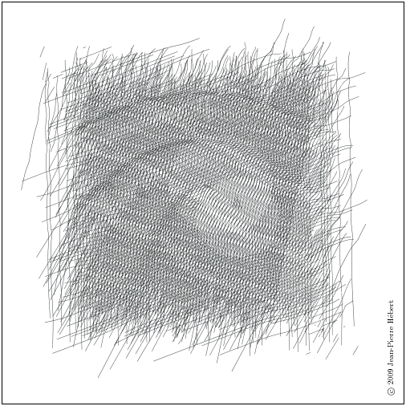

[#chp_records]
== Chapter 9. Records

This chapter describes the means by which the programmer may define new data types, or _records types_, each distinct from all other types. A record type determines the number and names of the fields each instance of the type has. Records are defined via the `define-record-type` form or the `make-record-type-descriptor` procedure.

=== Section 9.1. Defining Records [[section_9.1.]]

A `define-record-type` form defines a record type and, along with it, a constructor procedure for records of the type, a type predicate that returns true only for records of the type, an access procedure for each field, and an assignment procedure for each mutable field. For example, the definition

[source,scheme,subs=""]
----
(define-record-type point (fields x y))
----

creates a `point` record type with two fields, `x` and `y`, and defines the following procedures:

[horizontal]
`(make-point _x_ _y_)`::     constructor
`(point? _obj_)`::           predicate
`(point-x _p_)`::     accessor for field `x`
`(point-y _p_)`::     accessor for field `y`

With this definition in place, we can use these procedures to create and manipulate records of the `point` type, as illustrated below.

[source,scheme,subs=""]
----
(define p (make-point 36 -17))
(point? p) ⇒ #t
(point? '(cons 36 -17)) ⇒ #f
(point-x p) ⇒ 36
(point-y p) ⇒ -17
----

Fields are immutable by default, but may be declared mutable. In the alternate definition of `point` below, the `x` field is mutable while `y` remains immutable.

[source,scheme,subs=""]
----
(define-record-type point (fields (mutable x) y))
----

In this case, `define-record-type` defines a mutator for the `x` field in addition to the other products shown above.

[horizontal]
`(point-x-set! _p_ _x_)`::     mutator for field `x`

The mutator can be used to change the contents of the `x` field.

[source,scheme,subs=""]
----
(define p (make-point 36 -17))
(point-x-set! p (- (point-x p) 12))
(point-x p) ⇒ 24
----

A field may be declared immutable explicitly for clarity; the definition of `point` below is equivalent to the second definition above.

[source,scheme,subs=""]
----
(define-record-type point (fields (mutable x) (immutable y)))
----

The names of the procedures defined by `define-record-type` follow the regular naming convention illustrated by the examples above, by default, but the programmer can override the defaults if desired. With the following definition of `point`, the constructor is `mkpoint`, the predicate is `ispoint?`, and the accessors for `x` and `y` are `x-val` and `y-val`. The mutator for `x` is `set-x-val!`.

[source,scheme,subs=""]
----
(define-record-type (point mkpoint ispoint?)
  (fields (mutable x x-val set-x-val!)
          (immutable y y-val)))
----

By default, a record definition creates a new type each time it is evaluated, as illustrated by the example below.

[source,scheme,subs=""]
----
(define (f p)
  (define-record-type point (fields x y))
  (if (eq? p 'make) (make-point 3 4) (point? p)))
(f (f 'make)) ⇒ #f
----

The first (inner) call to `f` returns a point `_p_`, which is passed to `f` in the second (outer) call, which applies `point?` to `_p_`. This `point?` is looking for points of the type created by the second call, while `_p_` is a point of the type created by the first call. So `point?` returns `#f`.

This default _generative_ behavior may be overridden by including a `nongenerative` clause in the record definition.

[source,scheme,subs=""]
----
(define (f p)
  (define-record-type point (fields x y) (nongenerative))
  (if (eq? p 'make) (make-point 3 4) (point? p)))
(define p (f 'make))
(f p) ⇒ #t
----

Record types created in this manner are still distinct from record types created by a definition appearing in a different part of the program, even if the definitions are syntactically identical:

[source,scheme,subs=""]
----
(define (f)
  (define-record-type point (fields x y) (nongenerative))
  (make-point 3 4))
(define (g p)
  (define-record-type point (fields x y) (nongenerative))
  (point? p))
(g (f)) ⇒ #f
----

[#page:record-uid]
Even this can be overridden by including a uid (unique id) in the `nongenerative` clause: [[records:s6]]

[source,scheme,subs=""]
----
(define (f)
  (define-record-type point (fields x y)
    (nongenerative really-the-same-point))
  (make-point 3 4))
(define (g p)
  (define-record-type point (fields x y)
    (nongenerative really-the-same-point))
  (point? p))
(g (f)) ⇒ #t
----

The uid may be any identifier, but programmers are encouraged to select uids from the RFC 4122 UUID namespace <<ref20>>, possibly with the record-type name as a prefix.

[#page:parent-type]
A record type may be defined as a subtype of an existing "parent" type with a `parent` clause that declares the name of the existing record type. If a parent is specified, the new "child" record type inherits the parent record's fields, and each instance of the child type is considered to be an instance of the parent type, so that accessors and mutators for the parent type may be used on instances of the child type.

[source,scheme,subs=""]
----
(define-record-type point (fields x y))
(define-record-type cpoint (parent point) (fields color))
----

The child type has all of the fields of the parent type, plus the additional fields declared in the child's definition. This is reflected in the constructor for `cpoint`, which now takes three arguments, with the parent arguments followed by the child argument.

[source,scheme,subs=""]
----
(define cp (make-cpoint 3 4 'red))
----

A record of the child type is considered a record of the parent type, but a record of the parent type is not a record of the new type.

[source,scheme,subs=""]
----
(point? (make-cpoint 3 4 'red)) ⇒ #t
(cpoint? (make-point 3 4)) ⇒ #f
----

Only one new accessor is created for `cpoint`, the one for the new field `color`. The existing accessors and mutators for the parent type may be used to access and modify the parent fields of the child type.

[source,scheme,subs=""]
----
(define cp (make-cpoint 3 4 'red))
(point-x cp) ⇒ 3
(point-y cp) ⇒ 4
(cpoint-color cp) ⇒ red
----

[#page:protocols]
As the examples given so far illustrate, the default constructor defined by `define-record-type` accepts as many arguments as the record has fields, including parent fields, and parent's parent fields, and so on. The programmer may override the default and specify the arguments to the constructor for the new type and how it determines the initial values of the constructed record's fields, via the `protocol` clause. The following definition creates a `point` record with three fields: `x`, `y`, and `d`, where `d` represents the displacement from the origin. The constructor still takes only two arguments, the `x` and `y` values, and initializes `d` to the square root of the sum of the squares of `x` and `y`.

[source,scheme,subs=""]
----
(define-record-type point
  (fields x y d)
  (protocol
    (lambda (new)
      (lambda (x y)
        (new x y (sqrt (+ (* x x) (* y y))))))))

(define p (make-point 3 4))
(point-x p) ⇒ 3
(point-y p) ⇒ 4
(point-d p) ⇒ 5
----

The procedure value of the expression within the `protocol` clause receives as an argument a primitive constructor `_new_` and returns a final constructor `_c_`. There are essentially no limits on what `_c_` is allowed to do, but if it returns, it should return the result of calling `_new_`. Before it does so, it may modify the new record instance (if the record type has mutable fields), register it with some external handler, print messages, etc. In this case, `_c_` accepts two arguments, `_x_` and `_y_`, and applies `_new_` to `_x_`, `_y_`, and the result of computing the origin displacement based on `_x_` and `_y_`.

If a parent record is specified, the construction protocol becomes more involved. The following definition of `cpoint` assumes that `point` has been defined as shown just above.

[source,scheme,subs=""]
----
(define-record-type cpoint
  (parent point)
  (fields color)
  (protocol
    (lambda (pargs->new)
      (lambda (c x y)
        ((pargs->new x y) c)))))

(define cp (make-cpoint 'red 3 4))
(point-x cp) ⇒ 3
(point-y cp) ⇒ 4
(point-d cp) ⇒ 5
(cpoint-color cp) ⇒ red
----

Because a parent clause is present, the procedure value of the expression within the `protocol` clause receives a procedure `_pargs_\->__new__` that, when applied to parent arguments, returns a `_new_` procedure. The `_new_` procedure, when passed the values of the child fields, returns the result of applying the parent protocol to an appropriate `_new_` procedure of its own. In this case, `_pargs_\->__new__` is passed the values of the child constructor's second and third arguments (the `_x_` and `_y_` values) and the resulting `_new_` procedure is passed the value of the child constructor's first argument (the color). Thus, the protocol supplied in this example effectively reverses the normal order of arguments in which the parent arguments come before the child arguments, while arranging to pass along the arguments needed by the parent protocol.

[#records:s12]
The default protocol is equivalent to

[source,scheme,subs=""]
----
(lambda (new) new)
----

for record types with no parents, while for record types with parents, the default protocol is equivalent to the following

[source,scheme,subs="quotes"]
----
(lambda (pargs->new)
  (lambda (_x~1~_ ... _x~n~_ _y~1~_ ... _y~m~_)
    ((pargs->new _x~1~_ ... _x~n~_) _y~1~_ ... _y~m~_)))
----

where `_n_` is the number of parent (including grandparent, etc.) fields and `_m_` is the number of child fields.

Use of the `protocol` clause insulates the child record definition from some changes to the parent record type. The parent definition may be modified to add or remove fields, or even add, remove, or change a parent, yet the child protocol and constructor need not change as long as the parent protocol does not change.

Additional details and options for `define-record-type` are given in its formal description below.

[#records:s13]
[horizontal]
syntax:: `(define-record-type _record-name_ _clause_ \...)`
syntax:: `(define-record-type (_record-name_ _constructor_ _pred_) _clause_ \...)`
libraries:: `(rnrs records syntactic)`, `(rnrs)`

A `define-record-type` form, or _record definition_, is a definition and may appear anywhere other definitions may appear. It defines a record type identified by `_record-name_`, plus a predicate, constructor, accessors, and mutators for the record type. If the record definition takes the first form above, the names of the constructor and predicate are derived from `_record-name_`: `make-_record-name_` for the constructor and `_record-name_?` for the predicate. If the record definition takes the second form above, the name of the constructor is `_constructor_` and the name of the predicate is `_pred_`. All names defined by a record definition are scoped where the record definition appears.

The clauses `_clause_ \...` of the record definition determine the fields of the record type and the names of their accessors and mutators; its parent type, if any; its construction protocol; whether it is nongenerative and, if so, whether its uid is specified; whether it is sealed; and whether it is opaque. The syntax and impact of each clause is described below.

None of the clauses is required; thus, the simplest record definition is

[source,scheme,subs="quotes"]
----
(define-record-type _record-name_)
----

which defines a new, generative, non-sealed, non-opaque record type with no parent and no fields, plus a constructor of no arguments and a predicate.

At most one of each kind of clause may be present in the set of clauses, and if a `parent` clause is present, a `parent-rtd` clause must not be present. The clauses that appear may appear in any order.

*Fields clause.*  A `(fields _field-spec_ \...)` clause declares the fields of the record type. Each `_field-spec_` must take one of the following forms:

[source,scheme,subs="quotes"]
----
_field-name_
(immmutable _field-name_)
(mutable _field-name_)
(immmutable _field-name_ _accessor-name_)
(mutable _field-name_ _accessor-name_ _mutator-name_)
----

where `_field-name_`, `_accessor-name_`, and `_mutator-name_` are identifiers. The first form, `_field-name_`, is equivalent to `(immutable _field-name_)`. The value of a field declared immutable may not be changed, and no mutator is created for it. With the first three forms, the name of the accessor is `_rname_-_fname_`, where `_rname_` is the record name and `_fname_` is the field name. With the third form, the name of the accessor is `_rname_-_fname_-set!`. The fourth and fifth forms explicitly declare the accessor and mutator names.

If no `fields` clause is present or the list `_field-spec_ \...` is empty, the record type has no fields (other than parent fields, if any).

*Parent clause.*  A `(parent _parent-name_)` clause declares the parent record type; `_parent-name_` must be the name of a non-sealed record type previously defined via `define-record-type`. Instances of a record type are also considered instances of its parent record type and have all the fields of its parent record type in addition to those declared via the `fields` clause.

*Nongenerative clause.*  A `nongenerative` clause may take one of two forms:

[source,scheme,subs="quotes"]
----
(nongenerative)
(nongenerative _uid_)
----

where `_uid_` is a symbol. The first form is equivalent to the second, with a uid generated by the implementation at macro-expansion time. When a `define-record-type` form with a nongenerative clause is evaluated, a new type is created if and only if the uid is not the uid of an existing record type.

If it is the uid of an existing record type, the parent, field-names, sealed property, and opaque property must match as follows.

- If a parent is specified, the existing record type must have the same parent rtd (by `eqv?`). If a parent is not specified, the existing record type must not have a parent.

- The same number of fields must be provided, with the same names and in the same order, and the mutability of each field must be the same.

- If a `(sealed #t)` clause is present, the existing record type must be sealed. Otherwise, the existing record type must not be sealed.

- If an `(opaque #t)` clause is present, the existing record type must be opaque. Otherwise, the existing record type must be opaque if and only if an opaque parent type is specified.

If these constraints are met, no new record type is created, and the other products of the record-type definition (constructor, predicate, accessors, and mutators) operate on records of the existing type. If these constraints are not met, the implementation may treat it as a syntax violation, or it may raise a run-time exception with condition type `&assertion`.

With the first form of `nongenerative` clause, the generated uid can be the uid of an existing record type only if the same definition is executed multiple times, e.g., if it appears in the body of a procedure that is invoked multiple times.

If `_uid_` is not the uid of an existing record type, or if no `nongenerative` clause is present, a new record type is created.

*Protocol clause.*  A `(protocol _expression_)` determines the protocol that the generated constructor uses to construct instances of the record type. It must evaluate to a procedure, and this procedure should be an appropriate protocol for the record type, as described on <<page:protocols,page 326>>.

[#page:sealed]
*Sealed clause.*  A `sealed` clause of the form `(sealed #t)` declares that the record type is _sealed_. This means that it cannot be extended, i.e., cannot be used as the parent for another record definition or `make-record-type-descriptor` call. If no `sealed` clause is present or if one of the form `(sealed #f)` is present, the record type is not sealed.

[#page:opaque]
*Opaque clause.*  An `opaque` clause of the form `(opaque #t)` declares that the record type is _opaque_. Instances of an opaque record type are not considered records by the `record?` predicate or, more importantly, the rtd-extraction procedure `record-rtd`, which are both described in <<section_9.3.,Section 9.3>>. Thus, it is not possible for code that does not have access to the `record-name`, accessors, or mutators to access or modify any of the fields of an opaque record type. A record type is also opaque if its parent is opaque. If no `opaque` clause is present or if one of the form `(opaque #f)` is present, and the parent, if any, is not opaque, the record type is not opaque.

*Parent-rtd clause.*  A `(parent-rtd _parent-rtd_ _parent-rcd_)` clause is an alternative to the `parent` clause for specifying the parent record type, along with a parent record constructor descriptor. It is primarily useful when the parent rtd and rcd were obtained via calls to `make-record-type-descriptor` and `make-record-constructor-descriptor`.

`_parent-rtd_` must evaluate to an rtd or `#f`. If `_parent-rtd_` evaluates to `#f`, `_parent-rcd_` must also evaluate to `#f`. Otherwise, `_parent-rcd_` must evaluate to an rcd or `#f`. If `_parent-rcd_` evaluates to an rcd, it must encapsulate an rtd equivalent (by `eqv?`) to the value of `_parent-rtd_`. If the value of `_parent-rcd_` is `#f`, it is treated as an rcd for the value of `_parent-rtd_` with a default protocol.

The `define-record-type` form is designed in such a way that it is normally possible for a compiler to determine the shapes of the record types it defines, including the offsets for all fields. This guarantee does not hold, however, when the `parent-rtd` clause is used, since the parent rtd might not be determinable until run time. Thus, the `parent` clause is preferred over the `parent-rtd` clause whenever the `parent` clause suffices.

[#records:s16]
[horizontal]
syntax:: `fields`
syntax:: `mutable`
syntax:: `immutable`
syntax:: `parent`
syntax:: `protocol`
syntax:: `sealed`
syntax:: `opaque`
syntax:: `nongenerative`
syntax:: `parent-rtd`
libraries:: `(rnrs records syntactic)`, `(rnrs)`

These identifiers are auxiliary keywords for `define-record-type`. It is a syntax violation to reference these identifiers except in contexts where they are recognized as auxiliary keywords.

=== Section 9.2. Procedural Interface [[section_9.2.]]

The procedural (`make-record-type-descriptor`) interface may also be used to create new record types. The procedural interface is more flexible than the syntactic interface, but this flexibility can lead to less readable and efficient programs, so programmers should use the syntactic interface whenever it suffices.

[#records:s20]
[horizontal]
procedure:: `(make-record-type-descriptor _name_ _parent_ _uid_ _s?_ _o?_ _fields_)`
returns:: a record-type descriptor (rtd) for a new or existing record type
libraries:: `(rnrs records procedural)`, `(rnrs)`

`_name_` must be a symbol, `_parent_` must be `#f` or the rtd of a non-sealed record type, `_uid_` must be `#f` or a symbol, and `_fields_` must be a vector, each element of which is a two-element list of the form `(mutable _field-name_)` or `(immutable _field-name_)`. The field names `_field-name_ \...` must be symbols and need not be distinct from each other.

If `_uid_` is `#f` or is not the uid of an existing record type, this procedure creates a new record type and returns a record-type descriptor (rtd) for the new type. The type has the parent type (<<page:parent-type,page 325>>) described by `_parent_`, if nonfalse; the uid specified by `_uid_`, if nonfalse; and the fields specified by `_fields_`. It is sealed (<<page:sealed,page 330>>) if `_s?_` is nonfalse. It is opaque (<<page:sealed,page 330>>) if `_opaque_` is nonfalse or the parent (if specified) is opaque. The name of the new record type is `_name_` and the names of the fields are `_field-name_ \...`.

If `_uid_` is nonfalse and is the uid (<<page:parent-type,page 325>>) of an existing record type, the `_parent_`, `_fields_`, `_s?_`, and `_o?_` arguments must match the corresponding characteristics of the existing record type. That is, `_parent_` must be the same (by `eqv?`); the number of fields must be the same; the fields must have the same names, be in the same order, and have the same mutability; `_s?_` must be false if and only if the existing record type is sealed; and, if a parent is not specified or is not opaque, `_o?_` must be false if and only if the existing record type is opaque. If this is the case, `make-record-type-descriptor` returns the rtd for the existing record type. Otherwise, an exception with condition type `&assertion` is raised.

Using the rtd returned by `make-record-type-descriptor`, programs can generate constructors, type predicates, field accessors, and field mutators dynamically. The following code demonstrates how the procedural interface might be used to create a `point` record type and associated definitions similar to those of the second `point` record definition in <<section_9.1.,Section 9.1>>, with a mutable `x` field and an immutable `y` field.

[source,scheme,subs=""]
----
(define point-rtd (make-record-type-descriptor 'point #f #f #f #f
                '#((mutable x) (immutable y))))
(define point-rcd (make-record-constructor-descriptor point-rtd
                    #f #f))
(define make-point (record-constructor point-rcd))
(define point? (record-predicate point-rtd))
(define point-x (record-accessor point-rtd 0))
(define point-y (record-accessor point-rtd 1))
(define point-x-set! (record-mutator point-rtd 0))
----

See the additional examples given at the end of this section.

[#records:s23]
[horizontal]
procedure:: `(record-type-descriptor? _obj_)`
returns:: `#f` if `_obj_` is a record-type descriptor, otherwise `#f`
libraries:: `(rnrs records procedural)`, `(rnrs)`

See the examples given at the end of this section.

[#records:s24]
[horizontal]
procedure:: `(make-record-constructor-descriptor _rtd_ _parent-rcd_ _protocol_)`
returns:: a record-constructor descriptor (rcd)
libraries:: `(rnrs records procedural)`, `(rnrs)`

An rtd alone is sufficient to create predicates, accessors, and mutators. To create a constructor, however, it is first necessary to create a record-constructor descriptor (rcd) for the record type. An rcd encapsulates three pieces of information: the rtd of the record type for which the rcd has been created, the parent rcd (if any), and the protocol.

The `_parent-rcd_` argument must be an rcd or `#f`. If it is an rcd, `_rtd_` must have a parent rtd, and the parent rtd must be the same as the rtd encapsulated within `_parent-rcd_`. If `_parent-rcd_` is false, either `_rtd_` has no parent or an rcd with a default protocol is assumed for the parent.

The `_protocol_` argument must be a procedure or `#f`. If it is `#f`, a default protocol is assumed. Protocols are discussed on <<page:protocols,page 326>>.

See the examples given at the end of this section.

[#records:s28]
[horizontal]
syntax:: `(record-type-descriptor _record-name_)`
returns:: the rtd for the record type identified by `record-name`
syntax:: `(record-constructor-descriptor _record-name_)`
returns:: the rcd for the record type identified by `record-name`
libraries:: `(rnrs records syntactic)`, `(rnrs)`

Each record definition creates, behind the scenes, an rtd and rcd for the defined record type. These procedures allow the rtd and rcd to be obtained and used like any other rtd or rcd. `_record-name_` must be the name of a record previously defined via `define-record-type`.

[#records:s29]
[horizontal]
procedure:: `(record-constructor _rcd_)`
returns:: a record constructor for the record type encapsulated within `_rcd_`
libraries:: `(rnrs records procedural)`, `(rnrs)`

The behavior of the record constructor is determined by the protocol and parent rcd (if any) also encapsulated within `_rcd_`.

See the examples given at the end of this section.

[#records:s30]
[horizontal]
procedure:: `(record-predicate _rtd_)`
returns:: a predicate for `_rtd_`
libraries:: `(rnrs records procedural)`, `(rnrs)`

This procedure returns a predicate that accepts one argument and returns `#t` if the argument is an instance of the record-type described by `_rtd_`, `#f` otherwise.

See the examples given at the end of this section.

[#records:s31]
[horizontal]
procedure:: `(record-accessor _rtd_ _idx_)`
returns:: an accessor for the field of `_rtd_` specified by `_idx_`
libraries:: `(rnrs records procedural)`, `(rnrs)`

`_idx_` must be a nonnegative integer less than the number of fields of `_rtd_`, not counting parent fields. An `_idx_` value of 0 specifies the first field given in the `define-record-type` form or `make-record-type-descriptor` call that created the record type, 1 specifies the second, and so on.

A child rtd cannot be used directly to create accessors for parent fields. To create an accessor for a parent field, the record-type descriptor of the parent must be used instead.

See the examples given at the end of this section.

[#records:s32]
[horizontal]
procedure:: `(record-mutator _rtd_ _idx_)`
returns:: a mutator for the field of `_rtd_` specified by `_idx_`
libraries:: `(rnrs records procedural)`, `(rnrs)`

`_idx_` must be a nonnegative integer less than the number of fields of `_rtd_`, not counting parent fields. An `_idx_` value of 0 specifies the first field given in the `define-record-type` form or `make-record-type-descriptor` call that created the record type, 1 specifies the second, and so on. The indicated field must be mutable; otherwise, an exception with condition type `&assertion` is raised.

A child rtd cannot be used directly to create mutators for parent fields. To create a mutator for a parent field, the record-type descriptor of the parent must be used instead.

The following example illustrates the creation of parent and child record types, predicates, accessors, mutators, and constructors using the procedures described in this section.

[source,scheme,subs="quotes"]
----
(define rtd/parent
  (make-record-type-descriptor 'parent \#f #f #f #f
    '#((mutable x))))

(record-type-descriptor? rtd/parent) ⇒ \#t
(define parent? (record-predicate rtd/parent))
(define parent-x (record-accessor rtd/parent 0))
(define set-parent-x! (record-mutator rtd/parent 0))

(define rtd/child
  (make-record-type-descriptor 'child rtd/parent #f #f #f
    '#((mutable x) (immutable y))))

(define child? (record-predicate rtd/child))
(define child-x (record-accessor rtd/child 0))
(define set-child-x! (record-mutator rtd/child 0))
(define child-y (record-accessor rtd/child 1))

(record-mutator rtd/child 1) ⇒ _exception: immutable field_

(define rcd/parent
  (make-record-constructor-descriptor rtd/parent #f
    (lambda (new) (lambda (x) (new (* x x))))))

(record-type-descriptor? rcd/parent) ⇒ #f

(define make-parent (record-constructor rcd/parent))

(define p (make-parent 10))
(parent? p) ⇒ #t
(parent-x p) ⇒ 100
(set-parent-x! p 150)
(parent-x p) ⇒ 150

(define rcd/child
  (make-record-constructor-descriptor rtd/child rcd/parent
    (lambda (pargs->new)
      (lambda (x y)
        ((pargs->new x) (+ x 5) y)))))

(define make-child (record-constructor rcd/child))
(define c (make-child 10 'cc))
(parent? c) ⇒ #t
(child? c) ⇒ #t
(child? p) ⇒ #f

(parent-x c) ⇒ 100
(child-x c) ⇒ 15
(child-y c) ⇒ cc

(child-x p) ⇒ _exception: invalid argument type_
----

=== Section 9.3. Inspection [[section_9.3.]]

This section describes various procedures for asking questions about or extracting information from record-type descriptors (rtds). It also describes the `record-rtd` procedure, with which the rtd of a non-opaque record instance may be extracted, allowing the record type of the instance to be inspected and, via record accessors and mutators generated from the rtd, the record itself to be inspected or modified. This is a powerful feature that permits the coding of portable record printers and inspectors.

[#records:s33]
The record-type descriptor cannot be extracted from an instance of an opaque record type; this is the feature that distinguishes opaque from non-opaque record types.

[#records:s34]
[horizontal]
procedure:: `(record-type-name _rtd_)`
returns:: the name associated with `_rtd_`
libraries:: `(rnrs records inspection)`, `(rnrs)`

[source,scheme,subs=""]
----
(define record->name
  (lambda (x)
    (and (record? x) (record-type-name (record-rtd x)))))

(define-record-type dim (fields w l h))
(record->name (make-dim 10 15 6)) ⇒ dim

(define-record-type dim (fields w l h) (opaque #t))
(record->name (make-dim 10 15 6)) ⇒ #f
----

[#records:s35]
[horizontal]
procedure:: `(record-type-parent _rtd_)`
returns:: the parent of `_rtd_`, or `#f` if it has no parent
libraries:: `(rnrs records inspection)`, `(rnrs)`

[source,scheme,subs=""]
----
(define-record-type point (fields x y))
(define-record-type cpoint (parent point) (fields color))
(record-type-parent (record-type-descriptor point)) ⇒ #f
(record-type-parent (record-type-descriptor cpoint)) ⇒ #&lt;rtd&gt;
----

[#records:s36]
[horizontal]
procedure:: `(record-type-uid _rtd_)`
returns:: the uid of `_rtd_`, or `#f` if it has no uid
libraries:: `(rnrs records inspection)`, `(rnrs)`

Whether a record type created without a programmer-supplied uid actually has one anyway is left up to the implementation, so this procedure is never guaranteed to return `#f`.

[source,scheme,subs="quotes"]
----
(define-record-type point (fields x y))
(define-record-type cpoint
  (parent point)
  (fields color)
  (nongenerative e40cc926-8cf4-4559-a47c-cac636630314))
(record-type-uid (record-type-descriptor point)) ⇒ _unspecified_
(record-type-uid (record-type-descriptor cpoint)) ⇒
                             e40cc926-8cf4-4559-a47c-cac636630314
----

[#records:s37]
[horizontal]
procedure:: `(record-type-generative? _rtd_)`
returns:: `#t` if the record type described by `_rtd_` is generative, `#f` otherwise
procedure:: `(record-type-sealed? _rtd_)`
returns:: `#t` if the record type described by `_rtd_` is sealed, `#f` otherwise
procedure:: `(record-type-opaque? _rtd_)`
returns:: `#t` if the record type described by `_rtd_` is opaque, `#f` otherwise
libraries:: `(rnrs records inspection)`, `(rnrs)`

[source,scheme,subs=""]
----
(define-record-type table
  (fields keys vals)
  (opaque #t))
(define rtd (record-type-descriptor table))
(record-type-generative? rtd) ⇒ #t
(record-type-sealed? rtd) ⇒ #f
(record-type-opaque? rtd) ⇒ #t

(define-record-type cache-table
  (parent table)
  (fields key val)
  (nongenerative))
(define rtd (record-type-descriptor cache-table))
(record-type-generative? rtd) ⇒ #f
(record-type-sealed? rtd) ⇒ #f
(record-type-opaque? rtd) ⇒ #t
----

[#records:s38]
[horizontal]
procedure:: `(record-type-field-names _rtd_)`
returns:: a vector containing the names of the fields of the type described by `_rtd_`
libraries:: `(rnrs records inspection)`, `(rnrs)`

The vector returned by this procedure is immutable: the effect on `_rtd_` of modifying it is unspecified. The vector does not include parent field names. The order of the names in the vector is the same as the order in which the fields were specified in the `define-record-type` form or `make-record-type-descriptor` call that created the record type.

[source,scheme,subs=""]
----
(define-record-type point (fields x y))
(define-record-type cpoint (parent point) (fields color))
(record-type-field-names
  (record-type-descriptor point)) ⇒ #(x y)
(record-type-field-names
  (record-type-descriptor cpoint)) ⇒ #(color)
----

[#records:s39]
[horizontal]
procedure:: `(record-field-mutable? _rtd_ _idx_)`
returns:: `#t if the specified field of _rtd_` is mutable, `#f` otherwise
libraries:: `(rnrs records inspection)`, `(rnrs)`

`_idx_` must be a nonnegative integer less than the number of fields of `_rtd_`, not counting parent fields. An `_idx_` value of 0 specifies the first field given in the `define-record-type` form or `make-record-type-descriptor` call that created the record type, 1 specifies the second, and so on.

[source,scheme,subs=""]
----
(define-record-type point (fields (mutable x) (mutable y)))
(define-record-type cpoint (parent point) (fields color))

(record-field-mutable? (record-type-descriptor point) 0) ⇒ #t
(record-field-mutable? (record-type-descriptor cpoint) 0) ⇒ #f
----

[#records:s40]
[horizontal]
procedure:: `(record? _obj_)`
returns:: `#t` if `_obj_` is a non-opaque record instance, `#f` otherwise
libraries:: `(rnrs records inspection)`, `(rnrs)`

When passed an instance of an opaque record type, `record?` returns `#f`. While an instance of an opaque record type is, in essence, a record, the point of opacity is to hide all representation information from the parts of a program that should not have access to the information, and this includes whether an object is a record. Furthermore, the primary purpose of this predicate is to allow programs to check whether it is possible to obtain from the argument an rtd via the `record-rtd` procedure described below.

[source,scheme,subs=""]
----
(define-record-type statement (fields str))
(define q (make-statement "He's dead, Jim"))
(statement? q) ⇒ #t
(record? q) ⇒ #t

(define-record-type opaque-statement (fields str) (opaque #t))
(define q (make-opaque-statement "He's moved on, Jim"))
(opaque-statement? q) ⇒ #t
(record? q) ⇒ #f
----

[#records:s41]
[horizontal]
procedure:: `(record-rtd _record_)`
returns:: the record-type descriptor (rtd) of `_record_`
libraries:: `(rnrs records inspection)`, `(rnrs)`

The argument must be an instance of a non-opaque record type. In combination with some of the other procedures described in this section and <<section_9.2.,Section 9.2>>, `record-rtd` allows the inspection or mutation of record instances, even if the type of the instance is unknown to the inspector. This capability is illustrated by the procedure `print-fields` below, which accepts a record argument and writes the name and value of each field of the record.

[source,scheme,subs=""]
----
(define print-fields
  (lambda (r)
    (unless (record? r)
      (assertion-violation 'print-fields "not a record" r))
    (let loop ([rtd (record-rtd r)])
      (let ([prtd (record-type-parent rtd)])
        (when prtd (loop prtd)))
      (let* ([v (record-type-field-names rtd)]
             [n (vector-length v)])
        (do ([i 0 (+ i 1)])
            ((= i n))
          (write (vector-ref v i))
          (display "=")
          (write ((record-accessor rtd i) r))
          (newline))))))
----

With the familiar definitions of `point` and `cpoint`:

[source,scheme,subs=""]
----
(define-record-type point (fields x y))
(define-record-type cpoint (parent point) (fields color))
----

the expression `(print-fields (make-cpoint -3 7 'blue))` displays the following three lines.

[source,scheme,subs=""]
----
x=-3
y=7
color=blue
----
