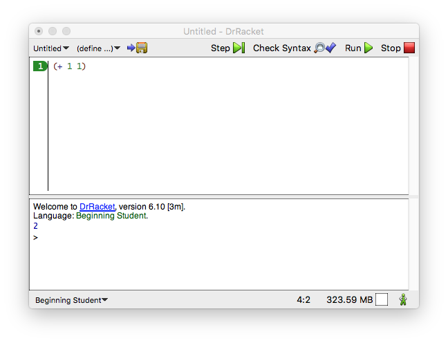
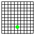
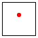
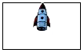
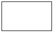

Prologue: How to Program
=================================================

When you were a small child, your parents taught you to count and perform simple calculations with your fingers: “1 + 1 is 2”; “1 + 2 is 3”; and so on. Then they would ask “what’s 3 + 2?” and you would count off the fingers of one hand. They programmed, and you computed. And in some way, that’s really all there is to programming and computing.

Now it is time to switch roles. Start DrRacket. Doing so brings up the window of [figure 7](#figure-7). Select “Choose language” from the “Language” menu, which opens a dialog listing “Teaching Languages” for “How to Design Programs.” Choose “Beginning Student” (the Beginning Student Language, or BSL) and click *OK* to set up DrRacket. With this task completed, **you** can program, and the DrRacket software becomes the child. Start with the simplest of all calculations. You type

<blockquote class="SCodeFlow">
(<a href="https://docs.racket-lang.org/htdp-langs/beginner.html#%28def._htdp-beginner._%28%28lib._lang%2Fhtdp-beginner..rkt%29._%2B%29%29" class="RktValLink" data-pltdoc="x">+</a>&nbsp;1&nbsp;1)
</blockquote>

into the top part of DrRacket, click *RUN*, and a 2 shows up in the bottom.

<a id="figure-7" style="font-size: 0;float: left;line-height: 0;">Figure 7</a>

> 

> 
Figure 7: Meet DrRacket

That’s how simple programming is. You ask questions as if DrRacket were a child, and DrRacket computes for you. You can also ask DrRacket to process several requests at once:

<blockquote class="SCodeFlow"><table class="RktBlk" cellspacing="0" cellpadding="0"><tbody><tr><td>(<a href="https://docs.racket-lang.org/htdp-langs/beginner.html#%28def._htdp-beginner._%28%28lib._lang%2Fhtdp-beginner..rkt%29._%2B%29%29" class="RktValLink" data-pltdoc="x">+</a>&nbsp;2&nbsp;2)</td></tr><tr><td>(<a href="https://docs.racket-lang.org/htdp-langs/beginner.html#%28def._htdp-beginner._%28%28lib._lang%2Fhtdp-beginner..rkt%29._%2A%29%29" class="RktValLink" data-pltdoc="x">*</a>&nbsp;3&nbsp;3)</td></tr><tr><td>(<a href="https://docs.racket-lang.org/htdp-langs/beginner.html#%28def._htdp-beginner._%28%28lib._lang%2Fhtdp-beginner..rkt%29._-%29%29" class="RktValLink" data-pltdoc="x">-</a>&nbsp;4&nbsp;2)</td></tr><tr><td>(<a href="https://docs.racket-lang.org/htdp-langs/beginner.html#%28def._htdp-beginner._%28%28lib._lang%2Fhtdp-beginner..rkt%29._%2F%29%29" class="RktValLink" data-pltdoc="x">/</a>&nbsp;6&nbsp;2)</td></tr></tbody></table></blockquote>

After you click *RUN*, you see 4 9 2 3 in the bottom half of DrRacket, which are the expected results.

Let’s slow down for a moment and introduce some words:

- The top half of DrRacket is called the *definitions area*. In this area, you create the programs, which is called *editing*. As soon as you add a word or change something in the definitions area, the *SAVE* button shows up in the top-left corner. When you click *SAVE* for the first time, DrRacket asks you for the name of a file so that it can store your program for good. Once your definitions area is associated with a file, clicking *SAVE* ensures that the content of the definitions area is stored safely in the file.

- *Programs consist of expressions*. You have seen expressions in mathematics. For now, an expression is either a plain number or something that starts with a left parenthesis “(” and ends in a matching right parenthesis “)”—which DrRacket rewards by shading the area between the pair of parentheses.

- When you click *RUN*, DrRacket evaluates the expressions in the definitions area and shows their result in the *interactions area*. Then, DrRacket, your faithful servant, awaits your commands at the *prompt* (>). The appearance of the prompt signals that DrRacket is waiting for you to enter additional expressions, which it then evaluates like those in the definitions area: <blockquote class="SCodeFlow"><table class="RktBlk" cellspacing="0" cellpadding="0"><tbody><tr><td>&gt; (<a href="https://docs.racket-lang.org/htdp-langs/beginner.html#%28def._htdp-beginner._%28%28lib._lang%2Fhtdp-beginner..rkt%29._%2B%29%29" class="RktValLink" data-pltdoc="x">+</a>&nbsp;1&nbsp;1)</td></tr><tr><td>
2
</td></tr></tbody></table></blockquote>

Enter an expression at the prompt, hit the “return” or “enter” key on your keyboard, and watch how DrRacket responds with the result. You can do so as often as you wish:

<blockquote class="SCodeFlow"><table class="RktBlk" cellspacing="0" cellpadding="0"><tbody><tr><td>&gt; (<a href="https://docs.racket-lang.org/htdp-langs/beginner.html#%28def._htdp-beginner._%28%28lib._lang%2Fhtdp-beginner..rkt%29._%2B%29%29" class="RktValLink" data-pltdoc="x">+</a>&nbsp;2&nbsp;2)</td></tr><tr><td>
4
</td></tr><tr><td>&gt; (<a href="https://docs.racket-lang.org/htdp-langs/beginner.html#%28def._htdp-beginner._%28%28lib._lang%2Fhtdp-beginner..rkt%29._%2A%29%29" class="RktValLink" data-pltdoc="x">*</a>&nbsp;3&nbsp;3)</td></tr><tr><td>
9
</td></tr><tr><td>&gt; (<a href="https://docs.racket-lang.org/htdp-langs/beginner.html#%28def._htdp-beginner._%28%28lib._lang%2Fhtdp-beginner..rkt%29._-%29%29" class="RktValLink" data-pltdoc="x">-</a>&nbsp;4&nbsp;2)</td></tr><tr><td>
2
</td></tr><tr><td>&gt; (<a href="https://docs.racket-lang.org/htdp-langs/beginner.html#%28def._htdp-beginner._%28%28lib._lang%2Fhtdp-beginner..rkt%29._%2F%29%29" class="RktValLink" data-pltdoc="x">/</a>&nbsp;6&nbsp;2)</td></tr><tr><td>
3
</td></tr><tr><td>&gt; (<a href="https://docs.racket-lang.org/htdp-langs/beginner.html#%28def._htdp-beginner._%28%28lib._lang%2Fhtdp-beginner..rkt%29._sqr%29%29" class="RktValLink" data-pltdoc="x">sqr</a>&nbsp;3)</td></tr><tr><td>
9
</td></tr><tr><td>&gt; (<a href="https://docs.racket-lang.org/htdp-langs/beginner.html#%28def._htdp-beginner._%28%28lib._lang%2Fhtdp-beginner..rkt%29._expt%29%29" class="RktValLink" data-pltdoc="x">expt</a>&nbsp;2&nbsp;3)</td></tr><tr><td>
8
</td></tr><tr><td>&gt; (<a href="https://docs.racket-lang.org/htdp-langs/beginner.html#%28def._htdp-beginner._%28%28lib._lang%2Fhtdp-beginner..rkt%29._sin%29%29" class="RktValLink" data-pltdoc="x">sin</a>&nbsp;0)</td></tr><tr><td>
0
</td></tr><tr><td>&gt; (<a href="https://docs.racket-lang.org/htdp-langs/beginner.html#%28def._htdp-beginner._%28%28lib._lang%2Fhtdp-beginner..rkt%29._cos%29%29" class="RktValLink" data-pltdoc="x">cos</a>&nbsp;<a href="https://docs.racket-lang.org/htdp-langs/beginner.html#%28def._htdp-beginner._%28%28lib._lang%2Fhtdp-beginner..rkt%29._pi%29%29" class="RktValLink" data-pltdoc="x">pi</a>)</td></tr><tr><td>
#i-1.0
</td></tr></tbody></table></blockquote>

Take a close look at the last number. Its “#i” prefix is short for “I don’t really know the precise number so take that for now” or an *inexact number*. Unlike your calculator or other programming systems, DrRacket is honest. When it doesn’t know the exact number, it warns you with this special prefix. Later, we will show you really strange facts about “computer numbers,” and you will then truly appreciate that DrRacket issues such warnings.

By now you might be wondering whether DrRacket can add more than two numbers at once, and yes, it can! As a matter of fact, it can do it in two different ways:

<blockquote class="SCodeFlow"><table class="RktBlk" cellspacing="0" cellpadding="0"><tbody><tr><td>&gt; (<a href="https://docs.racket-lang.org/htdp-langs/beginner.html#%28def._htdp-beginner._%28%28lib._lang%2Fhtdp-beginner..rkt%29._%2B%29%29" class="RktValLink" data-pltdoc="x">+</a>&nbsp;2&nbsp;(<a href="https://docs.racket-lang.org/htdp-langs/beginner.html#%28def._htdp-beginner._%28%28lib._lang%2Fhtdp-beginner..rkt%29._%2B%29%29" class="RktValLink" data-pltdoc="x">+</a>&nbsp;3&nbsp;4))</td></tr><tr><td>
9
</td></tr><tr><td>&gt; (<a href="https://docs.racket-lang.org/htdp-langs/beginner.html#%28def._htdp-beginner._%28%28lib._lang%2Fhtdp-beginner..rkt%29._%2B%29%29" class="RktValLink" data-pltdoc="x">+</a>&nbsp;2&nbsp;3&nbsp;4)</td></tr><tr><td>
9
</td></tr></tbody></table></blockquote>

The first one is *nested arithmetic*, as you know it from school. The second one is *BSL arithmetic*; and the latter is natural, because in this notation you always use parentheses to group operations and numbers together.

In BSL, every time you want to use a “calculator operation,” you write down an opening parenthesis, the operation you wish to perform, say `+`, the numbers on which the operation should work (separated by spaces or even line breaks), and, finally, a closing parenthesis. The items following the operation are called the *operands*. Nested arithmetic means that you can use an expression for an operand, which is why

<blockquote class="SCodeFlow"><table class="RktBlk" cellspacing="0" cellpadding="0"><tbody><tr><td>&gt; (<a href="https://docs.racket-lang.org/htdp-langs/beginner.html#%28def._htdp-beginner._%28%28lib._lang%2Fhtdp-beginner..rkt%29._%2B%29%29" class="RktValLink" data-pltdoc="x">+</a>&nbsp;2&nbsp;(<a href="https://docs.racket-lang.org/htdp-langs/beginner.html#%28def._htdp-beginner._%28%28lib._lang%2Fhtdp-beginner..rkt%29._%2B%29%29" class="RktValLink" data-pltdoc="x">+</a>&nbsp;3&nbsp;4))</td></tr><tr><td>
9
</td></tr></tbody></table></blockquote>

is a fine program. You can do this as often as you wish:

<blockquote class="SCodeFlow"><table class="RktBlk" cellspacing="0" cellpadding="0"><tbody><tr><td>&gt; (<a href="https://docs.racket-lang.org/htdp-langs/beginner.html#%28def._htdp-beginner._%28%28lib._lang%2Fhtdp-beginner..rkt%29._%2B%29%29" class="RktValLink" data-pltdoc="x">+</a>&nbsp;2&nbsp;(<a href="https://docs.racket-lang.org/htdp-langs/beginner.html#%28def._htdp-beginner._%28%28lib._lang%2Fhtdp-beginner..rkt%29._%2B%29%29" class="RktValLink" data-pltdoc="x">+</a>&nbsp;(<a href="https://docs.racket-lang.org/htdp-langs/beginner.html#%28def._htdp-beginner._%28%28lib._lang%2Fhtdp-beginner..rkt%29._%2A%29%29" class="RktValLink" data-pltdoc="x">*</a>&nbsp;3&nbsp;3)&nbsp;4))</td></tr><tr><td>
15
</td></tr><tr><td>&gt; (<a href="https://docs.racket-lang.org/htdp-langs/beginner.html#%28def._htdp-beginner._%28%28lib._lang%2Fhtdp-beginner..rkt%29._%2B%29%29" class="RktValLink" data-pltdoc="x">+</a>&nbsp;2&nbsp;(<a href="https://docs.racket-lang.org/htdp-langs/beginner.html#%28def._htdp-beginner._%28%28lib._lang%2Fhtdp-beginner..rkt%29._%2B%29%29" class="RktValLink" data-pltdoc="x">+</a>&nbsp;(<a href="https://docs.racket-lang.org/htdp-langs/beginner.html#%28def._htdp-beginner._%28%28lib._lang%2Fhtdp-beginner..rkt%29._%2A%29%29" class="RktValLink" data-pltdoc="x">*</a>&nbsp;3&nbsp;(<a href="https://docs.racket-lang.org/htdp-langs/beginner.html#%28def._htdp-beginner._%28%28lib._lang%2Fhtdp-beginner..rkt%29._%2F%29%29" class="RktValLink" data-pltdoc="x">/</a>&nbsp;12&nbsp;4))&nbsp;4))</td></tr><tr><td>
15
</td></tr><tr><td>&gt; (<a href="https://docs.racket-lang.org/htdp-langs/beginner.html#%28def._htdp-beginner._%28%28lib._lang%2Fhtdp-beginner..rkt%29._%2B%29%29" class="RktValLink" data-pltdoc="x">+</a>&nbsp;(<a href="https://docs.racket-lang.org/htdp-langs/beginner.html#%28def._htdp-beginner._%28%28lib._lang%2Fhtdp-beginner..rkt%29._%2A%29%29" class="RktValLink" data-pltdoc="x">*</a>&nbsp;5&nbsp;5)&nbsp;(<a href="https://docs.racket-lang.org/htdp-langs/beginner.html#%28def._htdp-beginner._%28%28lib._lang%2Fhtdp-beginner..rkt%29._%2B%29%29" class="RktValLink" data-pltdoc="x">+</a>&nbsp;(<a href="https://docs.racket-lang.org/htdp-langs/beginner.html#%28def._htdp-beginner._%28%28lib._lang%2Fhtdp-beginner..rkt%29._%2A%29%29" class="RktValLink" data-pltdoc="x">*</a>&nbsp;3&nbsp;(<a href="https://docs.racket-lang.org/htdp-langs/beginner.html#%28def._htdp-beginner._%28%28lib._lang%2Fhtdp-beginner..rkt%29._%2F%29%29" class="RktValLink" data-pltdoc="x">/</a>&nbsp;12&nbsp;4))&nbsp;4))</td></tr><tr><td>
38
</td></tr></tbody></table></blockquote>

There are no limits to nesting, except for your patience.

Naturally, when DrRacket calculates for you, it uses the rules that you know and love from math. Like you, it can determine the result of an addition only when all the operands are plain numbers. If an operand is a parenthesized operator expression—something that starts with a “(” and an operation—it determines the result of that nested expression first. Unlike you, it never needs to ponder which expression to calculate first—because this first rule is the only rule there is.

The price for DrRacket’s convenience is that parentheses have meaning. You must enter all these parentheses, and you may not enter too many. For example, while extra parentheses are acceptable to your math teacher, this is not the case for BSL. The expression `(+ (1) (2))` contains way too many parentheses, and DrRacket lets you know in no uncertain terms:

<blockquote class="SCodeFlow"><table class="RktBlk" cellspacing="0" cellpadding="0"><tbody><tr><td>&gt; (<a href="https://docs.racket-lang.org/htdp-langs/beginner.html#%28def._htdp-beginner._%28%28lib._lang%2Fhtdp-beginner..rkt%29._%2B%29%29" class="RktValLink" data-pltdoc="x">+</a>&nbsp;(1)&nbsp;(2))</td></tr><tr><td>
function call:expected a function after the open parenthesis, found a number
</td></tr></tbody></table></blockquote>

Once you get used to BSL programming, though, you will see that it isn’t a price at all. First, you get to use operations on several operands at once, if it is natural to do so:

<blockquote class="SCodeFlow"><table class="RktBlk" cellspacing="0" cellpadding="0"><tbody><tr><td>&gt; (<a href="https://docs.racket-lang.org/htdp-langs/beginner.html#%28def._htdp-beginner._%28%28lib._lang%2Fhtdp-beginner..rkt%29._%2B%29%29" class="RktValLink" data-pltdoc="x">+</a>&nbsp;1&nbsp;2&nbsp;3&nbsp;4&nbsp;5&nbsp;6&nbsp;7&nbsp;8&nbsp;9&nbsp;0)</td></tr><tr><td>
45
</td></tr><tr><td>&gt; (<a href="https://docs.racket-lang.org/htdp-langs/beginner.html#%28def._htdp-beginner._%28%28lib._lang%2Fhtdp-beginner..rkt%29._%2A%29%29" class="RktValLink" data-pltdoc="x">*</a>&nbsp;1&nbsp;2&nbsp;3&nbsp;4&nbsp;5&nbsp;6&nbsp;7&nbsp;8&nbsp;9&nbsp;0)</td></tr><tr><td>
0
</td></tr></tbody></table></blockquote>

If you don’t know what an operation does for several operands, enter an example into the interactions area and hit “return”; DrRacket lets you know whether and how it works. Or use HelpDesk to read the documentation. Second, when you read programs that others write, you will never have to wonder which expressions are evaluated first. The parentheses and the nesting will immediately tell you.

In this context, to program is to write down comprehensible arithmetic expressions, and to compute is to determine their value. With DrRacket, it is easy to explore this kind of programming and computing.

## Arithmetic and Arithmetic

If programming were just about numbers and arithmetic, it would be as boring as mathematics. Fortunately, there is much more to programming than numbers: text, truths, images, and a great deal more.

The first thing you need to know is that in BSL, text is any sequence of keyboard characters enclosed in double quotes (`"`). We call it a string. Thus, `"hello world"` is a perfectly fine string; and when DrRacket evaluates this string, it just echoes it back in the interactions area, like a number:

<blockquote class="SCodeFlow"><table class="RktBlk" cellspacing="0" cellpadding="0"><tbody><tr><td>&gt; "hello world"</td></tr><tr><td>
"hello world"
</td></tr></tbody></table></blockquote>

Indeed, many people’s first program is one that displays exactly this string.

Otherwise, you need to know that in addition to an arithmetic of numbers, DrRacket also knows about an arithmetic of strings. So here are two interactions that illustrate this form of arithmetic:

<blockquote class="SCodeFlow"><table class="RktBlk" cellspacing="0" cellpadding="0"><tbody><tr><td>&gt; (<a href="https://docs.racket-lang.org/htdp-langs/beginner.html#%28def._htdp-beginner._%28%28lib._lang%2Fhtdp-beginner..rkt%29._string-append%29%29" class="RktValLink" data-pltdoc="x">string-append</a>&nbsp;"hello"&nbsp;"world")</td></tr><tr><td>
"helloworld"
</td></tr><tr><td>&gt; (<a href="https://docs.racket-lang.org/htdp-langs/beginner.html#%28def._htdp-beginner._%28%28lib._lang%2Fhtdp-beginner..rkt%29._string-append%29%29" class="RktValLink" data-pltdoc="x">string-append</a>&nbsp;"hello "&nbsp;"world")</td></tr><tr><td>
"hello world"
</td></tr></tbody></table></blockquote>

Just like `+`, `string-append` is an operation; it makes a string by adding the second to the end of the first. As the first interaction shows, it does this literally, without adding anything between the two strings: no blank space, no comma, nothing. Thus, if you want to see the phrase `"hello world"`, you really need to add a space to one of these words somewhere; that’s what the second interaction shows. Of course, the most natural way to create this phrase from the two words is to enter

<blockquote class="SCodeFlow">
(<a href="https://docs.racket-lang.org/htdp-langs/beginner.html#%28def._htdp-beginner._%28%28lib._lang%2Fhtdp-beginner..rkt%29._string-append%29%29" class="RktValLink" data-pltdoc="x">string-append</a>&nbsp;"hello"&nbsp;" "&nbsp;"world")
</blockquote>

because `string-append`, like `+`, can handle as many operands as desired.

You can do more with strings than append them. You can extract pieces from a string, reverse them, render all letters uppercase (or lowercase), strip blank spaces from the left and right, and so on. And best of all, you don’t have to memorize any of that. If you need to know what you can do with strings, look up the term in HelpDesk.

If you looked up the primitive operations of BSL, you saw that *primitive* (sometimes called *pre-defined* or *built-in*) operations can consume strings and produce numbers:

<blockquote class="SCodeFlow"><table class="RktBlk" cellspacing="0" cellpadding="0"><tbody><tr><td>&gt; (<a href="https://docs.racket-lang.org/htdp-langs/beginner.html#%28def._htdp-beginner._%28%28lib._lang%2Fhtdp-beginner..rkt%29._%2B%29%29" class="RktValLink" data-pltdoc="x">+</a>&nbsp;(<a href="https://docs.racket-lang.org/htdp-langs/beginner.html#%28def._htdp-beginner._%28%28lib._lang%2Fhtdp-beginner..rkt%29._string-length%29%29" class="RktValLink" data-pltdoc="x">string-length</a>&nbsp;"hello world")&nbsp;20)</td></tr><tr><td>
31
</td></tr><tr><td>&gt; (<a href="https://docs.racket-lang.org/htdp-langs/beginner.html#%28def._htdp-beginner._%28%28lib._lang%2Fhtdp-beginner..rkt%29._number-~3estring%29%29" class="RktValLink" data-pltdoc="x">number-&gt;string</a>&nbsp;42)</td></tr><tr><td>
"42"
</td></tr></tbody></table></blockquote>

There is also an operation that converts strings into numbers:

<blockquote class="SCodeFlow"><table class="RktBlk" cellspacing="0" cellpadding="0"><tbody><tr><td>&gt; (<a href="https://docs.racket-lang.org/htdp-langs/beginner.html#%28def._htdp-beginner._%28%28lib._lang%2Fhtdp-beginner..rkt%29._string-~3enumber%29%29" class="RktValLink" data-pltdoc="x">string-&gt;number</a>&nbsp;"42")</td></tr><tr><td>
42
</td></tr></tbody></table></blockquote>

If you expected “forty-two” or something clever along those lines, sorry, that’s really not what you want from a string calculator.

The last expression raises a question, though. What if someone uses `string->number` with a string that is not a number wrapped within string quotes? In that case, the operation produces a different kind of result:

<blockquote class="SCodeFlow"><table class="RktBlk" cellspacing="0" cellpadding="0"><tbody><tr><td>&gt; (<a href="https://docs.racket-lang.org/htdp-langs/beginner.html#%28def._htdp-beginner._%28%28lib._lang%2Fhtdp-beginner..rkt%29._string-~3enumber%29%29" class="RktValLink" data-pltdoc="x">string-&gt;number</a>&nbsp;"hello world")</td></tr><tr><td>
#false
</td></tr></tbody></table></blockquote>

This is neither a number nor a string; it is a Boolean. Unlike numbers and strings, Boolean values come in only two varieties: `#true` and `#false`. The first is truth, the second falsehood. Even so, DrRacket has several operations for combining Boolean values:

<blockquote class="SCodeFlow"><table class="RktBlk" cellspacing="0" cellpadding="0"><tbody><tr><td>&gt; (<a href="https://docs.racket-lang.org/htdp-langs/beginner.html#%28form._%28%28lib._lang%2Fhtdp-beginner..rkt%29._and%29%29" class="RktStxLink" data-pltdoc="x">and</a>&nbsp;#true&nbsp;#true)</td></tr><tr><td>
#true
</td></tr><tr><td>&gt; (<a href="https://docs.racket-lang.org/htdp-langs/beginner.html#%28form._%28%28lib._lang%2Fhtdp-beginner..rkt%29._and%29%29" class="RktStxLink" data-pltdoc="x">and</a>&nbsp;#true&nbsp;#false)</td></tr><tr><td>
#false
</td></tr><tr><td>&gt; (<a href="https://docs.racket-lang.org/htdp-langs/beginner.html#%28form._%28%28lib._lang%2Fhtdp-beginner..rkt%29._or%29%29" class="RktStxLink" data-pltdoc="x">or</a>&nbsp;#true&nbsp;#false)</td></tr><tr><td>
#true
</td></tr><tr><td>&gt; (<a href="https://docs.racket-lang.org/htdp-langs/beginner.html#%28form._%28%28lib._lang%2Fhtdp-beginner..rkt%29._or%29%29" class="RktStxLink" data-pltdoc="x">or</a>&nbsp;#false&nbsp;#false)</td></tr><tr><td>
#false
</td></tr><tr><td>&gt; (<a href="https://docs.racket-lang.org/htdp-langs/beginner.html#%28def._htdp-beginner._%28%28lib._lang%2Fhtdp-beginner..rkt%29._not%29%29" class="RktValLink" data-pltdoc="x">not</a>&nbsp;#false)</td></tr><tr><td>
#true
</td></tr></tbody></table></blockquote>

and you get the results that the name of the operation suggests. (Don’t know what `and`, `or`, and `not` compute? Easy: `(and x y)` is true if `x` and `y` are true; `(or x y)` is true if either `x` or `y` or both are true; and `(not x)` results in `#true` precisely when `x` is `#false`.)

It is also useful to “convert” two numbers into a Boolean:

<blockquote class="SCodeFlow"><table class="RktBlk" cellspacing="0" cellpadding="0"><tbody><tr><td>&gt; (<a href="https://docs.racket-lang.org/htdp-langs/beginner.html#%28def._htdp-beginner._%28%28lib._lang%2Fhtdp-beginner..rkt%29._~3e%29%29" class="RktValLink" data-pltdoc="x">&gt;</a>&nbsp;10&nbsp;9)</td></tr><tr><td>
#true
</td></tr><tr><td>&gt; (<a href="https://docs.racket-lang.org/htdp-langs/beginner.html#%28def._htdp-beginner._%28%28lib._lang%2Fhtdp-beginner..rkt%29._~3c%29%29" class="RktValLink" data-pltdoc="x">&lt;</a>&nbsp;-1&nbsp;0)</td></tr><tr><td>
#true
</td></tr><tr><td>&gt; (<a href="https://docs.racket-lang.org/htdp-langs/beginner.html#%28def._htdp-beginner._%28%28lib._lang%2Fhtdp-beginner..rkt%29._~3d%29%29" class="RktValLink" data-pltdoc="x">=</a>&nbsp;42&nbsp;9)</td></tr><tr><td>
#false
</td></tr></tbody></table></blockquote>

Stop! Try the following three expressions: `(>= 10 10)`, `(<= -1 0)`, and `(string=? "design" "tinker")`. This last one is different again; but don’t worry, you can do it.

With all these new kinds of data—yes, numbers, strings, and Boolean values are data—and operations floating around, it is easy to forget some basics, like nested arithmetic:

<blockquote class="SCodeFlow"><table class="RktBlk" cellspacing="0" cellpadding="0"><tbody><tr><td>(<a href="https://docs.racket-lang.org/htdp-langs/beginner.html#%28form._%28%28lib._lang%2Fhtdp-beginner..rkt%29._and%29%29" class="RktStxLink" data-pltdoc="x">and</a>&nbsp;(<a href="https://docs.racket-lang.org/htdp-langs/beginner.html#%28form._%28%28lib._lang%2Fhtdp-beginner..rkt%29._or%29%29" class="RktStxLink" data-pltdoc="x">or</a>&nbsp;(<a href="https://docs.racket-lang.org/htdp-langs/beginner.html#%28def._htdp-beginner._%28%28lib._lang%2Fhtdp-beginner..rkt%29._~3d%29%29" class="RktValLink" data-pltdoc="x">=</a>&nbsp;(<a href="https://docs.racket-lang.org/htdp-langs/beginner.html#%28def._htdp-beginner._%28%28lib._lang%2Fhtdp-beginner..rkt%29._string-length%29%29" class="RktValLink" data-pltdoc="x">string-length</a>&nbsp;"hello world")</td></tr><tr><td>&nbsp;&nbsp;&nbsp;&nbsp;&nbsp;&nbsp;&nbsp;&nbsp;&nbsp;&nbsp;&nbsp;&nbsp;(<a href="https://docs.racket-lang.org/htdp-langs/beginner.html#%28def._htdp-beginner._%28%28lib._lang%2Fhtdp-beginner..rkt%29._string-~3enumber%29%29" class="RktValLink" data-pltdoc="x">string-&gt;number</a>&nbsp;"11"))</td></tr><tr><td>&nbsp;&nbsp;&nbsp;&nbsp;&nbsp;&nbsp;&nbsp;&nbsp;&nbsp;(<a href="https://docs.racket-lang.org/htdp-langs/beginner.html#%28def._htdp-beginner._%28%28lib._lang%2Fhtdp-beginner..rkt%29._string~3d~3f%29%29" class="RktValLink" data-pltdoc="x">string=?</a>&nbsp;"hello world"&nbsp;"good morning"))</td></tr><tr><td>&nbsp;&nbsp;&nbsp;&nbsp;&nbsp;(<a href="https://docs.racket-lang.org/htdp-langs/beginner.html#%28def._htdp-beginner._%28%28lib._lang%2Fhtdp-beginner..rkt%29._~3e~3d%29%29" class="RktValLink" data-pltdoc="x">&gt;=</a>&nbsp;(<a href="https://docs.racket-lang.org/htdp-langs/beginner.html#%28def._htdp-beginner._%28%28lib._lang%2Fhtdp-beginner..rkt%29._%2B%29%29" class="RktValLink" data-pltdoc="x">+</a>&nbsp;(<a href="https://docs.racket-lang.org/htdp-langs/beginner.html#%28def._htdp-beginner._%28%28lib._lang%2Fhtdp-beginner..rkt%29._string-length%29%29" class="RktValLink" data-pltdoc="x">string-length</a>&nbsp;"hello world")&nbsp;60)&nbsp;80))</td></tr></tbody></table></blockquote>

What is the result of this expression? How did you figure it out? All by yourself? Or did you just type it into DrRacket’s interactions area and hit the “return” key? If you did the latter, do you think you would know how to do this on your own? After all, if you can’t predict what DrRacket does for small expressions, you may not want to trust it when you submit larger tasks than that for evaluation.

Before we show you how to do some “real” programming, let’s discuss one more kind of data to spice things up: images. When you insert an image into the interactions area and hit “return” like this

<blockquote class="SCodeFlow">
&gt; 
</blockquote>

DrRacket replies with the image. In contrast to many other programming languages, BSL understands images, and it supports an arithmetic of images just as it supports an arithmetic of numbers or strings. In short, your programs can calculate with images, and you can do so in the interactions area. Furthermore, BSL programmers—like the programmers for other programming languages—create *libraries* that others may find helpful. Using such libraries is just like expanding your vocabularies with new words or your programming vocabulary with new primitives. We dub such libraries *teachpacks* because they are helpful with teaching.

One important library—the `2htdp/image` library—supports operations for computing the width and height of an image:

<blockquote class="SCodeFlow">
(<a href="https://docs.racket-lang.org/htdp-langs/beginner.html#%28def._htdp-beginner._%28%28lib._lang%2Fhtdp-beginner..rkt%29._%2A%29%29" class="RktValLink" data-pltdoc="x">*</a>&nbsp;(<a href="https://docs.racket-lang.org/teachpack/2htdpimage.html#%28def._%28%28lib._2htdp%2Fimage..rkt%29._image-width%29%29" class="RktValLink" data-pltdoc="x">image-width</a>&nbsp;)&nbsp;(<a href="https://docs.racket-lang.org/teachpack/2htdpimage.html#%28def._%28%28lib._2htdp%2Fimage..rkt%29._image-height%29%29" class="RktValLink" data-pltdoc="x">image-height</a>&nbsp;))
</blockquote>

Once you have added the library to your program, clicking *RUN* gives you 1176 because that’s the area of a 28 by 42 image.

You don’t have to use Google to find images and insert them in your DrRacket programs with the “Insert” menu. You can also instruct DrRacket to create simple images from scratch:

<blockquote class="SCodeFlow"><table class="RktBlk" cellspacing="0" cellpadding="0"><tbody><tr><td>&gt; (<a href="https://docs.racket-lang.org/teachpack/2htdpimage.html#%28def._%28%28lib._2htdp%2Fimage..rkt%29._circle%29%29" class="RktValLink" data-pltdoc="x">circle</a>&nbsp;10&nbsp;"solid"&nbsp;"red")</td></tr><tr><td>

</td></tr><tr><td>&gt; (<a href="https://docs.racket-lang.org/teachpack/2htdpimage.html#%28def._%28%28lib._2htdp%2Fimage..rkt%29._rectangle%29%29" class="RktValLink" data-pltdoc="x">rectangle</a>&nbsp;30&nbsp;20&nbsp;"outline"&nbsp;"blue")</td></tr><tr><td>

</td></tr></tbody></table></blockquote>

When the result of an expression is an image, DrRacket draws it into the interactions area. But otherwise, a BSL program deals with images as data that is just like numbers. In particular, BSL has operations for combining images in the same way that it has operations for adding numbers or appending strings:

<blockquote class="SCodeFlow"><table class="RktBlk" cellspacing="0" cellpadding="0"><tbody><tr><td><table class="RktBlk" cellspacing="0" cellpadding="0"><tbody><tr><td>&gt; (<a href="https://docs.racket-lang.org/teachpack/2htdpimage.html#%28def._%28%28lib._2htdp%2Fimage..rkt%29._overlay%29%29" class="RktValLink" data-pltdoc="x">overlay</a>&nbsp;(<a href="https://docs.racket-lang.org/teachpack/2htdpimage.html#%28def._%28%28lib._2htdp%2Fimage..rkt%29._circle%29%29" class="RktValLink" data-pltdoc="x">circle</a>&nbsp;5&nbsp;"solid"&nbsp;"red")</td></tr><tr><td>&nbsp;&nbsp;&nbsp;&nbsp;&nbsp;&nbsp;&nbsp;&nbsp;&nbsp;&nbsp;&nbsp;(<a href="https://docs.racket-lang.org/teachpack/2htdpimage.html#%28def._%28%28lib._2htdp%2Fimage..rkt%29._rectangle%29%29" class="RktValLink" data-pltdoc="x">rectangle</a>&nbsp;20&nbsp;20&nbsp;"solid"&nbsp;"blue"))</td></tr></tbody></table></td></tr><tr><td>

</td></tr></tbody></table></blockquote>

Overlaying these images in the opposite order produces a solid blue square:

<blockquote class="SCodeFlow"><table class="RktBlk" cellspacing="0" cellpadding="0"><tbody><tr><td><table class="RktBlk" cellspacing="0" cellpadding="0"><tbody><tr><td>&gt; (<a href="https://docs.racket-lang.org/teachpack/2htdpimage.html#%28def._%28%28lib._2htdp%2Fimage..rkt%29._overlay%29%29" class="RktValLink" data-pltdoc="x">overlay</a>&nbsp;(<a href="https://docs.racket-lang.org/teachpack/2htdpimage.html#%28def._%28%28lib._2htdp%2Fimage..rkt%29._rectangle%29%29" class="RktValLink" data-pltdoc="x">rectangle</a>&nbsp;20&nbsp;20&nbsp;"solid"&nbsp;"blue")</td></tr><tr><td>&nbsp;&nbsp;&nbsp;&nbsp;&nbsp;&nbsp;&nbsp;&nbsp;&nbsp;&nbsp;&nbsp;(<a href="https://docs.racket-lang.org/teachpack/2htdpimage.html#%28def._%28%28lib._2htdp%2Fimage..rkt%29._circle%29%29" class="RktValLink" data-pltdoc="x">circle</a>&nbsp;5&nbsp;"solid"&nbsp;"red"))</td></tr></tbody></table></td></tr><tr><td>

</td></tr></tbody></table></blockquote>

Stop and reflect on this last result for a moment.

As you can see, overlay is more like `string-append` than `+`, but it does “add” images just like `string-append` “adds” strings and `+` adds numbers. Here is another illustration of the idea:

<blockquote class="SCodeFlow"><table class="RktBlk" cellspacing="0" cellpadding="0"><tbody><tr><td>&gt; (<a href="https://docs.racket-lang.org/teachpack/2htdpimage.html#%28def._%28%28lib._2htdp%2Fimage..rkt%29._image-width%29%29" class="RktValLink" data-pltdoc="x">image-width</a>&nbsp;(<a href="https://docs.racket-lang.org/teachpack/2htdpimage.html#%28def._%28%28lib._2htdp%2Fimage..rkt%29._square%29%29" class="RktValLink" data-pltdoc="x">square</a>&nbsp;10&nbsp;"solid"&nbsp;"red"))</td></tr><tr><td>
10
</td></tr><tr><td><table class="RktBlk" cellspacing="0" cellpadding="0"><tbody><tr><td>&gt; (<a href="https://docs.racket-lang.org/teachpack/2htdpimage.html#%28def._%28%28lib._2htdp%2Fimage..rkt%29._image-width%29%29" class="RktValLink" data-pltdoc="x">image-width</a></td></tr><tr><td>&nbsp;&nbsp;&nbsp;&nbsp;(<a href="https://docs.racket-lang.org/teachpack/2htdpimage.html#%28def._%28%28lib._2htdp%2Fimage..rkt%29._overlay%29%29" class="RktValLink" data-pltdoc="x">overlay</a>&nbsp;(<a href="https://docs.racket-lang.org/teachpack/2htdpimage.html#%28def._%28%28lib._2htdp%2Fimage..rkt%29._rectangle%29%29" class="RktValLink" data-pltdoc="x">rectangle</a>&nbsp;20&nbsp;20&nbsp;"solid"&nbsp;"blue")</td></tr><tr><td>&nbsp;&nbsp;&nbsp;&nbsp;&nbsp;&nbsp;&nbsp;&nbsp;&nbsp;&nbsp;&nbsp;&nbsp;&nbsp;(<a href="https://docs.racket-lang.org/teachpack/2htdpimage.html#%28def._%28%28lib._2htdp%2Fimage..rkt%29._circle%29%29" class="RktValLink" data-pltdoc="x">circle</a>&nbsp;5&nbsp;"solid"&nbsp;"red")))</td></tr></tbody></table></td></tr><tr><td>
20
</td></tr></tbody></table></blockquote>

These interactions with DrRacket don’t draw anything at all; they really just measure their width.

Two more operations matter: `empty-scene` and `place-image`. The first creates a scene, a special kind of rectangle. The second places an image into such a scene:

<blockquote class="SCodeFlow"><table class="RktBlk" cellspacing="0" cellpadding="0"><tbody><tr><td>(<a href="https://docs.racket-lang.org/teachpack/2htdpimage.html#%28def._%28%28lib._2htdp%2Fimage..rkt%29._place-image%29%29" class="RktValLink" data-pltdoc="x">place-image</a>&nbsp;(<a href="https://docs.racket-lang.org/teachpack/2htdpimage.html#%28def._%28%28lib._2htdp%2Fimage..rkt%29._circle%29%29" class="RktValLink" data-pltdoc="x">circle</a>&nbsp;5&nbsp;"solid"&nbsp;"green")</td></tr><tr><td>&nbsp;&nbsp;&nbsp;&nbsp;&nbsp;&nbsp;&nbsp;&nbsp;&nbsp;&nbsp;&nbsp;&nbsp;&nbsp;50&nbsp;80</td></tr><tr><td>&nbsp;&nbsp;&nbsp;&nbsp;&nbsp;&nbsp;&nbsp;&nbsp;&nbsp;&nbsp;&nbsp;&nbsp;&nbsp;(<a href="https://docs.racket-lang.org/teachpack/2htdpimage.html#%28def._%28%28lib._2htdp%2Fimage..rkt%29._empty-scene%29%29" class="RktValLink" data-pltdoc="x">empty-scene</a>&nbsp;100&nbsp;100))</td></tr></tbody></table></blockquote>

and you get this:

<blockquote class="SCodeFlow">

</blockquote>

As you can see from this image, the origin (or (0,0)) is in the upper-left corner. Unlike in mathematics, the y-coordinate is measured **downward**, not upward. Otherwise, the image shows what you should have expected: a solid green disk at the coordinates (50,80) in a 100 by 100 empty rectangle.

Let’s summarize again. To program is to write down an arithmetic expression, but you’re no longer restricted to boring numbers. In BSL, arithmetic is the arithmetic of numbers, strings, Booleans, and even images. To compute, though, still means to determine the value of an expression—except that this value can be a string, a number, a Boolean, or an image.

And now you’re ready to write programs that make rockets fly.

## Inputs and Output

The programs you have written so far are pretty boring. You write down an expression or several expressions; you click *RUN*; you see some results. If you click *RUN* again, you see the exact same results. As a matter of fact, you can click *RUN* as often as you want, and the same results show up. In short, your programs really are like calculations on a pocket calculator, except that DrRacket calculates with all kinds of data, not just numbers.

That’s good news and bad news. It is good because programming and computing ought to be a natural generalization of using a calculator. It is bad because the purpose of programming is to deal with lots of data and to get lots of different results, with more or less the same calculations. (It should also compute these results quickly, at least faster than we can.) That is, you need to learn more still before you know how to program. No need to worry though: with all your knowledge about arithmetic of numbers, strings, Boolean values, and images, you’re almost ready to write a program that creates movies, not just some silly program for displaying “hello world” somewhere. And that’s what we’re going to do next.

Just in case you didn’t know, a movie is a sequence of images that are rapidly displayed in order. If your algebra teachers had known about the “arithmetic of images” that you saw in the preceding section, you could have produced movies in algebra instead of boring number sequences. Well, here is one more such table:

<blockquote style="border: none; background-color: inherit;"><table style="border-collapse: collapse;" cellspacing="0" cellpadding="0"><tbody><tr><td style="border-bottom: 1px solid black;" align="left">
x = 
</td><td style="border-bottom: 1px solid black;" align="left">
&nbsp;&nbsp;&nbsp;
</td><td style="border-bottom: 1px solid black;" align="right">
1
</td><td style="border-bottom: 1px solid black;" align="right">
&nbsp;&nbsp;&nbsp;
</td><td style="border-bottom: 1px solid black;" align="right">
2
</td><td style="border-bottom: 1px solid black;" align="right">
&nbsp;&nbsp;&nbsp;
</td><td style="border-bottom: 1px solid black;" align="right">
3
</td><td style="border-bottom: 1px solid black;" align="right">
&nbsp;&nbsp;&nbsp;
</td><td style="border-bottom: 1px solid black;" align="right">
4
</td><td style="border-bottom: 1px solid black;" align="right">
&nbsp;&nbsp;&nbsp;
</td><td style="border-bottom: 1px solid black;" align="right">
5
</td><td style="border-bottom: 1px solid black;" align="right">
&nbsp;&nbsp;&nbsp;
</td><td style="border-bottom: 1px solid black;" align="right">
6
</td><td style="border-bottom: 1px solid black;" align="right">
&nbsp;&nbsp;&nbsp;
</td><td style="border-bottom: 1px solid black;" align="right">
7
</td><td style="border-bottom: 1px solid black;" align="right">
&nbsp;&nbsp;&nbsp;
</td><td style="border-bottom: 1px solid black;" align="right">
8
</td><td style="border-bottom: 1px solid black;" align="right">
&nbsp;&nbsp;&nbsp;
</td><td style="border-bottom: 1px solid black;" align="right">
9
</td><td style="border-bottom: 1px solid black;" align="right">
&nbsp;&nbsp;&nbsp;
</td><td style="border-bottom: 1px solid black;" align="right">
10
</td></tr><tr><td colspan="21" valign="top" align="left">

</td></tr><tr><td valign="top" align="left">
y =
</td><td valign="top" align="left">
&nbsp;&nbsp;&nbsp;
</td><td valign="top" align="right">
1
</td><td valign="top" align="right">
&nbsp;&nbsp;&nbsp;
</td><td valign="top" align="right">
4
</td><td valign="top" align="right">
&nbsp;&nbsp;&nbsp;
</td><td valign="top" align="right">
9
</td><td valign="top" align="right">
&nbsp;&nbsp;&nbsp;
</td><td valign="top" align="right">
16
</td><td valign="top" align="right">
&nbsp;&nbsp;&nbsp;
</td><td valign="top" align="right">
25
</td><td valign="top" align="right">
&nbsp;&nbsp;&nbsp;
</td><td valign="top" align="right">
36
</td><td valign="top" align="right">
&nbsp;&nbsp;&nbsp;
</td><td valign="top" align="right">
49
</td><td valign="top" align="right">
&nbsp;&nbsp;&nbsp;
</td><td valign="top" align="right">
64
</td><td valign="top" align="right">
&nbsp;&nbsp;&nbsp;
</td><td valign="top" align="right">
81
</td><td valign="top" align="right">
&nbsp;&nbsp;&nbsp;
</td><td valign="top" align="right">
?
</td></tr></tbody></table></blockquote>

Your teachers would now ask you to fill in the blank, that is, replace the “?” mark with a number.

It turns out that making a movie is no more complicated than completing a table of numbers like that. Indeed, it is all about such tables:

<blockquote style="border: none; background-color: inherit;"><table style="border-collapse: collapse;" cellspacing="0" cellpadding="0"><tbody><tr><td style="border-bottom: 1px solid black;" align="left">
x = 
</td><td style="border-bottom: 1px solid black;" align="left">
&nbsp;&nbsp;&nbsp;
</td><td style="border-bottom: 1px solid black;" align="center">
1
</td><td style="border-bottom: 1px solid black;" align="center">
&nbsp;&nbsp;&nbsp;
</td><td style="border-bottom: 1px solid black;" align="center">
2
</td><td style="border-bottom: 1px solid black;" align="center">
&nbsp;&nbsp;&nbsp;
</td><td style="border-bottom: 1px solid black;" align="center">
3
</td><td style="border-bottom: 1px solid black;" align="center">
&nbsp;&nbsp;&nbsp;
</td><td style="border-bottom: 1px solid black;" align="center">
4
</td></tr><tr><td colspan="9" valign="bottom" align="left">

</td></tr><tr><td valign="bottom" align="left">
y =
</td><td valign="bottom" align="left">
&nbsp;&nbsp;&nbsp;
</td><td valign="bottom" align="center">

</td><td valign="bottom" align="center">
&nbsp;&nbsp;&nbsp;
</td><td valign="bottom" align="center">

</td><td valign="bottom" align="center">
&nbsp;&nbsp;&nbsp;
</td><td valign="bottom" align="center">

</td><td valign="bottom" align="center">
&nbsp;&nbsp;&nbsp;
</td><td valign="bottom" align="center">

</td></tr></tbody></table></blockquote>

To be concrete, your teacher should ask you here to draw the fourth image, the fifth, and the 1273rd one because a movie is just a lot of images, some 20 or 30 of them per second. So you need some 1200 to 1800 of them to make one minute’s worth of it.

You may also recall that your teacher not only asked for the fourth or fifth number in some sequence but also for an expression that determines any element of the sequence from a given x. In the numeric example, the teacher wants to see something like this:

If you plug in 1, 2, 3, and so on for x, you get 1, 4, 9, and so on for y—just as the table says. For the sequence of images, you could say something like

y = the image that contains a dot x2 pixels below the top.

The key is that these one-liners are not just expressions but functions.

At first glance, functions are like expressions, always with a y on the left, followed by an = sign, and an expression. They aren’t expressions, however. And the notation you often see in school for functions is utterly misleading. In DrRacket, you therefore write functions a bit differently:

<blockquote class="SCodeFlow">
(<a href="https://docs.racket-lang.org/htdp-langs/beginner.html#%28form._%28%28lib._lang%2Fhtdp-beginner..rkt%29._define%29%29" class="RktStxLink" data-pltdoc="x">define</a>&nbsp;(y&nbsp;x)&nbsp;(<a href="https://docs.racket-lang.org/htdp-langs/beginner.html#%28def._htdp-beginner._%28%28lib._lang%2Fhtdp-beginner..rkt%29._%2A%29%29" class="RktValLink" data-pltdoc="x">*</a>&nbsp;x&nbsp;x))
</blockquote>

The `define` says “consider y a function,” which, like an expression, computes a value. A function’s value, though, depends on the value of something called the *input*, which we express with `(y x)`. Since we don’t know what this input is, we use a name to represent the input. Following the mathematical tradition, we use `x` here to stand in for the unknown input; but pretty soon, we will use all kinds of names.

This second part means you must supply one number—for `x`—to determine a specific value for `y`. When you do, DrRacket plugs the value for `x` into the expression associated with the function. Here the expression is `(* x x)`. Once `x` is replaced with a value, say 1, DrRacket can compute the result of the expressions, which is also called the output of the function.

Click *RUN* and watch nothing happen. Nothing shows up in the interactions area. Nothing seems to change anywhere else in DrRacket. It is as if you hadn’t accomplished anything. But you did. You actually defined a function and informed DrRacket about its existence. As a matter of fact, the latter is now ready for you to use the function. Enter

<blockquote class="SCodeFlow">
(y&nbsp;1)
</blockquote>

at the prompt in the interactions area and watch a 1 appear in response. The `(y 1)` is called a *function application* in DrRacket. Try

<blockquote class="SCodeFlow">
(y&nbsp;2)
</blockquote>

and see a 4 pop out. Of course, you can also enter all these expressions in the definitions area and click *RUN*:

<blockquote class="SCodeFlow"><table class="RktBlk" cellspacing="0" cellpadding="0"><tbody><tr><td>(<a href="https://docs.racket-lang.org/htdp-langs/beginner.html#%28form._%28%28lib._lang%2Fhtdp-beginner..rkt%29._define%29%29" class="RktStxLink" data-pltdoc="x">define</a>&nbsp;(y&nbsp;x)&nbsp;(<a href="https://docs.racket-lang.org/htdp-langs/beginner.html#%28def._htdp-beginner._%28%28lib._lang%2Fhtdp-beginner..rkt%29._%2A%29%29" class="RktValLink" data-pltdoc="x">*</a>&nbsp;x&nbsp;x))</td></tr><tr><td>&nbsp;</td></tr><tr><td>(y&nbsp;1)</td></tr><tr><td>(y&nbsp;2)</td></tr><tr><td>(y&nbsp;3)</td></tr><tr><td>(y&nbsp;4)</td></tr><tr><td>(y&nbsp;5)</td></tr></tbody></table></blockquote>

In response, DrRacket displays: 1 4 9 16 25, which are the numbers from the table. Now determine the missing entry.

What all this means for you is that functions provide a rather economic way of computing lots of interesting values with a single expression. Indeed, programs are functions; and once you understand functions well, you know almost everything there is to know about programming. Given their importance, let’s recap what we know about functions so far:

- First, 
<blockquote class="SCentered">
(<a href="https://docs.racket-lang.org/htdp-langs/beginner.html#%28form._%28%28lib._lang%2Fhtdp-beginner..rkt%29._define%29%29" class="RktStxLink" data-pltdoc="x">define</a> (FunctionName InputName) BodyExpression)
</blockquote>
 is a *function definition*. You recognize it as such because it starts with the “`define`” keyword. It essentially consists of three pieces: two names and an expression. The first name is the name of the function; you need it to apply the function as often as you wish. The second name—called a *parameter*—represents the input of the function, which is unknown until you apply the function. The expression, dubbed *body*, computes the output of the function for a specific input.

- Second, 
<blockquote class="SCentered">
(FunctionName ArgumentExpression)
</blockquote>
 is a *function application*. The first part tells DrRacket which function you wish to use. The second part is the input to which you want to apply the function. If you were reading a Windows or a Mac manual, it might tell you that this expression “launches” the “application” called *FunctionName* and that it is going to process *ArgumentExpression* as the input. Like all expressions, the latter is possibly a plain piece of data or a deeply nested expression.

Functions can input more than numbers, and they can output all kinds of data, too. Our next task is to create a function that simulates the second table—the one with images of a colored dot—just like the first function simulated the numeric table. Since the creation of images from expressions isn’t something you know from high school, let’s start simply. Do you remember `empty-scene`? We quickly mentioned it at the end of the previous section. When you type it into the interactions area, like that:

<blockquote class="SCodeFlow"><table class="RktBlk" cellspacing="0" cellpadding="0"><tbody><tr><td>&gt; (<a href="https://docs.racket-lang.org/teachpack/2htdpimage.html#%28def._%28%28lib._2htdp%2Fimage..rkt%29._empty-scene%29%29" class="RktValLink" data-pltdoc="x">empty-scene</a>&nbsp;100&nbsp;60)</td></tr><tr><td>

</td></tr></tbody></table></blockquote>

DrRacket produces an empty rectangle, also called a scene. You can add images to a scene with `place-image`:

<blockquote class="SCodeFlow"><table class="RktBlk" cellspacing="0" cellpadding="0"><tbody><tr><td>&gt; (<a href="https://docs.racket-lang.org/teachpack/2htdpimage.html#%28def._%28%28lib._2htdp%2Fimage..rkt%29._place-image%29%29" class="RktValLink" data-pltdoc="x">place-image</a>&nbsp;&nbsp;50&nbsp;23&nbsp;(<a href="https://docs.racket-lang.org/teachpack/2htdpimage.html#%28def._%28%28lib._2htdp%2Fimage..rkt%29._empty-scene%29%29" class="RktValLink" data-pltdoc="x">empty-scene</a>&nbsp;100&nbsp;60))</td></tr><tr><td>

</td></tr></tbody></table></blockquote>

Think of the rocket as an object that is like the dot in the above table from your mathematics class. The difference is that a rocket is interesting.

Next, you should make the rocket descend, just like the dot in the above table. From the preceding section, you know how to achieve this effect by increasing the y-coordinate that is supplied to `place-image`:

<blockquote class="SCodeFlow"><table class="RktBlk" cellspacing="0" cellpadding="0"><tbody><tr><td>&gt; (<a href="https://docs.racket-lang.org/teachpack/2htdpimage.html#%28def._%28%28lib._2htdp%2Fimage..rkt%29._place-image%29%29" class="RktValLink" data-pltdoc="x">place-image</a>&nbsp;&nbsp;50&nbsp;20&nbsp;(<a href="https://docs.racket-lang.org/teachpack/2htdpimage.html#%28def._%28%28lib._2htdp%2Fimage..rkt%29._empty-scene%29%29" class="RktValLink" data-pltdoc="x">empty-scene</a>&nbsp;100&nbsp;60))</td></tr><tr><td>

</td></tr><tr><td>&gt; (<a href="https://docs.racket-lang.org/teachpack/2htdpimage.html#%28def._%28%28lib._2htdp%2Fimage..rkt%29._place-image%29%29" class="RktValLink" data-pltdoc="x">place-image</a>&nbsp;&nbsp;50&nbsp;30&nbsp;(<a href="https://docs.racket-lang.org/teachpack/2htdpimage.html#%28def._%28%28lib._2htdp%2Fimage..rkt%29._empty-scene%29%29" class="RktValLink" data-pltdoc="x">empty-scene</a>&nbsp;100&nbsp;60))</td></tr><tr><td>

</td></tr><tr><td>&gt; (<a href="https://docs.racket-lang.org/teachpack/2htdpimage.html#%28def._%28%28lib._2htdp%2Fimage..rkt%29._place-image%29%29" class="RktValLink" data-pltdoc="x">place-image</a>&nbsp;&nbsp;50&nbsp;40&nbsp;(<a href="https://docs.racket-lang.org/teachpack/2htdpimage.html#%28def._%28%28lib._2htdp%2Fimage..rkt%29._empty-scene%29%29" class="RktValLink" data-pltdoc="x">empty-scene</a>&nbsp;100&nbsp;60))</td></tr><tr><td>

</td></tr></tbody></table></blockquote>

All that’s needed now is to produce lots of these scenes easily and to display all of them in rapid order.

<blockquote class="Figure"><a id="figure-8" style="font-size: 0;float: left;line-height: 0;">Figure 8</a><blockquote class="Centerfigure"><blockquote class="FigureInside"><table class="RktBlk" cellspacing="0" cellpadding="0"><tbody><tr><td>(<a href="https://docs.racket-lang.org/htdp-langs/beginner.html#%28form._%28%28lib._lang%2Fhtdp-beginner..rkt%29._define%29%29" class="RktStxLink" data-pltdoc="x">define</a>&nbsp;(picture-of-rocket&nbsp;height)</td></tr><tr><td>&nbsp;&nbsp;(<a href="https://docs.racket-lang.org/teachpack/2htdpimage.html#%28def._%28%28lib._2htdp%2Fimage..rkt%29._place-image%29%29" class="RktValLink" data-pltdoc="x">place-image</a>&nbsp;&nbsp;50&nbsp;height&nbsp;(<a href="https://docs.racket-lang.org/teachpack/2htdpimage.html#%28def._%28%28lib._2htdp%2Fimage..rkt%29._empty-scene%29%29" class="RktValLink" data-pltdoc="x">empty-scene</a>&nbsp;100&nbsp;60)))</td></tr></tbody></table></blockquote></blockquote>
Figure&nbsp;8: Landing a rocket (version 1)
</blockquote>

The first goal can be achieved with a function, of course; see [figure 8](#figure-8). Yes, this is a function definition. Instead of `y`, it uses the name `picture-of-rocket`, a name that immediately tells you what the function outputs: a scene with a rocket. Instead of `x`, the function definition uses `height` for the name of its parameter, a name that suggests that it is a number and that it tells the function where to place the rocket. The body expression of the function is exactly like the series of expressions with which we just experimented, except that it uses `height` in place of a number. And we can easily create all of those images with this one function:

<blockquote class="SCodeFlow"><table class="RktBlk" cellspacing="0" cellpadding="0"><tbody><tr><td>(picture-of-rocket&nbsp;0)</td></tr><tr><td>(picture-of-rocket&nbsp;10)</td></tr><tr><td>(picture-of-rocket&nbsp;20)</td></tr><tr><td>(picture-of-rocket&nbsp;30)</td></tr></tbody></table></blockquote>

Try this out in the definitions area or the interactions area; both create the expected scenes.

The second goal requires knowledge about one additional primitive operation from the `2htdp/universe` library: `animate`. So, click *RUN* and enter the following expression:

<blockquote class="SCodeFlow">
&gt; (<a href="https://docs.racket-lang.org/teachpack/2htdpuniverse.html#%28def._%28%28lib._2htdp%2Funiverse..rkt%29._animate%29%29" class="RktValLink" data-pltdoc="x">animate</a>&nbsp;picture-of-rocket)
</blockquote>

Stop and note that the argument expression is a function. Don’t worry for now about using functions as arguments; it works well with `animate`, but don’t try to define functions like `animate` at home just yet.

As soon as you hit the “return” key, DrRacket evaluates the expression; but it does not display a result, not even a prompt. It opens another window—a *canvas*—and starts a clock that ticks 28 times per second. Every time the clock ticks, DrRacket applies `picture-of-rocket` to the number of ticks passed since this function call. The results of these function calls are displayed in the canvas, and it produces the effect of an animated movie. The simulation runs until you close the window. At that point, `animate` returns the number of ticks that have passed.

The question is where the images on the window come from. The short explanation is that `animate` runs its operand on the numbers 0, 1, 2, and so on, and displays the resulting images. The long explanation is this:

- `animate` starts a clock and counts the number of ticks;

- the clock ticks 28 times per second;

- every time the clock ticks, `animate` applies the function `picture-of-rocket` to the current clock tick; and

- the scene that this application creates is displayed on the canvas.

This means that the rocket first appears at height 0, then 1, then 2, and so on, which explains why the rocket descends from the top of the canvas to the bottom. That is, our three-line program creates some 100 pictures in about 3.5 seconds, and displaying these pictures rapidly creates the effect of a rocket descending to the ground.

So here is what you learned in this section. Functions are useful because they can process lots of data in a short time. You can launch a function by hand on a few select inputs to ensure that it produces the proper outputs. This is called testing a function. Or, DrRacket can launch a function on lots of inputs with the help of some libraries; when you do that, you are running the function. Naturally, DrRacket can launch functions when you press a key on your keyboard or when you manipulate the mouse of your computer. To find out how, keep reading. Whatever triggers a function application isn’t important, but do keep in mind that (simple) programs are functions.

## Many Ways to Compute

When you evaluate `(animate picture-of-rocket)`, the rocket eventually disappears into the ground. That’s plain silly. Rockets in old science fiction movies don’t sink into the ground; they gracefully land on their bottoms, and the movie should end right there.

This idea suggests that computations should proceed differently, depending on the situation. In our example, the `picture-of-rocket` program should work “as is” while the rocket is in flight. When the rocket’s bottom touches the bottom of the canvas, however, it should stop the rocket from descending any farther.

In a sense, the idea shouldn’t be new to you. Even your mathematics teachers define functions that distinguish various situations:

This *sign* function distinguishes three kinds of inputs: those numbers that are larger than 0, those equal to 0, and those smaller than 0. Depending on the input, the result of the function is +1, 0, or -1.

You can define this function in DrRacket without much ado using a [cond](https://docs.racket-lang.org/htdp-langs/beginner.html#%28form._%28%28lib._lang%2Fhtdp-beginner..rkt%29._cond%29%29)itional expression:

<blockquote class="SCodeFlow"><table class="RktBlk" cellspacing="0" cellpadding="0"><tbody><tr><td>(<a href="https://docs.racket-lang.org/htdp-langs/beginner.html#%28form._%28%28lib._lang%2Fhtdp-beginner..rkt%29._define%29%29" class="RktStxLink" data-pltdoc="x">define</a>&nbsp;(sign&nbsp;x)</td></tr><tr><td>&nbsp;&nbsp;(<a href="https://docs.racket-lang.org/htdp-langs/beginner.html#%28form._%28%28lib._lang%2Fhtdp-beginner..rkt%29._cond%29%29" class="RktStxLink" data-pltdoc="x">cond</a></td></tr><tr><td>&nbsp;&nbsp;&nbsp;&nbsp;[(<a href="https://docs.racket-lang.org/htdp-langs/beginner.html#%28def._htdp-beginner._%28%28lib._lang%2Fhtdp-beginner..rkt%29._~3e%29%29" class="RktValLink" data-pltdoc="x">&gt;</a>&nbsp;x&nbsp;0)&nbsp;1]</td></tr><tr><td>&nbsp;&nbsp;&nbsp;&nbsp;[(<a href="https://docs.racket-lang.org/htdp-langs/beginner.html#%28def._htdp-beginner._%28%28lib._lang%2Fhtdp-beginner..rkt%29._~3d%29%29" class="RktValLink" data-pltdoc="x">=</a>&nbsp;x&nbsp;0)&nbsp;0]</td></tr><tr><td>&nbsp;&nbsp;&nbsp;&nbsp;[(<a href="https://docs.racket-lang.org/htdp-langs/beginner.html#%28def._htdp-beginner._%28%28lib._lang%2Fhtdp-beginner..rkt%29._~3c%29%29" class="RktValLink" data-pltdoc="x">&lt;</a>&nbsp;x&nbsp;0)&nbsp;-1]))</td></tr></tbody></table></blockquote>

After you click *RUN*, you can interact with sign like any other function:

<blockquote class="SCodeFlow"><table class="RktBlk" cellspacing="0" cellpadding="0"><tbody><tr><td>&gt; (sign&nbsp;10)</td></tr><tr><td>
1
</td></tr><tr><td>&gt; (sign&nbsp;-5)</td></tr><tr><td>
-1
</td></tr><tr><td>&gt; (sign&nbsp;0)</td></tr><tr><td>
0
</td></tr></tbody></table></blockquote>

In general, a *conditional expression* has the shape

<blockquote class="SCodeFlow"><table class="RktBlk" cellspacing="0" cellpadding="0"><tbody><tr><td>(<a href="https://docs.racket-lang.org/htdp-langs/beginner.html#%28form._%28%28lib._lang%2Fhtdp-beginner..rkt%29._cond%29%29" class="RktStxLink" data-pltdoc="x">cond</a></td></tr><tr><td>&nbsp;&nbsp;[ConditionExpression1&nbsp;ResultExpression1]</td></tr><tr><td>&nbsp;&nbsp;[ConditionExpression2&nbsp;ResultExpression2]</td></tr><tr><td>&nbsp;&nbsp;...</td></tr><tr><td>&nbsp;&nbsp;[ConditionExpressionN&nbsp;ResultExpressionN])</td></tr></tbody></table></blockquote>

That is, a [cond](https://docs.racket-lang.org/htdp-langs/beginner.html#%28form._%28%28lib._lang%2Fhtdp-beginner..rkt%29._cond%29%29)itional expression consists of as many *conditional lines* as needed. Each line contains two expressions: the left one is often called *condition*, and the right one is called *result*; occasionally we also use *question* and *answer*. To evaluate a `cond` expression, DrRacket evaluates the first condition expression, `ConditionExpression1`. If this yields `#true`, DrRacket replaces the `cond` expression with `ResultExpression1`, evaluates it, and uses the value as the result of the entire `cond` expression. If the evaluation of `ConditionExpression1` yields `#false`, DrRacket drops the first line and starts over. In case all condition expressions evaluate to #false, DrRacket signals an error.

<blockquote class="Herefigure"><blockquote class="Centerfigure"><blockquote class="FigureInside"><table class="RktBlk" cellspacing="0" cellpadding="0"><tbody><tr><td>(<a href="https://docs.racket-lang.org/htdp-langs/beginner.html#%28form._%28%28lib._lang%2Fhtdp-beginner..rkt%29._define%29%29" class="RktStxLink" data-pltdoc="x">define</a>&nbsp;(picture-of-rocket.v2&nbsp;height)</td></tr><tr><td>&nbsp;&nbsp;(<a href="https://docs.racket-lang.org/htdp-langs/beginner.html#%28form._%28%28lib._lang%2Fhtdp-beginner..rkt%29._cond%29%29" class="RktStxLink" data-pltdoc="x">cond</a></td></tr><tr><td>&nbsp;&nbsp;&nbsp;&nbsp;[(<a href="https://docs.racket-lang.org/htdp-langs/beginner.html#%28def._htdp-beginner._%28%28lib._lang%2Fhtdp-beginner..rkt%29._~3c~3d%29%29" class="RktValLink" data-pltdoc="x">&lt;=</a>&nbsp;height&nbsp;60)</td></tr><tr><td>&nbsp;&nbsp;&nbsp;&nbsp;&nbsp;(<a href="https://docs.racket-lang.org/teachpack/2htdpimage.html#%28def._%28%28lib._2htdp%2Fimage..rkt%29._place-image%29%29" class="RktValLink" data-pltdoc="x">place-image</a>&nbsp;&nbsp;50&nbsp;height</td></tr><tr><td>&nbsp;&nbsp;&nbsp;&nbsp;&nbsp;&nbsp;&nbsp;&nbsp;&nbsp;&nbsp;&nbsp;&nbsp;&nbsp;&nbsp;&nbsp;&nbsp;&nbsp;&nbsp;(<a href="https://docs.racket-lang.org/teachpack/2htdpimage.html#%28def._%28%28lib._2htdp%2Fimage..rkt%29._empty-scene%29%29" class="RktValLink" data-pltdoc="x">empty-scene</a>&nbsp;100&nbsp;60))]</td></tr><tr><td>&nbsp;&nbsp;&nbsp;&nbsp;[(<a href="https://docs.racket-lang.org/htdp-langs/beginner.html#%28def._htdp-beginner._%28%28lib._lang%2Fhtdp-beginner..rkt%29._~3e%29%29" class="RktValLink" data-pltdoc="x">&gt;</a>&nbsp;height&nbsp;60)</td></tr><tr><td>&nbsp;&nbsp;&nbsp;&nbsp;&nbsp;(<a href="https://docs.racket-lang.org/teachpack/2htdpimage.html#%28def._%28%28lib._2htdp%2Fimage..rkt%29._place-image%29%29" class="RktValLink" data-pltdoc="x">place-image</a>&nbsp;&nbsp;50&nbsp;60</td></tr><tr><td>&nbsp;&nbsp;&nbsp;&nbsp;&nbsp;&nbsp;&nbsp;&nbsp;&nbsp;&nbsp;&nbsp;&nbsp;&nbsp;&nbsp;&nbsp;&nbsp;&nbsp;&nbsp;(<a href="https://docs.racket-lang.org/teachpack/2htdpimage.html#%28def._%28%28lib._2htdp%2Fimage..rkt%29._empty-scene%29%29" class="RktValLink" data-pltdoc="x">empty-scene</a>&nbsp;100&nbsp;60))]))</td></tr></tbody></table></blockquote></blockquote>
<a id="figure-9" style="font-size: 0;float: left;line-height: 0;">Figure 9</a>Figure&nbsp;9: Landing a rocket (version 2)
</blockquote>

With this knowledge, you can now change the course of the simulation. The goal is to not let the rocket descend below the ground level of a 100-by-60 scene. Since the `picture-of-rocket` function consumes the height where it should place the rocket in the scene, a simple test comparing the given height to the maximum height appears to suffice.

See [figure 9](#figure-9) for the revised function definition. The definition uses the name `picture-of-rocket.v2` to distinguish the two versions. Using distinct names also allows us to use both functions in the interactions area and to compare the results. Here is how the original version works:

<blockquote class="SCodeFlow"><table class="RktBlk" cellspacing="0" cellpadding="0"><tbody><tr><td>&gt; (picture-of-rocket&nbsp;5555)</td></tr><tr><td>

</td></tr></tbody></table></blockquote>

And here is the second one:

<blockquote class="SCodeFlow"><table class="RktBlk" cellspacing="0" cellpadding="0"><tbody><tr><td>&gt; (picture-of-rocket.v2&nbsp;5555)</td></tr><tr><td>

</td></tr></tbody></table></blockquote>

No matter what number you give to `picture-of-rocket.v2`, if it is over 60, you get the same scene. In particular, when you run

<blockquote class="SCodeFlow">
&gt; (<a href="https://docs.racket-lang.org/teachpack/2htdpuniverse.html#%28def._%28%28lib._2htdp%2Funiverse..rkt%29._animate%29%29" class="RktValLink" data-pltdoc="x">animate</a>&nbsp;picture-of-rocket.v2)
</blockquote>

 the rocket descends and sinks halfway into the ground before it stops.

Stop! What do you think we want to see?

Landing the rocket this far down is ugly. Then again, you know how to fix this aspect of the program. As you have seen, BSL knows an arithmetic of images. When `place-image` adds an image to a scene, it uses its center point as if it were the whole image, even though the image has a real height and a real width. As you may recall, you can measure the height of an image with the operation `image-height`. This function comes in handy here because you really want to fly the rocket only until its bottom touches the ground.

Putting one and one together you can now figure out that

<blockquote class="SCodeFlow">
(<a href="https://docs.racket-lang.org/htdp-langs/beginner.html#%28def._htdp-beginner._%28%28lib._lang%2Fhtdp-beginner..rkt%29._-%29%29" class="RktValLink" data-pltdoc="x">-</a>&nbsp;60&nbsp;(<a href="https://docs.racket-lang.org/htdp-langs/beginner.html#%28def._htdp-beginner._%28%28lib._lang%2Fhtdp-beginner..rkt%29._%2F%29%29" class="RktValLink" data-pltdoc="x">/</a>&nbsp;(<a href="https://docs.racket-lang.org/teachpack/2htdpimage.html#%28def._%28%28lib._2htdp%2Fimage..rkt%29._image-height%29%29" class="RktValLink" data-pltdoc="x">image-height</a>&nbsp;)&nbsp;2))
</blockquote>

is the point at which you want the rocket to stop its descent. You could figure this out by playing with the program directly, or you can experiment in the interactions area with your image arithmetic.

Here is a first attempt:

<blockquote class="SCodeFlow"><table class="RktBlk" cellspacing="0" cellpadding="0"><tbody><tr><td>(<a href="https://docs.racket-lang.org/teachpack/2htdpimage.html#%28def._%28%28lib._2htdp%2Fimage..rkt%29._place-image%29%29" class="RktValLink" data-pltdoc="x">place-image</a>&nbsp;&nbsp;50&nbsp;(<a href="https://docs.racket-lang.org/htdp-langs/beginner.html#%28def._htdp-beginner._%28%28lib._lang%2Fhtdp-beginner..rkt%29._-%29%29" class="RktValLink" data-pltdoc="x">-</a>&nbsp;60&nbsp;(<a href="https://docs.racket-lang.org/teachpack/2htdpimage.html#%28def._%28%28lib._2htdp%2Fimage..rkt%29._image-height%29%29" class="RktValLink" data-pltdoc="x">image-height</a>&nbsp;))</td></tr><tr><td>&nbsp;&nbsp;&nbsp;&nbsp;&nbsp;&nbsp;&nbsp;&nbsp;&nbsp;&nbsp;&nbsp;&nbsp;&nbsp;(<a href="https://docs.racket-lang.org/teachpack/2htdpimage.html#%28def._%28%28lib._2htdp%2Fimage..rkt%29._empty-scene%29%29" class="RktValLink" data-pltdoc="x">empty-scene</a>&nbsp;100&nbsp;60))</td></tr></tbody></table></blockquote>

Now replace the third argument in the above application with

<blockquote class="SCodeFlow">
(<a href="https://docs.racket-lang.org/htdp-langs/beginner.html#%28def._htdp-beginner._%28%28lib._lang%2Fhtdp-beginner..rkt%29._-%29%29" class="RktValLink" data-pltdoc="x">-</a>&nbsp;60&nbsp;(<a href="https://docs.racket-lang.org/htdp-langs/beginner.html#%28def._htdp-beginner._%28%28lib._lang%2Fhtdp-beginner..rkt%29._%2F%29%29" class="RktValLink" data-pltdoc="x">/</a>&nbsp;(<a href="https://docs.racket-lang.org/teachpack/2htdpimage.html#%28def._%28%28lib._2htdp%2Fimage..rkt%29._image-height%29%29" class="RktValLink" data-pltdoc="x">image-height</a>&nbsp;)&nbsp;2))
</blockquote>

Stop! Conduct the experiments. Which result do you like better?

<blockquote class="Figure"><a id="figure-10" style="font-size: 0;float: left;line-height: 0;">Figure 10</a><blockquote class="Centerfigure"><blockquote class="FigureInside"><table class="RktBlk" cellspacing="0" cellpadding="0"><tbody><tr><td>(<a href="https://docs.racket-lang.org/htdp-langs/beginner.html#%28form._%28%28lib._lang%2Fhtdp-beginner..rkt%29._define%29%29" class="RktStxLink" data-pltdoc="x">define</a>&nbsp;(picture-of-rocket.v3&nbsp;height)</td></tr><tr><td>&nbsp;&nbsp;(<a href="https://docs.racket-lang.org/htdp-langs/beginner.html#%28form._%28%28lib._lang%2Fhtdp-beginner..rkt%29._cond%29%29" class="RktStxLink" data-pltdoc="x">cond</a></td></tr><tr><td>&nbsp;&nbsp;&nbsp;&nbsp;[(<a href="https://docs.racket-lang.org/htdp-langs/beginner.html#%28def._htdp-beginner._%28%28lib._lang%2Fhtdp-beginner..rkt%29._~3c~3d%29%29" class="RktValLink" data-pltdoc="x">&lt;=</a>&nbsp;height&nbsp;(<a href="https://docs.racket-lang.org/htdp-langs/beginner.html#%28def._htdp-beginner._%28%28lib._lang%2Fhtdp-beginner..rkt%29._-%29%29" class="RktValLink" data-pltdoc="x">-</a>&nbsp;60&nbsp;(<a href="https://docs.racket-lang.org/htdp-langs/beginner.html#%28def._htdp-beginner._%28%28lib._lang%2Fhtdp-beginner..rkt%29._%2F%29%29" class="RktValLink" data-pltdoc="x">/</a>&nbsp;(<a href="https://docs.racket-lang.org/teachpack/2htdpimage.html#%28def._%28%28lib._2htdp%2Fimage..rkt%29._image-height%29%29" class="RktValLink" data-pltdoc="x">image-height</a>&nbsp;)&nbsp;2)))</td></tr><tr><td>&nbsp;&nbsp;&nbsp;&nbsp;&nbsp;(<a href="https://docs.racket-lang.org/teachpack/2htdpimage.html#%28def._%28%28lib._2htdp%2Fimage..rkt%29._place-image%29%29" class="RktValLink" data-pltdoc="x">place-image</a>&nbsp;&nbsp;50&nbsp;height</td></tr><tr><td>&nbsp;&nbsp;&nbsp;&nbsp;&nbsp;&nbsp;&nbsp;&nbsp;&nbsp;&nbsp;&nbsp;&nbsp;&nbsp;&nbsp;&nbsp;&nbsp;&nbsp;&nbsp;(<a href="https://docs.racket-lang.org/teachpack/2htdpimage.html#%28def._%28%28lib._2htdp%2Fimage..rkt%29._empty-scene%29%29" class="RktValLink" data-pltdoc="x">empty-scene</a>&nbsp;100&nbsp;60))]</td></tr><tr><td>&nbsp;&nbsp;&nbsp;&nbsp;[(<a href="https://docs.racket-lang.org/htdp-langs/beginner.html#%28def._htdp-beginner._%28%28lib._lang%2Fhtdp-beginner..rkt%29._~3e%29%29" class="RktValLink" data-pltdoc="x">&gt;</a>&nbsp;height&nbsp;(<a href="https://docs.racket-lang.org/htdp-langs/beginner.html#%28def._htdp-beginner._%28%28lib._lang%2Fhtdp-beginner..rkt%29._-%29%29" class="RktValLink" data-pltdoc="x">-</a>&nbsp;60&nbsp;(<a href="https://docs.racket-lang.org/htdp-langs/beginner.html#%28def._htdp-beginner._%28%28lib._lang%2Fhtdp-beginner..rkt%29._%2F%29%29" class="RktValLink" data-pltdoc="x">/</a>&nbsp;(<a href="https://docs.racket-lang.org/teachpack/2htdpimage.html#%28def._%28%28lib._2htdp%2Fimage..rkt%29._image-height%29%29" class="RktValLink" data-pltdoc="x">image-height</a>&nbsp;)&nbsp;2)))</td></tr><tr><td>&nbsp;&nbsp;&nbsp;&nbsp;&nbsp;(<a href="https://docs.racket-lang.org/teachpack/2htdpimage.html#%28def._%28%28lib._2htdp%2Fimage..rkt%29._place-image%29%29" class="RktValLink" data-pltdoc="x">place-image</a>&nbsp;&nbsp;50&nbsp;(<a href="https://docs.racket-lang.org/htdp-langs/beginner.html#%28def._htdp-beginner._%28%28lib._lang%2Fhtdp-beginner..rkt%29._-%29%29" class="RktValLink" data-pltdoc="x">-</a>&nbsp;60&nbsp;(<a href="https://docs.racket-lang.org/htdp-langs/beginner.html#%28def._htdp-beginner._%28%28lib._lang%2Fhtdp-beginner..rkt%29._%2F%29%29" class="RktValLink" data-pltdoc="x">/</a>&nbsp;(<a href="https://docs.racket-lang.org/teachpack/2htdpimage.html#%28def._%28%28lib._2htdp%2Fimage..rkt%29._image-height%29%29" class="RktValLink" data-pltdoc="x">image-height</a>&nbsp;)&nbsp;2))</td></tr><tr><td>&nbsp;&nbsp;&nbsp;&nbsp;&nbsp;&nbsp;&nbsp;&nbsp;&nbsp;&nbsp;&nbsp;&nbsp;&nbsp;&nbsp;&nbsp;&nbsp;&nbsp;&nbsp;(<a href="https://docs.racket-lang.org/teachpack/2htdpimage.html#%28def._%28%28lib._2htdp%2Fimage..rkt%29._empty-scene%29%29" class="RktValLink" data-pltdoc="x">empty-scene</a>&nbsp;100&nbsp;60))]))</td></tr></tbody></table></blockquote></blockquote>
Figure&nbsp;10: Landing a rocket (version 3)
</blockquote>

When you think and experiment along these lines, you eventually get to the program in [figure 10](#figure-10). Given some number, which represents the `height` of the rocket, it first tests whether the rocket’s bottom is above the ground. If it is, it places the rocket into the scene as before. If it isn’t, it places the rocket’s image so that its bottom touches the ground.

## One Program, Many Definitions

Now suppose your friends watch the animation but don’t like the size of your canvas. They might request a version that uses 200-by-400 scenes. This simple request forces you to replace 100 with 400 in five places in the program and 60 with 200 in two other places—not to speak of the occurrences of 50, which really means “middle of the canvas.”

Stop! Before you read on, try to do just that so that you get an idea of how difficult it is to execute this request for a five-line program. As you read on, keep in mind that programs in the world consist of 50,000 or 500,000 or even 5,000,000 or more lines of program code.

In the ideal program, a small request, such as changing the sizes of the canvas, should require an equally small change. The tool to achieve this simplicity with BSL is `define`. In addition to defining functions, you can also introduce *constant definitions*, which assign some name to a constant. The general shape of a constant definition is straightforward:

<blockquote class="SCentered">
(<a href="https://docs.racket-lang.org/htdp-langs/beginner.html#%28form._%28%28lib._lang%2Fhtdp-beginner..rkt%29._define%29%29" class="RktStxLink" data-pltdoc="x">define</a> Name Expression)
</blockquote>

Thus, for example, if you write down

<blockquote class="SCodeFlow">
(<a href="https://docs.racket-lang.org/htdp-langs/beginner.html#%28form._%28%28lib._lang%2Fhtdp-beginner..rkt%29._define%29%29" class="RktStxLink" data-pltdoc="x">define</a>&nbsp;HEIGHT&nbsp;60)
</blockquote>

in your program, you are saying that `HEIGHT` always represents the number 60. The meaning of such a definition is what you expect. Whenever DrRacket encounters `HEIGHT` during its calculations, it uses 60 instead.

<blockquote class="Figure"><a id="figure-11" style="font-size: 0;float: left;line-height: 0;">Figure 11</a><blockquote class="Centerfigure"><blockquote class="FigureInside"><table class="RktBlk" cellspacing="0" cellpadding="0"><tbody><tr><td>(<a href="https://docs.racket-lang.org/htdp-langs/beginner.html#%28form._%28%28lib._lang%2Fhtdp-beginner..rkt%29._define%29%29" class="RktStxLink" data-pltdoc="x">define</a>&nbsp;(picture-of-rocket.v4&nbsp;h)</td></tr><tr><td>&nbsp;&nbsp;(<a href="https://docs.racket-lang.org/htdp-langs/beginner.html#%28form._%28%28lib._lang%2Fhtdp-beginner..rkt%29._cond%29%29" class="RktStxLink" data-pltdoc="x">cond</a></td></tr><tr><td>&nbsp;&nbsp;&nbsp;&nbsp;[(<a href="https://docs.racket-lang.org/htdp-langs/beginner.html#%28def._htdp-beginner._%28%28lib._lang%2Fhtdp-beginner..rkt%29._~3c~3d%29%29" class="RktValLink" data-pltdoc="x">&lt;=</a>&nbsp;h&nbsp;(<a href="https://docs.racket-lang.org/htdp-langs/beginner.html#%28def._htdp-beginner._%28%28lib._lang%2Fhtdp-beginner..rkt%29._-%29%29" class="RktValLink" data-pltdoc="x">-</a>&nbsp;HEIGHT&nbsp;(<a href="https://docs.racket-lang.org/htdp-langs/beginner.html#%28def._htdp-beginner._%28%28lib._lang%2Fhtdp-beginner..rkt%29._%2F%29%29" class="RktValLink" data-pltdoc="x">/</a>&nbsp;(<a href="https://docs.racket-lang.org/teachpack/2htdpimage.html#%28def._%28%28lib._2htdp%2Fimage..rkt%29._image-height%29%29" class="RktValLink" data-pltdoc="x">image-height</a>&nbsp;ROCKET)&nbsp;2)))</td></tr><tr><td>&nbsp;&nbsp;&nbsp;&nbsp;&nbsp;(<a href="https://docs.racket-lang.org/teachpack/2htdpimage.html#%28def._%28%28lib._2htdp%2Fimage..rkt%29._place-image%29%29" class="RktValLink" data-pltdoc="x">place-image</a>&nbsp;ROCKET&nbsp;50&nbsp;h&nbsp;(<a href="https://docs.racket-lang.org/teachpack/2htdpimage.html#%28def._%28%28lib._2htdp%2Fimage..rkt%29._empty-scene%29%29" class="RktValLink" data-pltdoc="x">empty-scene</a>&nbsp;WIDTH&nbsp;HEIGHT))]</td></tr><tr><td>&nbsp;&nbsp;&nbsp;&nbsp;[(<a href="https://docs.racket-lang.org/htdp-langs/beginner.html#%28def._htdp-beginner._%28%28lib._lang%2Fhtdp-beginner..rkt%29._~3e%29%29" class="RktValLink" data-pltdoc="x">&gt;</a>&nbsp;h&nbsp;(<a href="https://docs.racket-lang.org/htdp-langs/beginner.html#%28def._htdp-beginner._%28%28lib._lang%2Fhtdp-beginner..rkt%29._-%29%29" class="RktValLink" data-pltdoc="x">-</a>&nbsp;HEIGHT&nbsp;(<a href="https://docs.racket-lang.org/htdp-langs/beginner.html#%28def._htdp-beginner._%28%28lib._lang%2Fhtdp-beginner..rkt%29._%2F%29%29" class="RktValLink" data-pltdoc="x">/</a>&nbsp;(<a href="https://docs.racket-lang.org/teachpack/2htdpimage.html#%28def._%28%28lib._2htdp%2Fimage..rkt%29._image-height%29%29" class="RktValLink" data-pltdoc="x">image-height</a>&nbsp;ROCKET)&nbsp;2)))</td></tr><tr><td>&nbsp;&nbsp;&nbsp;&nbsp;&nbsp;(<a href="https://docs.racket-lang.org/teachpack/2htdpimage.html#%28def._%28%28lib._2htdp%2Fimage..rkt%29._place-image%29%29" class="RktValLink" data-pltdoc="x">place-image</a>&nbsp;ROCKET</td></tr><tr><td>&nbsp;&nbsp;&nbsp;&nbsp;&nbsp;&nbsp;&nbsp;&nbsp;&nbsp;&nbsp;&nbsp;&nbsp;&nbsp;&nbsp;&nbsp;&nbsp;&nbsp;&nbsp;50&nbsp;(<a href="https://docs.racket-lang.org/htdp-langs/beginner.html#%28def._htdp-beginner._%28%28lib._lang%2Fhtdp-beginner..rkt%29._-%29%29" class="RktValLink" data-pltdoc="x">-</a>&nbsp;HEIGHT&nbsp;(<a href="https://docs.racket-lang.org/htdp-langs/beginner.html#%28def._htdp-beginner._%28%28lib._lang%2Fhtdp-beginner..rkt%29._%2F%29%29" class="RktValLink" data-pltdoc="x">/</a>&nbsp;(<a href="https://docs.racket-lang.org/teachpack/2htdpimage.html#%28def._%28%28lib._2htdp%2Fimage..rkt%29._image-height%29%29" class="RktValLink" data-pltdoc="x">image-height</a>&nbsp;ROCKET)&nbsp;2))</td></tr><tr><td>&nbsp;&nbsp;&nbsp;&nbsp;&nbsp;&nbsp;&nbsp;&nbsp;&nbsp;&nbsp;&nbsp;&nbsp;&nbsp;&nbsp;&nbsp;&nbsp;&nbsp;&nbsp;(<a href="https://docs.racket-lang.org/teachpack/2htdpimage.html#%28def._%28%28lib._2htdp%2Fimage..rkt%29._empty-scene%29%29" class="RktValLink" data-pltdoc="x">empty-scene</a>&nbsp;WIDTH&nbsp;HEIGHT))]))</td></tr><tr><td>&nbsp;</td></tr><tr><td>(<a href="https://docs.racket-lang.org/htdp-langs/beginner.html#%28form._%28%28lib._lang%2Fhtdp-beginner..rkt%29._define%29%29" class="RktStxLink" data-pltdoc="x">define</a>&nbsp;WIDTH&nbsp;100)</td></tr><tr><td>(<a href="https://docs.racket-lang.org/htdp-langs/beginner.html#%28form._%28%28lib._lang%2Fhtdp-beginner..rkt%29._define%29%29" class="RktStxLink" data-pltdoc="x">define</a>&nbsp;HEIGHT&nbsp;60)</td></tr><tr><td>(<a href="https://docs.racket-lang.org/htdp-langs/beginner.html#%28form._%28%28lib._lang%2Fhtdp-beginner..rkt%29._define%29%29" class="RktStxLink" data-pltdoc="x">define</a>&nbsp;ROCKET&nbsp;)</td></tr></tbody></table></blockquote></blockquote>
Figure&nbsp;11: Landing a rocket (version 4)
</blockquote>

Now take a look at the code in [figure 11](#figure-11), which implements this simple change and also names the image of the rocket. Copy the program into DrRacket; and after clicking *RUN*, evaluate the following interaction:

<blockquote class="SCodeFlow">
&gt; (<a href="https://docs.racket-lang.org/teachpack/2htdpuniverse.html#%28def._%28%28lib._2htdp%2Funiverse..rkt%29._animate%29%29" class="RktValLink" data-pltdoc="x">animate</a>&nbsp;picture-of-rocket.v4)
</blockquote>

Confirm that the program still functions as before.

The program in [figure 11](#figure-11) consists of four definitions: one function definition and three constant definitions. The numbers 100 and 60 occur only twice—once as the value of `WIDTH` and once as the value of `HEIGHT`. You may also have noticed that it uses `h` instead of `height` for the function parameter of `picture-of-rocket.v4`. Strictly speaking, this change isn’t necessary because DrRacket doesn’t confuse `height` with `HEIGHT`, but we did it to avoid confusing **you**.

When DrRacket evaluates `(animate picture-of-rocket.v4)`, it replaces `HEIGHT` with 60, `WIDTH` with 100, and `ROCKET` with the image every time it encounters these names. To experience the joys of real programmers, change the 60 next to `HEIGHT` into a 400 and click *RUN*. You see a rocket descending and landing in a 100 by 400 scene. One small change did it all.

In modern parlance, you have just experienced your first *program refactoring*. Every time you reorganize your program to prepare yourself for likely future change requests, you refactor your program. Put it on your resume. It sounds good, and your future employer probably enjoys reading such buzzwords, even if it doesn’t make you a good programmer. What a good programmer would never live with, however, is having a program contain the same expression three times:

<blockquote class="SCodeFlow">
(<a href="https://docs.racket-lang.org/htdp-langs/beginner.html#%28def._htdp-beginner._%28%28lib._lang%2Fhtdp-beginner..rkt%29._-%29%29" class="RktValLink" data-pltdoc="x">-</a>&nbsp;HEIGHT&nbsp;(<a href="https://docs.racket-lang.org/htdp-langs/beginner.html#%28def._htdp-beginner._%28%28lib._lang%2Fhtdp-beginner..rkt%29._%2F%29%29" class="RktValLink" data-pltdoc="x">/</a>&nbsp;(<a href="https://docs.racket-lang.org/teachpack/2htdpimage.html#%28def._%28%28lib._2htdp%2Fimage..rkt%29._image-height%29%29" class="RktValLink" data-pltdoc="x">image-height</a>&nbsp;ROCKET)&nbsp;2))
</blockquote>

Every time your friends and colleagues read this program, they need to understand what this expression computes, namely, the distance between the top of the canvas and the center point of a rocket resting on the ground. Every time DrRacket computes the value of the expressions, it has to perform three steps: (1) determine the height of the image; (2) divide it by 2; and (3) subtract the result from `HEIGHT`. And, every time, it comes up with the same number.

This observation calls for the introduction of one more definition:

<blockquote class="SCodeFlow"><table class="RktBlk" cellspacing="0" cellpadding="0"><tbody><tr><td>(<a href="https://docs.racket-lang.org/htdp-langs/beginner.html#%28form._%28%28lib._lang%2Fhtdp-beginner..rkt%29._define%29%29" class="RktStxLink" data-pltdoc="x">define</a>&nbsp;ROCKET-CENTER-TO-TOP</td></tr><tr><td>&nbsp;&nbsp;(<a href="https://docs.racket-lang.org/htdp-langs/beginner.html#%28def._htdp-beginner._%28%28lib._lang%2Fhtdp-beginner..rkt%29._-%29%29" class="RktValLink" data-pltdoc="x">-</a>&nbsp;HEIGHT&nbsp;(<a href="https://docs.racket-lang.org/htdp-langs/beginner.html#%28def._htdp-beginner._%28%28lib._lang%2Fhtdp-beginner..rkt%29._%2F%29%29" class="RktValLink" data-pltdoc="x">/</a>&nbsp;(<a href="https://docs.racket-lang.org/teachpack/2htdpimage.html#%28def._%28%28lib._2htdp%2Fimage..rkt%29._image-height%29%29" class="RktValLink" data-pltdoc="x">image-height</a>&nbsp;ROCKET)&nbsp;2)))</td></tr></tbody></table></blockquote>

Now substitute `ROCKET-CENTER-TO-TOP` for the expression `(- HEIGHT (/ (image-height ROCKET) 2))` in the rest of the program. You may be wondering whether this definition should be placed above or below the definition for `HEIGHT`. More generally, you should be wondering whether the ordering of definitions matters. The answer is that for constant definitions, the order matters; and for function definitions, it doesn’t. As soon as DrRacket encounters a constant definition, it determines the value of the expression and then associates the name with this value. For example,

<blockquote class="SCodeFlow"><table class="RktBlk" cellspacing="0" cellpadding="0"><tbody><tr><td>(<a href="https://docs.racket-lang.org/htdp-langs/beginner.html#%28form._%28%28lib._lang%2Fhtdp-beginner..rkt%29._define%29%29" class="RktStxLink" data-pltdoc="x">define</a>&nbsp;HEIGHT&nbsp;(<a href="https://docs.racket-lang.org/htdp-langs/beginner.html#%28def._htdp-beginner._%28%28lib._lang%2Fhtdp-beginner..rkt%29._%2A%29%29" class="RktValLink" data-pltdoc="x">*</a>&nbsp;2&nbsp;CENTER))</td></tr><tr><td>(<a href="https://docs.racket-lang.org/htdp-langs/beginner.html#%28form._%28%28lib._lang%2Fhtdp-beginner..rkt%29._define%29%29" class="RktStxLink" data-pltdoc="x">define</a>&nbsp;CENTER&nbsp;100)</td></tr></tbody></table></blockquote>

causes DrRacket to complain that “`CENTER` is used before its definition,” when it encounters the definition for `HEIGHT`. In contrast,

<blockquote class="SCodeFlow"><table class="RktBlk" cellspacing="0" cellpadding="0"><tbody><tr><td>(<a href="https://docs.racket-lang.org/htdp-langs/beginner.html#%28form._%28%28lib._lang%2Fhtdp-beginner..rkt%29._define%29%29" class="RktStxLink" data-pltdoc="x">define</a>&nbsp;CENTER&nbsp;100)</td></tr><tr><td>(<a href="https://docs.racket-lang.org/htdp-langs/beginner.html#%28form._%28%28lib._lang%2Fhtdp-beginner..rkt%29._define%29%29" class="RktStxLink" data-pltdoc="x">define</a>&nbsp;HEIGHT&nbsp;(<a href="https://docs.racket-lang.org/htdp-langs/beginner.html#%28def._htdp-beginner._%28%28lib._lang%2Fhtdp-beginner..rkt%29._%2A%29%29" class="RktValLink" data-pltdoc="x">*</a>&nbsp;2&nbsp;CENTER))</td></tr></tbody></table></blockquote>

works as expected. First, DrRacket associates `CENTER` with 100. Second, it evaluates `(* 2 CENTER)`, which yields 200. Finally, DrRacket associates 200 with `HEIGHT`.

While the order of constant definitions matters, it does not matter where you place constant definitions relative to function definitions. Indeed, if your program consists of many function definitions, their order doesn’t matter either, though it is good to introduce all constant definitions first, followed by the definitions of functions in decreasing order of importance. When you start writing your own multi-definition programs, you will see why this ordering matters.

<blockquote class="Figure"><a id="figure-12" style="font-size: 0;float: left;line-height: 0;">Figure 12</a><blockquote class="Centerfigure"><blockquote class="FigureInside"><table class="RktBlk" cellspacing="0" cellpadding="0"><tbody><tr><td>;&nbsp;constants </td></tr><tr><td>(<a href="https://docs.racket-lang.org/htdp-langs/beginner.html#%28form._%28%28lib._lang%2Fhtdp-beginner..rkt%29._define%29%29" class="RktStxLink" data-pltdoc="x">define</a>&nbsp;WIDTH&nbsp;&nbsp;100)</td></tr><tr><td>(<a href="https://docs.racket-lang.org/htdp-langs/beginner.html#%28form._%28%28lib._lang%2Fhtdp-beginner..rkt%29._define%29%29" class="RktStxLink" data-pltdoc="x">define</a>&nbsp;HEIGHT&nbsp;&nbsp;60)</td></tr><tr><td>(<a href="https://docs.racket-lang.org/htdp-langs/beginner.html#%28form._%28%28lib._lang%2Fhtdp-beginner..rkt%29._define%29%29" class="RktStxLink" data-pltdoc="x">define</a>&nbsp;MTSCN&nbsp;&nbsp;(<a href="https://docs.racket-lang.org/teachpack/2htdpimage.html#%28def._%28%28lib._2htdp%2Fimage..rkt%29._empty-scene%29%29" class="RktValLink" data-pltdoc="x">empty-scene</a>&nbsp;WIDTH&nbsp;HEIGHT))</td></tr><tr><td>(<a href="https://docs.racket-lang.org/htdp-langs/beginner.html#%28form._%28%28lib._lang%2Fhtdp-beginner..rkt%29._define%29%29" class="RktStxLink" data-pltdoc="x">define</a>&nbsp;ROCKET&nbsp;)</td></tr><tr><td>(<a href="https://docs.racket-lang.org/htdp-langs/beginner.html#%28form._%28%28lib._lang%2Fhtdp-beginner..rkt%29._define%29%29" class="RktStxLink" data-pltdoc="x">define</a>&nbsp;ROCKET-CENTER-TO-TOP</td></tr><tr><td>&nbsp;&nbsp;(<a href="https://docs.racket-lang.org/htdp-langs/beginner.html#%28def._htdp-beginner._%28%28lib._lang%2Fhtdp-beginner..rkt%29._-%29%29" class="RktValLink" data-pltdoc="x">-</a>&nbsp;HEIGHT&nbsp;(<a href="https://docs.racket-lang.org/htdp-langs/beginner.html#%28def._htdp-beginner._%28%28lib._lang%2Fhtdp-beginner..rkt%29._%2F%29%29" class="RktValLink" data-pltdoc="x">/</a>&nbsp;(<a href="https://docs.racket-lang.org/teachpack/2htdpimage.html#%28def._%28%28lib._2htdp%2Fimage..rkt%29._image-height%29%29" class="RktValLink" data-pltdoc="x">image-height</a>&nbsp;ROCKET)&nbsp;2)))</td></tr><tr><td>&nbsp;</td></tr><tr><td>;&nbsp;functions</td></tr><tr><td>(<a href="https://docs.racket-lang.org/htdp-langs/beginner.html#%28form._%28%28lib._lang%2Fhtdp-beginner..rkt%29._define%29%29" class="RktStxLink" data-pltdoc="x">define</a>&nbsp;(picture-of-rocket.v5&nbsp;h)</td></tr><tr><td>&nbsp;&nbsp;(<a href="https://docs.racket-lang.org/htdp-langs/beginner.html#%28form._%28%28lib._lang%2Fhtdp-beginner..rkt%29._cond%29%29" class="RktStxLink" data-pltdoc="x">cond</a></td></tr><tr><td>&nbsp;&nbsp;&nbsp;&nbsp;[(<a href="https://docs.racket-lang.org/htdp-langs/beginner.html#%28def._htdp-beginner._%28%28lib._lang%2Fhtdp-beginner..rkt%29._~3c~3d%29%29" class="RktValLink" data-pltdoc="x">&lt;=</a>&nbsp;h&nbsp;ROCKET-CENTER-TO-TOP)</td></tr><tr><td>&nbsp;&nbsp;&nbsp;&nbsp;&nbsp;(<a href="https://docs.racket-lang.org/teachpack/2htdpimage.html#%28def._%28%28lib._2htdp%2Fimage..rkt%29._place-image%29%29" class="RktValLink" data-pltdoc="x">place-image</a>&nbsp;ROCKET&nbsp;50&nbsp;h&nbsp;MTSCN)]</td></tr><tr><td>&nbsp;&nbsp;&nbsp;&nbsp;[(<a href="https://docs.racket-lang.org/htdp-langs/beginner.html#%28def._htdp-beginner._%28%28lib._lang%2Fhtdp-beginner..rkt%29._~3e%29%29" class="RktValLink" data-pltdoc="x">&gt;</a>&nbsp;h&nbsp;ROCKET-CENTER-TO-TOP)</td></tr><tr><td>&nbsp;&nbsp;&nbsp;&nbsp;&nbsp;(<a href="https://docs.racket-lang.org/teachpack/2htdpimage.html#%28def._%28%28lib._2htdp%2Fimage..rkt%29._place-image%29%29" class="RktValLink" data-pltdoc="x">place-image</a>&nbsp;ROCKET&nbsp;50&nbsp;ROCKET-CENTER-TO-TOP&nbsp;MTSCN)]))</td></tr></tbody></table></blockquote></blockquote>
Figure&nbsp;12: Landing a rocket (version 5)
</blockquote>

Once you eliminate all repeated expressions, you get the program in [figure 12](#figure-12). It consists of one function definition and five constant definitions. Beyond the placement of the rocket’s center, these constant definitions also factor out the image itself as well as the creation of the empty scene.

Before you read on, ponder the following changes to your program:

- How would you change the program to create a 200-by-400 scene?

- How would you change the program so that it depicts the landing of a green UFO (unidentified flying object)? Drawing the UFO is easy: <blockquote class="SCodeFlow"><table class="RktBlk" cellspacing="0" cellpadding="0"><tbody><tr><td>(<a href="https://docs.racket-lang.org/teachpack/2htdpimage.html#%28def._%28%28lib._2htdp%2Fimage..rkt%29._overlay%29%29" class="RktValLink" data-pltdoc="x">overlay</a>&nbsp;(<a href="https://docs.racket-lang.org/teachpack/2htdpimage.html#%28def._%28%28lib._2htdp%2Fimage..rkt%29._circle%29%29" class="RktValLink" data-pltdoc="x">circle</a>&nbsp;10&nbsp;"solid"&nbsp;"green")</td></tr><tr><td>&nbsp;&nbsp;&nbsp;&nbsp;&nbsp;&nbsp;&nbsp;&nbsp;&nbsp;(<a href="https://docs.racket-lang.org/teachpack/2htdpimage.html#%28def._%28%28lib._2htdp%2Fimage..rkt%29._rectangle%29%29" class="RktValLink" data-pltdoc="x">rectangle</a>&nbsp;40&nbsp;4&nbsp;"solid"&nbsp;"green"))</td></tr></tbody></table></blockquote>

- How would you change the program so that the background is always blue?

- How would you change the program so that the rocket lands on a flat rock bed that is 10 pixels higher than the bottom of the scene? Don’t forget to change the scenery, too.

Better than pondering is doing. It’s the only way to learn. So don’t let us stop you. Just do it.

**Magic Numbers** Take another look at `picture-of-rocket.v5`. Because we eliminated all repeated expressions, all but one number disappeared from this function definition. In the world of programming, these numbers are called *magic numbers*, and nobody likes them. Before you know it, you forget what role the number plays and what changes are legitimate. It is best to name such numbers in a definition.

Here we actually know that 50 is our choice for an x-coordinate for the rocket. Even though 50 doesn’t look like much of an expression, it really is a repeated expression, too. Thus, we have two reasons to eliminate 50 from the function definition, and we leave it to you to do so.

## One More Definition

Recall that `animate` actually applies its functions to the number of clock ticks that have passed since it was first called. That is, the argument to `picture-of-rocket` isn’t a height but a time. Our previous definitions of `picture-of-rocket` use the wrong name for the argument of the function; instead of `h`—short for height—it ought to use `t` for time:

<blockquote class="SCodeFlow"><table class="RktBlk" cellspacing="0" cellpadding="0"><tbody><tr><td>(<a href="https://docs.racket-lang.org/htdp-langs/beginner.html#%28form._%28%28lib._lang%2Fhtdp-beginner..rkt%29._define%29%29" class="RktStxLink" data-pltdoc="x">define</a>&nbsp;(picture-of-rocket&nbsp;t)</td></tr><tr><td>&nbsp;&nbsp;(<a href="https://docs.racket-lang.org/htdp-langs/beginner.html#%28form._%28%28lib._lang%2Fhtdp-beginner..rkt%29._cond%29%29" class="RktStxLink" data-pltdoc="x">cond</a></td></tr><tr><td>&nbsp;&nbsp;&nbsp;&nbsp;[(<a href="https://docs.racket-lang.org/htdp-langs/beginner.html#%28def._htdp-beginner._%28%28lib._lang%2Fhtdp-beginner..rkt%29._~3c~3d%29%29" class="RktValLink" data-pltdoc="x">&lt;=</a>&nbsp;t&nbsp;ROCKET-CENTER-TO-TOP)</td></tr><tr><td>&nbsp;&nbsp;&nbsp;&nbsp;&nbsp;(<a href="https://docs.racket-lang.org/teachpack/2htdpimage.html#%28def._%28%28lib._2htdp%2Fimage..rkt%29._place-image%29%29" class="RktValLink" data-pltdoc="x">place-image</a>&nbsp;ROCKET&nbsp;50&nbsp;t&nbsp;MTSCN)]</td></tr><tr><td>&nbsp;&nbsp;&nbsp;&nbsp;[(<a href="https://docs.racket-lang.org/htdp-langs/beginner.html#%28def._htdp-beginner._%28%28lib._lang%2Fhtdp-beginner..rkt%29._~3e%29%29" class="RktValLink" data-pltdoc="x">&gt;</a>&nbsp;t&nbsp;ROCKET-CENTER-TO-TOP)</td></tr><tr><td>&nbsp;&nbsp;&nbsp;&nbsp;&nbsp;(<a href="https://docs.racket-lang.org/teachpack/2htdpimage.html#%28def._%28%28lib._2htdp%2Fimage..rkt%29._place-image%29%29" class="RktValLink" data-pltdoc="x">place-image</a>&nbsp;ROCKET</td></tr><tr><td>&nbsp;&nbsp;&nbsp;&nbsp;&nbsp;&nbsp;&nbsp;&nbsp;&nbsp;&nbsp;&nbsp;&nbsp;&nbsp;&nbsp;&nbsp;&nbsp;&nbsp;&nbsp;50&nbsp;ROCKET-CENTER-TO-TOP</td></tr><tr><td>&nbsp;&nbsp;&nbsp;&nbsp;&nbsp;&nbsp;&nbsp;&nbsp;&nbsp;&nbsp;&nbsp;&nbsp;&nbsp;&nbsp;&nbsp;&nbsp;&nbsp;&nbsp;MTSCN)]))</td></tr></tbody></table></blockquote>

 And this small change to the definition immediately clarifies that this program uses time as if it were a distance. What a bad idea.

Even if you have never taken a physics course, you know that a time is not a distance. So somehow our program worked by accident. Don’t worry, though; it is all easy to fix. All you need to know is a bit of rocket science, which people like us call physics.

Physics?!? Well, perhaps you have already forgotten what you learned in that course. Or perhaps you have never taken a course on physics because you are way too young or gentle. No worries. This happens to the best programmers all the time because they need to help people with problems in music, economics, photography, nursing, and all kinds of other disciplines. Obviously, not even programmers know everything. So they look up what they need to know. Or they talk to the right kind of people. And if you talk to a physicist, you will find out that the distance traveled is proportional to the time:

That is, if the velocity of an object is v, then the object travels d miles (or meters or pixels or whatever) in t seconds.

Of course, a teacher ought to show you a proper function definition:

because this tells everyone immediately that the computation of d depends on t and that v is a constant. A programmer goes even further and uses meaningful names for these one-letter abbreviations:

<blockquote class="SCodeFlow"><table class="RktBlk" cellspacing="0" cellpadding="0"><tbody><tr><td>(<a href="https://docs.racket-lang.org/htdp-langs/beginner.html#%28form._%28%28lib._lang%2Fhtdp-beginner..rkt%29._define%29%29" class="RktStxLink" data-pltdoc="x">define</a>&nbsp;V&nbsp;3)</td></tr><tr><td>&nbsp;</td></tr><tr><td>(<a href="https://docs.racket-lang.org/htdp-langs/beginner.html#%28form._%28%28lib._lang%2Fhtdp-beginner..rkt%29._define%29%29" class="RktStxLink" data-pltdoc="x">define</a>&nbsp;(distance&nbsp;t)</td></tr><tr><td>&nbsp;&nbsp;(<a href="https://docs.racket-lang.org/htdp-langs/beginner.html#%28def._htdp-beginner._%28%28lib._lang%2Fhtdp-beginner..rkt%29._%2A%29%29" class="RktValLink" data-pltdoc="x">*</a>&nbsp;V&nbsp;t))</td></tr></tbody></table></blockquote>

This program fragment consists of two definitions: a function `distance` that computes the distance traveled by an object traveling at a constant velocity, and a constant `V` that describes the velocity.

You might wonder why `V` is 3 here. There is no special reason. We consider 3 pixels per clock tick a good velocity. You may not. Play with this number and see what happens with the animation.

<blockquote class="Figure"><a id="figure-13" style="font-size: 0;float: left;line-height: 0;">Figure 13</a><blockquote class="Centerfigure"><blockquote class="FigureInside"><table class="RktBlk" cellspacing="0" cellpadding="0"><tbody><tr><td>;&nbsp;properties of the "world" and the descending rocket</td></tr><tr><td>(<a href="https://docs.racket-lang.org/htdp-langs/beginner.html#%28form._%28%28lib._lang%2Fhtdp-beginner..rkt%29._define%29%29" class="RktStxLink" data-pltdoc="x">define</a>&nbsp;WIDTH&nbsp;&nbsp;100)</td></tr><tr><td>(<a href="https://docs.racket-lang.org/htdp-langs/beginner.html#%28form._%28%28lib._lang%2Fhtdp-beginner..rkt%29._define%29%29" class="RktStxLink" data-pltdoc="x">define</a>&nbsp;HEIGHT&nbsp;&nbsp;60)</td></tr><tr><td>(<a href="https://docs.racket-lang.org/htdp-langs/beginner.html#%28form._%28%28lib._lang%2Fhtdp-beginner..rkt%29._define%29%29" class="RktStxLink" data-pltdoc="x">define</a>&nbsp;V&nbsp;3)</td></tr><tr><td>(<a href="https://docs.racket-lang.org/htdp-langs/beginner.html#%28form._%28%28lib._lang%2Fhtdp-beginner..rkt%29._define%29%29" class="RktStxLink" data-pltdoc="x">define</a>&nbsp;X&nbsp;50)</td></tr><tr><td>&nbsp;</td></tr><tr><td>;&nbsp;graphical constants </td></tr><tr><td>(<a href="https://docs.racket-lang.org/htdp-langs/beginner.html#%28form._%28%28lib._lang%2Fhtdp-beginner..rkt%29._define%29%29" class="RktStxLink" data-pltdoc="x">define</a>&nbsp;MTSCN&nbsp;&nbsp;(<a href="https://docs.racket-lang.org/teachpack/2htdpimage.html#%28def._%28%28lib._2htdp%2Fimage..rkt%29._empty-scene%29%29" class="RktValLink" data-pltdoc="x">empty-scene</a>&nbsp;WIDTH&nbsp;HEIGHT))</td></tr><tr><td>(<a href="https://docs.racket-lang.org/htdp-langs/beginner.html#%28form._%28%28lib._lang%2Fhtdp-beginner..rkt%29._define%29%29" class="RktStxLink" data-pltdoc="x">define</a>&nbsp;ROCKET&nbsp;)</td></tr><tr><td>(<a href="https://docs.racket-lang.org/htdp-langs/beginner.html#%28form._%28%28lib._lang%2Fhtdp-beginner..rkt%29._define%29%29" class="RktStxLink" data-pltdoc="x">define</a>&nbsp;ROCKET-CENTER-TO-TOP</td></tr><tr><td>&nbsp;&nbsp;(<a href="https://docs.racket-lang.org/htdp-langs/beginner.html#%28def._htdp-beginner._%28%28lib._lang%2Fhtdp-beginner..rkt%29._-%29%29" class="RktValLink" data-pltdoc="x">-</a>&nbsp;HEIGHT&nbsp;(<a href="https://docs.racket-lang.org/htdp-langs/beginner.html#%28def._htdp-beginner._%28%28lib._lang%2Fhtdp-beginner..rkt%29._%2F%29%29" class="RktValLink" data-pltdoc="x">/</a>&nbsp;(<a href="https://docs.racket-lang.org/teachpack/2htdpimage.html#%28def._%28%28lib._2htdp%2Fimage..rkt%29._image-height%29%29" class="RktValLink" data-pltdoc="x">image-height</a>&nbsp;ROCKET)&nbsp;2)))</td></tr><tr><td>&nbsp;</td></tr><tr><td>;&nbsp;functions</td></tr><tr><td>(<a href="https://docs.racket-lang.org/htdp-langs/beginner.html#%28form._%28%28lib._lang%2Fhtdp-beginner..rkt%29._define%29%29" class="RktStxLink" data-pltdoc="x">define</a>&nbsp;(picture-of-rocket.v6&nbsp;t)</td></tr><tr><td>&nbsp;&nbsp;(<a href="https://docs.racket-lang.org/htdp-langs/beginner.html#%28form._%28%28lib._lang%2Fhtdp-beginner..rkt%29._cond%29%29" class="RktStxLink" data-pltdoc="x">cond</a></td></tr><tr><td>&nbsp;&nbsp;&nbsp;&nbsp;[(<a href="https://docs.racket-lang.org/htdp-langs/beginner.html#%28def._htdp-beginner._%28%28lib._lang%2Fhtdp-beginner..rkt%29._~3c~3d%29%29" class="RktValLink" data-pltdoc="x">&lt;=</a>&nbsp;(distance&nbsp;t)&nbsp;ROCKET-CENTER-TO-TOP)</td></tr><tr><td>&nbsp;&nbsp;&nbsp;&nbsp;&nbsp;(<a href="https://docs.racket-lang.org/teachpack/2htdpimage.html#%28def._%28%28lib._2htdp%2Fimage..rkt%29._place-image%29%29" class="RktValLink" data-pltdoc="x">place-image</a>&nbsp;ROCKET&nbsp;X&nbsp;(distance&nbsp;t)&nbsp;MTSCN)]</td></tr><tr><td>&nbsp;&nbsp;&nbsp;&nbsp;[(<a href="https://docs.racket-lang.org/htdp-langs/beginner.html#%28def._htdp-beginner._%28%28lib._lang%2Fhtdp-beginner..rkt%29._~3e%29%29" class="RktValLink" data-pltdoc="x">&gt;</a>&nbsp;(distance&nbsp;t)&nbsp;ROCKET-CENTER-TO-TOP)</td></tr><tr><td>&nbsp;&nbsp;&nbsp;&nbsp;&nbsp;(<a href="https://docs.racket-lang.org/teachpack/2htdpimage.html#%28def._%28%28lib._2htdp%2Fimage..rkt%29._place-image%29%29" class="RktValLink" data-pltdoc="x">place-image</a>&nbsp;ROCKET&nbsp;X&nbsp;ROCKET-CENTER-TO-TOP&nbsp;MTSCN)]))</td></tr><tr><td>&nbsp;</td></tr><tr><td>(<a href="https://docs.racket-lang.org/htdp-langs/beginner.html#%28form._%28%28lib._lang%2Fhtdp-beginner..rkt%29._define%29%29" class="RktStxLink" data-pltdoc="x">define</a>&nbsp;(distance&nbsp;t)</td></tr><tr><td>&nbsp;&nbsp;(<a href="https://docs.racket-lang.org/htdp-langs/beginner.html#%28def._htdp-beginner._%28%28lib._lang%2Fhtdp-beginner..rkt%29._%2A%29%29" class="RktValLink" data-pltdoc="x">*</a>&nbsp;V&nbsp;t))</td></tr></tbody></table></blockquote></blockquote>
Figure&nbsp;13: Landing a rocket (version 6)
</blockquote>

Now we can fix `picture-of-rocket` again. Instead of comparing `t` with a height, the function can use `(distance t)` to calculate how far down the rocket is. The final program is displayed in [figure 13](#figure-13). It consists of two function definitions: `picture-of-rocket.v6` and `distance`. The remaining constant definitions make the function definitions readable and modifiable. As always, you can run this program with `animate`:

<blockquote class="SCodeFlow">
&gt; (<a href="https://docs.racket-lang.org/teachpack/2htdpuniverse.html#%28def._%28%28lib._2htdp%2Funiverse..rkt%29._animate%29%29" class="RktValLink" data-pltdoc="x">animate</a>&nbsp;picture-of-rocket.v6)
</blockquote>

In comparison to the previous versions of `picture-of-rocket`, this one shows that a program may consist of several function definitions that refer to each other. Then again, even the first version used `+` and `/`—it’s just that you think of those as built into BSL.

As you become a true-blue programmer, you will find out that programs consist of many function definitions and many constant definitions. You will also see that functions refer to each other all the time. What you really need to practice is to organize them so that you can read them easily, even months after completion. After all, an older version of you—or someone else—will want to make changes to these programs; and if you cannot understand the program’s organization, you will have a difficult time with even the smallest task. Otherwise, you mostly know what there is to know.

## You Are a Programmer Now

The claim that you are a programmer may have come as a surprise to you at the end of the preceding section, but it is true. You know all the mechanics that there are to know about BSL. You know that programming uses the arithmetic of numbers, strings, images, and whatever other data your chosen programming languages support. You know that programs consist of function and constant definitions. You know, because we have told you, that in the end, it’s all about organizing these definitions properly. Last but not least, you know that DrRacket and the teachpacks support lots of other functions and that DrRacket’s HelpDesk explains what these functions do.

You might think that you still don’t know enough to write programs that react to keystrokes, mouse clicks, and so on. As it turns out, you do. In addition to the `animate` function, the `2htdp/universe` library provides other functions that hook up your programs to the keyboard, the mouse, the clock, and other moving parts in your computer. Indeed, it even supports writing programs that connect your computer with anybody else’s computer around the world. So this isn’t really a problem.

In short, you have seen almost all the mechanics of putting together programs. If you read up on all the functions that are available, you can write programs that play interesting computer games, run simulations, or keep track of business accounts. The question is whether this really means you are a programmer. Are you?

 
 
 
 
 
 
 
 

Stop! Don’t turn the page yet. Think!

 
 
 
 
 
 
 
 

## Not!

When you look at the “programming” bookshelves in a random bookstore, you will see loads of books that promise to turn you into a programmer on the spot. Now that you have worked your way through some first examples, however, you probably realize that this cannot possibly happen.

Acquiring the mechanical skills of programming—learning to write expressions that the computer understands, getting to know which functions and libraries are available, and similar activities—isn’t helping you all that much with **real** programming. If it were, you could equally well learn a foreign language by memorizing a thousand words from the dictionary and a few rules from a grammar book.

Good programming is far more than the mechanics of acquiring a language. Most importantly, it is about keeping in mind that programmers create programs for other people to read them in the future. A good program reflects the problem statements and its important concepts. It comes with a concise self-description. Examples illustrate this description and relate it back to the problem. The examples make sure that the future reader knows why and how your code works. In short, good programming is about solving problems systematically and conveying the system within the code. Best of all, this approach to programming actually makes programming accessible to everyone—so it serves two masters at once.

The rest of this book is all about these things; very little of the book’s content is actually about the mechanics of DrRacket, BSL, or libraries. The book shows you how good programmers think about problems. And, you will even learn that this way of solving problems applies to other situations in life, such as the work of doctors, journalists, lawyers, and engineers.

Oh, and by the way, the rest of the book uses a tone that is more appropriate for a serious text than this Prologue. Enjoy!

**Note on What This Book Is Not About** Introductory books on programming tend to contain lots of material about the authors’ favorite application discipline: puzzles, mathematics, physics, music, and so on. Such material is natural because programming is obviously useful in all these areas, but it also distracts from the essential elements of programming. Hence, we have made every attempt to minimize the use of knowledge from other areas so that we can focus on what computer science can teach you about computational problem solving.
