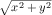

Fixed-Size Data
================================================

Every programming language comes with a language of data and a language of operations on data. The first language always provides some forms of atomic data; to represent the variety of information in the real world as data, a programmer must learn to compose basic data and to describe such compositions. Similarly, the second language provides some basic operations on atomic data; it is the programmer’s task to compose these operations into programs that perform the desired computations. We use *arithmetic* for the combination of these two parts of a programming language because it generalizes what you know from grade school.

This first part of the book (I) introduces the arithmetic of BSL, the programming language used in the Prologue. From arithmetic, it is a short step to your first simple programs, which you may know as *functions* from mathematics. Before you know it, though, the process of writing programs looks confusing, and you will long for a way to organize your thoughts. We equate “organizing thoughts” with *design*, and this first part of the book introduces you to a systematic way of designing programs.

## Arithmetic

From [Prologue: How to Program](./02-prologue.md), you know how to write down the kind of *expression* you know from first grade in BSL notation:

- write “`(`”,

- write down the name of a primitive operation op,

- write down the arguments, separated by some space, and

- write down “`)`”.

Just as a reminder, here is a primitive expression:

<blockquote class="SCodeFlow">
(<a href="https://docs.racket-lang.org/htdp-langs/beginner.html#%28def._htdp-beginner._%28%28lib._lang%2Fhtdp-beginner..rkt%29._%2B%29%29" class="RktValLink" data-pltdoc="x">+</a>&nbsp;1&nbsp;2)
</blockquote>

It uses `+`, the operation for adding two numbers, followed by two arguments, which are plain numbers. But here is another example:

<blockquote class="SCodeFlow">
(<a href="https://docs.racket-lang.org/htdp-langs/beginner.html#%28def._htdp-beginner._%28%28lib._lang%2Fhtdp-beginner..rkt%29._%2B%29%29" class="RktValLink" data-pltdoc="x">+</a>&nbsp;1&nbsp;(<a href="https://docs.racket-lang.org/htdp-langs/beginner.html#%28def._htdp-beginner._%28%28lib._lang%2Fhtdp-beginner..rkt%29._%2B%29%29" class="RktValLink" data-pltdoc="x">+</a>&nbsp;1&nbsp;(<a href="https://docs.racket-lang.org/htdp-langs/beginner.html#%28def._htdp-beginner._%28%28lib._lang%2Fhtdp-beginner..rkt%29._%2B%29%29" class="RktValLink" data-pltdoc="x">+</a>&nbsp;1&nbsp;1)&nbsp;2)&nbsp;3&nbsp;4&nbsp;5)
</blockquote>

This second example exploits two points in the above description that are open to interpretation. First, primitive operations may consume more than two arguments. Second, the arguments don’t have to be numbers per se; they can be expressions, too.

Evaluating expressions is also straightforward. First, BSL evaluates all the arguments of a primitive operation. Second, it “feeds” the resulting pieces of data to the operation, which produces a result. Thus,

<blockquote class="SCodeFlow"><table class="RktBlk" cellspacing="0" cellpadding="0"><tbody><tr><td>(<a href="https://docs.racket-lang.org/htdp-langs/beginner.html#%28def._htdp-beginner._%28%28lib._lang%2Fhtdp-beginner..rkt%29._%2B%29%29" class="RktValLink" data-pltdoc="x">+</a>&nbsp;1&nbsp;2)</td></tr><tr><td>==</td></tr><tr><td>3</td></tr></tbody></table></blockquote>

and

<blockquote class="SCodeFlow"><table class="RktBlk" cellspacing="0" cellpadding="0"><tbody><tr><td>(<a href="https://docs.racket-lang.org/htdp-langs/beginner.html#%28def._htdp-beginner._%28%28lib._lang%2Fhtdp-beginner..rkt%29._%2B%29%29" class="RktValLink" data-pltdoc="x">+</a>&nbsp;1&nbsp;(<a href="https://docs.racket-lang.org/htdp-langs/beginner.html#%28def._htdp-beginner._%28%28lib._lang%2Fhtdp-beginner..rkt%29._%2B%29%29" class="RktValLink" data-pltdoc="x">+</a>&nbsp;1&nbsp;(<a href="https://docs.racket-lang.org/htdp-langs/beginner.html#%28def._htdp-beginner._%28%28lib._lang%2Fhtdp-beginner..rkt%29._%2B%29%29" class="RktValLink" data-pltdoc="x">+</a>&nbsp;1&nbsp;1)&nbsp;2)&nbsp;3&nbsp;(<a href="https://docs.racket-lang.org/htdp-langs/beginner.html#%28def._htdp-beginner._%28%28lib._lang%2Fhtdp-beginner..rkt%29._%2B%29%29" class="RktValLink" data-pltdoc="x">+</a>&nbsp;2&nbsp;2)&nbsp;5)</td></tr><tr><td>==</td></tr><tr><td>(<a href="https://docs.racket-lang.org/htdp-langs/beginner.html#%28def._htdp-beginner._%28%28lib._lang%2Fhtdp-beginner..rkt%29._%2B%29%29" class="RktValLink" data-pltdoc="x">+</a>&nbsp;1&nbsp;(<a href="https://docs.racket-lang.org/htdp-langs/beginner.html#%28def._htdp-beginner._%28%28lib._lang%2Fhtdp-beginner..rkt%29._%2B%29%29" class="RktValLink" data-pltdoc="x">+</a>&nbsp;1&nbsp;2&nbsp;2)&nbsp;3&nbsp;4&nbsp;5)</td></tr><tr><td>==</td></tr><tr><td>(<a href="https://docs.racket-lang.org/htdp-langs/beginner.html#%28def._htdp-beginner._%28%28lib._lang%2Fhtdp-beginner..rkt%29._%2B%29%29" class="RktValLink" data-pltdoc="x">+</a>&nbsp;1&nbsp;5&nbsp;3&nbsp;4&nbsp;5)</td></tr><tr><td>==</td></tr><tr><td>18</td></tr></tbody></table></blockquote>

These calculations should look familiar because they are the same kind of calculations that you performed in mathematics classes. You may have written down the steps in a different way; you may have never been taught how to write down a sequence of calculation steps. Yet, BSL performs calculations just like you do, and this should be a relief. It guarantees that you understand what it does with primitive operations and primitive data, so there is some hope that you can predict what your programs will compute. Generally speaking, it is critical for a programmer to know how the chosen language calculates because otherwise a program’s computation may harm the people who use them or on whose behalf the programs calculate.

The rest of this chapter introduces four forms of *atomic data* of BSL: numbers, strings, images, and Boolean values. We use the word “atomic” here in analogy to physics. You cannot peek inside atomic pieces of data, but you do have functions that combine several pieces of atomic data into another one, retrieve “properties” of them, also in terms of atomic data, and so on. The sections of this chapter introduce some of these functions, also called *primitive operations* or *pre-defined operations*. You can find others in the documentation of BSL that comes with DrRacket.

### The Arithmetic of Numbers

Most people think “numbers” and “operations on numbers” when they hear “arithmetic.” “Operations on numbers” means adding two numbers to yield a third, subtracting one number from another, determining the greatest common divisor of two numbers, and many more such things. If we don’t take arithmetic too literally, we may even include the sine of an angle, rounding a real number to the closest integer, and so on.

<a id="numbers" style="font-size: 0;float: left;line-height: 0;">Numbers</a>

The BSL language supports *Numbers* and arithmetic on them. As discussed in the Prologue, an arithmetic operation such as `+` is used like this:

<blockquote class="SCodeFlow">
(<a href="https://docs.racket-lang.org/htdp-langs/beginner.html#%28def._htdp-beginner._%28%28lib._lang%2Fhtdp-beginner..rkt%29._%2B%29%29" class="RktValLink" data-pltdoc="x">+</a>&nbsp;3&nbsp;4)
</blockquote>

that is, in *prefix* notation form. Here are some of the operations on numbers that our language provides: `+`, `-`, `*`, `/`, `abs`, `add1`, `ceiling`, `denominator`, `exact->inexact`, `expt`, `floor`, `gcd`, `log`, `max`, `numerator`, `quotient`, `random`, `remainder`, `sqr`, and `tan`. We picked our way through the alphabet just to show the variety of operations. Explore what they compute, and then find out how many more there are.

If you need an operation on numbers that you know from your mathematics courses, chances are that BSL knows about it, too. Guess its name and experiment in the interactions area. Say you need to compute the sin of some angle; try

<blockquote class="SCodeFlow"><table class="RktBlk" cellspacing="0" cellpadding="0"><tbody><tr><td>&gt; (<a href="https://docs.racket-lang.org/htdp-langs/beginner.html#%28def._htdp-beginner._%28%28lib._lang%2Fhtdp-beginner..rkt%29._sin%29%29" class="RktValLink" data-pltdoc="x">sin</a>&nbsp;0)</td></tr><tr><td>
0
</td></tr></tbody></table></blockquote>

and use it happily ever after. Or look in the HelpDesk. You will find there that in addition to operations BSL also recognizes the names of some widely used numbers, for example, `pi` and `e`.

When it comes to numbers, BSL programs may use natural numbers, integers, rational numbers, real numbers, and complex numbers. We assume that you have heard of all but the last one. The last one may have been mentioned in your high school class. If not, don’t worry; while complex numbers are useful for all kinds of calculations, a novice doesn’t have to know about them.

A truly important distinction concerns the precision of numbers. For now, it is important to understand that BSL distinguishes *exact numbers* and *inexact numbers*. When it calculates with exact numbers, BSL preserves this precision whenever possible. For example, `(/ 4 6)` produces the precise fraction `2/3`, which DrRacket can render as a proper fraction, an improper fraction, or a mixed decimal. Play with your computer’s mouse to find the menu that changes the fraction into decimal expansion.

Some of BSL’s numeric operations cannot produce an exact result. For example, using the `sqrt` operation on `2` produces an irrational number that cannot be described with a finite number of digits. Because computers are of finite size and BSL must somehow fit such numbers into the computer, it chooses an approximation: `1.4142135623730951`. As mentioned in the Prologue, the `#i` prefix warns novice programmers of this lack of precision. While most programming languages choose to reduce precision in this manner, few advertise it and even fewer warn programmers.

**Note on Numbers** The word “[Number](#numbers)” refers to a wide variety of numbers, including counting numbers, integers, rational numbers, real numbers, and even complex numbers. For most uses, you can safely equate [Number](#numbers) with the number line from elementary school, though on occasion this translation is too imprecise. If we wish to be precise, we use appropriate words: *Integer*, *Rational*, and so on. We may even refine these notions using such standard terms as *PositiveInteger*, *NonnegativeNumber*, *NegativeNumber*, and so on. **End**

<a id="exercise-1" style="font-size: 0;float: left;line-height: 0;">Exercise 1</a>

**Exercise 1**. Add the following definitions for `x` and `y` to DrRacket’s definitions area:

<blockquote class="SCodeFlow"><table class="RktBlk" cellspacing="0" cellpadding="0"><tbody><tr><td>(<a href="https://docs.racket-lang.org/htdp-langs/beginner.html#%28form._%28%28lib._lang%2Fhtdp-beginner..rkt%29._define%29%29" class="RktStxLink" data-pltdoc="x">define</a>&nbsp;x&nbsp;3)</td></tr><tr><td>(<a href="https://docs.racket-lang.org/htdp-langs/beginner.html#%28form._%28%28lib._lang%2Fhtdp-beginner..rkt%29._define%29%29" class="RktStxLink" data-pltdoc="x">define</a>&nbsp;y&nbsp;4)</td></tr></tbody></table></blockquote>

Now imagine that `x` and `y` are the coordinates of a Cartesian point. Write down an expression that computes the distance of this point to the origin, that is, a point with the coordinates `(0,0)`.

The expected result for these values is `5`, but your expression should produce the correct result even after you change these definitions.

Just in case you have not taken geometry courses or in case you forgot the formula that you encountered there, the point `(x,y)` has the distance

from the origin. After all, we are teaching you how to design programs, not how to be a geometer.

To develop the desired expression, it is best to click *RUN* and to experiment in the interactions area. The *RUN* action tells DrRacket what the current values of `x` and `y` are so that you can experiment with expressions that involve `x` and `y`:

<blockquote class="SCodeFlow"><table class="RktBlk" cellspacing="0" cellpadding="0"><tbody><tr><td>&gt; x</td></tr><tr><td>
3
</td></tr><tr><td>&gt; y</td></tr><tr><td>
4
</td></tr><tr><td>&gt; (<a href="https://docs.racket-lang.org/htdp-langs/beginner.html#%28def._htdp-beginner._%28%28lib._lang%2Fhtdp-beginner..rkt%29._%2B%29%29" class="RktValLink" data-pltdoc="x">+</a>&nbsp;x&nbsp;10)</td></tr><tr><td>
13
</td></tr><tr><td>&gt; (<a href="https://docs.racket-lang.org/htdp-langs/beginner.html#%28def._htdp-beginner._%28%28lib._lang%2Fhtdp-beginner..rkt%29._%2A%29%29" class="RktValLink" data-pltdoc="x">*</a>&nbsp;x&nbsp;y)</td></tr><tr><td>
12
</td></tr></tbody></table></blockquote>

Once you have the expression that produces the correct result, copy it from the interactions area to the definitions area.

To confirm that the expression works properly, change `x` to `12` and `y` to `5`, then click *RUN*. The result should be `13`.

Your mathematics teacher would say that you computed the **distance formula**. To use the formula on alternative inputs, you need to open DrRacket, edit the definitions of `x` and `y` so they represent the desired coordinates, and click *RUN*. But this way of reusing the distance formula is cumbersome and naive. We will soon show you a way to define functions, which makes reusing formulas straightforward. For now, we use this kind of exercise to call attention to the idea of functions and to prepare you for programming with them.

### The Arithmetic of Strings

A widespread prejudice about computers concerns their innards. Many believe that it is all about bits and bytes—whatever those are—and possibly numbers because everyone knows that computers can calculate. While it is true that electrical engineers must understand and study the computer as just such an object, beginning programmers and everyone else need never (ever) succumb to this thinking.

Programming languages are about computing with information, and information comes in all shapes and forms. For example, a program may deal with colors, names, business letters, or conversations between people. Even though we could encode this kind of information as numbers, it would be a horrible idea. Just imagine remembering large tables of codes, such as `0` means “red” and `1` means “hello,” and the like.

Instead, most programming languages provide at least one kind of data that deals with such symbolic information. For now, we use BSL’s strings. Generally speaking, a String is a sequence of the characters that you can enter on the keyboard, plus a few others, about which we aren’t concerned just yet, enclosed in double quotes. In [Prologue: How to Program](./02-prologue.md), we have seen a number of BSL strings: `"hello"`, `"world"`, `"blue"`, `"red"`, and others. The first two are words that may show up in a conversation or in a letter; the others are names of colors that we may wish to use.

**Note** We use [1String](#string) to refer to the keyboard characters that make up a [String](#string). For example, `"red"` consists of three such [1String](#string)s: `"r"`, `"e"`, `"d"`. As it turns out, there is a bit more to the definition of [1String](#string), but for now thinking of them as [String](#string)s of length 1 is fine. **End**

BSL includes only one operation that exclusively consumes and produces strings: `string-append`, which, as we have seen in [Prologue: How to Program](./02-prologue.md), concatenates two given strings into one. Think of `string-append` as an operation that is just like `+`. While the latter consumes two (or more) numbers and produces a new number, the former consumes two or more strings and produces a new string:

<blockquote class="SCodeFlow"><table class="RktBlk" cellspacing="0" cellpadding="0"><tbody><tr><td>&gt; (<a href="https://docs.racket-lang.org/htdp-langs/beginner.html#%28def._htdp-beginner._%28%28lib._lang%2Fhtdp-beginner..rkt%29._string-append%29%29" class="RktValLink" data-pltdoc="x">string-append</a>&nbsp;"what a "&nbsp;"lovely "&nbsp;"day"&nbsp;" 4 BSL")</td></tr><tr><td>
"what a lovely day 4 BSL"
</td></tr></tbody></table></blockquote>

Nothing about the given numbers changes when `+` adds them up, and nothing about the given strings changes when `string-append` concatenates them into one big string. If you wish to evaluate such expressions, you just need to think that the obvious laws hold for `string-append`, similar to those for `+`:

<blockquote><table cellspacing="0" cellpadding="0"><tbody><tr><td>
(<a href="https://docs.racket-lang.org/htdp-langs/beginner.html#%28def._htdp-beginner._%28%28lib._lang%2Fhtdp-beginner..rkt%29._%2B%29%29" class="RktValLink" data-pltdoc="x">+</a> 1 1) == 2
</td><td>
&nbsp;&nbsp;&nbsp;
</td><td>
(<a href="https://docs.racket-lang.org/htdp-langs/beginner.html#%28def._htdp-beginner._%28%28lib._lang%2Fhtdp-beginner..rkt%29._string-append%29%29" class="RktValLink" data-pltdoc="x">string-append</a> "a" "b") == "ab"
</td></tr><tr><td>
(<a href="https://docs.racket-lang.org/htdp-langs/beginner.html#%28def._htdp-beginner._%28%28lib._lang%2Fhtdp-beginner..rkt%29._%2B%29%29" class="RktValLink" data-pltdoc="x">+</a> 1 2) == 3
</td><td>
&nbsp;&nbsp;&nbsp;
</td><td>
(<a href="https://docs.racket-lang.org/htdp-langs/beginner.html#%28def._htdp-beginner._%28%28lib._lang%2Fhtdp-beginner..rkt%29._string-append%29%29" class="RktValLink" data-pltdoc="x">string-append</a> "ab" "c") == "abc"
</td></tr><tr><td>
(<a href="https://docs.racket-lang.org/htdp-langs/beginner.html#%28def._htdp-beginner._%28%28lib._lang%2Fhtdp-beginner..rkt%29._%2B%29%29" class="RktValLink" data-pltdoc="x">+</a> 2 2) == 4
</td><td>
&nbsp;&nbsp;&nbsp;
</td><td>
(<a href="https://docs.racket-lang.org/htdp-langs/beginner.html#%28def._htdp-beginner._%28%28lib._lang%2Fhtdp-beginner..rkt%29._string-append%29%29" class="RktValLink" data-pltdoc="x">string-append</a> "a" " ") == "a "
</td></tr><tr><td>
...
</td><td>
&nbsp;&nbsp;&nbsp;
</td><td>
...
</td></tr></tbody></table></blockquote>

**Exercise 2**. Add the following two lines to the definitions area:

<blockquote class="SCodeFlow"><table class="RktBlk" cellspacing="0" cellpadding="0"><tbody><tr><td>(<a href="https://docs.racket-lang.org/htdp-langs/beginner.html#%28form._%28%28lib._lang%2Fhtdp-beginner..rkt%29._define%29%29" class="RktStxLink" data-pltdoc="x">define</a>&nbsp;prefix&nbsp;"hello")</td></tr><tr><td>(<a href="https://docs.racket-lang.org/htdp-langs/beginner.html#%28form._%28%28lib._lang%2Fhtdp-beginner..rkt%29._define%29%29" class="RktStxLink" data-pltdoc="x">define</a>&nbsp;suffix&nbsp;"world")</td></tr></tbody></table></blockquote>

Then use string primitives to create an expression that concatenates `prefix` and `suffix` and adds `"_"` between them. When you run this program, you will see `"hello_world"` in the interactions area.

See [exercise 1](#exercise-1) for how to create expressions using DrRacket.

### Mixing It Up

All other operations (in BSL) concerning strings consume or produce data other than strings. Here are some examples:

- `string-length` consumes a string and produces a number;

- `string-ith` consumes a string s together with a number i and extracts the [1String](#string) located at the ith position (counting from 0); and

- `number->string` consumes a number and produces a string.

Also look up `substring` and find out what it does.

If the documentation in HelpDesk appears confusing, experiment with the functions in the interactions area. Give them appropriate arguments, and find out what they compute. Also use **inappropriate** arguments for some operations just to find out how BSL reacts:

<blockquote class="SCodeFlow"><table class="RktBlk" cellspacing="0" cellpadding="0"><tbody><tr><td>&gt; (<a href="https://docs.racket-lang.org/htdp-langs/beginner.html#%28def._htdp-beginner._%28%28lib._lang%2Fhtdp-beginner..rkt%29._string-length%29%29" class="RktValLink" data-pltdoc="x">string-length</a>&nbsp;42)</td></tr><tr><td>
string-length:expects a string, given 42
</td></tr></tbody></table></blockquote>

As you can see, BSL reports an error. The first part “string-length” informs you about the operation that is misapplied; the second half states what is wrong with the arguments. In this specific example, `string-length` is supposed to be applied to a string but is given a number, specifically `42`.

Naturally, it is possible to nest operations that consume and produce different kinds of data **as long as you keep track of what is proper and what is not**. Consider this expression from the [Prologue: How to Program](./02-prologue.md):

<blockquote class="SCodeFlow">
(<a href="https://docs.racket-lang.org/htdp-langs/beginner.html#%28def._htdp-beginner._%28%28lib._lang%2Fhtdp-beginner..rkt%29._%2B%29%29" class="RktValLink" data-pltdoc="x">+</a>&nbsp;(<a href="https://docs.racket-lang.org/htdp-langs/beginner.html#%28def._htdp-beginner._%28%28lib._lang%2Fhtdp-beginner..rkt%29._string-length%29%29" class="RktValLink" data-pltdoc="x">string-length</a>&nbsp;"hello world")&nbsp;20)
</blockquote>

The inner expression applies `string-length` to `"hello world"`, our favorite string. The outer expression has `+` consume the result of the inner expression and `20`.

Let’s determine the result of this expression in a step-by-step fashion:

<blockquote class="SCodeFlow"><table class="RktBlk" cellspacing="0" cellpadding="0"><tbody><tr><td>(<a href="https://docs.racket-lang.org/htdp-langs/beginner.html#%28def._htdp-beginner._%28%28lib._lang%2Fhtdp-beginner..rkt%29._%2B%29%29" class="RktValLink" data-pltdoc="x">+</a>&nbsp;(<a href="https://docs.racket-lang.org/htdp-langs/beginner.html#%28def._htdp-beginner._%28%28lib._lang%2Fhtdp-beginner..rkt%29._string-length%29%29" class="RktValLink" data-pltdoc="x">string-length</a>&nbsp;"hello world")&nbsp;20)</td></tr><tr><td>==</td></tr><tr><td>(<a href="https://docs.racket-lang.org/htdp-langs/beginner.html#%28def._htdp-beginner._%28%28lib._lang%2Fhtdp-beginner..rkt%29._%2B%29%29" class="RktValLink" data-pltdoc="x">+</a>&nbsp;11&nbsp;20)</td></tr><tr><td>==</td></tr><tr><td>31</td></tr></tbody></table></blockquote>

Not surprisingly, computing with such nested expressions that deal with a mix of data is no different from computing with numeric expressions. Here is another example:

<blockquote class="SCodeFlow"><table class="RktBlk" cellspacing="0" cellpadding="0"><tbody><tr><td>(<a href="https://docs.racket-lang.org/htdp-langs/beginner.html#%28def._htdp-beginner._%28%28lib._lang%2Fhtdp-beginner..rkt%29._%2B%29%29" class="RktValLink" data-pltdoc="x">+</a>&nbsp;(<a href="https://docs.racket-lang.org/htdp-langs/beginner.html#%28def._htdp-beginner._%28%28lib._lang%2Fhtdp-beginner..rkt%29._string-length%29%29" class="RktValLink" data-pltdoc="x">string-length</a>&nbsp;(<a href="https://docs.racket-lang.org/htdp-langs/beginner.html#%28def._htdp-beginner._%28%28lib._lang%2Fhtdp-beginner..rkt%29._number-~3estring%29%29" class="RktValLink" data-pltdoc="x">number-&gt;string</a>&nbsp;42))&nbsp;2)</td></tr><tr><td>==</td></tr><tr><td>(<a href="https://docs.racket-lang.org/htdp-langs/beginner.html#%28def._htdp-beginner._%28%28lib._lang%2Fhtdp-beginner..rkt%29._%2B%29%29" class="RktValLink" data-pltdoc="x">+</a>&nbsp;(<a href="https://docs.racket-lang.org/htdp-langs/beginner.html#%28def._htdp-beginner._%28%28lib._lang%2Fhtdp-beginner..rkt%29._string-length%29%29" class="RktValLink" data-pltdoc="x">string-length</a>&nbsp;"42")&nbsp;2)</td></tr><tr><td>==</td></tr><tr><td>(<a href="https://docs.racket-lang.org/htdp-langs/beginner.html#%28def._htdp-beginner._%28%28lib._lang%2Fhtdp-beginner..rkt%29._%2B%29%29" class="RktValLink" data-pltdoc="x">+</a>&nbsp;2&nbsp;2)</td></tr><tr><td>==</td></tr><tr><td>4</td></tr></tbody></table></blockquote>

Before you go on, construct some nested expressions that mix data in the **wrong** way, say,

<blockquote class="SCodeFlow">
(<a href="https://docs.racket-lang.org/htdp-langs/beginner.html#%28def._htdp-beginner._%28%28lib._lang%2Fhtdp-beginner..rkt%29._%2B%29%29" class="RktValLink" data-pltdoc="x">+</a>&nbsp;(<a href="https://docs.racket-lang.org/htdp-langs/beginner.html#%28def._htdp-beginner._%28%28lib._lang%2Fhtdp-beginner..rkt%29._string-length%29%29" class="RktValLink" data-pltdoc="x">string-length</a>&nbsp;42)&nbsp;1)
</blockquote>

Run them in DrRacket. Study the red error message but also watch what DrRacket highlights in the definitions area.

<a id="exercise-3" style="font-size: 0;float: left;line-height: 0;">Exercise 3</a>

**Exercise 3**. Add the following two lines to the definitions area:

<blockquote class="SCodeFlow"><table class="RktBlk" cellspacing="0" cellpadding="0"><tbody><tr><td>(<a href="https://docs.racket-lang.org/htdp-langs/beginner.html#%28form._%28%28lib._lang%2Fhtdp-beginner..rkt%29._define%29%29" class="RktStxLink" data-pltdoc="x">define</a>&nbsp;str&nbsp;"helloworld")</td></tr><tr><td>(<a href="https://docs.racket-lang.org/htdp-langs/beginner.html#%28form._%28%28lib._lang%2Fhtdp-beginner..rkt%29._define%29%29" class="RktStxLink" data-pltdoc="x">define</a>&nbsp;i&nbsp;5)</td></tr></tbody></table></blockquote>

Then create an expression using string primitives that adds `"_"` at position `i`. In general this means the resulting string is longer than the original one; here the expected result is `"hello_world"`.

*Position* means *i* characters from the left of the string, but programmers start counting at `0`. Thus, the *5th* letter in this example is `"w"`, because the `0`th letter is `"h"`. **Hint** When you encounter such “counting problems” you may wish to add a string of digits below `str` to help with counting:

<blockquote class="SCodeFlow"><table class="RktBlk" cellspacing="0" cellpadding="0"><tbody><tr><td>(<a href="https://docs.racket-lang.org/htdp-langs/beginner.html#%28form._%28%28lib._lang%2Fhtdp-beginner..rkt%29._define%29%29" class="RktStxLink" data-pltdoc="x">define</a>&nbsp;str&nbsp;"helloworld")</td></tr><tr><td>(<a href="https://docs.racket-lang.org/htdp-langs/beginner.html#%28form._%28%28lib._lang%2Fhtdp-beginner..rkt%29._define%29%29" class="RktStxLink" data-pltdoc="x">define</a>&nbsp;ind&nbsp;"0123456789")</td></tr><tr><td>(<a href="https://docs.racket-lang.org/htdp-langs/beginner.html#%28form._%28%28lib._lang%2Fhtdp-beginner..rkt%29._define%29%29" class="RktStxLink" data-pltdoc="x">define</a>&nbsp;i&nbsp;5)</td></tr></tbody></table></blockquote>

See [exercise 1](#exercise-1) for how to create expressions in DrRacket.

**Exercise 4**. Use the same setup as in [exercise 3](#exercise-3) to create an expression that deletes the *i*th position from `str`. Clearly this expression creates a shorter string than the given one. Which values for `i` are legitimate?

### The Arithmetic of Images

An *Image* is a visual, rectangular piece of data, for example, a photo or a geometric figure and its frame. You can insert images in DrRacket wherever you can write down an expression because images are values, just like numbers and strings.

Your programs can also manipulate images with primitive operations. These primitive operations come in three flavors. The first kind concerns the creation of basic images:

- `circle` produces a circle image from a radius, a mode string, and a color string;

- `ellipse` produces an ellipse from two diameters, a mode string, and a color string;

- `line` produces a line from two points and a color string;

- `rectangle` produces a rectangle from a width, a height, a mode string, and a color string;

- `text` produces a text image from a string, a font size, and a color string; and

- `triangle` produces an upward-pointing equilateral triangle from a size, a mode string, and a color string.

The names of these operations mostly explain what kind of image they create. All you must know is that *mode strings* means `"solid"` or `"outline"`, and *color strings* are strings such as `"orange"`, `"black"`, and so on.

Play with these operations in the interactions window:

<blockquote class="SCodeFlow"><table class="RktBlk" cellspacing="0" cellpadding="0"><tbody><tr><td>&gt; (<a href="https://docs.racket-lang.org/teachpack/2htdpimage.html#%28def._%28%28lib._2htdp%2Fimage..rkt%29._circle%29%29" class="RktValLink" data-pltdoc="x">circle</a>&nbsp;10&nbsp;"solid"&nbsp;"green")</td></tr><tr><td>

</td></tr><tr><td>&gt; (<a href="https://docs.racket-lang.org/teachpack/2htdpimage.html#%28def._%28%28lib._2htdp%2Fimage..rkt%29._rectangle%29%29" class="RktValLink" data-pltdoc="x">rectangle</a>&nbsp;10&nbsp;20&nbsp;"solid"&nbsp;"blue")</td></tr><tr><td>

</td></tr><tr><td>&gt; (<a href="https://docs.racket-lang.org/teachpack/2htdpimage.html#%28def._%28%28lib._2htdp%2Fimage..rkt%29._star%29%29" class="RktValLink" data-pltdoc="x">star</a>&nbsp;12&nbsp;"solid"&nbsp;"gray")</td></tr><tr><td>

</td></tr></tbody></table></blockquote>

Stop! The above uses a previously unmentioned operation. Look up its documentation and find out how many more such operations the *2htdp/image* library comes with. Experiment with the operations you find.

The second kind of functions on images concern image properties:

- `image-width` determines the width of an image in terms of pixels;

- `image-height` determines the height of an image;

They extract the kind of values from images that you expect:

<blockquote class="SCodeFlow"><table class="RktBlk" cellspacing="0" cellpadding="0"><tbody><tr><td>&gt; (<a href="https://docs.racket-lang.org/teachpack/2htdpimage.html#%28def._%28%28lib._2htdp%2Fimage..rkt%29._image-width%29%29" class="RktValLink" data-pltdoc="x">image-width</a>&nbsp;(<a href="https://docs.racket-lang.org/teachpack/2htdpimage.html#%28def._%28%28lib._2htdp%2Fimage..rkt%29._circle%29%29" class="RktValLink" data-pltdoc="x">circle</a>&nbsp;10&nbsp;"solid"&nbsp;"red"))</td></tr><tr><td>
20
</td></tr><tr><td>&gt; (<a href="https://docs.racket-lang.org/teachpack/2htdpimage.html#%28def._%28%28lib._2htdp%2Fimage..rkt%29._image-height%29%29" class="RktValLink" data-pltdoc="x">image-height</a>&nbsp;(<a href="https://docs.racket-lang.org/teachpack/2htdpimage.html#%28def._%28%28lib._2htdp%2Fimage..rkt%29._rectangle%29%29" class="RktValLink" data-pltdoc="x">rectangle</a>&nbsp;10&nbsp;20&nbsp;"solid"&nbsp;"blue"))</td></tr><tr><td>
20
</td></tr></tbody></table></blockquote>

Stop! Explain how DrRacket determines the value of this expression:

<blockquote class="SCodeFlow"><table class="RktBlk" cellspacing="0" cellpadding="0"><tbody><tr><td>(<a href="https://docs.racket-lang.org/htdp-langs/beginner.html#%28def._htdp-beginner._%28%28lib._lang%2Fhtdp-beginner..rkt%29._%2B%29%29" class="RktValLink" data-pltdoc="x">+</a>&nbsp;(<a href="https://docs.racket-lang.org/teachpack/2htdpimage.html#%28def._%28%28lib._2htdp%2Fimage..rkt%29._image-width%29%29" class="RktValLink" data-pltdoc="x">image-width</a>&nbsp;(<a href="https://docs.racket-lang.org/teachpack/2htdpimage.html#%28def._%28%28lib._2htdp%2Fimage..rkt%29._circle%29%29" class="RktValLink" data-pltdoc="x">circle</a>&nbsp;10&nbsp;"solid"&nbsp;"red"))</td></tr><tr><td>&nbsp;&nbsp;&nbsp;(<a href="https://docs.racket-lang.org/teachpack/2htdpimage.html#%28def._%28%28lib._2htdp%2Fimage..rkt%29._image-height%29%29" class="RktValLink" data-pltdoc="x">image-height</a>&nbsp;(<a href="https://docs.racket-lang.org/teachpack/2htdpimage.html#%28def._%28%28lib._2htdp%2Fimage..rkt%29._rectangle%29%29" class="RktValLink" data-pltdoc="x">rectangle</a>&nbsp;10&nbsp;20&nbsp;"solid"&nbsp;"blue")))</td></tr></tbody></table></blockquote>

A proper understanding of the third kind of image-composing primitives requires the introduction of one new idea: the *anchor point*. An image isn’t just a single pixel, it consists of many pixels. Specifically, each image is like a photograph, that is, a rectangle of pixels. One of these pixels is an implicit anchor point. When you use an image primitive to compose two images, the composition happens with respect to the anchor points, unless you specify some other point explicitly:

- `overlay` places all the images to which it is applied on top of each other, using the center as anchor point;

- `overlay/xy` is like `overlay` but accepts two numbers—`x` and `y`—between two image arguments. It shifts the second image by `x` pixels to the right and `y` pixels down—all with respect to the first image’s top-left corner; unsurprisingly, a negative `x` shifts the image to the left and a negative `y` up; and

- `overlay/align` is like `overlay` but accepts two strings that shift the anchor point(s) to other parts of the rectangles. There are nine different positions overall; experiment with all possibilities!

The *2htdp/image* library comes with many other primitive functions for combining images. As you get familiar with image processing, you will want to read up on those. For now, we introduce three more because they are important for creating animated scenes and images for games:

- `empty-scene` creates a rectangle of some given width and height;

- `place-image` places an image into a scene at a specified position. If the image doesn’t fit into the given scene, it is appropriately cropped;

- `scene+line` consumes a scene, four numbers, and a color to draw a line into the given image. Experiment with it to see how it works.

<blockquote class="Figure"><a id="figure-14" style="font-size: 0;float: left;line-height: 0;">Figure 14</a><blockquote class="Centerfigure"><blockquote class="FigureInside"><table style="border-collapse: collapse;" cellspacing="0" cellpadding="0"><tbody><tr><td style="border-bottom: 1px solid black;">
arithmetic of numbers
</td><td style="border-bottom: 1px solid black;">
&nbsp;&nbsp;&nbsp;&nbsp;
</td><td style="border-bottom: 1px solid black;">
arithmetic of images
</td></tr><tr><td valign="top">
(<a href="https://docs.racket-lang.org/htdp-langs/beginner.html#%28def._htdp-beginner._%28%28lib._lang%2Fhtdp-beginner..rkt%29._%2B%29%29" class="RktValLink" data-pltdoc="x">+</a> 1 1) == 2
</td><td valign="top">
&nbsp;&nbsp;&nbsp;&nbsp;
</td><td valign="top"><table class="RktBlk" cellspacing="0" cellpadding="0"><tbody><tr><td>(<a href="https://docs.racket-lang.org/teachpack/2htdpimage.html#%28def._%28%28lib._2htdp%2Fimage..rkt%29._overlay%29%29" class="RktValLink" data-pltdoc="x">overlay</a>&nbsp;(<a href="https://docs.racket-lang.org/teachpack/2htdpimage.html#%28def._%28%28lib._2htdp%2Fimage..rkt%29._square%29%29" class="RktValLink" data-pltdoc="x">square</a>&nbsp;4&nbsp;"solid"&nbsp;"orange")</td></tr><tr><td>&nbsp;&nbsp;&nbsp;&nbsp;&nbsp;&nbsp;&nbsp;&nbsp;&nbsp;(<a href="https://docs.racket-lang.org/teachpack/2htdpimage.html#%28def._%28%28lib._2htdp%2Fimage..rkt%29._circle%29%29" class="RktValLink" data-pltdoc="x">circle</a>&nbsp;6&nbsp;"solid"&nbsp;"yellow"))</td></tr><tr><td>==</td></tr><tr><td></td></tr></tbody></table></td></tr><tr><td valign="top">

</td><td valign="top">
&nbsp;&nbsp;&nbsp;&nbsp;
</td><td valign="top">

</td></tr><tr><td valign="top">
(<a href="https://docs.racket-lang.org/htdp-langs/beginner.html#%28def._htdp-beginner._%28%28lib._lang%2Fhtdp-beginner..rkt%29._%2B%29%29" class="RktValLink" data-pltdoc="x">+</a> 1 2) == 3
</td><td valign="top">
&nbsp;&nbsp;&nbsp;&nbsp;
</td><td valign="top"><table class="RktBlk" cellspacing="0" cellpadding="0"><tbody><tr><td>(<a href="https://docs.racket-lang.org/teachpack/2htdpimage.html#%28def._%28%28lib._2htdp%2Fimage..rkt%29._underlay%29%29" class="RktValLink" data-pltdoc="x">underlay</a>&nbsp;(<a href="https://docs.racket-lang.org/teachpack/2htdpimage.html#%28def._%28%28lib._2htdp%2Fimage..rkt%29._circle%29%29" class="RktValLink" data-pltdoc="x">circle</a>&nbsp;6&nbsp;"solid"&nbsp;"yellow")</td></tr><tr><td>&nbsp;&nbsp;&nbsp;&nbsp;&nbsp;&nbsp;&nbsp;&nbsp;&nbsp;&nbsp;(<a href="https://docs.racket-lang.org/teachpack/2htdpimage.html#%28def._%28%28lib._2htdp%2Fimage..rkt%29._square%29%29" class="RktValLink" data-pltdoc="x">square</a>&nbsp;4&nbsp;"solid"&nbsp;"orange"))</td></tr><tr><td>==</td></tr><tr><td></td></tr></tbody></table></td></tr><tr><td valign="top">

</td><td valign="top">
&nbsp;&nbsp;&nbsp;&nbsp;
</td><td valign="top">

</td></tr><tr><td valign="top">
(<a href="https://docs.racket-lang.org/htdp-langs/beginner.html#%28def._htdp-beginner._%28%28lib._lang%2Fhtdp-beginner..rkt%29._%2B%29%29" class="RktValLink" data-pltdoc="x">+</a> 2 2) == 4
</td><td valign="top">
&nbsp;&nbsp;&nbsp;&nbsp;
</td><td valign="top"><table class="RktBlk" cellspacing="0" cellpadding="0"><tbody><tr><td>(<a href="https://docs.racket-lang.org/teachpack/2htdpimage.html#%28def._%28%28lib._2htdp%2Fimage..rkt%29._place-image%29%29" class="RktValLink" data-pltdoc="x">place-image</a>&nbsp;(<a href="https://docs.racket-lang.org/teachpack/2htdpimage.html#%28def._%28%28lib._2htdp%2Fimage..rkt%29._circle%29%29" class="RktValLink" data-pltdoc="x">circle</a>&nbsp;6&nbsp;"solid"&nbsp;"yellow")</td></tr><tr><td>&nbsp;&nbsp;&nbsp;&nbsp;&nbsp;&nbsp;&nbsp;&nbsp;&nbsp;&nbsp;&nbsp;&nbsp;&nbsp;10&nbsp;10</td></tr><tr><td>&nbsp;&nbsp;&nbsp;&nbsp;&nbsp;&nbsp;&nbsp;&nbsp;&nbsp;&nbsp;&nbsp;&nbsp;&nbsp;(<a href="https://docs.racket-lang.org/teachpack/2htdpimage.html#%28def._%28%28lib._2htdp%2Fimage..rkt%29._empty-scene%29%29" class="RktValLink" data-pltdoc="x">empty-scene</a>&nbsp;20&nbsp;20))</td></tr><tr><td>==</td></tr><tr><td></td></tr></tbody></table></td></tr><tr><td valign="top">
...
</td><td valign="top">
&nbsp;&nbsp;&nbsp;&nbsp;
</td><td valign="top">
...
</td></tr></tbody></table></blockquote></blockquote>
Figure&nbsp;14: Laws of image creation
</blockquote>

The laws of arithmetic for images are analogous to those for numbers; see [figure 14](#figure-14) for some examples and a comparison with numeric arithmetic. Again, no image gets destroyed or changed. Like `+`, these primitives just make up new images that combine the given ones in some manner.

**Exercise 5**. Use the *2htdp/image* library to create the image of a simple boat or tree. Make sure you can easily change the scale of the entire image.

**Exercise 6**. Add the following line to the definitions area:

<blockquote class="SCodeFlow">
(<a href="https://docs.racket-lang.org/htdp-langs/beginner.html#%28form._%28%28lib._lang%2Fhtdp-beginner..rkt%29._define%29%29" class="RktStxLink" data-pltdoc="x">define</a>&nbsp;cat&nbsp;)
</blockquote>

Create an expression that counts the number of pixels in the image.

### The Arithmetic of Booleans

We need one last kind of primitive data before we can design programs: Boolean values. There are only two kinds of *Boolean* values: `#true` and `#false`. Programs use Boolean values for representing decisions or the status of switches.

Computing with Boolean values is simple, too. In particular, BSL programs get away with three operations: `or`, `and`, and `not`. These operations are kind of like addition, multiplication, and negation for numbers. Of course, because there are only two Boolean values, it is actually possible to demonstrate how these functions work in **all** possible situations:

- `or` checks whether **any** of the given Boolean values is `#true`: <blockquote class="SCodeFlow"><table class="RktBlk" cellspacing="0" cellpadding="0"><tbody><tr><td>&gt; (<a href="https://docs.racket-lang.org/htdp-langs/beginner.html#%28form._%28%28lib._lang%2Fhtdp-beginner..rkt%29._or%29%29" class="RktStxLink" data-pltdoc="x">or</a>&nbsp;#true&nbsp;#true)</td></tr><tr><td>
#true
</td></tr><tr><td>&gt; (<a href="https://docs.racket-lang.org/htdp-langs/beginner.html#%28form._%28%28lib._lang%2Fhtdp-beginner..rkt%29._or%29%29" class="RktStxLink" data-pltdoc="x">or</a>&nbsp;#true&nbsp;#false)</td></tr><tr><td>
#true
</td></tr><tr><td>&gt; (<a href="https://docs.racket-lang.org/htdp-langs/beginner.html#%28form._%28%28lib._lang%2Fhtdp-beginner..rkt%29._or%29%29" class="RktStxLink" data-pltdoc="x">or</a>&nbsp;#false&nbsp;#true)</td></tr><tr><td>
#true
</td></tr><tr><td>&gt; (<a href="https://docs.racket-lang.org/htdp-langs/beginner.html#%28form._%28%28lib._lang%2Fhtdp-beginner..rkt%29._or%29%29" class="RktStxLink" data-pltdoc="x">or</a>&nbsp;#false&nbsp;#false)</td></tr><tr><td>
#false
</td></tr></tbody></table></blockquote>

- `and` checks whether **all** of the given Boolean values are `#true`: <blockquote class="SCodeFlow"><table class="RktBlk" cellspacing="0" cellpadding="0"><tbody><tr><td>&gt; (<a href="https://docs.racket-lang.org/htdp-langs/beginner.html#%28form._%28%28lib._lang%2Fhtdp-beginner..rkt%29._and%29%29" class="RktStxLink" data-pltdoc="x">and</a>&nbsp;#true&nbsp;#true)</td></tr><tr><td>
#true
</td></tr><tr><td>&gt; (<a href="https://docs.racket-lang.org/htdp-langs/beginner.html#%28form._%28%28lib._lang%2Fhtdp-beginner..rkt%29._and%29%29" class="RktStxLink" data-pltdoc="x">and</a>&nbsp;#true&nbsp;#false)</td></tr><tr><td>
#false
</td></tr><tr><td>&gt; (<a href="https://docs.racket-lang.org/htdp-langs/beginner.html#%28form._%28%28lib._lang%2Fhtdp-beginner..rkt%29._and%29%29" class="RktStxLink" data-pltdoc="x">and</a>&nbsp;#false&nbsp;#true)</td></tr><tr><td>
#false
</td></tr><tr><td>&gt; (<a href="https://docs.racket-lang.org/htdp-langs/beginner.html#%28form._%28%28lib._lang%2Fhtdp-beginner..rkt%29._and%29%29" class="RktStxLink" data-pltdoc="x">and</a>&nbsp;#false&nbsp;#false)</td></tr><tr><td>
#false
</td></tr></tbody></table></blockquote>

- and `not` always picks the Boolean that isn’t given: <blockquote class="SCodeFlow"><table class="RktBlk" cellspacing="0" cellpadding="0"><tbody><tr><td>&gt; (<a href="https://docs.racket-lang.org/htdp-langs/beginner.html#%28def._htdp-beginner._%28%28lib._lang%2Fhtdp-beginner..rkt%29._not%29%29" class="RktValLink" data-pltdoc="x">not</a>&nbsp;#true)</td></tr><tr><td>
#false
</td></tr></tbody></table></blockquote>

Unsurprisingly, `or` and `and` may be used with more than two expressions. Finally, there is more to `or` and `and` than these explanations suggest, but to explain the extra bit requires a second look at nested expressions.

**Exercise 7**. Boolean expressions can express some everyday problems. Suppose you want to decide whether today is an appropriate day to go to the mall. You go to the mall either if it is not sunny or if today is Friday (because that is when stores post new sales items).

Here is how you could go about it using your new knowledge about Booleans. First add these two lines to the definitions area of DrRacket:

<blockquote class="SCodeFlow"><table class="RktBlk" cellspacing="0" cellpadding="0"><tbody><tr><td>(<a href="https://docs.racket-lang.org/htdp-langs/beginner.html#%28form._%28%28lib._lang%2Fhtdp-beginner..rkt%29._define%29%29" class="RktStxLink" data-pltdoc="x">define</a>&nbsp;sunny&nbsp;#true)</td></tr><tr><td>(<a href="https://docs.racket-lang.org/htdp-langs/beginner.html#%28form._%28%28lib._lang%2Fhtdp-beginner..rkt%29._define%29%29" class="RktStxLink" data-pltdoc="x">define</a>&nbsp;friday&nbsp;#false)</td></tr></tbody></table></blockquote>

Now create an expression that computes whether *sunny* is false or *friday* is true. So in this particular case, the answer is `#false`. (Why?)

See [exercise 1](#exercise-1) for how to create expressions in DrRacket. How many combinations of Booleans can you associate with *sunny* and *friday*?

### Mixing It Up with Booleans

One important use of Boolean values concerns calculations with different kinds of data. We know from the Prologue that BSL programs may name values via definitions. For example, we could start a program with

<blockquote class="SCodeFlow">
(<a href="https://docs.racket-lang.org/htdp-langs/beginner.html#%28form._%28%28lib._lang%2Fhtdp-beginner..rkt%29._define%29%29" class="RktStxLink" data-pltdoc="x">define</a>&nbsp;x&nbsp;2)
</blockquote>

and then compute its inverse:

<blockquote class="SCodeFlow">
(<a href="https://docs.racket-lang.org/htdp-langs/beginner.html#%28form._%28%28lib._lang%2Fhtdp-beginner..rkt%29._define%29%29" class="RktStxLink" data-pltdoc="x">define</a>&nbsp;inverse-of-x&nbsp;(<a href="https://docs.racket-lang.org/htdp-langs/beginner.html#%28def._htdp-beginner._%28%28lib._lang%2Fhtdp-beginner..rkt%29._%2F%29%29" class="RktValLink" data-pltdoc="x">/</a>&nbsp;1&nbsp;x))
</blockquote>

This works fine, as long as we don’t edit the program and change `x` to `0`.

This is where Boolean values come in, in particular conditional calculations. First, the primitive function `=` determines whether two (or more) numbers are equal. If so, it produces `#true`, otherwise `#false`. Second, there is a kind of BSL expression that we haven’t mentioned so far: the `if` expression. It uses the word “if” as if it were a primitive function; it isn’t. The word “if” is followed by three expressions, separated by blank spaces (that includes tabs, line breaks, etc.). Naturally the entire expression is enclosed in parentheses. Here is an example:

<blockquote class="SCodeFlow">
(<a href="https://docs.racket-lang.org/htdp-langs/beginner.html#%28form._%28%28lib._lang%2Fhtdp-beginner..rkt%29._if%29%29" class="RktStxLink" data-pltdoc="x">if</a>&nbsp;(<a href="https://docs.racket-lang.org/htdp-langs/beginner.html#%28def._htdp-beginner._%28%28lib._lang%2Fhtdp-beginner..rkt%29._~3d%29%29" class="RktValLink" data-pltdoc="x">=</a>&nbsp;x&nbsp;0)&nbsp;0&nbsp;(<a href="https://docs.racket-lang.org/htdp-langs/beginner.html#%28def._htdp-beginner._%28%28lib._lang%2Fhtdp-beginner..rkt%29._%2F%29%29" class="RktValLink" data-pltdoc="x">/</a>&nbsp;1&nbsp;x))
</blockquote>

This `if` expression contains `(= x 0)`, `0`, and `(/ 1 x)`, three so-called *sub-expressions*. The evaluation of this expression proceeds in two steps:

1. The first expression is always evaluated. Its result must be a Boolean.

1. If the result of the first expression is `#true`, then the second expression is evaluated; otherwise the third one is. Whatever their results are, they are also the result of the entire `if` expression.

Given the definition of `x` above, you can experiment with `if` expressions in the interactions area:

<blockquote class="SCodeFlow"><table class="RktBlk" cellspacing="0" cellpadding="0"><tbody><tr><td>&gt; (<a href="https://docs.racket-lang.org/htdp-langs/beginner.html#%28form._%28%28lib._lang%2Fhtdp-beginner..rkt%29._if%29%29" class="RktStxLink" data-pltdoc="x">if</a>&nbsp;(<a href="https://docs.racket-lang.org/htdp-langs/beginner.html#%28def._htdp-beginner._%28%28lib._lang%2Fhtdp-beginner..rkt%29._~3d%29%29" class="RktValLink" data-pltdoc="x">=</a>&nbsp;x&nbsp;0)&nbsp;0&nbsp;(<a href="https://docs.racket-lang.org/htdp-langs/beginner.html#%28def._htdp-beginner._%28%28lib._lang%2Fhtdp-beginner..rkt%29._%2F%29%29" class="RktValLink" data-pltdoc="x">/</a>&nbsp;1&nbsp;x))</td></tr><tr><td>
0.5
</td></tr></tbody></table></blockquote>

Using the laws of arithmetic, you can figure out the result yourself:

<blockquote class="SCodeFlow"><table class="RktBlk" cellspacing="0" cellpadding="0"><tbody><tr><td>(<a href="https://docs.racket-lang.org/htdp-langs/beginner.html#%28form._%28%28lib._lang%2Fhtdp-beginner..rkt%29._if%29%29" class="RktStxLink" data-pltdoc="x">if</a>&nbsp;(<a href="https://docs.racket-lang.org/htdp-langs/beginner.html#%28def._htdp-beginner._%28%28lib._lang%2Fhtdp-beginner..rkt%29._~3d%29%29" class="RktValLink" data-pltdoc="x">=</a>&nbsp;x&nbsp;0)&nbsp;0&nbsp;(<a href="https://docs.racket-lang.org/htdp-langs/beginner.html#%28def._htdp-beginner._%28%28lib._lang%2Fhtdp-beginner..rkt%29._%2F%29%29" class="RktValLink" data-pltdoc="x">/</a>&nbsp;1&nbsp;x))</td></tr><tr><td>==&nbsp;;&nbsp;because x stands for 2</td></tr><tr><td>(<a href="https://docs.racket-lang.org/htdp-langs/beginner.html#%28form._%28%28lib._lang%2Fhtdp-beginner..rkt%29._if%29%29" class="RktStxLink" data-pltdoc="x">if</a>&nbsp;(<a href="https://docs.racket-lang.org/htdp-langs/beginner.html#%28def._htdp-beginner._%28%28lib._lang%2Fhtdp-beginner..rkt%29._~3d%29%29" class="RktValLink" data-pltdoc="x">=</a>&nbsp;2&nbsp;0)&nbsp;0&nbsp;(<a href="https://docs.racket-lang.org/htdp-langs/beginner.html#%28def._htdp-beginner._%28%28lib._lang%2Fhtdp-beginner..rkt%29._%2F%29%29" class="RktValLink" data-pltdoc="x">/</a>&nbsp;1&nbsp;2))</td></tr><tr><td>==&nbsp;;&nbsp;2 is not equal to 0, (<a href="https://docs.racket-lang.org/htdp-langs/beginner.html#%28def._htdp-beginner._%28%28lib._lang%2Fhtdp-beginner..rkt%29._~3d%29%29" class="RktValLink" data-pltdoc="x">=</a> 2 0) is #false</td></tr><tr><td>(<a href="https://docs.racket-lang.org/htdp-langs/beginner.html#%28form._%28%28lib._lang%2Fhtdp-beginner..rkt%29._if%29%29" class="RktStxLink" data-pltdoc="x">if</a>&nbsp;#false&nbsp;0&nbsp;(<a href="https://docs.racket-lang.org/htdp-langs/beginner.html#%28def._htdp-beginner._%28%28lib._lang%2Fhtdp-beginner..rkt%29._%2F%29%29" class="RktValLink" data-pltdoc="x">/</a>&nbsp;1&nbsp;x))</td></tr><tr><td>(<a href="https://docs.racket-lang.org/htdp-langs/beginner.html#%28def._htdp-beginner._%28%28lib._lang%2Fhtdp-beginner..rkt%29._%2F%29%29" class="RktValLink" data-pltdoc="x">/</a>&nbsp;1&nbsp;2)</td></tr><tr><td>==&nbsp;;&nbsp;normalize this to its decimal representation </td></tr><tr><td>0.5</td></tr></tbody></table></blockquote>

In other words, DrRacket knows that `x` stands for `2` and that the latter is not equal to `0`. Hence, `(= x 0)` produces the result `#false`, meaning `if` picks its third sub-expression to be evaluated.

Stop! Imagine you edit the definition so that it looks like this:

<blockquote class="SCodeFlow">
(<a href="https://docs.racket-lang.org/htdp-langs/beginner.html#%28form._%28%28lib._lang%2Fhtdp-beginner..rkt%29._define%29%29" class="RktStxLink" data-pltdoc="x">define</a>&nbsp;x&nbsp;0)
</blockquote>

What do you think

<blockquote class="SCodeFlow">
(<a href="https://docs.racket-lang.org/htdp-langs/beginner.html#%28form._%28%28lib._lang%2Fhtdp-beginner..rkt%29._if%29%29" class="RktStxLink" data-pltdoc="x">if</a>&nbsp;(<a href="https://docs.racket-lang.org/htdp-langs/beginner.html#%28def._htdp-beginner._%28%28lib._lang%2Fhtdp-beginner..rkt%29._~3d%29%29" class="RktValLink" data-pltdoc="x">=</a>&nbsp;x&nbsp;0)&nbsp;0&nbsp;(<a href="https://docs.racket-lang.org/htdp-langs/beginner.html#%28def._htdp-beginner._%28%28lib._lang%2Fhtdp-beginner..rkt%29._%2F%29%29" class="RktValLink" data-pltdoc="x">/</a>&nbsp;1&nbsp;x))
</blockquote>

evaluates to in this context? Why? Show your calculation.

In addition to `=`, BSL provides a host of other comparison primitives. Explain what the following four comparison primitives determine about numbers: `<`, `<=`, `>`, `>=`.

Strings aren’t compared with `=` and its relatives. Instead, you must use `string=?` or `string<=?` or `string>=?` if you ever need to compare strings. While it is obvious that `string=?` checks whether the two given strings are equal, the other two primitives are open to interpretation. Look up their documentation. Or, experiment, guess a general law, and then check in the documentation whether you guessed right.

You may wonder why it is ever necessary to compare strings with each other. So imagine a program that deals with traffic lights. It may use the strings `"green"`, `"yellow"`, and `"red"`. This kind of program may contain a fragment such as this:

<blockquote class="SCodeFlow">
(<a href="https://docs.racket-lang.org/htdp-langs/beginner.html#%28form._%28%28lib._lang%2Fhtdp-beginner..rkt%29._define%29%29" class="RktStxLink" data-pltdoc="x">define</a>&nbsp;current-color&nbsp;<a href="https://docs.racket-lang.org/htdp-langs/beginner.html#%28form._%28%28lib._lang%2Fhtdp-beginner..rkt%29._......%29%29" class="RktStxLink" data-pltdoc="x">...</a>)
</blockquote>

<blockquote class="SCodeFlow"><table class="RktBlk" cellspacing="0" cellpadding="0"><tbody><tr><td>(<a href="https://docs.racket-lang.org/htdp-langs/beginner.html#%28form._%28%28lib._lang%2Fhtdp-beginner..rkt%29._define%29%29" class="RktStxLink" data-pltdoc="x">define</a>&nbsp;next-color</td></tr><tr><td>&nbsp;&nbsp;(<a href="https://docs.racket-lang.org/htdp-langs/beginner.html#%28form._%28%28lib._lang%2Fhtdp-beginner..rkt%29._if%29%29" class="RktStxLink" data-pltdoc="x">if</a>&nbsp;(<a href="https://docs.racket-lang.org/htdp-langs/beginner.html#%28def._htdp-beginner._%28%28lib._lang%2Fhtdp-beginner..rkt%29._string~3d~3f%29%29" class="RktValLink" data-pltdoc="x">string=?</a>&nbsp;"green"&nbsp;current-color)&nbsp;"yellow"&nbsp;<a href="https://docs.racket-lang.org/htdp-langs/beginner.html#%28form._%28%28lib._lang%2Fhtdp-beginner..rkt%29._......%29%29" class="RktStxLink" data-pltdoc="x">...</a>))</td></tr></tbody></table></blockquote>

It should be easy to imagine that this fragment deals with the computation that determines which light bulb is to be turned on next and which one should be turned off.

The next few chapters introduce better expressions than `if` to express conditional computations and, most importantly, systematic ways for designing them.

**Exercise 8**. Add the following line to the definitions area:

<blockquote class="SCodeFlow">
(<a href="https://docs.racket-lang.org/htdp-langs/beginner.html#%28form._%28%28lib._lang%2Fhtdp-beginner..rkt%29._define%29%29" class="RktStxLink" data-pltdoc="x">define</a>&nbsp;cat&nbsp;)
</blockquote>

Create a conditional expression that computes whether the image is tall or wide. An image should be labeled `"tall"` if its height is larger than or equal to its width; otherwise it is `"wide"`. See [exercise 1](#exercise-1) for how to create such expressions in DrRacket; as you experiment, replace the cat with a rectangle of your choice to ensure that you know the expected answer.

Now try the following modification. Create an expression that computes whether a picture is `"tall"`, `"wide"`, or `"square"`.

### Predicates: Know Thy Data

Remember the expression `(string-length 42)` and its result. Actually, the expression doesn’t have a result, it signals an error. DrRacket lets you know about errors via red text in the interactions area and highlighting of the faulty expression (in the definitions area). This way of marking errors is particularly helpful when you use this expression (or its relatives) deeply nested within some other expression:

<blockquote class="SCodeFlow">
(<a href="https://docs.racket-lang.org/htdp-langs/beginner.html#%28def._htdp-beginner._%28%28lib._lang%2Fhtdp-beginner..rkt%29._%2A%29%29" class="RktValLink" data-pltdoc="x">*</a>&nbsp;(<a href="https://docs.racket-lang.org/htdp-langs/beginner.html#%28def._htdp-beginner._%28%28lib._lang%2Fhtdp-beginner..rkt%29._%2B%29%29" class="RktValLink" data-pltdoc="x">+</a>&nbsp;(<a href="https://docs.racket-lang.org/htdp-langs/beginner.html#%28def._htdp-beginner._%28%28lib._lang%2Fhtdp-beginner..rkt%29._string-length%29%29" class="RktValLink" data-pltdoc="x">string-length</a>&nbsp;42)&nbsp;1)&nbsp;<a href="https://docs.racket-lang.org/htdp-langs/beginner.html#%28def._htdp-beginner._%28%28lib._lang%2Fhtdp-beginner..rkt%29._pi%29%29" class="RktValLink" data-pltdoc="x">pi</a>)
</blockquote>

Experiment with this expression by entering it both into DrRacket’s interactions area and in the definitions area (and then click on *RUN*).

Of course, you really don’t want such error-signaling expressions in your program. And usually, you don’t make such obvious mistakes as using `42` as a string. It is quite common, however, that programs deal with variables that may stand for either a number or a string:

<blockquote class="SCodeFlow"><table class="RktBlk" cellspacing="0" cellpadding="0"><tbody><tr><td>(<a href="https://docs.racket-lang.org/htdp-langs/beginner.html#%28form._%28%28lib._lang%2Fhtdp-beginner..rkt%29._define%29%29" class="RktStxLink" data-pltdoc="x">define</a>&nbsp;in&nbsp;<a href="https://docs.racket-lang.org/htdp-langs/beginner.html#%28form._%28%28lib._lang%2Fhtdp-beginner..rkt%29._......%29%29" class="RktStxLink" data-pltdoc="x">...</a>)</td></tr><tr><td>&nbsp;</td></tr><tr><td>(<a href="https://docs.racket-lang.org/htdp-langs/beginner.html#%28def._htdp-beginner._%28%28lib._lang%2Fhtdp-beginner..rkt%29._string-length%29%29" class="RktValLink" data-pltdoc="x">string-length</a>&nbsp;in)</td></tr></tbody></table></blockquote>

A variable such as `in` can be a placeholder for any value, including a number, and this value then shows up in the `string-length` expression.

One way to prevent such accidents is to use a *predicate*, which is a function that consumes a value and determines whether or not it belongs to some class of data. For example, the predicate `number?` determines whether the given value is a number or not:

<blockquote class="SCodeFlow"><table class="RktBlk" cellspacing="0" cellpadding="0"><tbody><tr><td>&gt; (<a href="https://docs.racket-lang.org/htdp-langs/beginner.html#%28def._htdp-beginner._%28%28lib._lang%2Fhtdp-beginner..rkt%29._number~3f%29%29" class="RktValLink" data-pltdoc="x">number?</a>&nbsp;4)</td></tr><tr><td>
#true
</td></tr><tr><td>&gt; (<a href="https://docs.racket-lang.org/htdp-langs/beginner.html#%28def._htdp-beginner._%28%28lib._lang%2Fhtdp-beginner..rkt%29._number~3f%29%29" class="RktValLink" data-pltdoc="x">number?</a>&nbsp;<a href="https://docs.racket-lang.org/htdp-langs/beginner.html#%28def._htdp-beginner._%28%28lib._lang%2Fhtdp-beginner..rkt%29._pi%29%29" class="RktValLink" data-pltdoc="x">pi</a>)</td></tr><tr><td>
#true
</td></tr><tr><td>&gt; (<a href="https://docs.racket-lang.org/htdp-langs/beginner.html#%28def._htdp-beginner._%28%28lib._lang%2Fhtdp-beginner..rkt%29._number~3f%29%29" class="RktValLink" data-pltdoc="x">number?</a>&nbsp;#true)</td></tr><tr><td>
#false
</td></tr><tr><td>&gt; (<a href="https://docs.racket-lang.org/htdp-langs/beginner.html#%28def._htdp-beginner._%28%28lib._lang%2Fhtdp-beginner..rkt%29._number~3f%29%29" class="RktValLink" data-pltdoc="x">number?</a>&nbsp;"fortytwo")</td></tr><tr><td>
#false
</td></tr></tbody></table></blockquote>

As you see, the predicates produce Boolean values. Hence, when predicates are combined with conditional expressions, programs can protect expressions from misuse:

<blockquote class="SCodeFlow"><table class="RktBlk" cellspacing="0" cellpadding="0"><tbody><tr><td>(<a href="https://docs.racket-lang.org/htdp-langs/beginner.html#%28form._%28%28lib._lang%2Fhtdp-beginner..rkt%29._define%29%29" class="RktStxLink" data-pltdoc="x">define</a>&nbsp;in&nbsp;<a href="https://docs.racket-lang.org/htdp-langs/beginner.html#%28form._%28%28lib._lang%2Fhtdp-beginner..rkt%29._......%29%29" class="RktStxLink" data-pltdoc="x">...</a>)</td></tr><tr><td>&nbsp;</td></tr><tr><td>(<a href="https://docs.racket-lang.org/htdp-langs/beginner.html#%28form._%28%28lib._lang%2Fhtdp-beginner..rkt%29._if%29%29" class="RktStxLink" data-pltdoc="x">if</a>&nbsp;(<a href="https://docs.racket-lang.org/htdp-langs/beginner.html#%28def._htdp-beginner._%28%28lib._lang%2Fhtdp-beginner..rkt%29._string~3f%29%29" class="RktValLink" data-pltdoc="x">string?</a>&nbsp;in)&nbsp;(<a href="https://docs.racket-lang.org/htdp-langs/beginner.html#%28def._htdp-beginner._%28%28lib._lang%2Fhtdp-beginner..rkt%29._string-length%29%29" class="RktValLink" data-pltdoc="x">string-length</a>&nbsp;in)&nbsp;<a href="https://docs.racket-lang.org/htdp-langs/beginner.html#%28form._%28%28lib._lang%2Fhtdp-beginner..rkt%29._......%29%29" class="RktStxLink" data-pltdoc="x">...</a>)</td></tr></tbody></table></blockquote>

Every class of data that we introduced in this chapter comes with a predicate. Experiment with `number?`, `string?`, `image?`, and `boolean?` to ensure that you understand how they work.

In addition to predicates that distinguish different forms of data, programming languages also come with predicates that distinguish different kinds of numbers. In BSL, numbers are classified in two ways: by construction and by their exactness. Construction refers to the familiar sets of numbers: `integer?`, `rational?`, `real?`, and `complex?`, but many programming languages, including BSL, also choose to use finite approximations to well-known constants, which leads to somewhat surprising results with the `rational?` predicate:

<blockquote class="SCodeFlow"><table class="RktBlk" cellspacing="0" cellpadding="0"><tbody><tr><td>&gt; (<a href="https://docs.racket-lang.org/htdp-langs/beginner.html#%28def._htdp-beginner._%28%28lib._lang%2Fhtdp-beginner..rkt%29._rational~3f%29%29" class="RktValLink" data-pltdoc="x">rational?</a>&nbsp;<a href="https://docs.racket-lang.org/htdp-langs/beginner.html#%28def._htdp-beginner._%28%28lib._lang%2Fhtdp-beginner..rkt%29._pi%29%29" class="RktValLink" data-pltdoc="x">pi</a>)</td></tr><tr><td>
#true
</td></tr></tbody></table></blockquote>

As for exactness, we have mentioned the idea before. For now, experiment with `exact?` and `inexact?` to make sure they perform the checks that their names suggest. Later we are going to discuss the nature of numbers in some detail.

**Exercise 9**. Add the following line to the definitions area of DrRacket:

<blockquote class="SCodeFlow">
(<a href="https://docs.racket-lang.org/htdp-langs/beginner.html#%28form._%28%28lib._lang%2Fhtdp-beginner..rkt%29._define%29%29" class="RktStxLink" data-pltdoc="x">define</a>&nbsp;in&nbsp;<a href="https://docs.racket-lang.org/htdp-langs/beginner.html#%28form._%28%28lib._lang%2Fhtdp-beginner..rkt%29._......%29%29" class="RktStxLink" data-pltdoc="x">...</a>)
</blockquote>

Then create an expression that converts the value of in to a positive number. For a [String](#string), it determines how long the [String](#string) is; for an [Image](#image), it uses the area; for a [Number](#number), it decrements the number by `1`, unless it is already `0` or negative; for `#true` it uses `10` and for `#false` `20`. **Hint** Check out `cond` from the [Prologue: How to Program](./02-prologue.md) (again).

See [exercise 1](#exercise-1) for how to create expressions in DrRacket.

**Exercise 10**. Now relax, eat, sleep, and then tackle the next chapter.

## Functions and Programs

As far as programming is concerned, “arithmetic” is half the game; the other half is “algebra.” Of course, “algebra” relates to the school notion of algebra as little/much as the notion of “arithmetic” from the preceding chapter relates to arithmetic taught in grade-school arithmetic. Specifically, the algebra notions needed are variable, function definition, function application, and function composition. This chapter reacquaints you with these notions in a fun and accessible manner.

### Functions

