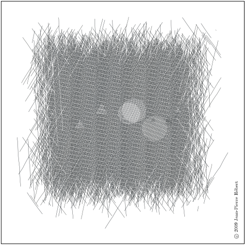

[#chp_input_and_output]
== Chapter 7. Input and Output

All input and output operations are performed through _ports_. A port is a pointer into a (possibly infinite) stream of data (often a file), an opening through which programs may draw bytes or characters from the stream or place bytes or characters into the stream. A port may be an input port, an output port, or both simultaneously.

Ports are first-class objects, like any other object in Scheme. Like procedures, ports do not have a printed representation the way strings and numbers do. There are initially three ports: the current input port, current output port, and current error port, which are textual ports connected to the process's standard input, standard output, and standard error streams. Several ways to open new ports are provided.

An input port often points to a finite stream, e.g., an input file stored on disk. If one of the input operations, e.g., `get-u8`, `get-char`, or `get-datum`, is asked to read from a port that has reached the end of a finite stream, it returns a special _eof_ (end of file) _object_. The predicate `eof-object?` may be used to determine if the value returned from the input operation is the eof object.

Ports are either _binary_ or _textual_. A binary port allows a program to read or write 8-bit unsigned bytes, or "octets," from or to the underlying stream. A textual port allows a program to read or write characters.

In many cases, the underlying stream is organized as a sequence of bytes, but these bytes should be treated as encodings for characters. In this case, a textual port may be created with a _transcoder_ to decode bytes to characters (for input) or encode characters to bytes (for output). A transcoder encapsulates a _codec_ that determines how characters are represented as bytes. Three standard codecs are provided: a _latin-1_ codec, a Unicode _utf-8_ codec, and a Unicode _utf-16_ codec. For the _latin-1_ encoding, each character is represented by exactly one byte. For _utf-8_, each character is represented by from one to four bytes, and for _utf-16_, each character is represented by two or four bytes.

A transcoder also encapsulates an _eol style_ that determines whether and how line endings are recognized. If the eol style is `none`, no line endings are recognized. The six other standard eol styles are the following:

`lf`: 	line-feed character
`cr`: 	carriage-return character
`nel`: 	Unicode next-line character
`ls`: 	Unicode line-separator character
`crlf`: 	carriage return followed by line feed, and
`crnel`: 	carriage return followed by next line

The eol style affects input and output operations differently. For input, any eol style except `none` causes each of the line-ending characters or two-character sequences to be converted into a single line-feed character. For output, any eol style except `none` causes line-feed characters to be converted into the specific one- or two-character sequence associated with the eol style. In the input direction, all eol styles except `none` are equivalent, while in the output direction, the eol styles `none` and `lf` are equivalent.

In addition to the codec and eol style, a transcoder encapsulates just one other piece of information: an _error-handling mode_ that determines what happens if a decoding or encoding error occurs, i.e., if a sequence of bytes cannot be converted to a character with the encapsulated codec in the input direction or a character cannot be converted to a sequence of bytes with the encapsulated codec in the output direction. The error-handling mode is `ignore`, `raise`, or `replace`. If the error-handling mode is `ignore`, the offending sequence of bytes or the character is ignored. If the error-handling mode is `raise`, an exception with condition type `i/o-decoding` or `i/o-encoding` is raised; in the input direction, the port is positioned beyond the sequence of bytes. If the error-handling mode is `replace`, a replacement character or character encoding is produced: in the input direction, the replacement character is U+FFFD, while in the output direction, the replacement is either the encoding of U+FFFD for `utf-8` and `utf-16` codecs or the encoding of the question-mark character ( ? ) for the `latin-1` codec.

A port may be buffered for efficiency, to eliminate the overhead of a call into the operating system for each byte or character. Three standard buffer modes are supported: _block_, _line_, and _none_. With block buffering, input is drawn from a stream and output is sent to the stream in chunks of some implementation-dependent size. With line buffering, buffering is performed on a line-by-line basis or on some other implementation-dependent basis. Line buffering is typically distinguished from block buffering only for textual output ports; there are no line divisions in binary ports, and input is likely to be drawn from a stream as it becomes available. With buffer-mode none, no buffering is performed, so output is sent immediately to the stream and input is drawn only as needed.

The remainder of this chapter covers operations on transcoders, file ports, standard ports, string and bytevector ports, custom ports, general port operations, input operations, output operations, convenience I/O, filesystem operations, and conversions between bytevectors and strings.

=== Section 7.1. Transcoders [[section_7.1.]]

As described above, transcoders encapsulate three values: a codec, an eol style, and an error-handling mode. This section describes the procedures that create or operate on transcoders and the values that transcoders encapsulate.

procedure: `(make-transcoder _codec_)`
procedure: `(make-transcoder _codec_ _eol-style_)`
procedure: `(make-transcoder _codec_ _eol-style_ _error-handling-mode_)`
returns: a transcoder encapsulating `_codec_`, `_eol-style_`, and `_error-handling-mode_`
libraries: `(rnrs io ports)`, `(rnrs)`

`_eol-style_` must be a valid eol-style symbol (`lf`, `cr`, `nel`, `ls`, `crlf`, `crnel`, or `none`); it defaults to the native eol-style for the platform. `_error-handling-mode_` must be a valid error-handling-mode symbol (`ignore`, `raise`, or `replace`) and defaults to `replace`.

procedure: `(transcoder-codec _transcoder_)`
returns: the codec encapsulated in `_transcoder_`
procedure: `(transcoder-eol-style _transcoder_)`
returns: the eol-style symbol encapsulated in `_transcoder_`
procedure: `(transcoder-error-handling-mode _transcoder_)`
returns: the error-handling-mode symbol encapsulated in `_transcoder_`
libraries: `(rnrs io ports)`, `(rnrs)`

procedure: `(native-transcoder)`
returns: the native transcoder
libraries: `(rnrs io ports)`, `(rnrs)`

The native transcoder is implementation-dependent and may vary by platform or locale.

procedure: `(latin-1-codec)`
returns: a codec for ISO 8859-1 (Latin 1) character encodings
procedure: `(utf-8-codec)`
returns: a codec for Unicode UTF-8 character encodings
procedure: `(utf-16-codec)`
returns: a codec for Unicode UTF-16 character encodings
libraries: `(rnrs io ports)`, `(rnrs)`

syntax: `(eol-style _symbol_)`
returns: `_symbol_`
libraries: `(rnrs io ports)`, `(rnrs)`

`_symbol_` must be one of the symbols `lf`, `cr`, `nel`, `ls`, `crlf`, `crnel`, or `none`. The expression `(eol-style _symbol_)` is equivalent to the expression `(quote _symbol_)` except the former checks at expansion time that `_symbol_` is one of the eol-style symbols. The `eol-style` syntax provides useful documentation as well.

`(eol-style crlf) &#8658; crlf
(eol-style lfcr) &#8658; _syntax violation_`

procedure: `(native-eol-style)`
returns: the native eol style
libraries: `(rnrs io ports)`, `(rnrs)`

The native eol style is implementation-dependent and may vary by platform or locale.

syntax: `(error-handling-mode _symbol_)`
returns: `_symbol_`
libraries: `(rnrs io ports)`, `(rnrs)`

`_symbol_` must be one of the symbols `ignore`, `raise`, or `replace`. The expression `(error-handling-mode _symbol_)` is equivalent to the expression `(quote _symbol_)` except that the former checks at expansion time that `_symbol_` is one of the error-handling-mode symbols. The `error-handling-mode` syntax provides useful documentation as well.

`(error-handling-mode replace) &#8658; replace
(error-handling-mode relpace) &#8658; _syntax violation_`

=== Section 7.2. Opening Files [[section_7.2.]]

The procedures in this section are used for opening file ports. Procedures for opening other kinds of ports, e.g., string ports or custom ports, are described in subsequent sections.

Each of the file-open operations accepts a `_path_` argument that names the file to be opened. It must be a string or some other implementation-dependent value that names a file.

Some of the file-open procedures accept optional `_options_`, `_b-mode_`, and `_?transcoder_` arguments. `_options_` must be an enumeration set over the symbols constituting valid file options described in the `file-options` entry below, and it defaults to the value of `(file-options)`. `_b-mode_` must be a valid buffer mode described in the `buffer-mode` entry below, and it defaults to `block`. `_?transcoder_` must be a transcoder or `#f`; if it is a transcoder, the open operation returns a transcoded port for the underlying binary file, while if it is `#f` (the default), the open operation returns a binary port.

Binary ports created by the procedures in this section support the `port-position` and `set-port-position!` operations. Whether textual ports created by the procedures in this section support these operations is implementation-dependent.

syntax: `(file-options _symbol_ ...)`
returns: a file-options enumeration set
libraries: `(rnrs io ports)`, `(rnrs)`

File-options enumeration sets may be passed to file-open operations to control aspects of the open operation. There are three standard file options: `no-create`, `no-fail`, and `no-truncate`, which affect only file-open operations that create output (including input/output) ports.

With the default file options, i.e., the value of `(file-options)`, when a program attempts to open a file for output, an exception is raised with condition type `i/o-file-already-exists` if the file already exists, and the file is created if it does not already exist. If the `no-fail` option is included, no exception is raised if the file already exists; instead, the file is opened and truncated to zero length. If the `no-create` option is included, the file is not created if it does not exist; instead, an exception is raised with condition type `i/o-file-does-not-exist`. The `no-create` option implies the `no-fail` option. The `no-truncate` option is relevant only if the `no-fail` option is included or implied, in which case if an existing file is opened, it is not truncated, but the port's position is still set to the beginning of the file.

It is perhaps easier to imagine that the default file options are the imaginary option symbols `create`, `fail-if-exists`, and `truncate`; `no-create` removes `create`, `no-fail` removes `fail-if-exists`, and `no-truncate` removes `truncate`.

Implementations may support additional file option symbols. Chez Scheme, for example, supports options that control whether the file is or should be compressed, whether it is locked for exclusive access, and what permissions are given to the file if it is created [9].

syntax: `(buffer-mode _symbol_)`
returns: `_symbol_`
libraries: `(rnrs io ports)`, `(rnrs)`

`_symbol_` must be one of the symbols `block`, `line`, or `none`. The expression `(buffer-mode _symbol_)` is equivalent to the expression `(quote _symbol_)` except that the former checks at expansion time that `_symbol_` is one of the buffer-mode symbols. The `buffer-mode` syntax provides useful documentation as well.

`(buffer-mode block) &#8658; block
(buffer-mode cushion) &#8658; _syntax violation_`

syntax: `(buffer-mode? _obj_)`
returns: `#t` if `_obj_` is a valid buffer mode, `#f` otherwise
libraries: `(rnrs io ports)`, `(rnrs)`

`(buffer-mode? 'block) &#8658; #t
(buffer-mode? 'line) &#8658; #t
(buffer-mode? 'none) &#8658; #t
(buffer-mode? 'something-else) &#8658; #f`

procedure: `(open-file-input-port _path_)`
procedure: `(open-file-input-port _path_ _options_)`
procedure: `(open-file-input-port _path_ _options_ _b-mode_)`
procedure: `(open-file-input-port _path_ _options_ _b-mode_ _?transcoder_)`
returns: a new input port for the named file
libraries: `(rnrs io ports)`, `(rnrs)`

If `_?transcoder_` is present and not `#f`, it must be a transcoder, and this procedure returns a textual input port whose transcoder is `_?transcoder_`. Otherwise, this procedure returns a binary input port. See the lead-in to this section for a description of the constraints on and effects of the other arguments.

procedure: `(open-file-output-port _path_)`
procedure: `(open-file-output-port _path_ _options_)`
procedure: `(open-file-output-port _path_ _options_ _b-mode_)`
procedure: `(open-file-output-port _path_ _options_ _b-mode_ _?transcoder_)`
returns: a new output port for the named file
libraries: `(rnrs io ports)`, `(rnrs)`

If `_?transcoder_` is present and not `#f`, it must be a transcoder, and this procedure returns a textual output port whose transcoder is `_?transcoder_`. Otherwise, this procedure returns a binary output port. See the lead-in to this section for a description of the constraints on and effects of the other arguments.

procedure: `(open-file-input/output-port _path_)`
procedure: `(open-file-input/output-port _path_ _options_)`
procedure: `(open-file-input/output-port _path_ _options_ _b-mode_)`
procedure: `(open-file-input/output-port _path_ _options_ _b-mode_ _?transcoder_)`
returns: a new input/output port for the named file
libraries: `(rnrs io ports)`, `(rnrs)`

If `_?transcoder_` is present and not `#f`, it must be a transcoder, and this procedure returns a textual input/output port whose transcoder is `_?transcoder_`. Otherwise, this procedure returns a binary input/output port. See the lead-in to this section for a description of the constraints on and effects of the other arguments.

=== Section 7.3. Standard Ports [[section_7.3.]]

The procedures described in this section return ports that are attached to a process's standard input, standard output, and standard error streams. The first set returns "ready-made" textual ports with implementation-dependent transcoders (if any) and buffer modes. The second set creates fresh binary ports and can be used either for binary input/output or, with the help of `transcoded-port`, for textual input/output with program-supplied transcoders and buffer modes.

procedure: `(current-input-port)`
returns: the current input port
procedure: `(current-output-port)`
returns: the current output port
procedure: `(current-error-port)`
returns: the current error port
libraries: `(rnrs io ports)`, `(rnrs io simple)`, `(rnrs)`

The current-input, current-output, and current-error ports return pre-built textual ports that are initially associated with a process's standard input, standard output, and standard error streams.

The values returned by `current-input-port` and `current-output-port` can be altered temporarily by the convenience I/O procedures `with-input-from-file` and `with-output-to-file` (Section 7.9).

procedure: `(standard-input-port)`
returns: a fresh binary input port connected to the standard input stream
procedure: `(standard-output-port)`
returns: a fresh binary output port connected to the standard output stream
procedure: `(standard-error-port)`
returns: a fresh binary output port connected to the standard error stream
libraries: `(rnrs io ports)`, `(rnrs)`

Because ports may be buffered, confusion can result if operations on more than one port attached to one of a process's standard streams are interleaved. Thus, these procedures are typically appropriate only when a program no longer needs to use any existing ports attached to the standard streams.

=== Section 7.4. String and Bytevector Ports [[section_7.4.]]

The procedures in this section allow bytevectors and strings to be used as input or output streams.

Binary ports created by the procedures in this section support the `port-position` and `set-port-position!` operations. Whether textual ports created by the procedures in this section support these operations is implementation-dependent.

procedure: `(open-bytevector-input-port _bytevector_)`
procedure: `(open-bytevector-input-port _bytevector_ _?transcoder_)`
returns: a new input port that draws input from `_bytevector_`
libraries: `(rnrs io ports)`, `(rnrs)`

If `_?transcoder_` is present and not `#f`, it must be a transcoder, and this procedure returns a textual input port whose transcoder is `_?transcoder_`. Otherwise, this procedure returns a binary input port.

The effect of modifying `_bytevector_` after this procedure is called is unspecified.

`(let ([ip (open-bytevector-input-port #vu8(1 2))])
  (let* ([x1 (get-u8 ip)] [x2 (get-u8 ip)] [x3 (get-u8 ip)])
    (list x1 x2 (eof-object? x3)))) &#8658; (1 2 #t)`

There is no need to close a bytevector port; it's storage will be reclaimed automatically when it is no longer needed, as with any other object, and an open bytevector port does not tie up any operating system resources.

procedure: `(open-string-input-port _string_)`
returns: a new textual input port that draws input from `_string_`
libraries: `(rnrs io ports)`, `(rnrs)`

The effect of modifying `_string_` after this procedure is called is unspecified. The new port may or may not have a transcoder, and if it does, the transcoder is implementation-dependent. While not required, implementations are encouraged to support `port-position` and `set-port-position!` for string ports.

`(get-line (open-string-input-port "hi.\nwhat's up?\n")) &#8658; "hi."`

There is no need to close a string port; it's storage will be reclaimed automatically when it is no longer needed, as with any other object, and an open string port does not tie up any operating system resources.

procedure: `(open-bytevector-output-port)`
procedure: `(open-bytevector-output-port _?transcoder_)`
returns: two values, a new output port and an extraction procedure
libraries: `(rnrs io ports)`, `(rnrs)`

If `_?transcoder_` is present and not `#f`, it must be a transcoder, and the port value is a textual output port whose transcoder is `_?transcoder_`. Otherwise, the port value is a binary output port.

The extraction procedure is a procedure that, when called without arguments, creates a bytevector containing the accumulated bytes in the port, clears the port of its accumulated bytes, resets its position to zero, and returns the bytevector. The accumulated bytes include any bytes written beyond the end of the current position, if the position has been set back from its maximum extent.

`(let-values ([(op g) (open-bytevector-output-port)])
  (put-u8 op 15)
  (put-u8 op 73)
  (put-u8 op 115)
  (set-port-position! op 2)
  (let ([bv1 (g)])
    (put-u8 op 27)
    (list bv1 (g)))) &#8658; (#vu8(15 73 115) #vu8(27))`

There is no need to close a bytevector port; it's storage will be reclaimed automatically when it is no longer needed, as with any other object, and an open bytevector port does not tie up any operating system resources.

procedure: `(open-string-output-port)`
returns: two values, a new textual output port and an extraction procedure
libraries: `(rnrs io ports)`, `(rnrs)`

The extraction procedure is a procedure that, when called without arguments, creates a string containing the accumulated characters in the port, clears the port of its accumulated characters, resets its position to zero, and returns the string. The accumulated characters include any characters written beyond the end of the current position, if the position has been set back from its maximum extent. While not required, implementations are encouraged to support `port-position` and `set-port-position!` for string ports.

`(let-values ([(op g) (open-string-output-port)])
  (put-string op "some data")
  (let ([str1 (g)])
    (put-string op "new stuff")
    (list str1 (g)))) &#8658; ("some data" "new stuff")`

There is no need to close a string port; it's storage will be reclaimed automatically when it is no longer needed, as with any other object, and an open string port does not tie up any operating system resources.

procedure: `(call-with-bytevector-output-port _procedure_)`
procedure: `(call-with-bytevector-output-port _procedure_ _?transcoder_)`
returns: a bytevector containing the accumulated bytes
libraries: `(rnrs io ports)`, `(rnrs)`

If `_?transcoder_` is present and not `#f`, it must be a transcoder, and `_procedure_` is called with a textual bytevector output port whose transcoder is `_?transcoder_`. Otherwise, `_procedure_` is called with a binary bytevector output port. If `_procedure_` returns, a bytevector containing the bytes accumulated in the port is created, the accumulated bytes are cleared from the port, the port's position is reset to zero, and the bytevector is returned from `call-with-bytevector-output-port`. These actions occur each time `_procedure_` returns, if it returns multiple times due to the invocation of a continuation created while `_procedure_` is active.

`(let ([tx (make-transcoder (latin-1-codec) (eol-style lf)
            (error-handling-mode replace))])
  (call-with-bytevector-output-port
    (lambda (p) (put-string p "abc"))
    tx)) &#8658; #vu8(97 98 99)`

procedure: `(call-with-string-output-port _procedure_)`
returns: a string containing the accumulated characters
libraries: `(rnrs io ports)`, `(rnrs)`

`_procedure_` is called with one argument, a string output port. If `_procedure_` returns, a string containing the characters accumulated in the port is created, the accumulated characters are cleared from the port, the port's position is reset to zero, and the string is returned from `call-with-string-output-port`. These actions occur each time `_procedure_` returns, if it returns multiple times due to the invocation of a continuation created while `_procedure_` is active.

`call-with-string-output-port` can be used along with `put-datum` to define a procedure, `object->string`, that returns a string containing the printed representation of an object.

`(define (object->string x)
  (call-with-string-output-port
    (lambda (p) (put-datum p x))))

(object->string (cons 'a '(b c))) &#8658; "(a b c)"`

=== Section 7.5. Opening Custom Ports [[section_7.5.]]

procedure: `(make-custom-binary-input-port _id_ _r!_ _gp_ _sp!_ _close_)`
returns: a new custom binary input port
procedure: `(make-custom-binary-output-port _id_ _w!_ _gp_ _sp!_ _close_)`
returns: a new custom binary output port
procedure: `(make-custom-binary-input/output-port _id_ _r!_ _w!_ _gp_ _sp!_ _close_)`
returns: a new custom binary input/output port
libraries: `(rnrs io ports)`, `(rnrs)`

These procedures allow programs to create ports from arbitrary byte streams. `_id_` must be a string naming the new port; the name is used for informational purposes only, and an implementation may choose to include it in the printed syntax, if any, of a custom port. `_r!_` and `_w!_` must be procedures, while `_gp_`, `_sp!_`, and `_close_` must each be a procedure or `#f`. These arguments are described below.

`_r!_`
    is called to draw input from the custom port, e.g., to support `get-u8` or `get-bytevector-n`. It is called with three arguments: `_bytevector_`, `_start_`, and `_n_`. `_start_` will be a nonnegative exact integer, `_n_` will be a positive exact integer, and the sum of `_start_` and `_n_` will not exceed the length of `_bytevector_`. If the byte stream is at end of file, `_r!_` should return exact 0. Otherwise, it should read at least one and at most `_n_` bytes from the stream, store these bytes in consecutive locations of `_bytevector_` starting at `_start_`, and return as an exact positive integer the number of bytes actually read.

`_w!_`
    is called to send output to the port, e.g., to support `put-u8` or `put-bytevector`. It is called with three arguments: `_bytevector_`, `_start_`, and `_n_`. `_start_` and `_n_` will be nonnegative exact integers, and the sum of `_start_` and `_n_` will not exceed the length of `_bytevector_`. `_w!_` should write up to `_n_` consecutive bytes from `_bytevector_` starting at `_start_` and return, as an exact nonnegative integer, the number of bytes actually written.

`_gp_`
    is called to query the port's position. If it is `#f`, the port will not support `port-position`. If it is not `#f`, it will be passed zero arguments and should return the current position as a displacement in bytes from the start of the byte stream as an exact nonnegative integer.

`_sp!_`
    is called to set the port's position. If it is `#f`, the port will not support `set-port-position!`. If it is not `#f`, it will be passed one argument, an exact nonnegative integer representing the new position as a displacement in bytes from the start of the byte stream, and it should set the position to this value.

`_close_`
    is called to close the byte stream. If it is `#f`, no action will be taken to close the byte stream when the new port is closed. If it is not `#f`, it will be passed zero arguments and should take whatever actions are necessary to close the byte stream.

If the new port is an input/output port and does not provide either a `_gp_` or `_sp!_` procedure, it may not be possible for the implementation to position the port properly if an output operation occurs after an input operation, due to input buffering that must be done to support `lookahead-u8` and is often done anyway for efficiency. For the same reason, a call to `port-position` after an input operation may not return an accurate position if the `_sp!_` procedure is not provided. Thus, programs that create custom binary input/output ports should generally provide both `_gp_` and `_sp!_` procedures.

procedure: `(make-custom-textual-input-port _id_ _r!_ _gp_ _sp!_ _close_)`
returns: a new custom textual input port
procedure: `(make-custom-textual-output-port _id_ _w!_ _gp_ _sp!_ _close_)`
returns: a new custom textual output port
procedure: `(make-custom-textual-input/output-port _id_ _r!_ _w!_ _gp_ _sp!_ _close_)`
returns: a new custom textual input/output port
libraries: `(rnrs io ports)`, `(rnrs)`

These procedures allow programs to create ports from arbitrary character streams. `_id_` must be a string naming the new port; the name is used for informational purposes only, and an implementation may choose to include it in the printed syntax, if any, of a custom port. `_r!_` and `_w!_` must be procedures, while `_gp_`, `_sp!_`, and `_close_` must each be a procedure or `#f`. These arguments are described below.

`_r!_`
    is called to draw input from the port, e.g., to support `get-char` or `get-string-n`. It is called with three arguments: `_string_`, `_start_`, and `_n_`. `_start_` will be a nonnegative exact integer, `_n_` will be a positive exact integer, and the sum of `_start_` and `_n_` will not exceed the length of `_string_`. If the character stream is at end of file, `_r!_` should return exact 0. Otherwise, it should read at least one and at most `_n_` characters from the stream, store these characters in consecutive locations of `_string_` starting at `_start_`, and return as an exact positive integer the number of characters actually read.

`_w!_`
    is called to send output to the port, e.g., to support `put-char` or `put-string`. It is called with three arguments: `_string_`, `_start_`, and `_n_`. `_start_` and `_n_` will be nonnegative exact integers, and the sum of `_start_` and `_n_` will not exceed the length of `_string_`. `_w!_` should write up to `_n_` consecutive characters from `_string_` starting at `_start_` and return, as an exact nonnegative integer, the number of characters actually written.

`_gp_`
    is called to query the port's position. If it is `#f`, the port will not support `port-position`. If it is not `#f`, it will be passed zero arguments and should return the current position, which may be an arbitrary value.

`_sp!_`
    is called to set the port's position. If it is `#f`, the port will not support `set-port-position!`. If it is not `#f`, it will be passed one argument, `_pos_`, a value representing the new position. If `_pos_` is the result of a previous call to `_gp_`, `_sp!_` should set the position to `_pos_`.

`_close_`
    is called to close the character stream. If it is `#f`, no action will be taken to close the character stream when the new port is closed. If it is not `#f`, it will be passed zero arguments and should take whatever actions are necessary to close the character stream.

If the new port is an input/output port, it may not be possible for the implementation to position the port properly if an output operation occurs after an input operation, even if the `_gp_` and `_sp!_` procedures are provided, due to input buffering that must be done to support `lookahead-char` and is often done anyway for efficiency. Since the representations of port positions are not specified, it is not possible for the implementation to adjust the `_gp_` return value to account for the number of buffered characters. For the same reason, a call to `port-position` after an input operation may not return an accurate position, even if the `_sp!_` procedure is provided.

It should, however, be possible to perform output reliably after reading if the position is reset to the starting position. Thus, programs that create custom textual input/output ports should generally provide both `_gp_` and `_sp!_` procedures, and consumers of these ports should obtain the starting position via `port-position` before any input operations and reset the position back to the starting position before doing any output operations.

=== Section 7.6. Port Operations [[section_7.6.]]

This section describes a variety of operations on ports that do not directly involve either reading from or writing to a port. The input and output operations are described in subsequent sections.

procedure: `(port? _obj_)`
returns: `#t` if `_obj_` is a port, `#f` otherwise
libraries: `(rnrs io ports)`, `(rnrs)`

procedure: `(input-port? _obj_)`
returns: `#t` if `_obj_` is an input or input/output port, `#f` otherwise
procedure: `(output-port? _obj_)`
returns: `#t` if `_obj_` is an output or input/output port, `#f` otherwise
libraries: `(rnrs io ports)`, `(rnrs io simple)`, `(rnrs)`

procedure: `(binary-port? _obj_)`
returns: `#t` if `_obj_` is a binary port, `#f` otherwise
procedure: `(textual-port? _obj_)`
returns: `#t` if `_obj_` is a textual port, `#f` otherwise
libraries: `(rnrs io ports)`, `(rnrs)`

procedure: `(close-port _port_)`
returns: unspecified
libraries: `(rnrs io ports)`, `(rnrs)`

If `_port_` is not already closed, `close-port` closes it, first flushing any buffered bytes or characters to the underlying stream if the port is an output port. Once a port has been closed, no more input or output operations may be performed on the port. Because the operating system may place limits on the number of file ports open at one time or restrict access to an open file, it is good practice to close any file port that will no longer be used for input or output. If the port is an output port, closing the port explicitly also ensures that buffered data is written to the underlying stream. Some Scheme implementations close file ports automatically after they become inaccessible to the program or when the Scheme program exits, but it is best to close file ports explicitly whenever possible. Closing a port that has already been closed has no effect.

procedure: `(transcoded-port _binary-port_ _transcoder_)`
returns: a new textual port with the same byte stream as `_binary-port_`
libraries: `(rnrs io ports)`, `(rnrs)`

This procedure returns a new textual port with transcoder `_transcoder_` and the same underlying byte stream as `_binary-port_`, positioned at the current position of `_binary-port_`.

As a side effect of creating the textual port, `_binary-port_` is closed to prevent read or write operations on `_binary-port_` from interfering with read and write operations on the new textual port. The underlying byte stream remains open, however, until the textual port is closed.

procedure: `(port-transcoder _port_)`
returns: the transcoder associated with `_port_` if any, `#f` otherwise
libraries: `(rnrs io ports)`, `(rnrs)`

This procedure always returns `#f` for binary ports and may return `#f` for some textual ports.

procedure: `(port-position _port_)`
returns: the port's current position
procedure: `(port-has-port-position? _port_)`
returns: `#t` if the port supports `port-position`, `#f` otherwise
libraries: `(rnrs io ports)`, `(rnrs)`

A port may allow queries to determine its current position in the underlying stream of bytes or characters. If so, the procedure `port-has-port-position?` returns `#t` and `port-position` returns the current position. For binary ports, the position is always an exact nonnegative integer byte displacement from the start of the byte stream. For textual ports, the representation of a position is unspecified; it may not be an exact nonnegative integer and, even if it is, it may not represent either a byte or character displacement in the underlying stream. The position may be used at some later time to reset the position if the port supports `set-port-position!`. If `port-position` is called on a port that does not support it, an exception with condition type `&assertion` is raised.

procedure: `(set-port-position! _port_ _pos_)`
returns: unspecified
procedure: `(port-has-set-port-position!? _port_)`
returns: `#t` if the port supports `set-port-position!`, `#f` otherwise
libraries: `(rnrs io ports)`, `(rnrs)`

A port may allow its current position to be moved directly to a different position in the underlying stream of bytes or characters. If so, the procedure `port-has-set-port-position!?` returns `#t` and `set-port-position!` changes the current position. For binary ports, the position `_pos_` must be an exact nonnegative integer byte displacement from the start of the byte stream. For textual ports, the representation of a position is unspecified, as described in the entry for `port-position` above, but `_pos_` must be an appropriate position for the textual port, which is usually guaranteed to be the case only if it was obtained from a call to `port-position` on the same port. If `set-port-position!` is called on a port that does not support it, an exception with condition type `&assertion` is raised.

If `_port_` is a binary output port and the position is set beyond the current end of the data in the underlying stream, the stream is not extended until new data is written at that position. If new data is written at that position, the contents of each intervening position is unspecified. Binary ports created with `open-file-output-port` and `open-file-input/output-port` can always be extended in this manner within the limits of the underlying operating system. In other cases, attempts to set the port beyond the current end of data in the underlying object may result in an exception with condition type `&i/o-invalid-position`.

procedure: `(call-with-port _port_ _procedure_)`
returns: the values returned by `_procedure_`
libraries: `(rnrs io ports)`, `(rnrs)`

`call-with-port` calls `_procedure_` with `_port_` as the only argument. If `_procedure_` returns, `call-with-port` closes the port and returns the values returned by `_procedure_`.

`call-with-port` does not automatically close the port if a continuation created outside of `_procedure_` is invoked, since it is possible that another continuation created inside of `_procedure_` will be invoked at a later time, returning control to `_procedure_`. If `_procedure_` does not return, an implementation is free to close the port only if it can prove that the output port is no longer accessible.

The example below copies the contents of infile to outfile, overwriting outfile if it exists. Unless an error occurs, the ports are closed after the copy has been completed.

`(call-with-port (open-file-input-port "infile" (file-options)
                  (buffer-mode block) (native-transcoder))
  (lambda (ip)
    (call-with-port (open-file-output-port "outfile"
                      (file-options no-fail)
                      (buffer-mode block)
                      (native-transcoder))
      (lambda (op)
        (do ([c (get-char ip) (get-char ip)])
            ((eof-object? c))
          (put-char op c))))))`

A definition of `call-with-port` is given on page 135.

procedure: `(output-port-buffer-mode _port_)`
returns: the symbol representing the buffer mode of `_port_`
libraries: `(rnrs io ports)`, `(rnrs)`

=== Section 7.7. Input Operations [[section_7.7.]]

Procedures whose primary purpose is to read data from an input port are described in this section, along with related procedures for recognizing or creating end-of-file (eof) objects.

procedure: `(eof-object? _obj_)`
returns: `#t` if `_obj_` is an eof object, `#f` otherwise
libraries: `(rnrs io ports)`, `(rnrs io simple)`, `(rnrs)`

The end-of-file object is returned by input operations, e.g., `get-datum`, when an input port has reached the end of input.

procedure: `(eof-object)`
returns: the eof object
libraries: `(rnrs io ports)`, `(rnrs io simple)`, `(rnrs)`

`(eof-object? (eof-object)) &#8658; #t`

procedure: `(get-u8 _binary-input-port_)`
returns: the next byte from `_binary-input-port_`, or the eof object
libraries: `(rnrs io ports)`, `(rnrs)`

If `_binary-input-port_` is at end of file, the eof object is returned. Otherwise, the next available byte is returned as an unsigned 8-bit quantity, i.e., an exact unsigned integer less than or equal to 255, and the port's position is advanced one byte.

procedure: `(lookahead-u8 _binary-input-port_)`
returns: the next byte from `_binary-input-port_`, or the eof object
libraries: `(rnrs io ports)`, `(rnrs)`

If `_binary-input-port_` is at end of file, the eof object is returned. Otherwise, the next available byte is returned as an unsigned 8-bit quantity, i.e., an exact unsigned integer less than or equal to 255. In contrast to `get-u8`, `lookahead-u8` does not consume the byte it reads from the port, so if the next operation on the port is a call to `lookahead-u8` or `get-u8`, the same byte is returned.

procedure: `(get-bytevector-n _binary-input-port_ _n_)`
returns: a nonempty bytevector containing up to `_n_` bytes, or the eof object
libraries: `(rnrs io ports)`, `(rnrs)`

`_n_` must be an exact nonnegative integer. If `_binary-input-port_` is at end of file, the eof object is returned. Otherwise, `get-bytevector-n` reads (as if with `get-u8`) as many bytes, up to `_n_`, as are available before the port is at end of file, and returns a new (nonempty) bytevector containing these bytes. The port's position is advanced past the bytes read.

procedure: `(get-bytevector-n! _binary-input-port_ _bytevector_ _start_ _n_)`
returns: the count of bytes read or the eof object
libraries: `(rnrs io ports)`, `(rnrs)`

`_start_` and `_n_` must be exact nonnegative integers, and the sum of `_start_` and `_n_` must not exceed the length of `_bytevector_`.

If `_binary-input-port_` is at end of file, the eof object is returned. Otherwise, `get-bytevector-n!` reads (as if with `get-u8`) as many bytes, up to `_n_`, as are available before the port is at end of file, stores the bytes in consecutive locations of `_bytevector_` starting at `_start_`, and returns the count of bytes read as an exact positive integer. The port's position is advanced past the bytes read.

procedure: `(get-bytevector-some _binary-input-port_)`
returns: a nonempty bytevector or the eof object
libraries: `(rnrs io ports)`, `(rnrs)`

If `_binary-input-port_` is at end of file, the eof object is returned. Otherwise, `get-bytevector-some` reads (as if with `get-u8`) at least one byte and possibly more, and returns a bytevector containing these bytes. The port's position is advanced past the bytes read. The maximum number of bytes read by this operation is implementation-dependent.

procedure: `(get-bytevector-all _binary-input-port_)`
returns: a nonempty bytevector or the eof object
libraries: `(rnrs io ports)`, `(rnrs)`

If `_binary-input-port_` is at end of file, the eof object is returned. Otherwise, `get-bytevector-all` reads (as if with `get-u8`) all of the bytes available before the port is at end of file and returns a bytevector containing these bytes. The port's position is advanced past the bytes read.

procedure: `(get-char _textual-input-port_)`
returns: the next character from `_textual-input-port_`, or the eof object
libraries: `(rnrs io ports)`, `(rnrs)`

If `_textual-input-port_` is at end of file, the eof object is returned. Otherwise, the next available character is returned and the port's position is advanced one character. If `_textual-input-port_` is a transcoded port, the position in the underlying byte stream may advance by more than one byte.

procedure: `(lookahead-char _textual-input-port_)`
returns: the next character from `_textual-input-port_`, or the eof object
libraries: `(rnrs io ports)`, `(rnrs)`

If `_textual-input-port_` is at end of file, the eof object is returned. Otherwise, the next available character is returned. In contrast to `get-char`, `lookahead-char` does not consume the character it reads from the port, so if the next operation on the port is a call to `lookahead-char` or `get-char`, the same character is returned.

`lookahead-char` is provided for applications requiring one character of lookahead. The procedure `get-word` defined below returns the next word from a textual input port as a string, where a word is defined to be a sequence of alphabetic characters. Since `get-word` does not know until it sees one character beyond the word that it has read the entire word, it uses `lookahead-char` to determine the next character and `get-char` to consume the character.

`(define get-word
  (lambda (p)
    (list->string
      (let f ()
        (let ([c (lookahead-char p)])
          (cond
            [(eof-object? c) '()]
            [(char-alphabetic? c) (get-char p) (cons c (f))]
            [else '()]))))))`

procedure: `(get-string-n _textual-input-port_ _n_)`
returns: a nonempty string containing up to `_n_` characters, or the eof object
libraries: `(rnrs io ports)`, `(rnrs)`

`_n_` must be an exact nonnegative integer. If `_textual-input-port_` is at end of file, the eof object is returned. Otherwise, `get-string-n` reads (as if with `get-char`) as many characters, up to `_n_`, as are available before the port is at end of file, and returns a new (nonempty) string containing these characters. The port's position is advanced past the characters read.

procedure: `(get-string-n! _textual-input-port_ _string_ _start_ _n_)`
returns: the count of characters read or the eof object
libraries: `(rnrs io ports)`, `(rnrs)`

`_start_` and `_n_` must be exact nonnegative integers, and the sum of `_start_` and `_n_` must not exceed the length of `_string_`.

If `_textual-input-port_` is at end of file, the eof object is returned. Otherwise, `get-string-n!` reads (as if with `get-char`) as many characters, up to `_n_`, as are available before the port is at end of file, stores the characters in consecutive locations of `_string_` starting at `_start_`, and returns the count of characters read as an exact positive integer. The port's position is advanced past the characters read.

`get-string-n!` may be used to implement `string-set!` and `string-fill!`, as illustrated below, although this is not its primary purpose.

`(define string-set!
  (lambda (s i c)
    (let ([sip (open-string-input-port (string c))])
      (get-string-n! sip s i 1)
     ; return unspecified values:
      (if #f #f))))

(define string-fill!
  (lambda (s c)
    (let ([n (string-length s)])
      (let ([sip (open-string-input-port (make-string n c))])
        (get-string-n! sip s 0 n)
       ; return unspecified values:
        (if #f #f)))))

(let ([x (make-string 3)])
  (string-fill! x #\-)
  (string-set! x 2 #\))
  (string-set! x 0 #\;)
  x) &#8658; ";-)"`

procedure: `(get-string-all _textual-input-port_)`
returns: a nonempty string or the eof object
libraries: `(rnrs io ports)`, `(rnrs)`

If `_textual-input-port_` is at end of file, the eof object is returned. Otherwise, `get-string-all` reads (as if with `get-char`) all of the characters available before the port is at end of file and returns a string containing these characters. The port's position is advanced past the characters read.

procedure: `(get-line _textual-input-port_)`
returns: a string or the eof object
libraries: `(rnrs io ports)`, `(rnrs)`

If `_textual-input-port_` is at end of file, the eof object is returned. Otherwise, `get-line` reads (as if with `get-char`) all of the characters available before the port is at end of file or a line-feed character has been read and returns a string containing all but the line-feed character of the characters read. The port's position is advanced past the characters read.

`(let ([sip (open-string-input-port "one\ntwo\n")])
  (let* ([s1 (get-line sip)] [s2 (get-line sip)])
    (list s1 s2 (port-eof? sip)))) &#8658; ("one" "two" #t)

(let ([sip (open-string-input-port "one\ntwo")])
  (let* ([s1 (get-line sip)] [s2 (get-line sip)])
    (list s1 s2 (port-eof? sip)))) &#8658; ("one" "two" #t)`

procedure: `(get-datum _textual-input-port_)`
returns: a Scheme datum object or the eof object
libraries: `(rnrs io ports)`, `(rnrs)`

This procedure scans past whitespace and comments to find the start of the external representation of a datum. If `_textual-input-port_` reaches end of file before the start of the external representation of a datum is found, the eof object is returned.

Otherwise, `get-datum` reads as many characters as necessary, and no more, to parse a single datum, and returns a newly allocated object whose structure is determined by the external representation. The port's position is advanced past the characters read. If an end-of-file is reached before the external representation of the datum is complete, or an unexpected character is read, an exception is raised with condition types `&lexical` and `i/o-read`.

`(let ([sip (open-string-input-port "; a\n\n one (two)\n")])
  (let* ([x1 (get-datum sip)]
         [c1 (lookahead-char sip)]
         [x2 (get-datum sip)])
    (list x1 c1 x2 (port-eof? sip)))) &#8658; (one #\space (two) #f)`

procedure: `(port-eof? _input-port_)`
returns: `#t` if `_input-port_` is at end-of-file, `#f` otherwise
libraries: `(rnrs io ports)`, `(rnrs)`

This procedure is similar to `lookahead-u8` on a binary input port or `lookahead-char` on a textual input port, except that instead of returning the next byte/character or eof object, it returns a boolean value to indicate whether the value would be the eof object.

=== Section 7.8. Output Operations [[section_7.8.]]

Procedures whose primary purpose is to send data to an output port are described in this section.

procedure: `(put-u8 _binary-output-port_ _octet_)`
returns: unspecified
libraries: `(rnrs io ports)`, `(rnrs)`

`_octet_` must be an exact nonnegative integer less than or equal to 255. This procedure writes `_octet_` to `_binary-output-port_`, advancing the port's position by one byte.

procedure: `(put-bytevector _binary-output-port_ _bytevector_)`
procedure: `(put-bytevector _binary-output-port_ _bytevector_ _start_)`
procedure: `(put-bytevector _binary-output-port_ _bytevector_ _start_ _n_)`
returns: unspecified
libraries: `(rnrs io ports)`, `(rnrs)`

`_start_` and `_n_` must be nonnegative exact integers, and the sum of `_start_` and `_n_` must not exceed the length of `_bytevector_`. If not supplied, `_start_` defaults to zero and `_n_` defaults to the difference between the length of `_bytevector_` and `_start_`.

This procedure writes the `_n_` bytes of `_bytevector_` starting at `_start_` to the port and advances the its position past the end of the bytes written.

procedure: `(put-char _textual-output-port_ _char_)`
returns: unspecified
libraries: `(rnrs io ports)`, `(rnrs)`

This procedure writes `_char_` to `_textual-output-port_`, advancing the port's position by one character. If `_textual-output-port_` is a transcoded port, the position in the underlying byte stream may advance by more than one byte.

procedure: `(put-string _textual-output-port_ _string_)`
procedure: `(put-string _textual-output-port_ _string_ _start_)`
procedure: `(put-string _textual-output-port_ _string_ _start_ _n_)`
returns: unspecified
libraries: `(rnrs io ports)`, `(rnrs)`

`_start_` and `_n_` must be nonnegative exact integers, and the sum of `_start_` and `_n_` must not exceed the length of `_string_`. If not supplied, `_start_` defaults to zero and `_n_` defaults to the difference between the length of `_string_` and `_start_`.

This procedure writes the `_n_` characters of `_string_` starting at `_start_` to the port and advances the its position past the end of the characters written.

procedure: `(put-datum _textual-output-port_ _obj_)`
returns: unspecified
libraries: `(rnrs io ports)`, `(rnrs)`

This procedure writes an external representation of `_obj_` to `_textual-output-port_`. If `_obj_` does not have an external representation as a datum, the behavior is unspecified. The precise external representation is implementation-dependent, but when `_obj_` does have an external representation as a datum, `put-datum` should produce a sequence of characters that can later be read by `get-datum` as an object equivalent (in the sense of `equal?`) to `_obj_`. See Section 12.5 for an implementation of `put-datum`, `write`, and `display`.

procedure: `(flush-output-port _output-port_)`
returns: unspecified
libraries: `(rnrs io ports)`, `(rnrs)`

This procedure forces any bytes or characters in the buffer associated with `_output-port_` to be sent immediately to the underlying stream.

=== Section 7.9. Convenience I/O [[section_7.9.]]

The procedures in this section are referred to as "convenience" I/O operators because they present a somewhat simplified interface for creating and interacting with textual ports. They also provide backward compatibility with the Revised5 Report, which did not support separate binary and textual I/O.

The convenience input/output procedures may be called with or without an explicit port argument. If called without an explicit port argument, the current input or output port is used, as appropriate. For example, `(read-char)` and `(read-char (current-input-port))` both return the next character from the current input port.

procedure: `(open-input-file _path_)`
returns: a new input port
libraries: `(rnrs io simple)`, `(rnrs)`

`_path_` must be a string or some other implementation-dependent value that names a file. `open-input-file` creates a new textual input port for the file named by `_path_`, as if by `open-file-input-port` with default options, an implementation-dependent buffer mode, and an implementation-dependent transcoder.

The following shows the use of `open-input-file`, `read`, and `close-port` in an expression that gathers a list of objects from the file named by "myfile.ss."

`(let ([p (open-input-file "myfile.ss")])
  (let f ([x (read p)])
    (if (eof-object? x)
        (begin
          (close-port p)
          '())
        (cons x (f (read p))))))`

procedure: `(open-output-file _path_)`
returns: a new output port
libraries: `(rnrs io simple)`, `(rnrs)`

`_path_` must be a string or some other implementation-dependent value that names a file. `open-output-file` creates a new output port for the file named by `_path_`, as if by `open-file-output-port` with default options, an implementation-dependent buffer mode, and an implementation-dependent transcoder.

The following shows the use of `open-output-file` to write a list of objects (the value of `list-to-be-printed`), separated by newlines, to the file named by "myfile.ss."

`(let ([p (open-output-file "myfile.ss")])
  (let f ([ls list-to-be-printed])
    (if (not (null? ls))
        (begin
          (write (car ls) p)
          (newline p)
          (f (cdr ls)))))
  (close-port p))`

procedure: `(call-with-input-file _path_ _procedure_)`
returns: the values returned by `_procedure_`
libraries: `(rnrs io simple)`, `(rnrs)`

`_path_` must be a string or some other implementation-dependent value that names a file. `_procedure_` should accept one argument.

`call-with-input-file` creates a new input port for the file named by `_path_`, as if with `open-input-file`, and passes this port to `_procedure_`. If `_procedure_` returns, `call-with-input-file` closes the input port and returns the values returned by `_procedure_`.

`call-with-input-file` does not automatically close the input port if a continuation created outside of `_procedure_` is invoked, since it is possible that another continuation created inside of `_procedure_` will be invoked at a later time, returning control to `_procedure_`. If `_procedure_` does not return, an implementation is free to close the input port only if it can prove that the input port is no longer accessible. As shown in Section 5.6, `dynamic-wind` may be used to ensure that the port is closed if a continuation created outside of `_procedure_` is invoked.

The following example shows the use of `call-with-input-file` in an expression that gathers a list of objects from the file named by "myfile.ss." It is functionally equivalent to the example given for `open-input-file` above.

`(call-with-input-file "myfile.ss"
  (lambda (p)
    (let f ([x (read p)])
      (if (eof-object? x)
          '()
          (cons x (f (read p)))))))`

`call-with-input-file` might be defined without error checking as follows.

`(define call-with-input-file
  (lambda (filename proc)
    (let ([p (open-input-file filename)])
      (let-values ([v* (proc p)])
        (close-port p)
        (apply values v*)))))`

procedure: `(call-with-output-file _path_ _procedure_)`
returns: the values returned by `_procedure_`
libraries: `(rnrs io simple)`, `(rnrs)`

`_path_` must be a string or some other implementation-dependent value that names a file. `_procedure_` should accept one argument.

`call-with-output-file` creates a new output port for the file named by `_path_`, as if with `open-output-file`, and passes this port to `_procedure_`. If `_procedure_` returns, `call-with-output-file` closes the output port and returns the values returned by `_procedure_`.

`call-with-output-file` does not automatically close the output port if a continuation created outside of `_procedure_` is invoked, since it is possible that another continuation created inside of `_procedure_` will be invoked at a later time, returning control to `_procedure_`. If `_procedure_` does not return, an implementation is free to close the output port only if it can prove that the output port is no longer accessible. As shown in Section 5.6, `dynamic-wind` may be used to ensure that the port is closed if a continuation created outside of `_procedure_` is invoked.

The following shows the use of `call-with-output-file` to write a list of objects (the value of `list-to-be-printed`), separated by newlines, to the file named by "myfile.ss." It is functionally equivalent to the example given for `open-output-file` above.

`(call-with-output-file "myfile.ss"
  (lambda (p)
    (let f ([ls list-to-be-printed])
      (unless (null? ls)
        (write (car ls) p)
        (newline p)
        (f (cdr ls))))))`

`call-with-output-file` might be defined without error checking as follows.

`(define call-with-output-file
  (lambda (filename proc)
    (let ([p (open-output-file filename)])
      (let-values ([v* (proc p)])
        (close-port p)
        (apply values v*)))))`

procedure: `(with-input-from-file _path_ _thunk_)`
returns: the values returned by `_thunk_`
libraries: `(rnrs io simple)`, `(rnrs)`

`_path_` must be a string or some other implementation-dependent value that names a file. `_thunk_` must be a procedure and should accept zero arguments.

`with-input-from-file` temporarily changes the current input port to be the result of opening the file named by `_path_`, as if with `open-input-file`, during the application of `_thunk_`. If `_thunk_` returns, the port is closed and the current input port is restored to its old value.

The behavior of `with-input-from-file` is unspecified if a continuation created outside of `_thunk_` is invoked before `_thunk_` returns. An implementation may close the port and restore the current input port to its old value---but it may not.

procedure: `(with-output-to-file _path_ _thunk_)`
returns: the values returned by `_thunk_`
libraries: `(rnrs io simple)`, `(rnrs)`

`_path_` must be a string or some other implementation-dependent value that names a file. `_thunk_` must be a procedure and should accept zero arguments.

`with-output-to-file` temporarily rebinds the current output port to be the result of opening the file named by `_path_`, as if with `open-output-file`, during the application of `_thunk_`. If `_thunk_` returns, the port is closed and the current output port is restored to its old value.

The behavior of `with-output-to-file` is unspecified if a continuation created outside of `_thunk_` is invoked before `_thunk_` returns. An implementation may close the port and restore the current output port to its old value---but it may not.

procedure: `(read)`
procedure: `(read _textual-input-port_)`
returns: a Scheme datum object or the eof object
libraries: `(rnrs io simple)`, `(rnrs)`

If `_textual-input-port_` is not supplied, it defaults to the current input port. This procedure is otherwise equivalent to `get-datum`.

procedure: `(read-char)`
procedure: `(read-char _textual-input-port_)`
returns: the next character from `_textual-input-port_`
libraries: `(rnrs io simple)`, `(rnrs)`

If `_textual-input-port_` is not supplied, it defaults to the current input port. This procedure is otherwise equivalent to `get-char`.

procedure: `(peek-char)`
procedure: `(peek-char _textual-input-port_)`
returns: the next character from `_textual-input-port_`
libraries: `(rnrs io simple)`, `(rnrs)`

If `_textual-input-port_` is not supplied, it defaults to the current input port. This procedure is otherwise equivalent to `lookahead-char`.

procedure: `(write _obj_)`
procedure: `(write _obj_ _textual-output-port_)`
returns: unspecified
libraries: `(rnrs io simple)`, `(rnrs)`

If `_textual-output-port_` is not supplied, it defaults to the current output port. This procedure is otherwise equivalent to `put-datum`, with the arguments reversed. See Section 12.5 for an implementation of `put-datum`, `write`, and `display`.

procedure: `(display _obj_)`
procedure: `(display _obj_ _textual-output-port_)`
returns: unspecified
libraries: `(rnrs io simple)`, `(rnrs)`

If `_textual-output-port_` is not supplied, it defaults to the current output port.

`display` is similar to `write` or `put-datum` but prints strings and characters found within `_obj_` directly. Strings are printed without quotation marks or escapes for special characters, as if by `put-string`, and characters are printed without the `#\` notation, as if by `put-char`. With `display`, the three-element list `(a b c)` and the two-element list `("a b" c)` both print as `(a b c)`. Because of this, `display` should not be used to print objects that are intended to be read with `read`. `display` is useful primarily for printing messages, with `_obj_` most often being a string. See Section 12.5 for an implementation of `put-datum`, `write`, and `display`.

procedure: `(write-char _char_)`
procedure: `(write-char _char_ _textual-output-port_)`
returns: unspecified
libraries: `(rnrs io simple)`, `(rnrs)`

If `_textual-output-port_` is not supplied, it defaults to the current output port. This procedure is otherwise equivalent to `put-char`, with the arguments reversed.

procedure: `(newline)`
procedure: `(newline _textual-output-port_)`
returns: unspecified
libraries: `(rnrs io simple)`, `(rnrs)`

If `_textual-output-port_` is not supplied, it defaults to the current output port. `newline` sends a line-feed character to the port.

procedure: `(close-input-port _input-port_)`
procedure: `(close-output-port _output-port_)`
returns: unspecified
libraries: `(rnrs io simple)`, `(rnrs)`

`close-input-port` closes an input port, and `close-output-port` closes an output port. These procedures are provided for backward compatibility with the Revised5 Report; they are not actually more convenient to use than `close-port`.

=== Section 7.10. Filesystem Operations [[section_7.10.]]

Scheme has two standard operations, beyond file input/output, for interacting with the filesystem: `file-exists?` and `delete-file`. Most implementations support additional operations.

procedure: `(file-exists? _path_)`
returns: `#t` if the file named by `_path_` exists, `#f` otherwise
libraries: `(rnrs files)`, `(rnrs)`

`_path_` must be a string or some other implementation-dependent value that names a file. Whether `file-exists?` follows symbolic links is unspecified.

procedure: `(delete-file _path_)`
returns: unspecified
libraries: `(rnrs files)`, `(rnrs)`

`_path_` must be a string or some other implementation-dependent value that names a file. `delete-file` removes the file named by `_path_` if it exists and can be deleted, otherwise it raises an exception with condition type `&i/o-filename`. Whether `delete-file` follows symbolic links is unspecified.

=== Section 7.11. Bytevector/String Conversions [[section_7.11.]]

The procedures described in this section encode or decode character sequences, converting from strings to bytevectors or bytevectors to strings. They do not necessarily involve input/output, though they might be implemented using bytevector input and output ports.

The first two procedures, `bytevector->string` and `string->bytevector`, take an explicit transcoder argument that determines the character encodings, eol styles, and error-handling modes. The others perform specific Unicode conversions with an implicit eol-style of `none` and error-handling mode of `replace`.

procedure: `(bytevector->string _bytevector_ _transcoder_)`
returns: a string containing the characters encoded in `_bytevector_`
libraries: `(rnrs io ports)`, `(rnrs)`

This operation, at least in effect, creates a bytevector input port with the specified `_transcoder_` from which all of the available characters are read, as if by `get-string-all`, and placed into the output string.

`(let ([tx (make-transcoder (utf-8-codec) (eol-style lf)
            (error-handling-mode replace))])
  (bytevector->string #vu8(97 98 99) tx)) &#8658; "abc"`

procedure: `(string->bytevector _string_ _transcoder_)`
returns: a bytevector containing the encodings of the characters in `_string_`
libraries: `(rnrs io ports)`, `(rnrs)`

This operation, at least in effect, creates a bytevector output port with the specified `_transcoder_` to which all of the characters of `_string_` are written, then extracts a bytevector containing the accumulated bytes.

`(let ([tx (make-transcoder (utf-8-codec) (eol-style none)
            (error-handling-mode raise))])
  (string->bytevector "abc" tx)) &#8658; #vu8(97 98 99)`

procedure: `(string->utf8 _string_)`
returns: a bytevector containing the UTF-8 encoding of `_string_`
libraries: `(rnrs bytevectors)`, `(rnrs)`

procedure: `(string->utf16 _string_)`
procedure: `(string->utf16 _string_ _endianness_)`
procedure: `(string->utf32 _string_)`
procedure: `(string->utf32 _string_ _endianness_)`
returns: a bytevector containing the specified encoding of `_string_`
libraries: `(rnrs bytevectors)`, `(rnrs)`

`_endianness_` must be one of the symbols `big` or `little`. If `_endianness_` is not provided or is the symbol `big`, `string->utf16` returns the UTF-16BE encoding of `_string_` and `string->utf32` returns the UTF-32BE encoding of `_string_`. If `_endianness_` is the symbol `little`, `string->utf16` returns the UTF-16LE encoding of `_string_` and `string->utf32` returns the UTF-32LE encoding of `_string_`. No byte-order mark is included in the encoding.

procedure: `(utf8->string _bytevector_)`
returns: a string containing the UTF-8 decoding of `_bytevector_`
libraries: `(rnrs bytevectors)`, `(rnrs)`

procedure: `(utf16->string _bytevector_ _endianness_)`
procedure: `(utf16->string _bytevector_ _endianness_ _endianness-mandatory?_)`
procedure: `(utf32->string _bytevector_ _endianness_)`
procedure: `(utf32->string _bytevector_ _endianness_ _endianness-mandatory?_)`
returns: a string containing the specified decoding of `_bytevector_`
libraries: `(rnrs bytevectors)`, `(rnrs)`

`_endianness_` must be one of the symbols `big` or `little`. These procedures return a UTF-16 or UTF-32 decoding of `_bytevector_`, with the endianness of the representation determined from the endianness argument or byte-order mark (BOM). If `_endianness-mandatory?_` is not provided or is `#f`, the endianness is determined by a BOM at the front of `_bytevector_` or, if no BOM is present, by `_endianness_`. If `_endianness-mandatory?_` is `#t`, the endianness is determined by `_endianness_`, and, if a BOM appears at the front of `_bytevector_`, it is treated as a regular character encoding.

The UTF-16 BOM is the two-byte sequence `#xFE`, `#xFF` specifying "big" or the two-byte sequence `#xFF`, `#xFE` specifying "little." The UTF-32 BOM is the four-byte sequence `#x00`, `#x00`, `#xFE`, `#xFF` specifying "big" or the four-byte sequence `#xFF`, `#xFE`, `#x00`, `#x00` specifying "little."
